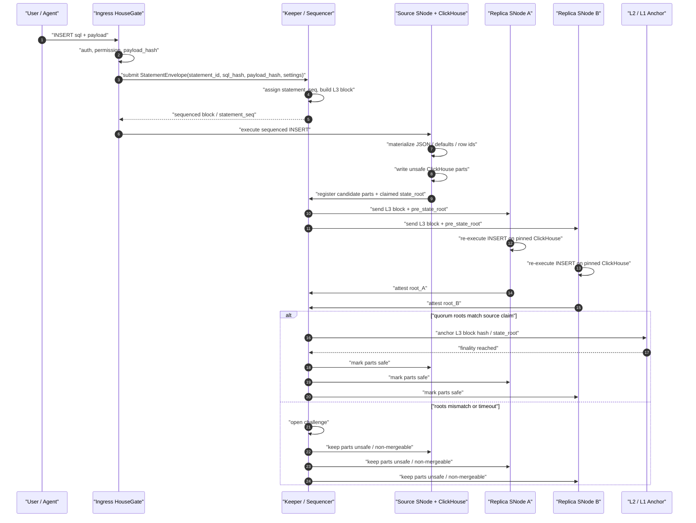
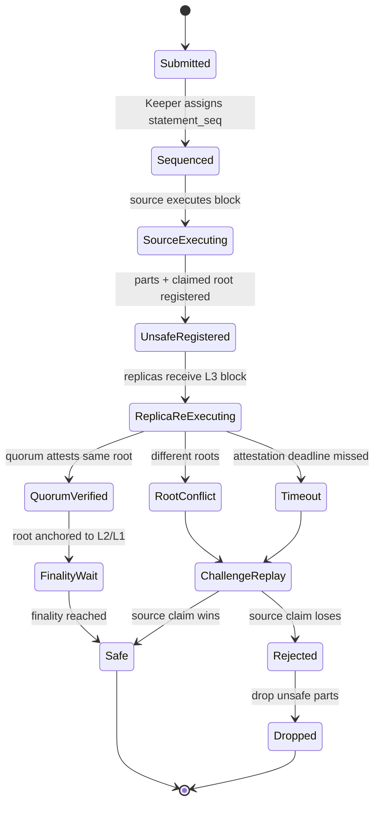

# Storage Network Data Integrity Verification Layer - Design Document

**Date:** 2026-06-10
**Status:** Proposed (v2, consolidated)
**Base:** `sentioxyz/designs` - `drafts/sentio-storage-network-design.md` (v0.1, Plan B) + `PROGRESS.md` as of the 2026-06-10 weekly sync
**Supersedes:** the v1 draft of this file, and `2026-05-12-data-reliability-design.md` (the S3 path was dropped network-wide)
**Authors:** poetry, Claude

> This v2 keeps the v1 architecture but fixes four safety gaps found in review: LtHash is used over uniquely identified row instances rather than raw row values; schema canonicalization no longer hashes a global `schema_version` that would make `ADD COLUMN` churn the whole table; INSERT payloads must be signed in the same statement envelope rather than chained into a later query; and P1 explicitly includes ClickHouse native Data-block decoding hooks rather than treating hashing as a trivial packet tee. Consolidation fixes on top of the review: the signed envelope carries a client-generated `statement_id` instead of the sequencer-assigned `statement_seq` (which the signer cannot know at signing time), `payload_bytes` is renamed `payload_length`, and the verification-ladder summary plus the 2026-06-10 non-determinism action-item answer are restored from v1.

## 1. Positioning and Problem

This document designs one layer: the data-integrity / anti-fraud verification layer of the Sentio Storage Network. It builds on top of the architecture the team has already converged on and does not reopen those decisions. Taken as given (per v0.1 + PROGRESS as of 2026-06-10):

- **Plan B (Keeper / L3-like).** A HouseKeeper sequences SQL into L3 blocks; block hashes anchor to L2 (OP-batcher-style calldata); L2 block height is the cross-keeper global clock.
- **One HouseGate -> one ClickHouse service.** HouseGate is the stateless ingress for all traffic: client SQL and the ClickHouse<->Keeper protocol (reverse proxy). ClickHouse is never exposed and never dials Keeper directly.
- **Replication reuses native ClickHouse<->Keeper replication** (ReplicatedMergeTree). Neither ClickHouse nor Keeper is forked on this path; ClickHouse itself drives commits to Keeper through HouseGate. This replaced v0.1 §5.3.3's custom peer-to-peer part pull on 2026-06-03.
- **safe / unsafe parts.** safe = the batch is rolled up and L1-finalized (plus `last_mergeable` depth); unsafe = provisional, excluded from merges, droppable on reorg. Only safe parts merge.
- **v1 Keeper is centralized** (Sentio-run, L2-sequencer analogy; sharded multi-raft for scale and high availability). Decentralization is deferred OP-Stack-style.
- **Data availability (DA) is internalized**: L3 block payloads replicate to K SNodes; only hashes + proofs-of-custody go on chain. No external DA and no object storage.

The problem this document solves is the #1 open item from the 2026-06-10 sync: anti-fraud / data integrity. A malicious operator can bypass HouseGate, write directly into its own ClickHouse, and native replication will broadcast the result network-wide with no validation: "the first node to commit a part becomes everyone's source." Philip's minimal example: a user signs `set balance=10`; the operator lands `balance=0`; every replica fetches the bad part. The sync conclusion was that data produced by Sentio Nodes is currently not trustworthy.

The initial discussion slid toward replay-based verification, which re-exposed the objections that killed Plan A: ordering needs a sequencer, ClickHouse has non-deterministic constructs (`now()`, `any()`, `LIMIT 1` without `ORDER BY`), and full-history replay is expensive. This document's claim is narrower and more mechanical: under Plan B, the sequencer already exists, append-only INSERT verification does not require SQL replay, and a row-instance content commitment localizes the remaining checks.

## 2. Goals / Non-Goals

**Goals**

1. **Pollution cannot propagate into `safe`.** A part not derived from signed, sequenced statements either never enters the replication log, or at worst replicates as bytes but can never cross the `safe` boundary, never merges, and is dropped by the same machinery that drops reorged parts.
2. **Faithful execution is verifiable.** Every part's row content is bound to the signed statements and payload bytes that produced it via an incremental content commitment; "signed `balance=10`, landed `balance=0`" is mechanically detectable and attributable.
3. **Verification cost scales with the write delta, not full history.** The dominant append-only workload verifies by Data-block decoding, deterministic row-instance hashing, and ledger arithmetic; replay is confined to rare mutation-class statements and explicitly admitted materialized-view transforms.
4. **The commitment is safe for ClickHouse duplicates.** ClickHouse permits duplicate rows, so the hash input is a set of row instances with unique row IDs, not a multiset of raw row values.
5. **v1 is implementable centralized; the later decentralization path changes only who checks.** The evidence format is present from day one: signed statement envelope, payload hash, per-part row commitment, partition commitment, and replica attestations.
6. **Close the standing 2026-06-10 action item** on ClickHouse non-determinism with verified facts (§9.6).

**Non-Goals**

- No reopening of Plan B, native ReplicatedMergeTree replication, DA internalization, or v1 Keeper centralization.
- No query attestation for SELECT results; that is orthogonal future work.
- No challenge-game economics; this layer defines evidence and safety predicates only.
- No non-plain-MergeTree engines in v1. Replacing/Summing/Aggregating/Collapsing engines, TTL, lightweight DELETE masks, and `OPTIMIZE ... DEDUPLICATE` are excluded because they break row-instance preservation across merges.
- No data confidentiality; indexed data is public.

## 3. Established Facts That Shape the Design

1. **Native ReplicatedMergeTree checksum machinery is convergence, not verification.** Merges/mutations are re-executed per replica and required to be byte-identical, but the arbiter is first-committer-wins: a replica whose locally built part mismatches the Keeper-registered checksum discards its own result and downloads the first committer's. This is the pollution mechanism; the fix must add an external content arbiter.
2. **Part byte determinism is best-effort.** Independent executions do not reliably yield byte-identical parts, part format is version-sensitive, and ClickHouse itself documents many checksum-divergence causes. Verification must compare logical row instances, not bytes, except where native part fetch already gives byte identity.
3. **Plain MergeTree merges preserve row instances when no row-changing features are enabled.** The row bytes may be rearranged and part bytes may differ, but a plain merge should not edit, drop, or inject logical rows. This is exactly the invariant a row-instance commitment can check.
4. **LtHash is appropriate only when each input element is unique.** The Meta / IACR LtHash construction and Solana SIMD-0215 both use additive lattice hashes for incrementally updated state, but ClickHouse tables are not sets of unique row values. If the exact same element is added `2^16` times to a 16-bit-lane LtHash, it cancels modulo each lane. Therefore this design hashes `(row_instance_id, row_value)`, not `row_value` alone.
5. **ClickHouse already enforces much of the determinism needed for mutation replay.** Non-deterministic mutations are forbidden by default on replicated tables (`allow_nondeterministic_mutations=0`) because ReplicatedMergeTree re-executes them per replica; `mutations_execute_nondeterministic_on_initiator` materializes functions such as `now()`/`rand()` at the initiator. Verification should align with this discipline rather than invent a new one.
6. **The current housegate signature covers only SQL text.** `JWSPayload.QueryHash` binds a JWS to Keccak256(SQL), but native-protocol INSERT rows travel later in Client Data packets. A malicious operator-side HouseGate can substitute payload bytes unless the payload digest is signed in the same statement envelope.
7. **The current relay does not expose Data-block rows to plugins.** `Relay.clientToUpstream` decodes Query packets and splices Data packets; `Codec.walkDataBlock` consumes/captures packet bodies but does not surface typed rows. Commitment P1 therefore includes a real wire-level Data-block hook and decoder.

## 4. Replay Objections Reframed

- **Ordering:** already solved by HouseKeeper. Verification consumes the L3 block sequence and does not need a second sequencer.
- **Non-determinism:** append-only INSERT verification does not replay SQL. It decodes the already materialized Data-block payload, assigns deterministic row instance IDs, canonicalizes values, and compares row commitments against the registered part commitments. Replay remains only for mutation-class statements, `INSERT ... SELECT`, and materialized-view transforms admitted by §8.
- **Full history:** the commitment is incremental. A verifier checks an append block from the previous partition commitment plus this block's delta; a merge is a per-merge equation; a mutation needs only the parts it touches. Full genesis replay remains the self-rescue fallback, not the normal verification path.

## 5. Content Commitments

### 5.1 Hash primitive

Use LtHash in the Solana-style configuration: `BLAKE3-XOF(element)` expanded to 2048 bytes, interpreted as 1024 little-endian `u16` lanes; combine by lane-wise wrapping addition and remove by lane-wise wrapping subtraction. The stored accumulator is the full 2048-byte value. If a compact on-chain value is needed, use `BLAKE3(lthash_2048)` as a display / anchoring digest, never as the arithmetic accumulator.

LtHash gives the needed order independence and O(1) add/remove arithmetic, but it does not make arbitrary duplicate row values safe by itself. The security object here is a set of row instances, where each inserted logical row has a unique, persistent row ID.

### 5.2 Row instance identity

Every verified physical table contains one reserved physical column:

```
_hg_row_id FixedString(32)
```

The column is part of the physical ClickHouse table and therefore part of every part and merge. Logical users do not provide it manually; HouseGate / the rewriter injects it into INSERTs and hides it from logical query surfaces where compatibility requires that. User attempts to write, update, rename, or drop `_hg_row_id` are rejected by admission.

For an INSERT payload, the agent computes row IDs at signing time, from values it already holds — no sequencer round-trip:

```
row_id = BLAKE3("housegate-row-id-v1" || network_id || table_id || statement_id || global_row_ordinal)
```

`statement_id` is the client-generated, client-signed nonce (§6); `global_row_ordinal` is the row's 0-based index in the **canonical original payload**, independent of how that payload is later split into Data-block chunks. The formula must satisfy four properties: deterministic from the anchored statement record, unique within the table except with cryptographic collision probability, present in the Data block that reaches ClickHouse, and stable for the row's lifetime. Mutations preserve `_hg_row_id`; deletes remove it; merges carry it through unchanged.

Pins on this definition:

- **No sequencer dependency (and therefore no reorg churn):** the row ID is derived only from client-signed (`statement_id`) and intra-payload (`global_row_ordinal`) data, so the agent can inject it *before* the statement is sequenced — the write path does not need a Keeper round-trip before ClickHouse executes (see the write-path ordering in §8). Because `statement_seq` is *not* an input, a re-sequencing under L2 reorg does not change any row ID. (An earlier draft fed `statement_seq || payload_chunk_index || row_ordinal_in_chunk || payload_hash` into the hash; that coupled row IDs to the sequencer and to non-canonical Data-block chunk boundaries — both couplings are removed.)
- **`statement_id` uniqueness is load-bearing and must be permanent.** Row-instance uniqueness — the property that defeats the duplicate-row LtHash cancellation attack (§16, walkthrough #4) — now rests entirely on `statement_id` being unique within the table. It MUST therefore be globally (or per-table) unique and **never recycled**: a sliding dedup window that lets `statement_id` be reused would let two statements collide on the same row IDs and resurrect the cancellation attack. This promotes open question 12 from a tuning detail to a safety requirement.
- **No circularity:** row IDs are derived from `statement_id` + ordinal (not from `payload_hash`), then injected; the augmented block that reaches ClickHouse is original columns + `_hg_row_id`. Any verifier reconstructs the same augmented rows from the signed original payload plus the anchored statement record.
- **Storage cost is real and accepted:** 32 bytes per row do not compress. A structured-integer alternative is recorded in §16; the hash form is kept for design conservatism. P0/P1 must measure the actual compressed-size impact on representative tables (open question 11).

This converts the commitment domain from "multiset of row values" to "set of uniquely named row instances." Duplicate user-visible rows are now distinct elements because their `_hg_row_id` values differ.

### 5.3 Canonical row element

For each physical row instance:

```
element = (
  domain = "housegate-row-v1",
  table_id,
  row_id,
  sorted [(column_id, type_id, canonical_value)]
)
row_lthash = LtHash(element)
```

`table_id` and `column_id` are stable IDs allocated in the anchored DDL log. Column names are metadata and are not part of the row hash; `RENAME COLUMN` is commitment-neutral only because `column_id` is stable. A table-wide `schema_version` is not hashed into every row, because that would make metadata-only `ADD COLUMN` change every existing row's commitment.

The canonical value encoding is versioned by the `domain` string and `type_id`. The cardinal rule is **one logical value, three decoders**: the same logical value is canonicalized by three independent code paths — the agent/HouseGate from the signed wire payload, the Keeper validation front from the DA copy, and every replica re-scanning its stored part via `SELECT` — and all three MUST produce identical element bytes. The encoding is therefore defined over the *logical* value, never the physical/storage representation, and every type below has a single logical form all three paths map to. A type with no defined encoder is rejected at CREATE admission (default-deny), so unsupported data can never hash ambiguously.

**Scalar types.** Integers are little-endian two's-complement at declared width (8…256-bit; wide ints just widen the field). Decimal(P,S) hashes its underlying integer payload; (P,S) come from the schema, not the value. String / FixedString(N) are raw bytes with length framing (FixedString keeps all N bytes, including zero padding). Floats canonicalize NaN to one pattern and `-0.0` to `+0.0` (±Inf kept). Bool is a single tagged byte. UUID hashes the logical 16 bytes in RFC order (not ClickHouse's internal two-UInt64 byte order). IPv4 / IPv6 hash their fixed-width integer / 16-byte form. Date / Date32 / DateTime hash the absolute instant; **DateTime64 hashes the raw integer tick count, with the scale carried in `type_id`** (no lossy normalization to nanoseconds). **Enum8 / Enum16 hash the stored integer**, not the element name — the name↔int map is schema metadata, so renaming an element is commitment-neutral while remapping its integer is a (mutation-class) change.

**Composite types.** Nullable(T) is an explicit null tag followed, if non-null, by the inner canonical value. LowCardinality(T) hashes the logical value of T, never the storage dictionary id. Array(T) is length-framed and order-preserving, recursing into T. Tuple / Nested are encoded element-by-element in declared position (Nested decomposes into its parallel arrays); field names are metadata addressed by position / `column_id`. **Map(K,V) MUST be canonicalized by sorting entries by canonical key bytes** — ClickHouse Maps are unordered and do not dedup keys, so without a sort the same logical map hashes differently and a malicious key reorder evades detection; duplicate keys are preserved (sorted stably by key then value). Geo types reduce to their Tuple / Array(Float64) definitions.

**JSON (`housegate-json-v1`).** The native ClickHouse `JSON` type is the authoritative, verified store (not a derived String). Because CH shreds JSON into typed sub-columns and does not preserve the wire bytes, the commitment is over a canonical *logical* JSON value, recomputed identically by all three decoders (the agent canonicalizes the user's JSON before signing; Ring-2 reconstructs it via `SELECT <jsoncol>` and re-canonicalizes). The canonical form:

- **Objects:** members sorted by key (UTF-8 byte order), recursing into values; **duplicate keys are rejected** at canonicalization / admission; **`null`-valued members are preserved** as distinct from absent members (spike-gated — see §14).
- **Arrays:** order-preserving, recursing.
- **Numbers:** native JSON numbers are restricted to **integer-syntax values within signed/unsigned 64-bit range**; the canonical form is the integer. Fractional numbers, exponents, and values outside 64-bit are **rejected at admission** — the indexer MUST carry them (e.g. EVM `uint256` amounts, decimals) as JSON **strings**, which canonicalize as ordinary strings and round-trip losslessly. This removes the Float64 round-trip hazard entirely.
- **Strings:** UTF-8 only (invalid UTF-8 rejected), minimal JSON escaping, byte-preserving; no Unicode (NFC/NFD) normalization.
- **bool / null:** literals.

The `max_dynamic_paths` / `max_dynamic_types` settings are pinned in the anchored DDL and a minimum ClickHouse version is required, so the shredding / read-back behavior the round-trip relies on is fixed (§8, §14).

**Excluded types (default-deny).** AggregateFunction / SimpleAggregateFunction (opaque, version-dependent intermediate state — not a logical value; excluded by *type*, independent of engine) and Dynamic / Variant (per-row typing) are rejected at CREATE in v1. Any type without a defined encoder is likewise rejected.

**Stored-vs-wire column reconciliation.** The wire payload may carry fewer columns than the materialized part, so the element is computed over the part's *stored, materialized* columns, reconciled as follows:

- `ALIAS` columns are not stored and are **never hashed**.
- `DEFAULT` / `MATERIALIZED` columns are materialized by the verifier from the anchored DDL and **included**; their defining expressions MUST be in the verifier's deterministic-evaluation whitelist (non-deterministic ones such as `DEFAULT now()` are rejected at CREATE — §9.6).
- A partial-column INSERT has its omitted columns filled with the anchored deterministic default before hashing.
- Default elision (over stable `column_id`, never a global schema version): a column absent from a part because it was added later, or omitted by an INSERT, whose logical value equals the anchored default, has its pair omitted — so `ADD COLUMN` with a deterministic immutable default is commitment-neutral.
- `column_id` is stable, so `RENAME COLUMN` is commitment-neutral. `MODIFY COLUMN` type changes allocate a **new `type_id`**, and the anchored DDL log records which `type_id` is in force for which part-version, so old-type and new-type rows hash under their respective encoders. `MODIFY DEFAULT`, non-deterministic DEFAULT/MATERIALIZED, and `DROP COLUMN` are not silently neutral — banned in v1 or treated as commitment-affecting mutation-class operations with explicit deltas.

### 5.4 Part and partition commitments

Commitments are maintained at two granularities:

```
part_row_lthash = sum(row_lthash for all active row instances in the part)
partition_commitment = sum(part_row_lthash for all active parts in the partition)
table_commitment = sum(partition_commitment for all active partitions)
```

Parts are the verification unit: replicas fetch parts, merges consume and produce parts, and a mismatch localizes to a part. Part names are transient, so they are not the anchored state root. Partition commitments are stable across plain merges and form the state root used for `safe` and anchoring. The invariant `partition_commitment == sum(active part_row_lthash)` is itself an auditable ledger check.

## 6. L3 Block Schema and Signed Statement Envelope

The L3 block payload is the complete write request, not just SQL text. A native-protocol bulk INSERT is a Query packet plus later Client Data packets; the L3 payload includes the statement envelope and the canonical payload digest of those Data packets.

```
StatementEnvelope {
  statement_id,        // client-generated unique nonce; the SIGNED identity
  statement_seq,       // sequencer-assigned; NOT signed; the L3 block anchors
                       // the statement_id -> statement_seq binding
  sql,
  sql_hash,
  settings_hash,
  payload_hash,        // hash of the ORIGINAL user payload, before row-id
                       // injection; empty for non-payload statements
  payload_length,
  target_table_id,
  user_jws_v2,         // signs this envelope's client-side fields
}

L3Block {
  ...existing fields (seq, prev_hash, anchored to L2)...
  statements: [{
    envelope,
    source_node,
    parts: [(part_name, part_phys_hash, part_row_lthash)],
    partition_deltas: [(partition_id, lthash_delta)],
  }],
  partition_commitments_after: [(partition_id, lthash)],
}
```

`user_jws_v2` signs a domain-separated payload:

```
{
  "purpose": "housegate-statement-v2",
  "iat": <unix seconds>,
  "statement_id": "...",
  "sql_hash": "0x...",
  "settings_hash": "0x...",
  "payload_hash": "0x...",
  "payload_length": ...,
  "target_table_id": "..."
}
```

**Why `statement_id`, not `statement_seq`, inside the signature:** the sequence number is assigned by the sequencer *after* submission, so the signer cannot know it at signing time. The client generates a unique `statement_id` (nonce) and signs it; the L3 block anchors the `statement_id -> statement_seq` binding, which keeps the mapping auditable. Duplicate `statement_id` values are rejected at sequencing, which also gives retried submissions idempotent semantics for free.

The signature must cover the INSERT payload in the same statement envelope. The v1 idea of chaining a payload hash into the next statement is demoted to a detection-only fallback because it leaves the final statement, disconnects, and delayed commitments ambiguous. For P1, the agent side may buffer or spool INSERT Data blocks until `payload_hash` is known, then forward the Query + Data with the signed envelope. A streaming optimization may later use an out-of-band final `StatementCommit` message, but Keeper must not accept part registration until the same-statement payload signature is present and valid.

`part_phys_hash` proves identity of fetched bytes. `part_row_lthash` proves logical content. Both are required: a fraudulent part can have a valid physical hash for its own bytes.

## 7. Two Containment Rings

The v1 trust boundary is: Sentio-run HouseKeeper and its raft group are trusted; operator-side ClickHouse and operator-side HouseGate are not. All ClickHouse<->Keeper traffic terminates at the trusted side, so Keeper ingress is the enforcement point.

### Ring 1 - Keeper validation front

A validation module in front of the Keeper raft group admits a part registration only if:

- **Statement linkage:** the part maps to known statement envelopes in known L3 blocks. The leading candidate remains `insert_deduplication_token = <statement_seq>` injection, but v2 also records row IDs that embed `statement_seq`, giving auditors another linkage surface.
- **Signature validity:** each statement envelope has a valid `user_jws_v2` over the client-side fields (SQL hash, settings hash, payload hash, payload length, target table, `statement_id`), and the anchored `statement_id -> statement_seq` binding is consistent.
- **Payload-derived delta:** for INSERT payloads, the validation front independently decodes the L3 Data blocks, assigns / verifies row IDs, evaluates the admitted partition key expression, canonicalizes rows, and computes expected per-partition LtHash deltas.
- **Registration arithmetic:** the sum of registered part lthashes for each `(statement_seq, partition_id)` equals the payload-derived delta; partition commitments advance exactly by those deltas.
- **Merge/mutation rules:** §8 and §9.

A direct write into ClickHouse produces a part with no signed statement envelope and no valid statement linkage, so registration is rejected before it enters `/log`. Native replication never propagates it.

### Ring 2 - Replica byte-side verification and safe boundary

Ring 1 checks claims; bytes can still lie if a compromised source registers a truthful-looking lthash for different bytes. Therefore every replica, after natively fetching a part, recomputes row lthash from the actual rows in that part and compares it with the L3-anchored `part_row_lthash`.

```
safe = L1-finalized AND Ring-1-valid AND enough Ring-2 verification / attestations
```

In v1, "enough" can be operationally centralized: the validation front checks synchronously and replicas report mismatches. In the later decentralized path, replicas submit signed attestations and `safe` requires quorum. In both modes, a bad part may physically replicate, but it cannot cross `safe`, cannot merge, is invisible to `safe` reads, and is dropped by the same unsafe-part cleanup path used for L2 reorgs.

Merge eligibility must be gated by `safe` as a hard predicate, not by part age. Age can be a scheduler hint, but it cannot be the safety rule.

### The verification ladder (summary)

| Check | What | Cost | Catches | Runs at |
|---|---|---|---|---|
| Identity check | fetched part bytes match `part_phys_hash` | hash of download | substitution/corruption in transit | native ReplicatedMergeTree (already exists) |
| Content check | payload-derived row-instance lthash == registered `part_row_lthash` == lthash of actual part rows | decode + hash, no SQL execution | fabricated / altered / dropped / duplicated rows; lying registrations | validation front (claim side) + every replica (byte side) |
| Merge check | ledger equation: sum(lthash(outputs)) == sum(lthash(inputs)) | ledger arithmetic + one row scan | rows edited, dropped, duplicated, or injected during merge | validation front + re-merging replicas |
| Replay check | mutation re-execution against the anchored delta | proportional to data touched (rare) | unfaithful UPDATE/DELETE/DDL execution | natively all replicas (ReplicatedMergeTree re-executes mutations); the commitment arbitrates |

The escalation path is built in: a maximally suspicious party can replay the full L3 stream from genesis - full state-machine replication is the degenerate mode the anchored log supports for free.

### Execution cost model — which paths run SQL

The ladder has one property worth stating outright, because it is the design's entire cost argument: **only the mutation path re-executes SQL.** INSERT verification decodes the signed payload and hashes it — no execution, because the inserted rows are already materialized in the payload. Merge verification hashes the rows of a part the replica fetched anyway — no execution, just the multiset-preservation equation. Only an UPDATE/DELETE forces a replica to run the statement, because its new value is `f(pre-state, statement)` and exists nowhere until computed.

Three things keep that bounded. **(1) It is not added work.** Native ReplicatedMergeTree already re-executes every mutation on every replica (mutations replicate by re-execution, not by part fetch) — the verification layer reuses that result and only adds a hash scan over it; the increment is hashing, not a second execution. **(2) It is localized replay, not Plan A.** Plan A replayed *every statement over full history*; here replay is confined to the rare mutation slice and only over the parts it touches, never the append-only INSERT stream — and the determinism it needs is already enforced by ClickHouse (`allow_nondeterministic_mutations=0`). **(3) LtHash is a comparison tool, not an execution substitute.** It is what lets the INSERT path skip execution entirely (the expected value hashes straight from the payload) and what collapses the post-mutation comparison from a row-by-row SELECT diff into one O(1) commitment check. Even where execution is unavoidable, *verifying* its result stays cheap.

One scope line to avoid confusion: "runs SQL" here means write-path mutation re-execution — the work native replication already does. It is unrelated to read-path SELECT queries; this layer does not verify user query results at all (query attestation is an explicit non-goal).

### Judging a dishonest replica

Two adversaries must not be conflated. A dishonest **writer** is judged by majority against an independently recomputable truth: it anchors `balance=0`, a quorum of honest replicas recompute `balance=10`, and it stands alone against them. A dishonest **replica** is the subtler case — it could submit a signed attestation claiming a commitment that honest replicas disagree with. It is judged the same way, and the mechanism is worth making explicit because it is the source of the whole design's Byzantine safety.

**The correct commitment is not voted on — it is recomputable.** For any INSERT anchor, any party hashes the signed payload (on DA) to the unique expected commitment; for any mutation anchor, any party replays the signed statement against the byte-identical pre-state to the unique expected commitment. The signed statement log plus the public commitment function determine *one* answer. Attestations are signed and on-chain, so "who claimed what" is non-repudiable; judging a replica is comparing its signed attestation against that recomputable answer. A replica whose signed attestation disagrees with the recomputable truth has signed an endorsement of a value anyone can refute — public, on-chain evidence — and is flagged, dropped from the `read_replica` set, and (in the economic phase) slashed.

The consequence is stronger than BFT voting: **the truth does not depend on honest replicas being a majority.** Quorum provides *liveness* — enough honest attestations to advance data to `safe`. Safety comes from *recomputability*: a single honest verifier with the signed log can refute arbitrarily many colluding replicas, because the answer is math, not headcount. (Classic BFT loses safety past a one-third fault threshold; this does not, as long as the signed log is available and the commitment function is public.)

## 8. INSERT and Data-Block Verification

Unchanged user-visible flow: signed INSERT -> HouseGate -> Keeper packs into L3 -> source SNode executes -> part registers through Ring 1 -> replicas fetch and verify through Ring 2.

Implementation detail that v1 understated: current housegate decodes Query packets but splices Data packets. P1 must add:

- a `ClientDataBlockPlugin` or equivalent relay hook fired between Query and QueryComplete;
- typed Data-block metadata (`block_name`, compression mode, row count, column names/types, raw byte hash);
- a decompression and row decoding path for ClickHouse native blocks, including compressed frames;
- canonical row encoding and row-id injection / verification;
- backpressure and bounded buffering so hashing cannot outrun or stall the relay unpredictably;
- tests for compressed and uncompressed Data blocks, empty Data terminators, `ClientScalar`, and large multi-frame INSERTs.

For INSERT VALUES / native block inserts, verification is "payload-local": no WHERE evaluation and no pre-state are needed, but it is not only byte hashing. The verifier must decode rows, materialize deterministic defaults that are part of the admitted schema, inject or verify `_hg_row_id`, and evaluate the admitted `PARTITION BY` expression subset.

**Where schema knowledge comes from differs by role:** HouseGate may pragmatically read its co-located ClickHouse (`system.tables.partition_key`, `system.columns`), with event-driven invalidation since every DDL transits the proxy - and a wrong local cache is harmless because HouseGate only produces claims. Verifiers derive schema, stable IDs, and defaults from the **anchored DDL log**, never from the ClickHouse of the operator under verification. Because verifiers evaluate the partition key without a ClickHouse, admission restricts `PARTITION BY` on verified tables to a verifier-implemented deterministic subset (`toYYYYMM`, `toYYYYMMDD`, `toDate`, `toStartOf*`, identity columns, `intDiv`, `modulo`).

Part attribution happens at registration time, not on the wire. A part name encodes partition and block numbers; block-number allocation transits the proxy; `insert_deduplication_token = <statement_seq>` is still the preferred exact linkage because it puts statement identity into ClickHouse's own atomic Keeper transaction. If one statement produces several parts in a partition, the sum of their `part_row_lthash` values must equal that statement's payload delta for that partition. Row-to-part placement is not a verification input.

`async_insert` is disabled on verified tables in v1 because it mixes multiple statements into one part and weakens part<->statement attribution. It can be revisited later with batch-level signed envelopes.

## 9. Merge, Mutations, DDL, and Materialized Views

### 9.1 Merge

Native ReplicatedMergeTree merge flow is kept: a leader writes MERGE_PARTS to the log, every replica re-executes it, and ClickHouse still enforces its byte-level mechanics. The validation layer adds:

- inputs must be `safe`;
- engine/table features must be on the row-instance-preserving whitelist;
- the ledger equation must hold: `sum(lthash(outputs)) == sum(lthash(inputs))`;
- re-merging replicas verify output bytes against the registered output `part_row_lthash`.

Because `_hg_row_id` is stored in the row, duplicate user-visible rows remain distinguishable through merges. A merge that edits, drops, duplicates, or injects rows breaks the equation or the byte-side scan.

### 9.2 Mutations

Mutations preserve row IDs for surviving rows. The delta is:

```
delta = sum(lthash(new row instances)) - sum(lthash(old row instances))
```

`ALTER ... UPDATE/DELETE` is sequenced through L3 and serialized against in-flight INSERTs to the same table (HouseGate drains via its concurrency machinery; mutations are rare, the barrier is cheap). The source waits for `system.mutations.is_done`, registers removed/added part lthashes, and every replica's native mutation re-execution becomes the replay check - divergence between "my replay" and "the anchored claim" is a dispute, with the commitment as arbiter. Old- and new-part rows are read back through `SELECT ... WHERE _part IN (...)`, ClickHouse's virtual column, on the source and on replicas alike - no disk-format coupling. Attempts to modify `_hg_row_id` are rejected.

Non-deterministic mutations remain disallowed unless the sequencer materializes the non-deterministic value into a constant before execution. `any()`, unordered `first_value`, and un-ordered `LIMIT` in mutation-class statements are rejected.

**Worked example.** Table `balances(_hg_row_id, user_id, balance)` holds two rows, `r1 = (rid_1, '0x123', 100)` and `r2 = (rid_2, '0xabc', 250)`, so the partition commitment is `C_old = h(r1) + h(r2)`, where `h(r) = LtHash(canonical(r))` and `canonical` includes the row id: `(domain, table_id, rid_1, [(user_id, '0x123'), (balance, 100)])`. The user signs `ALTER TABLE balances UPDATE balance = 10 WHERE user_id = '0x123'`. ClickHouse rewrites the part holding `r1` into `r1' = (rid_1, '0x123', 10)` — only `balance` changes; `_hg_row_id` stays `rid_1` because the SET clause never touches it (this is the load-bearing fact). The source reads old- and new-part rows back via `_part` and takes the difference, with no need to identify *which* rows the WHERE selected:

```
ΔC    = sum(lthash(new-part rows)) - sum(lthash(old-part rows))
      = h(r1') - h(r1)
C_new = C_old + ΔC = h(r1) + h(r2) + h(r1') - h(r1) = h(r1') + h(r2)   ✓
```

In the LtHash view an UPDATE is exactly "remove the old row instance, add the new one" — identical arithmetic to a DELETE+INSERT, which is why no semantic diff is required. Preserving `rid_1` across the rewrite is what keeps replica replay deterministic: the id is derived from the signed statement envelope once at INSERT time and carried through unchanged, so independently re-executing the mutation cannot produce a different id (a regenerated id would diverge per replica and raise a false mismatch). Verification has two levels: the **arithmetic** check (all replicas, free) confirms `C_new = C_old + ΔC` is self-consistent and untouched parts are unchanged — but a malicious writer can land `balance=0` and anchor a self-consistent `ΔC` for it, so this proves anchor↔parts consistency only. The **replay** check (quorum) catches the fraud: each replica holds a byte-identical pre-state (the old part, shipped by native ReplicatedMergeTree), clones the affected part into a scratch table, executes the same signed statement, and compares the resulting row hashes against the writer's `parts_added`. A writer that landed `balance=0` produces `parts_added` hashing to `balance=0`; honest replicas compute `balance=10`; the mismatch withholds attestation, the mutation never reaches `safe`, and the contradiction (signed statement says 10, anchored part says 0) is publicly checkable. This is the verification ladder's Replay check — and the reason mutations are a separate row from INSERT: an INSERT's expected value is in the signed payload (pure hashing suffices), whereas an UPDATE's new value is `f(pre-state, statement)` and can only be obtained by re-execution.

The replay this requires has a real but bounded cost. Re-execution is proportional to the data the mutation touches — ClickHouse rewrites whole affected parts, not single rows — so a `WHERE` hitting one small partition is seconds while a full-table mutation is a full-table rewrite. Three things keep it acceptable: the replay reuses ReplicatedMergeTree's own per-replica mutation re-execution rather than adding one (the increment is just the hash scan), the scratch clone is hardlink-level (`FREEZE` / `ATTACH FROM`, no data copy), and mutations are rare in the append-only workload. The real risk is a large mutation briefly doubling read I/O during scratch replay plus hash scan, and — under the v1 synchronous-quorum option — adding that replay latency to the client's `ALTER`; both are bounded by an admission size cap per statement, with asynchronous verification (completed inside the unsafe window) as the escape hatch for large mutations (open question 8).

### 9.3 DDL

| Class | Route |
|---|---|
| `CREATE TABLE` | Admitted only if engine, partition key, ORDER BY, defaults, materialized columns, and types are on the verified whitelist; allocates stable `table_id` and `column_id` values; injects `_hg_row_id`. |
| `ADD COLUMN` | Commitment-neutral only for deterministic immutable defaults and stable `column_id`; otherwise rejected or treated as a mutation-class rehash. |
| `RENAME COLUMN` | Commitment-neutral because row hash uses `column_id`, not name. |
| `MODIFY DEFAULT` | Banned v1 unless followed by explicit rehash semantics; changing read-time defaults for old parts is not silently neutral. |
| `DROP COLUMN` / `MODIFY COLUMN` type | Mutation-class operation with explicit old/new part deltas, or banned v1. |
| `TRUNCATE` / `DROP PARTITION` | Delta is `-partition_commitment`; cheap and exact. |
| Lightweight `DELETE FROM`, TTL, `OPTIMIZE ... DEDUPLICATE` | Banned v1. |

### 9.4 INSERT ... SELECT

`INSERT ... SELECT` reads pre-state and may use non-deterministic execution plans. v2 treats it as mutation-class, not as a simple INSERT. v1 should reject it by default unless the source is local, the SELECT is deterministic, the result order is explicit, the statement is serialized by a barrier, and the sequencer can capture the materialized output rows into a signed payload envelope before part registration.

### 9.5 Materialized views

Materialized views are admitted in v1 only if deterministic and block-local: the view SELECT reads only the inserted block, does not join mutable state, and writes to a plain MergeTree target with its own `_hg_row_id` strategy. Verification replays the view transform over the signed payload block, O(block). Everything else is rejected pending a production usage survey.

### 9.6 Non-determinism catalog (closes the 2026-06-10 action item)

- `now()` / `rand()` / `generateUUIDv4()`: non-deterministic; ClickHouse bans them in replicated mutations by default, and materialize-at-initiator is ClickHouse's own precedent. The sequencing side materializes them into constants.
- `INSERT ... SELECT ... LIMIT n` without `ORDER BY`: arbitrary rows - confirmed. Admission requires an explicit `ORDER BY` or rejects.
- `any()` / `first_value` without ordering: arbitrary values - confirmed. Rejected in mutation-class statements.
- Non-deterministic DEFAULT / MATERIALIZED columns (`created_at DateTime DEFAULT now()` is common in indexer schemas): the value never crosses the wire, so payload-derived expectations cannot predict it. v1 rejects at CREATE/ALTER admission; HouseGate-side default pinning at sequencing time is the compatibility upgrade if the restriction bites real schemas (open question 4).
- Float aggregation order, ReplacingMergeTree merge timing, TTL: real, but irrelevant on the v1 whitelist + part-shipping path.
- Background merges: byte-level non-determinism exists (fact 2) but is content-preserving on the whitelist - handled by the merge check's invariant, not by determinism demands.

The structural answer: the catalog does not need to be exhaustively enumerated for the INSERT path (never re-executed); for the mutation path, ClickHouse's own discipline plus this short admission list suffices.

## 10. Safe State Machine and Reads

```
Pending --pack--> Unsafe(on L2) --L1 finality AND verification--> Safe
                         |
                         | L2 reorg / failed verification
                         v
                      Dropped
```

There is one state machine and one drop path: reorged blocks and verification-failed blocks both drop unsafe parts. For honest traffic, Ring 1 can run synchronously at registration; Ring 2 can complete before `safe` because L1 finality dominates the normal safe timeline.

Reads keep two levels: default reads include unsafe data with documented L2-latest semantics; `SETTINGS read_consistency='safe'` filters to safe parts. This layer adds per-replica safe watermarks to routing, so safe reads route only to replicas at or above the requested watermark. A still-syncing replica cannot serve partial safe reads.

## 11. Decentralization Path

The commitment and evidence format are designed so only the verification authority moves later:

| | v1 (centralized Keeper front) | Later decentralized Keeper |
|---|---|---|
| Ring 1 authority | Sentio-run Keeper validation front | each keeper replica validates; consistency anchored to L2 |
| Ring 2 authority | replicas report mismatches to ops | replicas submit signed attestations; safe requires quorum |
| Dispute evidence | operational bundle | signed statement envelope + payload bytes/hash + part bytes/hash + row-lthash recomputation transcript |
| Economic teeth | none, trusted operator phase | staking/slashing parameters outside this doc |

LtHash does not provide inclusion proofs. A challenge is therefore not a tiny Merkle branch; it is a localized data challenge around one block payload and one or more parts. That is still minutes of work, not full-history replay, and it is the right evidence shape for v2 economics.

The self-rescue path exists from day one: any party can replay the L3 stream from genesis, reconstruct row IDs and commitments, and compare against safe parts from any peer.

## 12. Adversarial Walkthrough

| # | Scenario | Outcome |
|---|---|---|
| 1 | Operator writes directly into its ClickHouse | Part has no valid signed statement envelope / statement linkage, so Ring 1 rejects registration; it never enters `/log`. |
| 2 | Source executes signed `balance=10` as `balance=0` | Payload-derived row-instance lthash differs from the part's actual row lthash; Ring 2 rejects safe, and mutation replay disagrees for mutation-class statements. |
| 3 | Source registers truthful-looking lthash for tampered bytes | Ring 1 may pass claim arithmetic; replica byte-side scan fails. |
| 4 | Duplicate-row collision attempt | Duplicate user rows have distinct `_hg_row_id` values, so adding the same visible row many times does not add the same LtHash element many times. The 2^16-lane cancellation and the equal-size duplicate-swap variant are both dead. |
| 5 | Malicious merge edits/drops/duplicates/injects rows | Ledger equation or output byte-side scan fails. |
| 6 | Statement censorship | Statement never appears in L3; agent read-back detects missing receipt and resubmits. This is liveness, not safety. |
| 7 | Keeper front misbehaves in v1 | Out of v1 threat model; L2 anchoring makes outputs auditable and the later path moves authority to quorum. |
| 8 | Replica serves unsafe/bad data | Safe reads route by watermark and exclude it; default reads carry L2-latest semantics. |
| 9 | L2 reorg | Existing unsafe drop path applies; commitments recompute on the new chain. |
| 10 | Replica long offline / source gone | Rebuild from L3 stream plus any peer's safe parts; row commitments make stale or partial snapshots detectable. |

## 13. Relationship to Existing Documents

- **`sentioxyz/designs` v0.1 + PROGRESS:** this document expands v0.1 §5.7 into a concrete mechanism and answers the 2026-06-10 anti-fraud open item. It strengthens "replay and compare part hash" into row-instance commitments plus localized replay.
- **Revision note (v1 -> v2):** the previous content of this file was corrected in place after a Codex GPT-5.5 cross-review. The two-ring architecture, replay-objection analysis, safe state machine, and read path remain; the LtHash domain (row instances), schema canonicalization (stable IDs, no global version), payload signature (same-envelope), and P1 scope (Data-block decoding) are corrected.
- **`2026-05-12-data-reliability-design.md`:** superseded. Its S3 durability path was dropped network-wide after DA internalization.
- **`2026-05-25-da-mvp-design.md` + `tools/da-mvp`:** external DA is no longer on the critical path; DAAnchor / publisher checkpointing experience remains useful engineering lineage.

## 14. Delivery Phases and Spikes

- **P0 - Commitment safety spec freeze.** Finalize row ID format, reserved column name, column/table ID allocation, canonical type encodings, default/DDL neutrality rules, `statement_id` uniqueness scoping, and `JWSPayloadV2`. Add test vectors before any production rollout.
- **P1 - HouseGate / agent signature and Data-block pipeline.** Agent same-statement payload signing; Query/Data buffering or commit protocol; relay `ClientDataBlockPlugin`; native block decompression/decoding; `_hg_row_id` injection; row canonicalization; partition expression evaluator; throughput benchmark. Roll out fail-open first and measure mismatch rate.
- **P2 - Keeper validation front.** L3 schema extension, statement/part linkage, payload-derived delta checks, partition ledger, direct-write rejection, and registration error surfaces.
- **P3 - Replica byte-side verification and safe gating.** Post-fetch row scan, signed or operational attestations, safe = finalized + verified, per-replica safe watermarks, safe read routing.
- **P4 - Mutation / DDL / materialized view completeness.** Sequencing barriers, mutation arbitration, exact DDL admission, materialized-view survey and allowed subset.
- **P5 - Decentralized attestations and challenge game.** Quorum-based safe, challenge evidence packaging, staking hooks on the Keeper-decentralization schedule.

## 15. Open Questions

1. **Physical reserved column compatibility:** exact name (`_hg_row_id` vs. `_sentio_row_id`), logical hiding behavior, `SELECT *` compatibility, backup/restore behavior, and migration of existing tables.
2. **Agent buffering cost:** whether P1 can buffer/spool full INSERT payloads before forwarding, or needs an out-of-band final `StatementCommit` protocol immediately.
3. **Data-block decoder scope:** compressed formats, `ClientScalar`, external tables, large multi-frame blocks, and compatibility with future ClickHouse revisions.
4. **Default semantics survey:** how many production tables rely on `DEFAULT now()` or mutable defaults, and whether HouseGate-side default pinning must ship early.
5. **Partition expression evaluator:** exact admitted function subset and test vectors against ClickHouse.
6. **Part<->statement linkage:** verify `insert_deduplication_token` Keeper node shape against ClickHouse source and decide fallback side channel.
7. **Partition cardinality:** storage and block-size cost of per-partition 2KB accumulators; commitment-of-commitments if thousands of partitions per table become common.
8. **Mutation I/O ceiling:** admission size caps and synchronous quorum settings for heavy mutations.
9. **Challenge size:** on-chain/off-chain split for part-byte evidence, since LtHash has no inclusion proofs.
10. **Cross-region latency:** central Keeper RTT may be visible on INSERT; region-local keeper shards may be needed for the litepaper's cross-region replica goal.
11. **Row-id storage overhead:** 32 incompressible bytes per row; measure compressed-size impact on representative indexer tables at P0/P1, with the structured-integer alternative (§16) as the documented fallback if measurements demand.
12. **`statement_id` uniqueness scope (now safety-critical):** per user, per table, or global. **`statement_id` must never be recycled** — since row IDs are `H(… || statement_id || global_row_ordinal)` (§5.2), a reused `statement_id` collides row IDs and resurrects the duplicate-row LtHash cancellation attack, so a finite dedup window is unsafe. Decide the uniqueness scope and the (permanent) retention / idempotency story accordingly.

## 16. Alternatives Considered

- **Raw row-value LtHash (v1).** Rejected because duplicate ClickHouse rows can repeat the same LtHash element; 2^16 copies cancel per lane, and a count check alone is defeated by swapping equal-sized duplicate sets. Row-instance IDs are required.
- **Structured-integer row IDs (e.g. `(statement reference, global_row_ordinal)` packed into a fixed-width integer).** Satisfies the same uniqueness/determinism properties as the v2 hash form — which is now itself `H(… || statement_id || global_row_ordinal)` (§5.2) — is human-debuggable, and compresses to near zero under delta codecs versus 32 incompressible bytes per row. Set aside for design conservatism (the hash form is fixed-width and collision-resistant without reasoning about integer-packing ranges), but it is the leading fallback if the open-question-11 storage measurements demand. Revisit at P0 freeze.
- **Global `schema_version` inside every row hash (v1).** Rejected because metadata-only `ADD COLUMN` would churn all existing row commitments; stable `table_id` / `column_id` plus explicit DDL rules are used instead.
- **Payload hash chained into next statement (v1 option).** Rejected as a safety primitive because final statements and disconnects remain ambiguous. It may be useful for detection-only telemetry, not for Keeper admission.
- **Full replay verification (rolling checksum + snapshots + 2/3 comparison).** Sound but heavyweight; the commitment scheme is its localized refinement.
- **Trust operator + economics only.** Rejected because without evidence binding signed statements to bytes, fraud is not objectively adjudicable.
- **Trusted-execution-environment (TEE) attestation.** Useful defense-in-depth but shifts trust to hardware vendors and still does not prove ClickHouse execution correctness.
- **Zero-knowledge proofs.** Not practical for OLAP-rate ingest today; revisit later for query attestation, not this write-integrity layer.

## 17. References

- Solana SIMD-0215, "Homomorphic Hashing of Account State": https://github.com/solana-foundation/solana-improvement-documents/blob/main/proposals/0215-accounts-lattice-hash.md
- IACR 2019/227, "Securing Update Propagation with Homomorphic Hashing": https://eprint.iacr.org/2019/227.pdf
- Meta Engineering, "Homomorphic hashing for secure update propagation": https://engineering.fb.com/2019/03/01/security/homomorphic-hashing/
- ClickHouse docs, table parts and `_part`: https://clickhouse.com/docs/parts
- ClickHouse docs, virtual columns: https://clickhouse.com/docs/engines/table-engines

## Appendix A - Quorum Re-execution and Challenge Replay Addendum

This appendix records the follow-up design direction for a JSON-heavy v1 where complex ClickHouse types make payload-byte hashing insufficient. The normal path uses quorum re-execution over the signed L3 payload; the safety fallback is challenge replay on a pinned reference executor. LtHash, Merkle roots, or another state-root scheme can still summarize state, but the root is treated as a claim until independently reproduced.

### A.1 INSERT end-to-end flow



The execution input for replicas is the L3 block payload plus the anchored schema/settings snapshot and the previous safe root, not the source's part bytes. This is the key shift for native JSON and other complex types: ClickHouse materialization is verified by independent re-execution on a pinned executor rather than by assuming wire bytes equal stored logical values.

### A.2 Unsafe-to-safe state machine



`UnsafeRegistered` data may serve default unsafe reads if the product wants L2-latest semantics, but it must not be eligible for safe reads or merges. `Safe` requires sequencing, matching quorum attestations, and finality. If roots conflict or attestations time out, the block remains unsafe until challenge replay decides whether the source claim is reproducible.

### A.3 State semantics

| State | Meaning | Safety rule |
|---|---|---|
| `Submitted` | The user or agent submits signed SQL and payload bytes. | Signature proves non-repudiation of input, not correct execution. |
| `Sequenced` | Keeper assigns `statement_seq` and includes the statement in an L3 block. | The block anchors statement order, schema/settings reference, payload hash, and previous safe root. |
| `SourceExecuting` | The selected source SNode executes the sequenced INSERT. | Produced parts are unsafe claims only. |
| `UnsafeRegistered` | Source registers candidate parts and a claimed root. | The root is not trusted until reproduced by quorum or challenge replay. |
| `ReplicaReExecuting` | Replicas independently execute the same L3 block on pinned ClickHouse. | Inputs are the L3 payload and anchored pre-state, not source part bytes. |
| `QuorumVerified` | Enough replicas attest to the same root as the source claim. | This advances liveness but still waits for finality and remains challengeable until the unsafe window closes. |
| `ChallengeReplay` | A reference executor replays the disputed block. | The reproducible root decides the dispute. |
| `Safe` | The root is finalized and verified. | Parts can serve safe reads and become merge-eligible. |
| `Rejected` / `Dropped` | The source claim is not reproducible or verification cannot complete. | Unsafe parts are removed; bad source/attester signatures become slashable evidence in the economic phase. |

For JSON-heavy v1, this addendum implies that native JSON support should be validated by executor equivalence rather than by a bespoke JSON canonicalizer alone. The minimum pinned inputs are ClickHouse version/build, relevant settings, schema snapshot, previous safe root, and the signed L3 payload.
