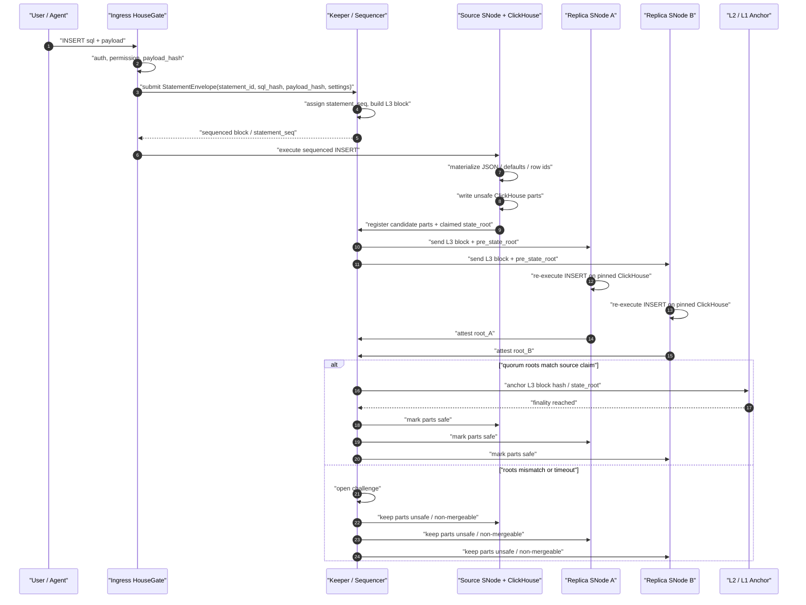
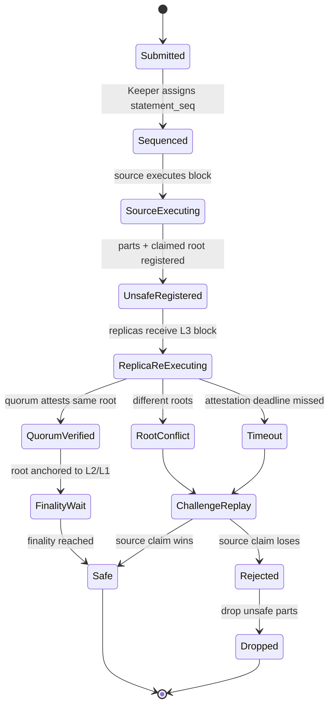

# Storage Network 数据完整性校验层 - 设计文档

**日期：** 2026-06-10
**状态：** Proposed(v2, consolidated)
**基座：** `sentioxyz/designs` - `drafts/sentio-storage-network-design.md`(v0.1,Plan B)+ 截至 2026-06-10 周会的 `PROGRESS.md`
**取代：** 本文件的 v1 草稿，以及 `2026-05-12-data-reliability-design.md`(S3 路线已在网络层面放弃)
**作者：** poetry, Claude

> 这个 v2 版本保留 v1 的整体架构，但修正了评审中发现的四个安全缺口：LtHash 的输入改为带唯一标识的行实例，而不是原始行值；schema canonicalization 不再把会导致 `ADD COLUMN` 扰动全表的全局 `schema_version` 放进每行 hash；INSERT payload 必须在同一条 statement envelope 中被签名，而不是链到后续 query；P1 明确包含 ClickHouse native Data-block 解码 hook，而不是把哈希当成简单的 packet tee。归并时在评审基础上又做了几处修正：签名 envelope 携带客户端生成的 `statement_id`，而不是 sequencer 分配的 `statement_seq`(签名者在签名时不可能知道后者)；`payload_bytes` 更名为 `payload_length`；并从 v1 恢复了验证阶梯总表和对 2026-06-10 非确定性行动项的回答。

## 1. 定位与问题

本文档只设计一层：Sentio Storage Network 的数据完整性 / 防作恶校验层。它构建在团队已收敛的架构之上，不重新打开那些决策。以下按 v0.1 + 截至 2026-06-10 的 PROGRESS 视为既定：

- **Plan B(Keeper / 类 L3)。** HouseKeeper 把 SQL 定序打包为 L3 block；block hash 以 OP-batcher 风格 calldata 锚定到 L2；跨 keeper 以 L2 block height 作为全局时钟。
- **一个 HouseGate -> 一个 ClickHouse service。** HouseGate 是所有流量的无状态入口：客户端 SQL 以及 ClickHouse<->Keeper 协议(反向代理)。ClickHouse 永不对外暴露，也永不直连 Keeper。
- **复制复用原生 ClickHouse<->Keeper replication**(ReplicatedMergeTree)。这条路径上 ClickHouse 与 Keeper 都不 fork；ClickHouse 自己经 HouseGate 驱动向 Keeper 提交。这个决策在 2026-06-03 替换了 v0.1 §5.3.3 的自定义 peer-to-peer part pull。
- **safe / unsafe parts。** safe = 批次已 roll up 且 L1-finalized(并满足 `last_mergeable` 深度)；unsafe = 临时态，不参与 merge，可在 reorg 时丢弃。只有 safe parts 可以 merge。
- **v1 Keeper 中心化**(Sentio 运营，类比 L2 sequencer；通过分片多 Raft 组获得扩展性与高可用)。去中心化按 OP-Stack 风格推迟。
- **Data availability(DA)内化**：L3 block payload 复制到 K 个 SNode；链上只放 hash + proof-of-custody。不使用外部 DA，也不使用对象存储。

本文档要解决的问题是 2026-06-10 周会的头号未决项：防作恶 / 数据完整性。恶意 operator 可以绕过 HouseGate 直接写自己的 ClickHouse，而原生 replication 会在没有验证的情况下把结果广播到全网：“第一个提交 part 的节点成为所有人的源”。Philip 的最小例子是：用户签名 `set balance=10`，operator 实际落成 `balance=0`，所有副本都拉到坏 part。当次周会的结论是：目前 Sentio Node 产出的数据并不可信。

最初讨论转向 replay-based verification，这又重新暴露了当初否决 Plan A 的几个反对意见：排序需要 sequencer，ClickHouse 有非确定性构造(`now()`、`any()`、没有 `ORDER BY` 的 `LIMIT 1`)，全量历史 replay 成本高。本文档的主张更窄、更机械：在 Plan B 下 sequencer 已经存在，append-only INSERT 的校验不需要 SQL replay，带 row-instance content commitment 的设计能把剩余检查局部化。

## 2. 目标 / 非目标

**目标**

1. **污染无法进入 `safe`。** 不是由签名且定序的 statement 产生的 part，要么根本进不了 replication log，要么最坏情况下只是作为字节复制出去，但永远跨不过 `safe` 边界、永远不能 merge，并由处理 reorged parts 的同一套机制清理。
2. **忠实执行可验证。** 每个 part 的行内容通过增量 content commitment 绑定到产生它的签名 statements 和 payload bytes；“签了 `balance=10`，落成 `balance=0`”可被机械检测并归责。
3. **校验成本随写入 delta 扩展，而不是随全量历史扩展。** 占主导的 append-only 工作负载通过 Data-block 解码、确定性 row-instance hashing 和 ledger arithmetic 校验；replay 只限制在罕见的 mutation-class statements 和显式准入的 materialized-view transforms。
4. **承诺对 ClickHouse 重复行安全。** ClickHouse 允许重复行，所以 hash 输入是具有唯一 row ID 的 row instances 集合，而不是原始 row values 的 multiset。
5. **v1 可在中心化模式下实现；后续去中心化只改变谁来检查。** 证据格式从第一天起就存在：signed statement envelope、payload hash、per-part row commitment、partition commitment、replica attestations。
6. **关闭 2026-06-10 关于 ClickHouse 非确定性的悬置行动项**，见 §9.6 的已核实事实。

**非目标**

- 不重新打开 Plan B、原生 ReplicatedMergeTree replication、DA 内化或 v1 Keeper 中心化。
- 不做 SELECT 结果的 query attestation；这是正交的未来工作。
- 不设计 challenge-game economics；本层只定义证据与安全谓词。
- v1 不支持非 plain-MergeTree engines。Replacing/Summing/Aggregating/Collapsing engines、TTL、lightweight DELETE masks 和 `OPTIMIZE ... DEDUPLICATE` 会破坏 merge 中的 row-instance preservation，因此排除。
- 不做数据保密；被索引数据是公开的。

## 3. 影响设计的既定事实

1. **原生 ReplicatedMergeTree checksum 机制是收敛，不是验证。** Merge/mutation 会在每个副本上重新执行并要求字节一致，但裁决规则是 first-committer-wins：本地构建的 part 与 Keeper 已注册 checksum 不符的副本会丢弃自己的结果，并下载第一个提交者的 part。这就是污染机制；修复必须引入外部 content arbiter。
2. **Part 字节确定性只是 best-effort。** 独立执行不可靠地产生字节相同的 parts，part 格式受版本影响，ClickHouse 自己也记录了许多 checksum divergence 原因。验证必须比较逻辑 row instances，而不是比较字节；只有原生 part fetch 已经提供字节同一性的地方例外。
3. **在禁用改行特性时，plain MergeTree merge 保持 row instances。** 行字节可能被重排，part 字节也可能不同，但 plain merge 不应编辑、删除或注入逻辑行。这正是 row-instance commitment 可以检查的不变量。
4. **LtHash 只有在每个输入元素唯一时才适合这里。** Meta / IACR 的 LtHash 构造和 Solana SIMD-0215 都使用 additive lattice hash 来维护增量状态，但 ClickHouse 表不是唯一 row values 的集合。如果同一个元素被加入 16-bit-lane LtHash `2^16` 次，它会在每个 lane 上取模抵消。因此本设计哈希 `(row_instance_id, row_value)`，而不是只哈希 `row_value`。
5. **ClickHouse 已经强制了 mutation replay 所需的大部分确定性。** Replicated tables 默认禁止非确定性 mutations(`allow_nondeterministic_mutations=0`)，因为 ReplicatedMergeTree 会在每个副本上重新执行它们；`mutations_execute_nondeterministic_on_initiator` 会在发起端物化 `now()` / `rand()` 等函数。验证层应沿用这套纪律，而不是另起一套。
6. **当前 housegate 签名只覆盖 SQL 文本。** `JWSPayload.QueryHash` 把 JWS 绑定到 Keccak256(SQL)，但 native-protocol INSERT 的行随后通过 Client Data packets 传输。除非 payload digest 在同一条 statement envelope 中被签名，否则恶意 operator-side HouseGate 可以替换 payload bytes。
7. **当前 relay 不把 Data-block rows 暴露给插件。** `Relay.clientToUpstream` 解码 Query packets 并 splice Data packets；`Codec.walkDataBlock` 消费并捕获 packet bodies，但不暴露 typed rows。Commitment P1 因此包括真正的 wire-level Data-block hook 和 decoder。

## 4. 重新界定 replay 反对意见

- **排序：** 已经由 HouseKeeper 解决。验证消费 L3 block sequence，不需要第二套 sequencer。
- **非确定性：** append-only INSERT verification 不 replay SQL。它解码已经物化的 Data-block payload，分配确定性的 row instance IDs，canonicalize values，并把 row commitments 与注册的 part commitments 比对。Replay 只保留给 §8 准入的 mutation-class statements、`INSERT ... SELECT` 和 materialized-view transforms。
- **全量历史：** commitment 是增量的。Verifier 从上一轮 partition commitment 加本 block 的 delta 检查一个 append block；merge 是 per-merge equation；mutation 只需要它触碰的 parts。完整 genesis replay 是自救 fallback，不是正常验证路径。

## 5. 内容承诺

### 5.1 哈希原语

使用 Solana 风格配置的 LtHash：`BLAKE3-XOF(element)` 展开为 2048 字节，解释为 1024 个 little-endian `u16` lanes；合并用逐 lane wrapping addition，删除用逐 lane wrapping subtraction。存储的 accumulator 是完整 2048-byte value。如果链上需要紧凑值，则用 `BLAKE3(lthash_2048)` 作为展示 / 锚定 digest，不能把它当作 arithmetic accumulator。

LtHash 提供所需的 order independence 和 O(1) add/remove arithmetic，但它本身并不让任意重复 row values 安全。这里的安全对象是 row instances 集合，其中每个被插入的逻辑行都有唯一、持久的 row ID。

### 5.2 Row instance identity

每张 verified physical table 都包含一个保留物理列：

```
_hg_row_id FixedString(32)
```

该列是物理 ClickHouse 表的一部分，因此也是每个 part 和 merge 的一部分。逻辑用户不手动提供它；HouseGate / rewriter 在 INSERT 中注入它，并在兼容性需要时从逻辑查询表面隐藏它。用户尝试写入、更新、重命名或删除 `_hg_row_id` 都会被 admission 拒绝。

对于 INSERT payload，agent 在签名时刻就计算 row IDs——用它已经持有的值，无需 sequencer 往返：

```
row_id = BLAKE3("housegate-row-id-v1" || network_id || table_id || statement_id || global_row_ordinal)
```

`statement_id` 是客户端生成、客户端签名的 nonce(§6)；`global_row_ordinal` 是该行在**canonical 原始 payload** 中的 0 基序号，与该 payload 之后如何被切成 Data-block chunks 无关。公式必须满足四个性质：可从 anchored statement record 确定；除密码学碰撞外在表内唯一；存在于到达 ClickHouse 的 Data block 中；在该行生命周期内稳定。Mutations 保留 `_hg_row_id`；deletes 删除它；merges 原样携带它。

对这个定义的几个钉点：

- **不依赖 sequencer(因而无 reorg 扰动)：** row ID 只从客户端签名的(`statement_id`)和 payload 内的(`global_row_ordinal`)数据派生，所以 agent 可以在语句被定序*之前*就注入它——写路径无需在 ClickHouse 执行前先过一次 Keeper 往返(写路径时序见 §8)。因为 `statement_seq` *不是*输入，L2 reorg 下的重新定序不会改变任何 row ID。(早期草稿把 `statement_seq || payload_chunk_index || row_ordinal_in_chunk || payload_hash` 喂进 hash；那把 row ID 耦合到了 sequencer 和非 canonical 的 Data-block chunk 边界——两个耦合都已移除。)
- **`statement_id` 唯一性是承重的，且必须永久。** Row-instance 唯一性——击穿重复行 LtHash 抵消攻击(§16、走查 #4)的那个性质——现在完全压在 `statement_id` 在表内唯一上。因此它必须全局(或 per-table)唯一且**绝不回收**：让 `statement_id` 可复用的滑动 dedup 窗口会让两条 statement 撞同一批 row ID、复活抵消攻击。这把 open question 12 从调参细节提升为安全要求。
- **没有循环依赖：** row ID 从 `statement_id` + ordinal 派生(不再从 `payload_hash`)，然后注入；到达 ClickHouse 的增强 block 是 original columns + `_hg_row_id`。任何 verifier 都能从签名的原始 payload 加 anchored statement record 重建出相同的增强 rows。
- **存储成本真实且已接受：** 每行 32 字节不会压缩。结构化整数替代方案记录在 §16；这里保留 hash 形态是出于设计保守。P0/P1 必须在代表性表上测量真实压缩体积影响(open question 11)。

这把 commitment domain 从 “row values 的 multiset” 转换成 “唯一命名的 row instances 集合”。重复的用户可见行因为 `_hg_row_id` 不同而成为不同元素。

### 5.3 Canonical row element

对于每个物理 row instance：

```
element = (
  domain = "housegate-row-v1",
  table_id,
  row_id,
  sorted [(column_id, type_id, canonical_value)]
)
row_lthash = LtHash(element)
```

`table_id` 和 `column_id` 是 anchored DDL log 中分配的稳定 ID。列名只是元数据，不属于 row hash；`RENAME COLUMN` 之所以 commitment-neutral，只因为 `column_id` 稳定。全表级 `schema_version` 不会被哈希进每一行，因为这会让 metadata-only `ADD COLUMN` 改变所有既有行的 commitment。

Canonical value encoding 由 `domain` string 和 `type_id` 版本化。首要规则是**一个逻辑值，三处解码**：同一逻辑值会被三条独立代码路径 canonical 化——agent/HouseGate 从签名 wire payload、Keeper validation front 从 DA 副本、每个 replica 通过 `SELECT` 重扫自己存的 part——三者必须产出逐字节相同的 element。因此编码定义在*逻辑*值上，绝不在物理/存储表示上；下面每种类型都有三条路径共同映射到的唯一逻辑形态。没有定义 encoder 的类型在 CREATE 准入被拒(default-deny)，使不支持的数据永不歧义地哈希。

**标量类型。** 整数按声明宽度编码为 little-endian two's-complement(8…256-bit；宽整数只是加宽字段)。Decimal(P,S) 哈希其底层整数 payload；(P,S) 来自 schema，不进 value。String / FixedString(N) 是带长度 framing 的原始字节(FixedString 保留全部 N 字节，含零填充)。Float 把 NaN canonical 到单一 pattern、`-0.0` 变 `+0.0`(±Inf 保留)。Bool 是单个带 tag 的字节。UUID 哈希逻辑 16 字节(RFC 序，而非 ClickHouse 内部的两段 UInt64 字节序)。IPv4 / IPv6 哈希其定宽整数 / 16 字节形态。Date / Date32 / DateTime 哈希绝对 instant；**DateTime64 哈希原始整数 tick 计数，scale 进 `type_id`**(不做归一到纳秒的有损转换)。**Enum8 / Enum16 哈希存储整数**，不是枚举名——名↔int 映射是 schema 元数据，所以改名 commitment-neutral，而重映其整数是(mutation-class)变更。

**复合类型。** Nullable(T) 是显式 null tag，非 null 时跟内层 canonical 值。LowCardinality(T) 哈希 T 的逻辑值，绝不哈希存储 dictionary id。Array(T) 带长度 framing 且保序，递归进 T。Tuple / Nested 按声明位置逐元素编码(Nested 拆成并行数组)；字段名是元数据，按位置 / `column_id` 寻址。**Map(K,V) 必须按 canonical key 字节排序后再 canonical 化**——ClickHouse Map 无序且不去重 key，不排序则同一逻辑 map 哈希不同、且恶意 key 重排可逃逸检测；重复 key 保留(按 key 再 value 稳定排序)。Geo 类型退化为其 Tuple / Array(Float64) 定义。

**JSON(`housegate-json-v1`)。** 原生 ClickHouse `JSON` 类型是权威、被验证的存储(不是派生 String)。由于 CH 把 JSON 拆成带类型子列、不保留 wire 字节，承诺建立在 canonical *逻辑* JSON 值上，由三条解码路径相同重算(agent 在签名前 canonical 化用户 JSON；Ring-2 通过 `SELECT <jsoncol>` 重建再 canonical 化)。Canonical 形态：

- **对象：** 成员按 key 排序(UTF-8 字节序)、递归进值；**重复 key 在 canonical 化 / 准入时拒**；**`null` 值成员保留**，与"缺失成员"区分(spike-gated——见 §14)。
- **数组：** 保序、递归。
- **数字：** 原生 JSON number 限制为**有符号/无符号 64-bit 范围内的整数语法值**；canonical 形态就是该整数。小数、指数、超 64-bit 的值在**准入时拒**——indexer 必须把它们(如 EVM `uint256` 金额、小数)当 JSON **字符串**携带，字符串按普通字符串 canonical 化、无损往返。这彻底消除 Float64 往返隐患。
- **字符串：** 仅 UTF-8(非法 UTF-8 拒)、最小 JSON 转义、字节保真；不做 Unicode(NFC/NFD)归一。
- **bool / null：** 字面量。

`max_dynamic_paths` / `max_dynamic_types` 设置钉进 anchored DDL，并要求最低 ClickHouse 版本，使往返所依赖的 shredding / 读回行为固定(§8、§14)。

**排除类型(default-deny)。** AggregateFunction / SimpleAggregateFunction(不透明、版本相关的中间状态——不是逻辑值；按*类型*排除，与 engine 无关)，以及 Dynamic / Variant(per-row 类型)在 v1 于 CREATE 拒。任何没有定义 encoder 的类型同样拒。

**存储 vs wire 的列调和。** wire payload 携带的列可能少于物化后的 part，所以 element 在 part 的*已存储、已物化*列上计算，按以下调和：

- `ALIAS` 列不存储，**绝不哈希**。
- `DEFAULT` / `MATERIALIZED` 列由 verifier 从 anchored DDL 物化并**纳入**；其定义表达式必须在 verifier 的确定性求值白名单内(非确定性如 `DEFAULT now()` 在 CREATE 拒——§9.6)。
- 部分列 INSERT 的缺失列在哈希前用 anchored 确定性 default 补齐。
- Default elision(基于稳定 `column_id`，绝不基于全局 schema version)：某列因后加而不在某 part、或被 INSERT 省略，且其逻辑值等于 anchored default 时，省略该 pair——所以带确定性不可变 default 的 `ADD COLUMN` 是 commitment-neutral。
- `column_id` 稳定，所以 `RENAME COLUMN` commitment-neutral。`MODIFY COLUMN` 类型变更分配**新 `type_id`**，anchored DDL log 记录哪个 `type_id` 对哪个 part-version 生效，使旧类型/新类型行各按其 encoder 哈希。`MODIFY DEFAULT`、非确定性 DEFAULT/MATERIALIZED、`DROP COLUMN` 不能静默中性——v1 禁止，或作为带显式 delta 的 commitment-affecting mutation-class 操作。

### 5.4 Part 与 partition commitments

Commitments 维护两个粒度：

```
part_row_lthash = sum(row_lthash for all active row instances in the part)
partition_commitment = sum(part_row_lthash for all active parts in the partition)
table_commitment = sum(partition_commitment for all active partitions)
```

Parts 是验证单元：replicas 拉取 parts，merges 消费和产生 parts，不匹配时可以定位到 part。Part names 是短命的，所以不能作为 anchored state root。Partition commitments 在 plain merges 下稳定，并作为 `safe` 和 anchoring 使用的 state root。`partition_commitment == sum(active part_row_lthash)` 这个不变量本身就是可审计的 ledger check。

## 6. L3 Block Schema 与 Signed Statement Envelope

L3 block payload 是完整写请求，不只是 SQL 文本。Native-protocol bulk INSERT 是 Query packet 加后续 Client Data packets；L3 payload 包含 statement envelope 以及这些 Data packets 的 canonical payload digest。

```
StatementEnvelope {
  statement_id,        // client-generated unique nonce; the SIGNED identity
  statement_seq,       // sequencer-assigned; NOT signed; the L3 block anchors
                       // the statement_id -> statement_seq binding
  sql,
  sql_hash,
  settings_hash,
  payload_hash,        // hash of the ORIGINAL user payload, before row-id
                       // injection; empty for non-payload statements
  payload_length,
  target_table_id,
  user_jws_v2,         // signs this envelope's client-side fields
}

L3Block {
  ...existing fields (seq, prev_hash, anchored to L2)...
  statements: [{
    envelope,
    source_node,
    parts: [(part_name, part_phys_hash, part_row_lthash)],
    partition_deltas: [(partition_id, lthash_delta)],
  }],
  partition_commitments_after: [(partition_id, lthash)],
}
```

`user_jws_v2` 签名一个 domain-separated payload：

```
{
  "purpose": "housegate-statement-v2",
  "iat": <unix seconds>,
  "statement_id": "...",
  "sql_hash": "0x...",
  "settings_hash": "0x...",
  "payload_hash": "0x...",
  "payload_length": ...,
  "target_table_id": "..."
}
```

**为什么签名里是 `statement_id`，而不是 `statement_seq`：** sequence number 是 sequencer 在 submission 之后分配的，所以签名者签名时不可能知道它。客户端生成一个唯一的 `statement_id`(nonce)并签名；L3 block 锚定 `statement_id -> statement_seq` 绑定，使这个映射可审计。重复的 `statement_id` 在 sequencing 阶段被拒绝，这也让 retried submissions 免费获得幂等语义。

签名必须在同一条 statement envelope 中覆盖 INSERT payload。v1 中把 payload hash 链到下一条 statement 的想法降级为 detection-only fallback，因为它无法清晰处理最后一条 statement、disconnects 和 delayed commitments。P1 中，agent 侧可以 buffer 或 spool INSERT Data blocks，直到 `payload_hash` 已知，再携带 signed envelope 转发 Query + Data。后续 streaming optimization 可以使用 out-of-band final `StatementCommit` message，但 Keeper 在同语句 payload signature 存在且有效之前，不得接受 part registration。

`part_phys_hash` 证明 fetched bytes 的 identity。`part_row_lthash` 证明 logical content。两者都需要：fraudulent part 也可以对自己的坏字节拥有有效 physical hash。

## 7. 两道遏制环

v1 trust boundary 是：Sentio-run HouseKeeper 及其 raft group 可信；operator-side ClickHouse 和 operator-side HouseGate 都不可信。所有 ClickHouse<->Keeper traffic 都终结在可信侧，所以 Keeper ingress 是 enforcement point。

### Ring 1 - Keeper validation front

Keeper raft group 前面的 validation module 只在满足以下条件时准许 part registration：

- **Statement linkage：** part 映射到已知 L3 blocks 中的已知 statement envelopes。首选候选仍然是注入 `insert_deduplication_token = <statement_seq>`，但 v2 也记录了嵌入 `statement_seq` 的 row IDs，为审计者提供另一层 linkage surface。
- **Signature validity：** 每个 statement envelope 都有有效的 `user_jws_v2`，覆盖 client-side fields(SQL hash、settings hash、payload hash、payload length、target table、`statement_id`)，且 anchored `statement_id -> statement_seq` binding 一致。
- **Payload-derived delta：** 对 INSERT payloads，validation front 独立解码 L3 Data blocks，分配 / 校验 row IDs，求值准入的 partition key expression，canonicalize rows，并计算期望的 per-partition LtHash deltas。
- **Registration arithmetic：** 每个 `(statement_seq, partition_id)` 的 registered part lthashes 之和等于 payload-derived delta；partition commitments 严格按这些 deltas 演进。
- **Merge/mutation rules：** §8 与 §9。

直接写 ClickHouse 会产生没有 signed statement envelope、也没有 valid statement linkage 的 part，因此 registration 在进入 `/log` 前被拒绝。Native replication 永远不会传播它。

### Ring 2 - Replica byte-side verification 与 safe 边界

Ring 1 检查的是 claims；如果 compromised source 为不同 bytes 注册了看似真实的 lthash，bytes 仍可能说谎。因此每个 replica 在 natively fetching 一个 part 后，都要从该 part 的实际 rows 重算 row lthash，并与 L3-anchored `part_row_lthash` 比对。

```
safe = L1-finalized AND Ring-1-valid AND enough Ring-2 verification / attestations
```

v1 中，“enough” 可以是 operationally centralized：validation front 同步检查，replicas 上报 mismatches。后续 decentralized path 中，replicas 提交 signed attestations，`safe` 需要 quorum。两种模式下，坏 part 可能作为 bytes 物理复制出去，但它不能跨过 `safe`、不能 merge、对 `safe` reads 不可见，并由处理 L2 reorgs 的同一条 unsafe-part cleanup path 丢弃。

Merge eligibility 必须以 `safe` 为硬谓词，不能用 part age 近似。Age 可以是 scheduler hint，但不能成为 safety rule。

### 验证阶梯(总表)

| 检查 | 内容 | 成本 | 抓什么 | 执行处 |
|---|---|---|---|---|
| Identity check | fetched part bytes match `part_phys_hash` | download hash | 传输中替换 / 损坏 | 原生 ReplicatedMergeTree(已有) |
| Content check | payload-derived row-instance lthash == registered `part_row_lthash` == actual part rows 的 lthash | decode + hash，无 SQL execution | 伪造 / 篡改 / 删除 / 重复的 rows；说谎的 registrations | validation front(claim side)+ 每个 replica(byte side) |
| Merge check | ledger equation: sum(lthash(outputs)) == sum(lthash(inputs)) | ledger arithmetic + 一次 row scan | merge 中编辑、删除、复制或注入 rows | validation front + re-merging replicas |
| Replay check | mutation re-execution against the anchored delta | 正比 touched data(罕见) | 不忠实的 UPDATE/DELETE/DDL execution | 原生即所有 replicas(ReplicatedMergeTree 本来就 re-executes mutations)；commitment 仲裁 |

升级路径内建：极度怀疑的一方可以从 genesis replay 整条 L3 stream。完整 state-machine replication 是 anchored log 免费支持的退化模式。

### 执行成本模型——哪些路径跑 SQL

阶梯有一个值得说破的性质，因为它就是整个设计的成本论证：**只有 mutation 路径重新执行 SQL。** INSERT 校验解码签名 payload 并哈希——不执行，因为插入的行已经物化在 payload 里。Merge 校验对副本反正要拉的 part 扫行哈希——不执行，只验多重集保持等式。只有 UPDATE/DELETE 迫使副本跑那条语句，因为它的新值是 `f(pre-state, statement)`，在算出来之前哪里都不存在。

三点让这条路径有界。**(1) 它不是额外的活。** native ReplicatedMergeTree 本来就在每个副本重新执行每条 mutation（mutation 靠重新执行复制，不靠拉 part）——校验层复用这个结果，只在它之上多加一次哈希扫描；增量是哈希，不是第二次执行。**(2) 它是局部化的 replay，不是方案 A。** 方案 A 要 replay *全量历史的每一条语句*；这里 replay 收窄到罕见的 mutation 切片、且只在它触碰的 parts 上，从不碰 append-only 的 INSERT 流——而它需要的确定性 ClickHouse 已经强制（`allow_nondeterministic_mutations=0`）。**(3) LtHash 是比较工具，不是执行的替代。** 是它让 INSERT 路径完全跳过执行（期望值直接从 payload 哈希出来），也是它把 mutation 后的比较从逐行 SELECT diff 压成一次 O(1) 的承诺比对。即便执行无法避免，*校验*其结果仍然便宜。

一条划界以免混淆：这里的“跑 SQL”指写路径的 mutation 重新执行——native 复制本来就在做的活。它与读路径的 SELECT 查询无关；本层完全不验证用户查询结果（query attestation 是显式 non-goal）。

### 如何判定作恶的副本

两种对手不能混为一谈。作恶的**写者**靠多数决、对照一个可独立重算的真值来判定：它锚定 `balance=0`，quorum 个诚实副本重算出 `balance=10`，它孤身对抗多数。作恶的**副本**是更微妙的情形——它可能提交一个签名作证，声称一个诚实副本都不认同的承诺。它的判定方式相同，而这个机制值得显式写出来，因为它是整个设计拜占庭安全性的来源。

**正确的承诺不是投票投出来的——它是可重算的。** 对任一 INSERT 锚定，任何一方都能把签名 payload（在 DA 上）哈希成唯一的期望承诺；对任一 mutation 锚定，任何一方都能把签名语句对照字节一致的 pre-state 重放出唯一的期望承诺。签名语句日志加公开的承诺函数，确定*唯一*答案。作证是签名的、上链的，所以“谁声称了什么”不可抵赖；判定一个副本就是把它的签名作证与那个可重算的答案比对。签名作证与可重算真值不符的副本，等于签名背书了一个任何人都能证伪的值——公开、链上的证据——于是被标记、踢出 `read_replica` 集合、（经济阶段）罚没。

这个推论比 BFT 投票更强：**真值不依赖诚实副本占多数。** quorum 提供的是*活性*——凑够诚实作证把数据推进到 `safe`。安全性来自*可重算性*：一个握有签名日志的诚实验证者，就能证伪任意多个串谋副本，因为答案是数学，不是人数。（经典 BFT 在超过 1/3 作恶时失去安全性；只要签名日志可得、承诺函数公开，本设计不会。）

## 8. INSERT 与 Data-Block Verification

用户可见流程不变：signed INSERT -> HouseGate -> Keeper packs into L3 -> source SNode executes -> part registers through Ring 1 -> replicas fetch and verify through Ring 2。

v1 低估了一个实现细节：当前 housegate 解码 Query packets，但 splice Data packets。P1 必须增加：

- `ClientDataBlockPlugin` 或等价 relay hook，在 Query 与 QueryComplete 之间触发；
- typed Data-block metadata(`block_name`、compression mode、row count、column names/types、raw byte hash)；
- ClickHouse native blocks 的 decompression 与 row decoding path，包括 compressed frames；
- canonical row encoding 与 row-id injection / verification；
- backpressure 与 bounded buffering，避免 hashing 不可预测地跑在 relay 前面或卡住 relay；
- 覆盖 compressed / uncompressed Data blocks、empty Data terminators、`ClientScalar` 和 large multi-frame INSERTs 的测试。

对于 INSERT VALUES / native block inserts，verification 是 payload-local：不需要 WHERE evaluation，也不需要 pre-state，但它不只是 byte hashing。Verifier 必须 decode rows，materialize admitted schema 中的 deterministic defaults，inject 或 verify `_hg_row_id`，并 evaluate admitted `PARTITION BY` expression subset。

**Schema knowledge 的来源因角色而异：** HouseGate 可以务实地读取 co-located ClickHouse(`system.tables.partition_key`、`system.columns`)，并通过事件驱动失效缓存，因为每条 DDL 都经过 proxy；本地 cache 错了也无害，因为 HouseGate 只产生 claims。Verifiers 必须从 **anchored DDL log** 推导 schema、stable IDs 和 defaults，绝不能读取被验证 operator 的 ClickHouse。由于 verifiers 不依赖 ClickHouse 来 evaluate partition key，verified tables 的 `PARTITION BY` 被 admission 限制在 verifier 已实现的 deterministic subset 中：`toYYYYMM`、`toYYYYMMDD`、`toDate`、`toStartOf*`、identity columns、`intDiv`、`modulo`。

Part attribution 发生在 registration time，不发生在 wire 上。Part name 编码 partition 和 block numbers；block-number allocation 经过 proxy；`insert_deduplication_token = <statement_seq>` 仍然是首选的精确 linkage，因为它把 statement identity 放进 ClickHouse 自己的 atomic Keeper transaction。如果一条 statement 在一个 partition 中产生多个 parts，这些 parts 的 `part_row_lthash` 之和必须等于该 statement 在该 partition 上的 payload delta。Row-to-part placement 不是 verification input。

v1 中 verified tables 禁用 `async_insert`，因为它会把多条 statements 混入一个 part，削弱 part<->statement attribution。后续可以用 batch-level signed envelopes 重新评估。

## 9. Merge、Mutations、DDL 与 Materialized Views

### 9.1 Merge

保留 native ReplicatedMergeTree merge flow：leader 把 MERGE_PARTS 写进 log，每个 replica re-executes it，ClickHouse 仍然执行自己的 byte-level mechanics。Validation layer 新增：

- inputs 必须是 `safe`；
- engine/table features 必须在 row-instance-preserving whitelist 上；
- ledger equation 必须成立：`sum(lthash(outputs)) == sum(lthash(inputs))`；
- re-merging replicas 根据 registered output `part_row_lthash` verify output bytes。

因为 `_hg_row_id` 存在于 row 中，重复的 user-visible rows 在 merge 中仍然可区分。Merge 如果编辑、删除、复制或注入 rows，会破坏 equation 或 byte-side scan。

### 9.2 Mutations

Mutations 对 surviving rows 保留 row IDs。Delta 是：

```
delta = sum(lthash(new row instances)) - sum(lthash(old row instances))
```

`ALTER ... UPDATE/DELETE` 经 L3 定序，并与同表 in-flight INSERTs 串行化(HouseGate 用既有 concurrency machinery drain；mutations 罕见，barrier 便宜)。Source 等待 `system.mutations.is_done`，注册 removed/added part lthashes，每个 replica 的 native mutation re-execution 成为 replay check。“我的 replay” 与 “anchored claim” 的分歧即争议，由 commitment 仲裁。Old- and new-part rows 在 source 和 replicas 上都通过 `SELECT ... WHERE _part IN (...)` 读取，这是 ClickHouse 的 virtual column，不耦合磁盘格式。任何修改 `_hg_row_id` 的尝试都会被拒绝。

Non-deterministic mutations 仍然禁止，除非 sequencer 在执行前把非确定性值 materialize 成常量。Mutation-class statements 中的 `any()`、unordered `first_value`、unordered `LIMIT` 都被拒绝。

**算例。** 表 `balances(_hg_row_id, user_id, balance)` 有两行，`r1 = (rid_1, '0x123', 100)` 和 `r2 = (rid_2, '0xabc', 250)`，所以 partition 承诺 `C_old = h(r1) + h(r2)`，其中 `h(r) = LtHash(canonical(r))`，而 `canonical` 包含 row id：`(domain, table_id, rid_1, [(user_id, '0x123'), (balance, 100)])`。用户签名提交 `ALTER TABLE balances UPDATE balance = 10 WHERE user_id = '0x123'`。ClickHouse 把含 `r1` 的 part 重写成 `r1' = (rid_1, '0x123', 10)`——只有 `balance` 变了；`_hg_row_id` 仍是 `rid_1`，因为 SET 子句从不碰它(这是承重的事实)。源侧通过 `_part` 读出新旧 part 的行做差，无需识别 WHERE *选中了哪些行*：

```
ΔC    = sum(lthash(新 part 的行)) - sum(lthash(旧 part 的行))
      = h(r1') - h(r1)
C_new = C_old + ΔC = h(r1) + h(r2) + h(r1') - h(r1) = h(r1') + h(r2)   ✓
```

在 LtHash 视角下，UPDATE 恰好就是“减掉旧行实例、加上新行实例”——与 DELETE+INSERT 算术完全相同，这正是不需要语义 diff 的原因。重写时保留 `rid_1` 是让副本重放保持确定性的关键：row id 在 INSERT 时由签名 statement envelope 一次性派生、之后原样携带，所以独立重新执行 mutation 不可能产生不同的 id(若重新生成 id，会在各副本间分歧并引发假阳性)。验证分两级：**算术**级(所有副本，免费)确认 `C_new = C_old + ΔC` 自洽、未触碰 parts 未变——但作恶写者可以落 `balance=0` 并为它锚定一个自洽的 `ΔC`，所以这一级只证明 anchor↔parts 自洽。**重放**级(quorum)抓住作恶：每个副本握有字节一致的 pre-state(旧 part，由 native ReplicatedMergeTree 传输而来)，把受影响 part 克隆进 scratch 表，执行同一条签名语句，把结果行哈希与写者的 `parts_added` 比对。落了 `balance=0` 的写者发布的 `parts_added` 哈希对应 `balance=0`；诚实副本算出 `balance=10`；不符则扣留作证，该 mutation 永远到不了 `safe`，而矛盾(签名语句说 10、锚定 part 说 0)公开可验。这就是验证阶梯里的 Replay check——也是 mutation 单独成行、不与 INSERT 合并的原因：INSERT 的期望值在签名 payload 里(纯哈希即可),而 UPDATE 的新值是 `f(pre-state, statement)`,只能靠重新执行得到。

这一重放有真实但有界的成本。重新执行正比于 mutation 触碰的数据量——ClickHouse 重写的是整个受影响的 part，不是单行——所以 `WHERE` 命中一个小 partition 是秒级，而全表 mutation 是一次全表重写。三点让它可接受：重放复用 ReplicatedMergeTree 自己的逐副本 mutation 重新执行而非新增一遍（增量只是哈希扫描），scratch 克隆是硬链接级（`FREEZE` / `ATTACH FROM`，不复制数据），而 mutation 在 append-only 负载里罕见。真正的风险是一个大 mutation 在 scratch 重放加哈希扫描期间短暂加倍读 I/O，以及——在 v1 同步 quorum 选项下——把这段重放延迟加到客户端的 `ALTER` 上；两者都由对单条语句的 admission 规模上限兜底，大 mutation 以异步校验（在 unsafe 窗口内完成）作为退路（open question 8）。

### 9.3 DDL

| Class | Route |
|---|---|
| `CREATE TABLE` | 只有 engine、partition key、ORDER BY、defaults、materialized columns 和 types 都在 verified whitelist 上时才准入；分配稳定的 `table_id` 和 `column_id`；注入 `_hg_row_id`。 |
| `ADD COLUMN` | 只有 deterministic immutable defaults 与稳定 `column_id` 时 commitment-neutral；否则拒绝或按 mutation-class rehash 处理。 |
| `RENAME COLUMN` | Commitment-neutral，因为 row hash 使用 `column_id`，不是 name。 |
| `MODIFY DEFAULT` | v1 中禁止，除非带显式 rehash semantics；改变 old parts 的 read-time defaults 不能静默中性。 |
| `DROP COLUMN` / `MODIFY COLUMN` type | 带显式 old/new part deltas 的 mutation-class operation，或在 v1 中禁止。 |
| `TRUNCATE` / `DROP PARTITION` | Delta 是 `-partition_commitment`；便宜且精确。 |
| Lightweight `DELETE FROM`、TTL、`OPTIMIZE ... DEDUPLICATE` | v1 中禁止。 |

### 9.4 INSERT ... SELECT

`INSERT ... SELECT` 读取 pre-state，并且可能使用非确定性 execution plans。v2 把它视为 mutation-class，而不是 simple INSERT。v1 默认应拒绝它，除非 source 是 local、SELECT deterministic、结果顺序显式、statement 通过 barrier 串行化，并且 sequencer 能在 part registration 前捕获 materialized output rows 放入 signed payload envelope。

### 9.5 Materialized views

v1 只准入 deterministic 且 block-local 的 materialized views：view SELECT 只读取 inserted block，不 join mutable state，并写入拥有自己 `_hg_row_id` strategy 的 plain MergeTree target。Verification 在 signed payload block 上 replay view transform，复杂度 O(block)。其他全部拒绝，等待 production usage survey。

### 9.6 非确定性清单(关闭 2026-06-10 行动项)

- `now()` / `rand()` / `generateUUIDv4()`：非确定性；ClickHouse 默认禁止它们出现在 replicated mutations 中，materialize-at-initiator 也是 ClickHouse 自己的先例。Sequencing side 把它们 materialize 成 constants。
- 没有 `ORDER BY` 的 `INSERT ... SELECT ... LIMIT n`：任意 rows，已确认。Admission 要求显式 `ORDER BY`，否则拒绝。
- 没有 ordering 的 `any()` / `first_value`：任意 values，已确认。在 mutation-class statements 中拒绝。
- 非确定性 DEFAULT / MATERIALIZED columns(`created_at DateTime DEFAULT now()` 在 indexer schemas 中很常见)：该值从不经过 wire，所以 payload-derived expectations 无法预测它。v1 在 CREATE/ALTER admission 中拒绝；如果这个限制伤到真实 schemas，兼容升级是在 sequencing time 做 HouseGate-side default pinning(open question 4)。
- Float aggregation order、ReplacingMergeTree merge timing、TTL：真实存在，但在 v1 whitelist + part-shipping path 上无关。
- Background merges：字节级非确定性存在(事实 2)，但在 whitelist 上 content-preserving，由 merge check invariant 处理，不需要额外 determinism demands。

结构性回答是：INSERT path 从不 re-execute，因此不需要穷举函数目录；mutation path 上，ClickHouse 自身纪律加这张短 admission list 就足够。

## 10. Safe State Machine 与 Reads

```
Pending --pack--> Unsafe(on L2) --L1 finality AND verification--> Safe
                         |
                         | L2 reorg / failed verification
                         v
                      Dropped
```

系统只有一个 state machine 和一条 drop path：reorged blocks 与 verification-failed blocks 都会 drop unsafe parts。对诚实流量，Ring 1 可以在 registration 时同步运行；Ring 2 可以在进入 `safe` 前完成，因为正常 safe timeline 中 L1 finality 占主导。

Reads 保留两档：default reads 包含 unsafe data，语义是文档化的 L2-latest；`SETTINGS read_consistency='safe'` 过滤到 safe parts。本层给 routing 增加 per-replica safe watermarks，因此 safe reads 只路由到达到请求 watermark 的 replicas。仍在同步中的 replica 不能服务 partial safe reads。

## 11. Decentralization Path

Commitment 和 evidence format 的设计使得后续只移动 verification authority：

| | v1(centralized Keeper front) | Later decentralized Keeper |
|---|---|---|
| Ring 1 authority | Sentio-run Keeper validation front | 每个 keeper replica 都验证；一致性锚定到 L2 |
| Ring 2 authority | replicas 向 ops 上报 mismatches | replicas 提交 signed attestations；safe 需要 quorum |
| Dispute evidence | operational bundle | signed statement envelope + payload bytes/hash + part bytes/hash + row-lthash recomputation transcript |
| Economic teeth | 无，trusted operator phase | staking/slashing 参数在本文档之外 |

LtHash 不提供 inclusion proofs。因此 challenge 不是一个很小的 Merkle branch，而是围绕一个 block payload 和一个或多个 parts 的 localized data challenge。这仍然是分钟级工作量，而不是 full-history replay，并且是 v2 economics 所需的正确 evidence shape。

Self-rescue path 从第一天就存在：任何一方可以从 genesis replay L3 stream，重建 row IDs 和 commitments，并与任意 peer 的 safe parts 比对。

## 12. 对抗走查

| # | Scenario | Outcome |
|---|---|---|
| 1 | Operator 直接写自己的 ClickHouse | Part 没有 valid signed statement envelope / statement linkage，所以 Ring 1 拒绝 registration；它永远不会进入 `/log`。 |
| 2 | Source 把签名的 `balance=10` 执行成 `balance=0` | Payload-derived row-instance lthash 与 part 的 actual row lthash 不同；Ring 2 拒绝 safe，对 mutation-class statements 来说 mutation replay 也会不一致。 |
| 3 | Source 为 tampered bytes 注册看似真实的 lthash | Ring 1 可能通过 claim arithmetic；replica byte-side scan 失败。 |
| 4 | Duplicate-row collision attempt | 重复的 user rows 拥有不同 `_hg_row_id`，所以多次加入同一 visible row 不会多次加入同一个 LtHash element。`2^16` lane cancellation 和 equal-size duplicate-swap variant 都失效。 |
| 5 | Malicious merge 编辑 / 删除 / 复制 / 注入 rows | Ledger equation 或 output byte-side scan 失败。 |
| 6 | Statement censorship | Statement 从未出现在 L3；agent read-back 发现 missing receipt 并重试。这是 liveness，不是 safety。 |
| 7 | Keeper front 在 v1 中作恶 | 超出 v1 threat model；L2 anchoring 让输出可审计，后续路径把 authority 移交给 quorum。 |
| 8 | Replica 服务 unsafe/bad data | Safe reads 按 watermark 路由并排除它；default reads 携带 L2-latest 语义。 |
| 9 | L2 reorg | 既有 unsafe drop path 适用；commitments 在新链上重算。 |
| 10 | Replica 长期离线 / source 消失 | 从 L3 stream 加任意 peer 的 safe parts 重建；row commitments 让 stale 或 partial snapshots 可检测。 |

## 13. 与既有文档的关系

- **`sentioxyz/designs` v0.1 + PROGRESS：** 本文档把 v0.1 §5.7 展开为具体机制，并回答 2026-06-10 防作恶 open item。它把 “replay and compare part hash” 强化为 row-instance commitments 加 localized replay。
- **Revision note(v1 -> v2)：** 本文件此前内容经过 Codex GPT-5.5 cross-review 后原地修正。Two-ring architecture、replay-objection analysis、safe state machine 和 read path 保留；LtHash domain(row instances)、schema canonicalization(stable IDs, no global version)、payload signature(same-envelope)、P1 scope(Data-block decoding) 已修正。
- **`2026-05-12-data-reliability-design.md`：** 被取代。其 S3 durability path 已在 DA internalization 后放弃。
- **`2026-05-25-da-mvp-design.md` + `tools/da-mvp`：** external DA 不再处于关键路径；DAAnchor / publisher checkpointing 经验仍是有用的工程血统。

## 14. 交付阶段与 Spikes

- **P0 - Commitment safety spec freeze。** 定稿 row ID format、reserved column name、column/table ID allocation、canonical type encodings、default/DDL neutrality rules、`statement_id` uniqueness scoping 和 `JWSPayloadV2`。任何 production rollout 前先添加 test vectors。
- **P1 - HouseGate / agent signature and Data-block pipeline。** Agent same-statement payload signing；Query/Data buffering 或 commit protocol；relay `ClientDataBlockPlugin`；native block decompression/decoding；`_hg_row_id` injection；row canonicalization；partition expression evaluator；throughput benchmark。先 fail-open rollout 并测量 mismatch rate。
- **P2 - Keeper validation front。** L3 schema extension、statement/part linkage、payload-derived delta checks、partition ledger、direct-write rejection 和 registration error surfaces。
- **P3 - Replica byte-side verification and safe gating。** Post-fetch row scan、signed 或 operational attestations、safe = finalized + verified、per-replica safe watermarks、safe read routing。
- **P4 - Mutation / DDL / materialized view completeness。** Sequencing barriers、mutation arbitration、exact DDL admission、materialized-view survey 和 allowed subset。
- **P5 - Decentralized attestations and challenge game。** Quorum-based safe、challenge evidence packaging、staking hooks，按 Keeper-decentralization schedule 推进。

## 15. Open Questions

1. **Physical reserved column compatibility：** 精确列名(`_hg_row_id` vs. `_sentio_row_id`)、logical hiding behavior、`SELECT *` compatibility、backup/restore behavior 和既有表迁移。
2. **Agent buffering cost：** P1 是否能在 forwarding 前 buffer/spool 完整 INSERT payload，还是必须立即设计 out-of-band final `StatementCommit` protocol。
3. **Data-block decoder scope：** compressed formats、`ClientScalar`、external tables、large multi-frame blocks，以及与未来 ClickHouse revisions 的兼容。
4. **Default semantics survey：** 多少 production tables 依赖 `DEFAULT now()` 或 mutable defaults，以及是否必须提前交付 HouseGate-side default pinning。
5. **Partition expression evaluator：** 精确 admitted function subset，以及与 ClickHouse 对齐的 test vectors。
6. **Part<->statement linkage：** 对照 ClickHouse source 验证 `insert_deduplication_token` Keeper node shape，并决定 fallback side channel。
7. **Partition cardinality：** per-partition 2KB accumulators 的存储和 block-size 成本；如果每表数千 partitions 变常见，则考虑 commitment-of-commitments。
8. **Mutation I/O ceiling：** heavy mutations 的 admission size caps 和 synchronous quorum settings。
9. **Challenge size：** 由于 LtHash 没有 inclusion proofs，需要明确 part-byte evidence 的 on-chain/off-chain split。
10. **Cross-region latency：** central Keeper RTT 可能在 INSERT 中可见；litepaper 的 cross-region replica 目标可能需要 region-local keeper shards。
11. **Row-id storage overhead：** 每行 32 个不可压缩字节；P0/P1 在代表性 indexer tables 上测量 compressed-size impact，并以结构化整数替代方案(§16)作为实测需要时的记录退路。
12. **`statement_id` uniqueness scope(现在是安全攸关)：** 按 user、按 table 还是 global。**`statement_id` 绝不能回收**——因为 row_id = `H(… || statement_id || global_row_ordinal)`(§5.2)，复用的 `statement_id` 会让 row_id 相撞、复活重复行 LtHash 抵消攻击，所以有限 dedup 窗口不安全。据此确定唯一性范围与(永久)retention / 幂等语义。

## 16. 被否决的备选

- **Raw row-value LtHash(v1)。** 拒绝，因为重复 ClickHouse rows 会重复同一个 LtHash element；`2^16` copies 会在每个 lane 上抵消，单独加 count check 也会被 equal-sized duplicate sets 置换击穿。Row-instance IDs 是必需的。
- **Structured-integer row IDs(例如把 `(statement reference, global_row_ordinal)` packed 进定宽整数)。** 它满足与 v2 hash 形态(现在本身就是 `H(… || statement_id || global_row_ordinal)`，§5.2)相同的唯一性/确定性性质，方便人工调试，并且在 delta codecs 下几乎可压缩到零，相比每行 32 个不可压缩字节有明显优势。出于设计保守暂时放弃(hash 形态定宽、抗碰撞，无需推理整数打包范围)，但它是 open-question-11 存储实测需要时的首选退路。P0 freeze 时重新评估。
- **Global `schema_version` inside every row hash(v1)。** 拒绝，因为 metadata-only `ADD COLUMN` 会扰动所有既有 row commitments；改用 stable `table_id` / `column_id` 加显式 DDL rules。
- **Payload hash chained into next statement(v1 option)。** 作为 safety primitive 拒绝，因为 final statements 和 disconnects 仍然有歧义。它可以用于 detection-only telemetry，不能用于 Keeper admission。
- **Full replay verification(rolling checksum + snapshots + 2/3 comparison)。** Sound 但 heavyweight；commitment scheme 是它的 localized refinement。
- **Trust operator + economics only。** 拒绝，因为没有把 signed statements 绑定到 bytes 的证据，fraud 无法客观裁决。
- **Trusted-execution-environment(TEE) attestation。** 可以作为 defense-in-depth，但会把信任根转移到硬件厂商，而且仍然不能证明 ClickHouse execution correctness。
- **Zero-knowledge proofs。** 今天不适合 OLAP-rate ingest；未来可为 query attestation 重新评估，但不是这个 write-integrity layer 的基础。

## 17. 参考

- Solana SIMD-0215, "Homomorphic Hashing of Account State": https://github.com/solana-foundation/solana-improvement-documents/blob/main/proposals/0215-accounts-lattice-hash.md
- IACR 2019/227, "Securing Update Propagation with Homomorphic Hashing": https://eprint.iacr.org/2019/227.pdf
- Meta Engineering, "Homomorphic hashing for secure update propagation": https://engineering.fb.com/2019/03/01/security/homomorphic-hashing/
- ClickHouse docs, table parts and `_part`: https://clickhouse.com/docs/parts
- ClickHouse docs, virtual columns: https://clickhouse.com/docs/engines/table-engines

## Appendix A - Quorum Re-execution 与 Challenge Replay 补充

本附录记录针对 JSON-heavy v1 的后续设计方向：复杂 ClickHouse types 使 payload-byte hashing 不足以作为行内容承诺，正常路径改用 quorum re-execution 复现 signed L3 payload，安全兜底则是 pinned reference executor 上的 challenge replay。LtHash、Merkle roots 或其他 state-root scheme 仍可用于状态摘要，但 root 在被独立复现之前只是 claim。

### A.1 INSERT 端到端流程



Replica 的执行输入是 L3 block payload、anchored schema/settings snapshot 和 previous safe root，而不是 source 的 part bytes。对 native JSON 和其他复杂类型来说，这是关键转向：ClickHouse materialization 由 pinned executor 上的独立 re-execution 校验，而不是假设 wire bytes 等同于最终存储的逻辑值。

### A.2 Unsafe 到 Safe 的状态机



如果产品需要 L2-latest 语义，`UnsafeRegistered` 数据可以服务 default unsafe reads，但不能服务 safe reads，也不能参与 safe merge。`Safe` 必须同时满足 sequencing、quorum attestations 一致和 finality。如果 roots 分歧或 attestation timeout，block 保持 unsafe，直到 challenge replay 裁决 source claim 是否可复现。

### A.3 状态语义

| State | 含义 | Safety rule |
|---|---|---|
| `Submitted` | 用户或 agent 提交 signed SQL 和 payload bytes。 | 签名只证明输入不可抵赖，不证明执行正确。 |
| `Sequenced` | Keeper 分配 `statement_seq`，并把 statement 放入 L3 block。 | Block 锚定 statement order、schema/settings reference、payload hash 和 previous safe root。 |
| `SourceExecuting` | 被选中的 source SNode 执行 sequenced INSERT。 | 产出的 parts 只是 unsafe claims。 |
| `UnsafeRegistered` | Source 注册 candidate parts 和 claimed root。 | Root 在被 quorum 或 challenge replay 复现前不可信。 |
| `ReplicaReExecuting` | Replicas 在 pinned ClickHouse 上独立执行同一个 L3 block。 | 输入是 L3 payload 和 anchored pre-state，不是 source part bytes。 |
| `QuorumVerified` | 足够多 replicas 对与 source claim 相同的 root 作证。 | 这推进活性，但仍要等待 finality，并且在 unsafe window 关闭前仍可 challenge。 |
| `ChallengeReplay` | Reference executor replay 争议 block。 | 可复现的 root 裁决争议。 |
| `Safe` | Root 已 finalized 且 verified。 | Parts 可以服务 safe reads，并具备 merge eligibility。 |
| `Rejected` / `Dropped` | Source claim 不可复现，或 verification 无法完成。 | Unsafe parts 被移除；作恶 source / attester 的 signatures 在经济阶段成为 slashable evidence。 |

### A.4 Latency 与 ACK 语义

如果客户端等到 `Safe` 才算 INSERT 成功，latency 按设计就会很高：它包含 L3 block formation、source ClickHouse execution、quorum re-execution，以及 L2/L1 finality window。因此 `Safe` 应被视为 read-consistency / merge-eligibility watermark，而不是普通同步 INSERT acknowledgment。

写路径应暴露分层 ACK：

| Ack level | Returned when | Dominant latency driver | Semantics |
|---|---|---|---|
| `Accepted` | HouseGate / Keeper 已持久接受 signed envelope 和 payload。 | Proxy RTT 加 durable queue write。 | 不可抵赖输入已经存在；不承诺 ClickHouse 中已有数据。 |
| `Sequenced` | Keeper 分配 `statement_seq`，并把 statement 放入 L3 block。 | L3 block / batching interval。 | Statement order 已固定；execution 仍可能 pending。 |
| `Unsafe` | Source ClickHouse 已执行 block，并注册 candidate unsafe parts/root。 | L3 interval 加 source INSERT execution。 | Default/L2-latest reads 可以包含该数据；safe reads 和 merges 必须排除它。 |
| `Verified` | quorum replicas 重新执行同一 L3 payload，并对同一 root 作证。 | 最慢 quorum 成员的 replay 与 hash/root computation。 | 执行已被复现，但 finality 可能仍 pending。 |
| `Safe` | `Verified` root 已 finalized，并越过 unsafe window。 | L2/L1 finality。 | 数据可以服务 safe reads，并具备 merge eligibility。 |

默认面向客户端的 INSERT success point 应是 `Unsafe`(或 async write API 的 `Sequenced`)，而不是 `Safe`。需要 finalized 语义的应用可以显式等待 `Safe` receipt，或在返回的 watermark 之后发起 safe reads。

执行排序有两种可行模式：

| Mode | Flow | INSERT ACK latency | Tradeoff |
|---|---|---|---|
| Strict sequenced execution | `sign -> sequence -> execute source -> register unsafe -> quorum -> safe` | Source execution 前至少包含一次 L3 batching wait。 | 状态机和归因更简单；适合作为先证明正确性的 v1 默认。 |
| Optimistic unsafe execution | `sign -> execute pending unsafe -> sequence later -> register/verify -> safe` | 接近当前 proxy + ClickHouse write latency。 | 需要 pending-part namespace、durable unsequenced payload queue，以及对未被定序或被 reorg 出去的 statement 所产 parts 做确定性 drop。 |

§5.2 的 row-id 变更(`statement_id + global_row_ordinal`，而不是 `statement_seq`)使 optimistic unsafe execution 成为可能，因为 `_hg_row_id` 不再需要在 ClickHouse 执行前等待 sequencer round-trip。这个优化不是安全模型必需的，应被同一条用于 reorg 和 verification failure 的 unsafe-part cleanup path 保护。

对 JSON-heavy v1，这个补充意味着 native JSON support 应通过 executor equivalence 校验，而不是只依赖自定义 JSON canonicalizer。最小 pinned inputs 包括 ClickHouse version/build、相关 settings、schema snapshot、previous safe root 和 signed L3 payload。
