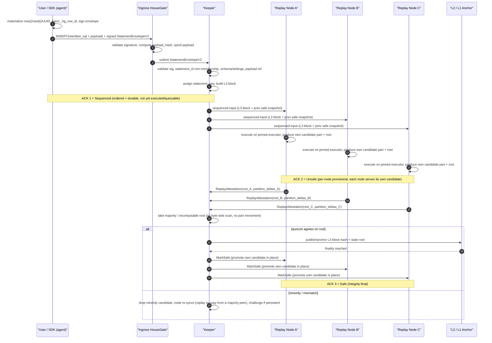
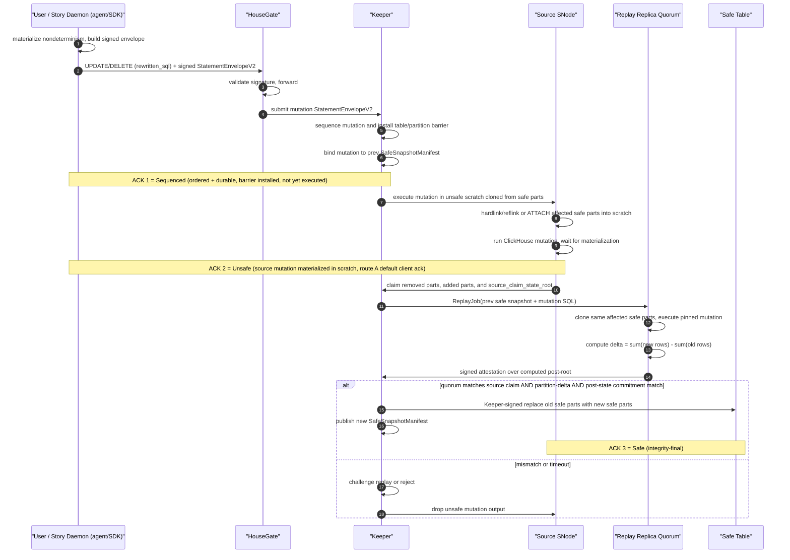
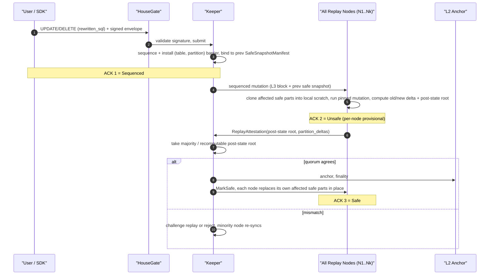
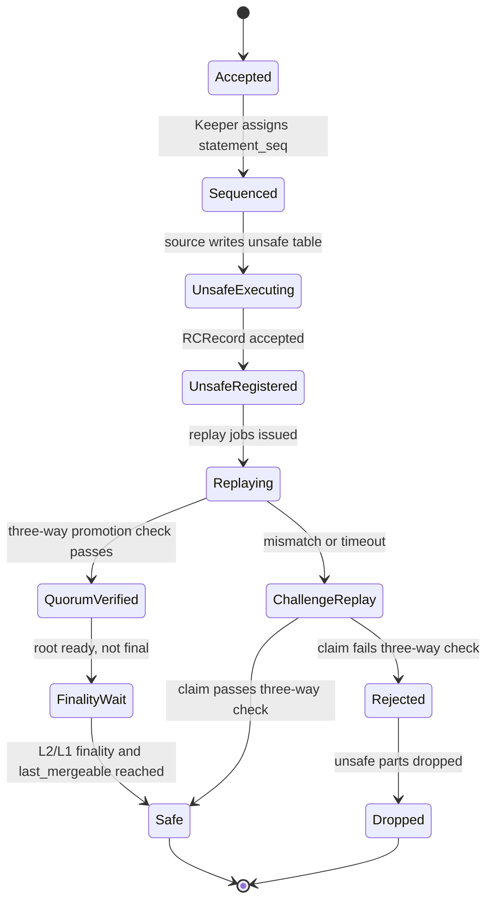

# Storage Network Data Integrity Verification Layer - Integrated Design

**Date:** 2026-06-22 **Status:** Proposed(v3, integrated after the 2026-06-17 storage integrity sync) **Base:** [2026-06-10 multi-replica trust design](https://github.com/housegate/housegate/blob/main/docs/superpowers/specs/2026-06-10-multi-replica-trust-design.md) + [sentio-network PROGRESS](https://github.com/sentioxyz/designs/blob/main/sento-network/PROGRESS.md) as of 2026-06-17 + [2026-06-17 storage integrity sync summary](https://github.com/sentioxyz/designs/blob/main/sento-network/meetings/2026-06-17-storage-integrity-sync-summary.md) **Source of truth:** English version; regenerate the Chinese version from this file when changing protocol semantics.

This document folds the June 17 discussion back into the June 10 trust design. It keeps the Plan B / Keeper direction, but narrows the v1 integrity layer around three decisions: verified user tables are exposed as one virtual table backed by physical `unsafe` and `safe` tables; JSON/Map and mutation-class statements are verified by replay rather than HouseGate-side streaming LtHash; and `safe` is a published state transition controlled by Keeper after quorum replay, not a local label assigned by a ClickHouse operator.

## 1. Positioning and Decision Summary

The scope is the data integrity and anti-fraud layer for Sentio Storage Network. It answers one question: when a user submits a signed write, how do other parties know that the ClickHouse parts later served as `safe` are the faithful result of that signed input?

The base topology remains fixed where it matters for the integrity layer: one HouseGate fronts one ClickHouse service; all client traffic passes through HouseGate; ClickHouse is not exposed directly to users, and the bottom-line invariant is that a ClickHouse instance opens TCP only to its co-located HouseGate — on the query plane and, per §12.1, on the ReplicatedMergeTree replication plane (Keeper + interserver) as well; `hg_unsafe` replication reuses native ReplicatedMergeTree and ClickHouse Keeper mechanics; Sentio Keeper owns sequencing, attestation, and safe-state publication; v1 Sentio Keeper is centralized and Sentio-operated; decentralization changes who checks and who bears economic consequences, not the evidence format.

The v1 verification baseline is **optimistic source execution plus quorum replay promotion**. One selected source node executes first and produces `unsafe` parts for freshness. Keeper records the signed input and the source's result claim. Verifier replicas replay the same L3 input against the previous safe snapshot on a pinned executor. Only a quorum matching the source claim, or a successful challenge replay, can promote parts into the `safe` table.

The full-node parallel replay route remains a fallback alternative: every replay node executes the sequenced input and produces its own candidate unsafe part, then Keeper chooses the majority/recomputable root. It is simpler and avoids part movement, but it lengthens the unsafe window and does not give the same fast source-write path.

## 2. Goals and Non-Goals

Goals:

1. Prevent polluted data from crossing into `safe`.
2. Preserve low-latency writes by allowing an `unsafe` acknowledgement before replay finality.
3. Make the relationship between signed SQL/payload and safe parts independently replayable.
4. Separate byte transport correctness from semantic execution correctness.
5. Define concrete responsibilities for HouseGate, Keeper, ClickHouse/SNode, and replay executors.
6. Keep v1 implementable without forking ClickHouse. The §12.1 engine split (`hg_unsafe` ReplicatedMergeTree ungated, `hg_safe` MergeTree) achieves this: no reverse-proxy gate and no ClickHouse patch are required.

Non-goals:

1. Query-result attestation for arbitrary `SELECT` responses.
2. A complete economic challenge/slashing game.
3. Support for `INSERT ... SELECT`, materialized views that read mutable state, or large unbounded mutations in v1.
4. A claim that local `safe` table bytes cannot be maliciously served incorrectly after promotion. That is a separate serving-integrity problem with probabilistic/engineering mitigations.
5. Support for engines that change row identity during background processing, such as Replacing/Summing/Aggregating/Collapsing MergeTree, TTL deletes, lightweight deletes, or `OPTIMIZE ... DEDUPLICATE`.

## 3. Established Facts From the June 17 Sync

The June 17 meeting changed the shape of the design in four material ways.

First, the physical table model is now explicit: each verified virtual table is backed by an `unsafe` table and a `safe` table. HouseGate exposes one virtual table name. Normal reads hit only the safe table. If a product explicitly asks for intermediate state, HouseGate can rewrite to a union of safe and unsafe surfaces.

Second, HouseGate-side streaming LtHash is no longer the general INSERT verifier. It can work for narrow scalar profiles, but JSON and Map are materialized by ClickHouse through version-dependent logic: key ordering, null handling, precision loss, dynamic path limits, and deep nesting behavior can change the stored logical value. Reimplementing ClickHouse's materializer in HouseGate is too heavy and too brittle. General v1 INSERT verification therefore uses replay/executor equivalence.

Third, UPDATE and DELETE are replay-only. A mutation changes stored rows relative to pre-state; a wire-side row hash does not know which old rows are removed or rewritten. The verifier must replay the mutation against the previous safe snapshot or against cloned affected safe parts.

Fourth, safe-table serving integrity is a separate and larger topic. The integrity layer can prove that a safe manifest/root was derived correctly. It cannot, by itself, prove that a malicious serving node returned that safe data for every user query. Mitigations include row/chunk hashes, Merkle roots, periodic scans, sampled real query input/output, and cross-node comparison, but shadow-data attacks remain possible without query attestation or trusted serving.

## 4. Threat Model and Trust Boundary

Trusted in v1:

- The Sentio-operated Keeper authority and its Raft group for ordering, admission, and safe-state publication.
- The input normalizer at the agent/SDK before the user signature. Non-deterministic functions such as `now()` and `random()` are materialized to constants and `_hg_row_id` is injected at the agent/SDK before signing (§7, §9). The ingress HouseGate does not normalize.
- The pinned executor profile selected by the protocol for a given L3 range.

Not trusted:

- Operator-side ClickHouse.
- Operator-side HouseGate once it is merely forwarding already signed input.
- Source SNode result claims.
- Local serving behavior after data has been promoted to a local safe table.
- Native ReplicatedMergeTree part checksums as semantic proof.

Native replication gives byte convergence. It does not prove that a first committer faithfully executed the signed SQL. The integrity layer adds an external content arbiter: signed statement log, previous safe snapshot, replay executor, state roots, and signed attestations.

## 5. System Roles and Responsibilities

### 5.1 HouseGate

HouseGate is the protocol and visibility boundary, not the SQL executor.

HouseGate responsibilities:

- Expose one virtual table for every verified user table.
- Apply physical table rewrites according to runtime mode: in forward mode HouseGate forwards the signed source SQL verbatim; in managed/proxy modes HouseGate deterministically rewrites virtual writes to the physical `unsafe` table and virtual safe reads to the physical `safe` table.
- Optionally rewrite an explicit intermediate-state read to `safe UNION unsafe`, with documented weaker semantics.
- **Validate** the incoming signed envelope (signature, `sql_hash`, `payload_hash`) and **spool** the payload into the DA/payload store. HouseGate does NOT materialize non-determinism or inject reserved columns — those happen at the agent/SDK before signing (§7, §9). In forward mode it forwards the signed SQL verbatim. In managed/proxy modes it applies the deterministic physical rewrite to the source-path SQL; the pinned executor recomputes the same rewrite during replay, so a malicious HouseGate rewrite is caught as a source/byte mismatch rather than trusted as protocol truth.
- Build or forward `StatementEnvelopeV2`.
- Hide reserved columns from the logical surface unless an operator/debug view explicitly asks for them.
- Reject user attempts to write, update, rename, or drop reserved columns.
- Report candidate parts, ClickHouse system state, and metrics needed by Keeper and replay workers.
- Optionally **forward ClickHouse's replication plane** so a ClickHouse instance opens TCP only to its co-located HouseGate (§1): the ClickHouse Keeper / ZooKeeper client connection (L4 TCP passthrough to the Keeper ensemble) and the interserver-HTTP part-fetch port (HTTP reverse-proxied to the peer's HouseGate via the cross-HouseGate `__peer__` routing). This is *forwarding for network isolation*, not gating — HouseGate moves the bytes without interpreting `ReplicationLogEntry` or controlling merges (gating is infeasible and unnecessary, §16) — so it adds network mediation, not integrity (§9), at the cost of HouseGate carrying the replication data plane (§12.1). Not required where the replication plane is isolated by network policy instead.

HouseGate must not be the final judge of correctness. It may compute expected claims for fast profiles, but `safe` depends on Keeper validation and replay attestations.

### 5.2 Keeper

Keeper is the sequencer, validator, registry, attestation collector, and safe-state publisher. The Go architecture for this role — component breakdown, consensus/HA plan, signing scheme, and the `pkg/sequencer` package map — is specified in [2026-06-30 Sentio Sequencer design](2026-06-30-storage-integrity-keeper-design.md); this section defines the responsibilities, that design defines how they are built. **Naming:** that sub-spec renames this role from "Keeper" to **Sentio Sequencer** to emphasize its trust-root sequencing function and to avoid confusion with the unrelated ClickHouse Keeper; throughout this document, "Keeper" in the integrity-layer sense refers to that same Sequencer role. "Keeper" is also used below for ClickHouse Keeper (the C++ ZooKeeper-compatible coordination service that backs `hg_unsafe` ReplicatedMergeTree); see §12.1 for that boundary — the two are unrelated despite the shared word.

Keeper responsibilities:

- Assign `statement_seq` and build L3 blocks over signed statement envelopes.
- Enforce `statement_id` uniqueness via the L3-derived mountain-range accumulator + per-account high-water mark (§7); reject duplicates with non-membership proofs. This state is replayable from the L3 stream, so decentralizing Keeper does not change the dedup fact.
- Record payload references and ensure payload availability.
- Select the source node for optimistic execution.
- Accept source result claims only through the validation front.
- Store RC records for candidate parts, partition deltas, and source claimed roots.
- Build `ReplayJob` objects from L3 block input, previous safe snapshot identity, schema snapshot, executor profile, and payload refs.
- Collect `ReplayAttestation` objects and run the three-way promotion check (replay + partition-delta + byte-side lthash, §9). In v1 the centralized Keeper is the trust root that *orchestrates* the 2-of-3 replay quorum and arbitrates promote/challenge immediately; recomputability is an after-the-fact audit capability in v1. The decentralized-phase safety model (challenge window) is specified in §11.
- Open challenge replay on root mismatch or timeout.
- Publish `SafeSnapshotManifest` and safe watermarks.
- Issue Keeper-signed promotion commands (`REPLACE PARTITION` from a promotion shadow table, §12) into safe tables.
- Gate safe-table merges via the ledger equation (§12.4).
- Coordinate reorg/drop cleanup for unsafe parts.
- Track node membership and the Active status of replicas after snapshot sync.

Keeper does not execute user SQL in the normal path. A challenge reference executor may be orchestrated by Keeper, but the signed replay receipt is still evidence produced by an executor profile.

### 5.3 ClickHouse and SNode

ClickHouse stores and materializes data; SNode runs local orchestration around it.

ClickHouse/SNode responsibilities:

- Store physical `unsafe` (ReplicatedMergeTree) and `safe` (MergeTree) tables per §12.1.
- Execute the source write into `unsafe`.
- Produce candidate part metadata: part name, partition id, physical checksum/hash, row count, bytes, and optional row/content commitment.
- Run pinned replay execution in scratch or replay-local tables.
- Scan local parts and compute byte/content commitments required by the receipt.
- Promote verified local partitions into `safe` only under Keeper-signed `REPLACE PARTITION` (§12.2).
- Detach/drop rejected unsafe parts.
- Run safe-table audit jobs and respond to cross-node sampling checks.

ClickHouse runs unmodified: the §12.1 engine split means no reverse-proxy gate and no ClickHouse patch are required.

### 5.4 Replay Executor

The replay executor is the deterministic execution witness.

Replay executor responsibilities:

- Start from a previous `SafeSnapshotManifest`, never from unsafe state.
- Load payload bytes only after `payload_hash` and `payload_length` match.
- Pin ClickHouse build, settings, schema snapshot, and executor profile.
- For payload-local INSERTs, apply the deterministic Phase-2 physical rewrite when the runtime mode requires it (§7), materialize the signed payload, and produce new part/root commitments.
- For mutations, clone or attach affected safe parts into scratch, execute the mutation, and compute old/new part deltas.
- Emit `ExecutionReceipt` and `ReplayAttestation`.
- Sign mismatches as challenge evidence rather than treating them as local protocol failure.

## 6. Physical Table Model

Each verified virtual table `Transfer` maps to two physical tables:

```text
hg_unsafe.Transfer_<table_id>
hg_safe.Transfer_<table_id>
```

Both tables use the same logical user columns plus reserved protocol columns. They should have the same partition key, order key, primary key, storage policy, and type profile so that `detach`/`attach`, `ATTACH PARTITION FROM`, or equivalent promotion can stay close to O(1).

Reserved columns:

```sql
-- mandatory on every verified table
_hg_row_id FixedString(32)

-- optional, per-table opt-in (default off); forensic/debug only
_hg_payload_ordinal UInt64
```

`_hg_row_id` is the only load-bearing reserved column. It distinguishes duplicate user-visible rows and is the LtHash row-instance identity (§8); merge, mutation, and the byte-side promotion check all rely on it. The agent injects it at signing time from `BLAKE3("housegate-row-id-v1" || network_id || table_id || statement_id || global_row_ordinal)` (§5.2 of the 2026-06-10 design), so it is fixed before sequencing and is stable for the row's lifetime. `global_row_ordinal` is the row's 0-based index over the **entire canonical payload of the statement**, spanning every part and partition the statement writes, and independent of how the payload is later split into Data-block chunks or distributed across destination partitions. This payload-global scope is load-bearing: it is what makes `_hg_row_id` unique across all of a statement's rows (the partition-level cancellation argument in §8 depends on it), so it must never be reset per chunk or per partition. Storage cost is real and accepted: 32 bytes/row, incompressible. A structured-integer alternative (`(client_account_hash, client_seq, global_row_ordinal)` packed into a fixed-width integer, compressible to near zero) remains the documented fallback if P0/P1 measurements demand it (open question 11 of the 2026-06-10 design — row-id storage overhead).

`_hg_payload_ordinal` is the `global_row_ordinal` that fed `_hg_row_id`; since `_hg_row_id` is a hash it cannot be reversed, so storing the ordinal separately is purely forensic ("which row of the payload was this"). Off by default.

**Reserved columns that are deliberately not stored per row, and why:**

- `_hg_l3_block_seq` / `_hg_statement_seq` (sequencer-assigned): NOT stored. Their only consumer is the `UNION(safe, unsafe)` read path and `as_of_safe(block)` time-travel, neither of which needs per-row values:
  - **Dedup across the UNION** uses `_hg_row_id` plus the Keeper unsafe-part registry. `REPLACE PARTITION` copies data into `hg_safe` rather than removing it from `hg_unsafe`, so promotion includes a cleanup/exclusion step: `unsafe_latest` must exclude parts already covered by the safe watermark until asynchronous unsafe cleanup drops them.
  - **Ordering across the UNION** uses the table's `ORDER BY`, not protocol sequence numbers.
  - **`as_of_safe(block=N)` time-travel** is served by the `SafeSnapshotManifest`, which is already indexed by `safe_l3_block_seq` (§8). The read picks the manifest for block N and reads the safe snapshot; it does not filter rows by a per-row block number.
  - **Part↔statement attribution** is carried by ClickHouse part metadata plus the Keeper `RCRecord`: `insert_deduplication_token = statement_seq` in sequencing-before-write mode, or `statement_id` in the optimistic-forward path (§12.2), not by a per-row column.
  Storing these per row would force source execution to wait for sequencing before writing `hg_unsafe` (or require a "pending namespace" rewrite after sequencing), which reinstates the sequencer dependency that §5.2 of the 2026-06-10 design removed and kills optimistic execution. See the tradeoff note below.
- `_hg_source_node`: NOT stored. Part-level provenance already lives in `RCRecord.source_node`. A row-level copy serves no safety role (safety comes from root/lthash, not provenance) and is misleading once the part replicates, since the serving node ≠ the source node.
- `_hg_row_hash`: NOT stored. `row_lthash` is already the canonical row commitment; an additional BLAKE3 row hash is pure redundancy, and the audit path recomputes `row_lthash` from stored rows anyway.

**Tradeoff: optimistic execution vs. per-row sequencing columns.** The decision to omit `_hg_l3_block_seq` / `_hg_statement_seq` is a deliberate trade. Considered and rejected:

- **B. Keep the columns, write `hg_unsafe` only after sequencing.** Preserves per-row time-travel and block-filtered unsafe reads. Cost: source INSERT latency gains an L3 batching round-trip before any ClickHouse write, and the row-id decoupling work in §5.2 (which exists precisely to remove this sequencer dependency) is undone. Unsafe writes also become sequencer-censored — if Keeper refuses to sequence, the row never lands even provisionally.
- **C. Keep the columns as mutable columns, fill them after sequencing via UPDATE.** Preserves optimistic execution. Cost: introduces a mutation into `hg_unsafe`, violating the §12.2 invariant that `hg_unsafe` is append-only under `STOP MERGES`; that mutation is itself unverified, so the provisional rows a client sees via `unsafe_latest` would carry a `0`/`NULL` block seq until the UPDATE runs, making the time-travel semantics the columns were meant to provide incorrect during the window anyway.

Scheme A (omit the columns, route time-travel through the manifest) is chosen because unsafe reads are provisional by definition (`unsafe_latest` "may change or be dropped, not integrity-final", §11), so per-block time-travel over provisional data has low semantic value, and the manifest already provides the block index for the surface where time-travel matters (safe snapshots).

Example physical schema:

```sql
CREATE TABLE hg_unsafe.Transfer_0xT (
  _hg_row_id FixedString(32),
  from_address String,
  to_address String,
  token_address String,
  amount String,
  block_number UInt64,
  tx_hash FixedString(32),
  log_index UInt32,
  block_time DateTime
)
ENGINE = ReplicatedMergeTree('/sentio/{keeper_shard}/unsafe/{table_id}', '{replica}')
PARTITION BY toYYYYMM(block_time)
ORDER BY (block_number, tx_hash, log_index, _hg_row_id);
```

The `safe` table uses a plain `MergeTree` (the engine split and its rationale are specified in §12.1):

```sql
CREATE TABLE hg_safe.Transfer_0xT ... ENGINE = MergeTree() ...
```

`hg_safe` is not on any ReplicatedMergeTree Keeper path; it receives parts only through the per-part promotion operation in §12.2. Using ReplicatedMergeTree for `hg_safe` was considered and rejected because it would re-introduce the need to gate ClickHouse's replication log from a reverse proxy; see §12.1.

## 7. StatementEnvelopeV2 and L3 Data Model

The signed envelope covers what the user or trusted ingress can know before sequencing. It must not sign sequencer-assigned values.

```text
StatementEnvelopeV2 {
  envelope_version,
  network_id,
  keeper_shard_id,
  client_account,
  statement_id,
  statement_kind,
  virtual_table_id,
  rewritten_sql,          // materialized SQL (non-deterministic fns resolved to constants); see below
  sql_hash,               // H(rewritten_sql) — the materialized, pre-physical-rewrite SQL
  settings_hash,
  schema_snapshot_id,
  payload_ref,
  payload_hash,
  payload_length,
  payload_format,
  row_id_profile_id,
  user_jws_v2,
}
```

**What `rewritten_sql` / `sql_hash` cover, and the rewrite split.** SQL rewriting has two phases with distinct trust boundaries and two runtime placements:

- **Phase 1 — non-determinism materialization (agent/SDK, trusted, before signing).** The agent/SDK rewrites non-deterministic functions in the SQL *text* to literal constants before signing: `now()` → `'2026-06-22 10:00:00'`, `rand()` → `0.732`, `generateUUIDv4()` → `'...'`. This is purely local (current time, local RNG, local UUID) and needs no external state. The result is the `rewritten_sql` the user signs; `sql_hash = H(rewritten_sql)`. Every executor that replays this envelope runs the same constants, so determinism holds by construction.
- **Phase 2 — deterministic physical rewrite (runtime mode dependent).** Table-name / schema rewriting (`db1.t` → physical, `SHOW TABLES` → metadata SELECT) is a pure function of `(rewritten_sql, anchored schema_snapshot, anchored settings, target_surface)`. In forward mode, no HouseGate rewrite is applied and `rewritten_sql` is already the source SQL sent to ClickHouse. In managed/proxy modes, HouseGate applies this deterministic rewrite on the source path to target `hg_unsafe`, and the pinned executor recomputes the same rewrite during replay. The physical rewrite is NOT user-signed and NOT trusted from the source/HouseGate; replay recomputation is the authority.

The envelope therefore signs the Phase-1 output only. The source may not re-materialize non-determinism. A compromised HouseGate in managed/proxy mode can send the wrong physical SQL to ClickHouse, but that only creates a source claim/byte-side mismatch: verifiers replay the deterministic physical rewrite from the signed Phase-1 SQL and reject the source bytes if they do not match.

**`user_jws_v2` signing payload** (P0 freeze):

```text
{
  "purpose": "housegate-statement-v2",
  "network_id": ...,
  "keeper_shard_id": ...,
  "iat": <unix seconds>,
  "statement_id": "...",
  "sql_hash": "0x...",          // H(rewritten_sql), post-materialization
  "settings_hash": "0x...",
  "schema_snapshot_id": "...",
  "payload_hash": "0x...",
  "payload_length": ...,
  "payload_format": "...",
  "target_table_id": "...",
  "row_id_profile_id": "..."
}
```

Explicitly NOT signed (assigned later or non-user-controlled): `statement_seq` (Keeper assigns after submission), `source_node`, `executor_profile_id` (block-level, in `L3Block`), and the Phase-2 physical rewrite.

**`statement_seq` vs `statement_id` — who assigns what, and why.** `statement_seq` is the Keeper-assigned, globally monotonic sequence number that establishes a **total order** over statements (the first half of the §5.2 sequencing responsibility, "assign `statement_seq` and build L3 blocks"). It is deliberately separated from the client-side `statement_id`:

| | `statement_id` | `statement_seq` |
|---|---|---|
| Assigned by | client / agent | Keeper (after submission) |
| Signed? | **yes** (in `user_jws_v2`) | **no** |
| Shape | `client_account \|\| client_seq \|\| client_nonce` | monotonic integer |
| Role | identity / dedup / feeds `_hg_row_id` | ordering / part attribution |

`statement_seq` cannot be signed because **signing happens before submission, but the number is assigned after it — the signer cannot know its position at signing time** (base design §6). The client therefore signs only its own `statement_id`; the Keeper later anchors the `statement_id → statement_seq` binding in the L3 block, keeping the mapping auditable. Downstream (§6, §12.2), part↔statement attribution rides on `insert_deduplication_token = statement_seq` in the sequencing-before-write mode; in the optimistic-forward mode the seq does not exist yet, so `statement_id` carries attribution until the Keeper binds it.

`statement_id` should be structured (per-account monotonic, supports L3-derived uniqueness enforcement):

```text
statement_id = client_account || client_seq || client_nonce
```

**`statement_id` uniqueness — resolved (adopts 2026-06-10 Appendix B.2).** `statement_id` uniqueness is load-bearing: `_hg_row_id = BLAKE3(... || statement_id || global_row_ordinal)`, so a reused `statement_id` resurrects the duplicate-row LtHash cancellation attack. Enforcement is an **L3-derived accumulator**, not Keeper memory, so that decentralizing Keeper authority does not change the dedup fact:

- A **mountain-range Merkle accumulator** (recommended construction for P0; no trusted setup, append-only, O(log n) non-membership proofs) commits `spent_ids_root` in each L3 block alongside `partition_commitments_after`. It is a pure function of the sequenced `statement_id`s — any honest node that replays the L3 stream reconstructs it identically. (RSA/pairing accumulators give O(1) proofs but require trusted-setup / modulus governance and are rejected for v1; sparse Merkle is acceptable but larger constants.)
- Acceptance requires a **non-membership proof** that the `statement_id` is not under the previous `spent_ids_root`; only then is the `statement_id → statement_seq` binding anchored.
- A **per-account high-water mark** `hi_seq[account]` (the largest `client_seq` sequenced for that account) gives well-behaved traffic O(1) acceptance — a new `client_seq > hi_seq` needs no non-membership proof; only out-of-order `client_seq ≤ hi_seq` falls back to the accumulator proof. This bounds dedup state to one integer per active account plus a gap set, and **shards cleanly by `client_account`**, addressing the scaling objection.
- The accumulator is append-only and permanent; a `statement_id` once in `spent_ids_root` is never removed. Scope is **per-account-global**.

`schema_snapshot_id` scoping (phased):

- **v1: block-level.** `schema_snapshot_id` is the same for every statement in an L3 block; a block may not contain schema changes (DDL statements that change the schema must occupy their own block or take effect at a block boundary). The executor replays the whole block under one schema. Simple and unambiguous.
- **P4 (mutation/DDL completeness): statement-level.** When more DDL is admitted, a DDL statement mints a new schema snapshot and subsequent statements in the same or later block carry the new `schema_snapshot_id`.

Schema-changing DDL uses a separate **schema-transition lane**, not the unsafe-part promotion path. In v1 every admitted schema change is sequenced as a singleton block or a block-boundary transition. Keeper installs a table/database-level schema barrier, stops admitting new writes under the old schema, and drains or rejects outstanding old-schema unsafe writes before the new schema becomes active. The DDL mints a new `schema_snapshot_id` and `schema_root`; SNode applies the Keeper-signed DDL to all protocol-owned physical surfaces (`hg_safe`, `hg_unsafe`, `hg_promote` templates, mutation scratch templates, and replay scratch templates) and reports the observed `schema_hash`. Normal writes resume only after the local schema matches the anchored root. Verifiers derive the schema exclusively from the anchored DDL/settings log; source-side `system.columns` is an observation, not authority.

DDL admission classes for v1:

| Statement class | v1 route |
|---|---|
| `CREATE TABLE` | Admit only if engine, partition key, order key, primary key, storage policy, defaults/materialized expressions, and types are on the verified whitelist. Keeper allocates stable `table_id` and `column_id` values and injects reserved protocol columns such as `_hg_row_id`. |
| `ADD COLUMN` | Metadata-only only for non-key, non-reserved columns with deterministic immutable `DEFAULT`/`NULL` semantics and a stable `column_id`. This is commitment-neutral only if the profile explicitly defines how old sealed parts canonicalize a missing column; otherwise the statement is rejected or upgraded to mutation-class rehash. Adding a column that changes partition/order/primary keys, projections, indexes, or materializes values into existing rows is not metadata-only. |
| `RENAME COLUMN` | Metadata-only: row commitments bind `column_id`, not display names. Reserved protocol columns may not be renamed. |
| `MODIFY DEFAULT` | Rejected in v1 unless the profile proves it affects only future inserts and does not change read-time values for old sealed parts. Defaults that are evaluated at read time are not silently neutral. |
| `DROP COLUMN` / `MODIFY COLUMN` type | Rejected in v1 by default. A later admitted form must be mutation-class rehash: clone affected safe parts into scratch, apply the DDL, recompute old/new partition commitments under the new schema, collect quorum attestations, and publish the rewritten partitions under a new `schema_snapshot_id`. |
| `TRUNCATE` / `DROP PARTITION` | Mutation-class but cheap: the delta is `-partition_commitment` for the dropped safe partition, with the same barrier and attestation rules as bounded mutations. |
| Partition key, order key, primary key, engine, storage policy, TTL, projection/index changes | Rejected in v1. These change storage/promotion/merge invariants rather than just catalog metadata; the safe path is create-new-table plus replay/reindex. |
| `_hg_row_id` and other protocol columns | Never user-modifiable: reject write, update, rename, drop, type/default changes, and key changes touching them. |

Keeper assigns and anchors:

```text
L3Block {
  l3_block_seq,
  prev_l3_hash,
  l2_anchor_ref,
  statement_seq_start,
  statements: [StatementEnvelopeV2],
  schema_snapshot_id,
  executor_profile_id,
  prev_safe_snapshot_id,
  prev_state_root,
  spent_ids_root_after,
}
```

The source registers a result claim:

```text
RCRecord {
  l3_block_seq,
  statement_seq,
  source_node,
  unsafe_table,
  candidate_parts: [{
    part_name,
    partition_id,
    part_phys_hash,
    part_row_lthash,
    row_count,
    bytes,
  }],
  partition_deltas,
  source_claim_state_root,
}
```

Keeper builds replay jobs from L3 + RC + previous safe state:

```text
ReplayJob {
  l3_block_seq,
  prev_safe_snapshot_id,
  prev_state_root,
  schema_snapshot_id,
  executor_profile_id,
  source_claim_state_root,
  statements,
}
```

Verifier output is an attestation row:

```text
ReplayAttestation {
  replica_id,
  receipt_hash,
  computed_state_root,
  match_source_root,
  signature,
}
```

## 8. Content Commitments and Safe Snapshot Manifests

The row commitment input is a unique row instance, not just user-visible row values. Commitments are maintained at four levels, each with a distinct role; conflating them is the easiest way to introduce a safety gap.

```text
row_id = BLAKE3("housegate-row-id-v1" || network_id || table_id || statement_id || global_row_ordinal)
row_element = ("housegate-row-v1", table_id, row_id, sorted [(column_id, type_id, canonical_value)])
row_lthash = LtHash(row_element)                          // per row; computed, not stored
part_row_lthash = sum(row_lthash)                         // per part; stored in RCRecord and manifest
partition_commitment = sum(active part_row_lthash)        // per partition; the promotion gate (LtHash accumulator, 2048 bytes)
data_root = H(canonicalized [(table_id, schema_hash, partition_roots, active_parts)])
state_root = H(schema_snapshot_id, schema_root, executor_profile_id, data_root)
```

The two schema fingerprints folded above are defined as: `schema_hash` is the per-table canonical schema commitment, `schema_hash = H("housegate-schema-v1" || table_id || sorted [(column_id, type_id)] || partition_key || order_key || primary_key || engine_id || pinned_settings)` over the anchored DDL (the same `(column_id, type_id)` encoding used in `row_element`, plus the structural keys, the engine, and the MergeTree settings pinned per §12.3 — e.g. `parts_to_throw_insert`, the no-merge setting); `schema_root` is the snapshot-level fold over every table's `schema_hash`, `schema_root = H(canonicalized [(table_id, schema_hash)])`, keyed by `schema_snapshot_id`. Both canonicalize by sorting (tables by `table_id`, columns by `column_id`) before hashing, so independent verifiers derive identical roots.

Two layers, two purposes: LtHash is the arithmetic object **up to the partition level only** (additive, supports mutation deltas). Above the partition, `data_root` and `state_root` are ordinary hash folds — they bind the replay to the anchored snapshot but are not arithmetic and cannot be add/subtracted. Mutation deltas use LtHash at partition level; snapshot comparison uses `state_root`. Do not conflate the two.

**LtHash is not computed on the HouseGate wire path.** Three places compute it, all executor/verifier-side: (a) the pinned executor during replay, from materialized values; (b) the byte-side scan in §9 check 3, from the fetched candidate-part bytes on the INSERT path (the mutation path has no shared fetched-byte object and instead recomputes the post-mutation `partition_commitment` from each replica's locally regenerated scratch, §10); (c) the §13 audit, from safe parts. HouseGate only injects `_hg_row_id` (at the agent, per §9) and computes `payload_hash`.

**Partition-level cancellation resistance.** `partition_commitment`'s collision resistance is inherited from the row level, and the load-bearing fact is per-row `_hg_row_id` uniqueness — not part structure (LtHash is additive over one 2048-byte accumulator, so folding per-part and folding all rows directly give the same result; "disjoint parts" does no independent work). Every `_hg_row_id` in a partition is distinct because `statement_id` is globally unique and `global_row_ordinal` is unique within a statement across all of its parts and partitions (§6); distinct parts then have disjoint row-ID sets as a consequence. The 2^16-lane cancellation attack, blocked at row level by `_hg_row_id`, is therefore also blocked at partition level — no separate argument is needed. This holds for the sequenced, dedup-enforced element set that the §9 promotion check recomputes from replay; it does **not** hold over raw `hg_unsafe` parts in the optimistic-forward window, where a reused `statement_id` could transiently produce colliding `_hg_row_id`s before the Keeper non-membership check runs — one reason `unsafe_latest` carries no integrity claim (§11).

The four levels and what each is responsible for:

| Level | Computed from | Role | Stored separately? |
|---|---|---|---|
| `row_lthash` | the canonical row element, including `_hg_row_id` | the atomic unit; no security role on its own | No — `_hg_row_id` is in the row, so any holder of the bytes can recompute it |
| `part_row_lthash` | `sum(row_lthash)` over the part | **dispute localization** — which part diverged | Yes — carried in `RCRecord.candidate_parts` and `SafeSnapshotManifest.active_parts` |
| `partition_commitment` | `sum(part_row_lthash)` over active parts in the partition | **the promotion gate** — see §9; LtHash collision resistance holds at this level because distinct row IDs make element sets disjoint across parts | Yes — `partition_deltas` in `RCRecord`, `partition_roots` in the manifest |
| `state_root` | fold over schema + executor profile + all partition commitments | necessary (binds the replay to the anchored snapshot) but **not sufficient** for promotion | Yes — `SafeSnapshotManifest.state_root` |

**Why `state_root` equality alone is insufficient for promotion.** A replay root is computed from the signed L3 payload and the previous safe snapshot, not from the source's part bytes (§9). Source can register `source_claim_state_root = R` while writing fraudulent part bytes `bytes_evil` into `hg_unsafe`; replicas independently replay to the same `R`; `R == R` proves nothing about the bytes on the source's disk. A fraudulent source can also register a self-consistent logical hash for the wrong materialized value (LtHash gives no non-membership proof against an attacker who controls both the claim and the underlying rows). Promotion therefore requires an additional byte-side check that ties the root to the bytes a replica actually fetched; see §9.

LtHash remains useful as an additive state accumulator, root comparison input, and dispute-localization handle. It is not the general proof that ClickHouse faithfully materialized JSON/Map/defaults/mutations. Replay is the proof for those paths; the byte-side partition-delta check is the proof that the replayed root actually corresponds to the bytes that entered the safe table.

`SafeSnapshotManifest` is the published safe state object. It contains:

```text
snapshot_id,
parent_snapshot_id,
safe_l3_block_seq,
schema_snapshot_id,
schema_root,
executor_profile_id,
data_root,
state_root,
manifest_root,
tables: [{
  table_id,
  schema_hash,
  partition_roots,
  active_parts: [{
    part_name,
    partition_id,
    part_phys_hash,
    part_row_lthash,
    row_count,
    bytes,
    storage_refs,
  }],
}]
```

The manifest is content-addressed and canonicalized. Table order, partition order, and part order must be normalized before hashing so independent verifiers derive the same roots.

## 9. INSERT Verification Flow

```mermaid
sequenceDiagram
    autonumber
    participant U as "User / Story Daemon (agent/SDK)"
    participant HG as "Ingress HouseGate"
    participant K as "Keeper"
    participant S as "Source SNode + ClickHouse"
    participant R1 as "Replay Replica A"
    participant R2 as "Replay Replica B"
    participant L2 as "L2 / L1 Anchor"

    U->>U: materialize now()/rand()/UUID to constants; inject _hg_row_id into payload
    U->>HG: INSERT(rewritten_sql + _hg_row_id-augmented payload) + signed StatementEnvelopeV2
    HG->>HG: validate signature, compute payload_hash, spool payload
    HG->>K: submit StatementEnvelopeV2
    K->>K: validate signature, statement_id non-membership, schema/settings, payload ref
    K->>K: assign statement_seq and build L3 block
    K-->>HG: Sequenced ack + source assignment (managed path)
    Note over U,K: ACK 1 = Sequenced (ordered + durable, not yet executed/queryable)
    HG->>S: execute source SQL against unsafe table (managed: after sequencing; optimistic-forward: may run before sequencing)
    S->>S: materialize unsafe parts
    Note over U,S: ACK 2 = Unsafe (route A default client ack at write speed, optimistic-forward can precede sequencing)
    S->>K: RCRecord(candidate parts + source_claim_state_root)
    K->>K: validate linkage, part claims, and registration arithmetic
    K->>R1: ReplayJob(prev safe snapshot + signed payload)
    K->>R2: ReplayJob(prev safe snapshot + signed payload)
    R1->>R1: execute on pinned executor (deterministic physical rewrite), compute root
    R2->>R2: execute on pinned executor (deterministic physical rewrite), compute root
    R1->>K: ReplayAttestation(root_A, partition_deltas_A, per-part lthash_A)
    R2->>K: ReplayAttestation(root_B, partition_deltas_B, per-part lthash_B)
    K->>R1: byte-side scan request over fetched candidate parts
    K->>R2: byte-side scan request over fetched candidate parts
    R1->>R1: SELECT rows from fetched parts, recompute part_row_lthash
    R2->>R2: SELECT rows from fetched parts, recompute part_row_lthash
    R1->>K: byte_side part_row_lthash_A
    R2->>K: byte-side part_row_lthash_B
    alt quorum AND per-partition delta matches AND byte-side lthash matches source claim
        K->>L2: publish/anchor L3 block hash and state root
        L2-->>K: finality / last_mergeable reached
        K->>S: Keeper-signed PromoteSafePartition (REPLACE PARTITION, see §12)
        K->>R1: Keeper-signed PromoteSafePartition (REPLACE PARTITION, see §12)
        K->>R2: Keeper-signed PromoteSafePartition (REPLACE PARTITION, see §12)
        Note over S,R2: ACK 3 = Safe (integrity-final)
    else mismatch or timeout
        K->>K: open challenge replay (signed mismatch attestation becomes evidence)
        K->>S: keep/drop unsafe parts
        K->>R1: keep/drop replay outputs
        K->>R2: keep/drop replay outputs
    end
```

Important properties:

- **Rewrite split (see §7):** the agent/SDK materializes non-deterministic functions and injects `_hg_row_id` *before* signing; HouseGate validates the signature, computes `payload_hash`, and spools the payload. In forward mode HouseGate forwards the signed SQL verbatim. In managed/proxy modes HouseGate applies the deterministic physical rewrite for the source write, while replay executors independently recompute the same rewrite before execution. HouseGate never re-materializes non-determinism or modifies the signed payload.
- **Execution timing split:** the diagram shows the managed/sequencing-before-write path, where `statement_seq` is available before the source write. The optimistic-forward path may write `hg_unsafe` before sequencing and uses `statement_id` for dedup/part attribution until Keeper later binds `statement_id -> statement_seq`; promotion still waits for sequencing, replay, finality, and the §9 three-way check.
- The source's unsafe part may serve explicit unsafe/fresh reads before it is safe, if the product exposes that mode.
- Normal `SELECT` reads only the safe table.
- Replayed roots are computed from signed input and previous safe state, not from source part bytes.
- Promotion is a three-way check, not root equality alone. A source part with valid ClickHouse checksums and a self-consistent `source_claim_state_root` can still be fraudulent. Promotion requires all three:
  1. **Replay check:** a quorum of replicas independently replays the signed L3 payload and produces the same `computed_state_root` as `source_claim_state_root`. Proves the payload's correct execution yields this root.
  2. **Partition-delta check:** for each partition touched by the statement, `Σ(part_row_lthash of new parts)` reported by the source equals the partition delta the replicas computed during replay. This binds the source's per-part claims to the replay root, and is the load-bearing link that defeats a colluding source: a malicious source controls both its on-disk bytes and its own `RCRecord.candidate_parts` claims, so to get evil rows promoted it must report per-part hashes that sum to the correct replay delta — which (LtHash being collision-resistant over disjoint row-ID sets, §8) is infeasible unless the evil rows happen to collide, which per-row `_hg_row_id` rules out. No amount of source-side hashing of an evil row set can make it reconcile with the root. It also localizes any disagreement to a partition.
  3. **Byte-side part-lthash check:** each attesting replica reads the part bytes it actually fetched (`SELECT ... WHERE _part IN (...)`), recomputes `part_row_lthash`, and confirms it equals the value in `RCRecord.candidate_parts`. This is the complementary link that binds the source's reported per-part hashes to the actual bytes on disk. It is the only one of the three that touches the source's actual part bytes, and it catches the case check 2 alone would miss: a source that reports a correct-looking `part_row_lthash` for `bytes_evil` while storing different bytes on disk.
- A root match without checks 2 and 3 is **not** promotion, and the two are complementary, not redundant — both are load-bearing. Each closes a different half of the `bytes_evil` attack: check 2 binds the root to the source's reported per-part claims (evil rows cannot be made to sum to the correct delta without a collision); check 3 binds those reported claims to the bytes actually on disk (catches a source that reports a hash for `bytes_evil` but stores divergent bytes). The earlier framing ("without the byte-side scan the evil bytes would enter `hg_safe` unopposed") understated check 2: a byte-side scan alone cannot stop a source that truthfully reports `LtHash(bytes_evil)`, because then check 3 passes too — only check 2 stops that variant. Promotion is the chain `root —check 2→ Σ source per-part claims —check 3→ actual disk bytes`; every link is needed.
- **v1 quorum parameter (P0 freeze):** promote requires ≥2 of 3 independent replay replicas to attest the same `computed_state_root`, and the source's own self-attestation does not count. In v1 the centralized Keeper is the trust root for *orchestrating* this quorum (it picks replicas, collects attestations, decides promote, opens challenges); recomputability is an *after-the-fact audit* capability in v1, not the runtime promote mechanism. The decentralized-phase safety model (challenge window) is specified in §11.
- The physical promotion operation (how verified bytes actually move from `hg_unsafe` to `hg_safe`) is specified in §12.

**Route B contrast — full-node parallel replay (the §16 fallback; shown for comparison, route A above is the v1 baseline).** Under route B there is no designated source: every node executes the sequenced input itself and produces its own candidate part, and Keeper takes the majority/recomputable root — so there is no source claim, no byte-side scan (each node's own materialization is its truth), and no part movement. The cost is a longer unsafe window and a later ack (see below).



**Ack-point difference.** The two routes diverge at the *Unsafe* ack. Route A returns the client's write at write speed — the source lands `unsafe` parts immediately (the optimistic-forward path can even write before sequencing), so the data is queryable via `unsafe_latest` right away (this is route A's default client ack). Route B's earliest cheap ack is *Sequenced* (ordered + durable, but not yet executed, hence not yet queryable); a queryable `unsafe` result only exists after sequencing **plus** node execution, and is per-node rather than one canonical surface. Both routes reach *Safe* only after finality, but route B's safe gate is just majority-root agreement — it has no byte-side check (§9 check 3), because no node promotes another node's bytes.

## 10. Mutation Verification Flow

Mutation-class statements include `ALTER ... UPDATE`, `ALTER ... DELETE`, large rewrites, and any write whose result depends on pre-state. v1 admits only bounded UPDATE/DELETE profiles; `INSERT ... SELECT` and large/unbounded mutations are deferred to v2.



Mutation constraints:

- Mutations read from a previous safe snapshot, not from arbitrary unsafe state.
- Keeper must serialize mutations against earlier writes to the same affected table/partition cut.
- The source must never mutate the safe table in place before verification.
- Replay cost is proportional to touched parts. Admission must cap touched bytes/parts for v1.
- Attempts to modify `_hg_row_id` or protocol columns are rejected.
- **The mutation third check is a recomputed-commitment match, not a fetched-byte scan.** §9's three-way check is defined for the INSERT path, where every replica fetches the *same* replicated `hg_unsafe` candidate parts and its byte-side check (§9 check 3) recomputes `part_row_lthash` from those shared bytes against `RCRecord.candidate_parts`. A mutation has no shared fetched-byte object: each attesting replica independently regenerates the mutated parts in its own scratch (clone affected safe parts → run the pinned mutation), so part bytes legitimately differ across replicas even when honest. The mutation third check is therefore a materialization-grounded commitment match: each replica recomputes the post-mutation per-partition `partition_commitment` (`Σ part_row_lthash` over its own locally materialized post-state parts) and confirms it equals the safe pre-state partition's `partition_commitment` plus the source's claimed `partition_deltas` in the mutation `RCRecord`. The comparison is absolute-against-absolute — `partition_commitment` is an absolute accumulator (§8) while `partition_deltas` is the `Σ new − Σ old` delta, and LtHash additivity makes `post = pre + delta` exact — so it ties the source's claim to the bytes each verifier actually materialized, the mutation analogue of §9 check 3 (and what the `post-state commitment match` guard in the flow above denotes), without a fetched common-byte scan.
- **Pre-state data availability (resolved).** Mutation replay requires the affected safe parts as pre-state. These are available because promotion publishes the verified post-state partition into every attesting replica's `hg_safe` through Keeper-signed `REPLACE PARTITION` (§12.2), and the `SafeSnapshotManifest` indexes them. A single honest replica holding the pre-state part suffices for challenge replay; a source that withholds its own copy cannot block verification. All-replica withholding is a liveness attack (no safety fix), but the §13 audit detects missing parts and drops withholding replicas from the read set. This resolves the v2 R3 concern without a separate proof-of-custody for pre-state.

**Route B contrast — full-node parallel replay (the §16 fallback; route A above is the v1 baseline).** Route B's mutation flow is the *same shape* as its INSERT flow (§9): every node clones the affected safe parts locally, runs the pinned mutation, and attests its post-state root; Keeper takes the majority/recomputable root and each node promotes its own post-state in place. No source claim, no byte-side scan, no part movement.



**Why this is cleaner under route B.** Route A's mutation third check had to be redefined as a recomputed-commitment match (not a fetched-byte scan) precisely because each replica regenerates the mutated parts locally — there is no shared source byte object to scan. That is *already* route B's model for everything. So under route B, INSERT and mutation use one uniform "execute locally, vote on the root" path with no INSERT/mutation asymmetry — one concrete reason §16 calls route B simpler and likely safer for a first correctness prototype. The ack-point difference is the same as for INSERT (§9): route A acks at *Unsafe* (write speed); route B's fast ack is *Sequenced*, with *Unsafe* only after node execution.

## 11. Safe, Unsafe, and Read Semantics

State transitions:



The `QuorumVerified` edge is the §9 three-way check (quorum-reproduced root **AND** per-partition delta **AND** byte-side `part_row_lthash`), not root equality alone; "matching attestations" would understate it, since a self-consistent root over `bytes_evil` can match without the byte-side scan.

**Challenge adjudication uses the same three-way predicate as promotion.** A challenge replay does not resolve on reproduced-root equality alone — that is exactly the `bytes_evil`-with-truthful-root case §9 exists to reject, and it is the mechanism that protects safe reads in the decentralized phase (§11 table below). "Claim passes three-way check" means the challenger's independent replay reproduces `source_claim_state_root`, **and** the per-partition delta matches, **and** the third check holds — on the INSERT path, `part_row_lthash` recomputed from the challenger's own fetched candidate-part bytes matches `RCRecord.candidate_parts`; on the mutation path, the post-mutation `partition_commitment` the challenger recomputes from its locally regenerated scratch equals the safe pre-state commitment plus the claimed `partition_deltas` in the mutation `RCRecord` (§9 check 3, §10). Any one of the three failing rejects the claim. This is a protocol-semantics rule and is in scope for v1; it is distinct from the economic challenge/slashing parameters (§2 non-goal 2, P5) that remain deferred.

Read modes:

| Mode | Rewrite | Semantics |
|---|---|---|
| `safe` default | virtual table -> `hg_safe.<table>` | Verified and finalized through Keeper safe watermark. Freshness may lag. |
| `unsafe_latest` explicit | virtual table -> `hg_safe.<table> UNION hg_unsafe.<table>` | Lower latency, may change or be dropped. Not integrity-final. |
| `as_of_safe(block)` future | safe snapshot for block N (selected from `SafeSnapshotManifest`, §8) | Time-travel over safe snapshots. Implemented by manifest-indexed reads; does NOT require a per-row `_hg_l3_block_seq` column (see §6). |

The default should be safe reads. If product freshness requires unsafe reads, the API must surface that the result is provisional.

**`safe` definition is phased** (this sharpens the §5.2 "recomputability > voting" claim, which is unconditional only in the decentralized phase):

| Phase | `safe` = | Runtime promote mechanism | Safe-read latency |
|---|---|---|---|
| v1 centralized | `Keeper-quorum-reproduced-root AND finalized` | Centralized Keeper orchestrates the 2-of-3 replay quorum (§9) and arbitrates immediately; no challenge window. Keeper is the v1 trust root for orchestration. | = L2 finality |
| Decentralized (P5+) | `quorum-reproduced-root AND finalized AND past-challenge-window` | Quorum can still be captured, so a bad part may briefly enter safe reads until an honest verifier opens a challenge. Recomputability guarantees fraud is *eventually* detected and reverted, not that it never appears. | = finality + challenge window |

The challenge window length (safety vs latency) is a P5 parameter; a value on the order of the L2 finality window (e.g. ~1 hour) is the working assumption. This makes §5.2's recomputability slogan accurate per phase rather than blanket: in v1 it is an audit capability; in the decentralized phase it is the safety mechanism, gated by the challenge window.

## 12. Merge and Promotion Control

Only safe parts may merge. Unsafe parts may be stored, retried, replayed, or dropped, but not merged into a part that could later be mistaken for safe.

### 12.1 Engine split and why no ClickHouse/Keeper gate is required

The v1 physical layout is **`hg_unsafe` = ReplicatedMergeTree, `hg_safe` = MergeTree.** This split removes the need for HouseGate to gate ClickHouse's replication machinery at all:

- `hg_unsafe` is an unverified buffer. Its native ReplicatedMergeTree replication distributes parts to every replica via interserver HTTP at no cost to the integrity layer (native RMT does the distribution; the optional §12.1 replication-plane forwarding adds a network hop but no new distribution logic); background merges inside `hg_unsafe` do not affect safety because promotion validates actual fetched bytes anyway (§9). Nothing here needs gating.
- `hg_safe` is a plain MergeTree. It is not on any ReplicatedMergeTree Keeper path, has no `MERGE_PARTS`/`ATTACH_PART` log entries to gate, and accepts writes only through the promotion operation described below.

Because neither engine requires HouseGate to *gate* ClickHouse's replication, the earlier "HouseGate as ClickHouse-to-Keeper reverse proxy **to gate merges**" framing is dropped — but only the gating framing. **Gating** (inspecting the ReplicatedMergeTree Keeper path / interserver HTTP to control which merges or parts are admitted) is both unnecessary — promotion validates the actual fetched bytes anyway (§9) — and infeasible, because it needs deep parsing of ClickHouse-internal `ReplicationLogEntry` serialization (not a stable API across versions) and part bytes flow over interserver HTTP, not Keeper. For *correctness*, ClickHouse therefore runs its own replication: it talks to its Keeper and fetches parts over interserver HTTP, with HouseGate only driving the promotion operation and the Sentio attestation layer.

**Forwarding the replication plane (for network isolation, optional).** Gating is off the table, but *forwarding* is not — and forwarding is what lets route A keep the bottom-line invariant that a ClickHouse instance opens TCP only to its co-located HouseGate (§1). HouseGate can front the replication plane as a plain proxy, with no protocol interpretation: point ClickHouse's `<zookeeper>` config at the local HouseGate, which **L4 TCP-passthrough**-forwards to the real Keeper ensemble (with health-checked failover across ensemble members), and set ClickHouse's `interserver_http_host` to the local HouseGate, which **HTTP-reverse-proxies** part fetches to the target replica's HouseGate (reusing the cross-HouseGate `__peer__` routing). ClickHouse then opens TCP only to its co-located HouseGate on both planes. Costs are real: HouseGate carries the full replication data plane (part-transfer bandwidth + CPU), every ZK operation gains a local hop, interserver part fetches gain a two-hop (local HouseGate → peer HouseGate → peer ClickHouse) latency, and the ZK ensemble session/failover handling must be implemented correctly. This forwarding adds **network isolation, not integrity** — integrity is unchanged by how parts move (§9). Where the replication plane is instead isolated by network policy (firewalled to the cluster subnet), the forwarding is unnecessary; route B avoids the question entirely (no part movement → no Keeper/interserver dependency).

The two "Keeper" roles must still be named explicitly to avoid ambiguity:

- **ClickHouse Keeper** (ZooKeeper-compatible): owned by ClickHouse for `hg_unsafe` ReplicatedMergeTree state only. HouseGate never *reads or interprets* it — at most it L4-forwards the ZK bytes for network isolation (above), never parsing them.
- **Sentio Keeper** (the L3-block sequencer and attestation collector of §5.2): owned by the integrity layer. Drives sequencing, replay job dispatch, and promotion.

### 12.2 Promotion = `REPLACE PARTITION`, with `hg_unsafe` merges stopped

Promotion runs locally on every replica that has fetched the candidate parts. Because `hg_unsafe` is ReplicatedMergeTree, every healthy replica eventually holds the same candidate parts; no cross-node distribution is needed at promote time.

**`hg_unsafe` runs with `SYSTEM STOP MERGES` for the lifetime of the table.** This is the key simplification. It eliminates the merge-vs-promotion race structurally rather than coordinating it with locks:

- A background merge that combined an about-to-be-promoted part with a still-unverified one would produce a mixed part (some rows verified, some not), and partition-level publication would drag unverified rows into `hg_safe`. Stopping merges removes this case entirely.
- With merges stopped, the part boundary in `hg_unsafe` always equals the statement boundary (anchored by `insert_deduplication_token = statement_seq` when sequencing-before-write is used, or by `statement_id` in the optimistic-forward path), so the verified candidate-part set is unambiguous.
- `hg_unsafe` is a thin buffer, not a query target; the read-amplification cost of never merging it is negligible because reads route to `hg_safe` and treat `hg_unsafe` only as the latest unverified sliver (§11).
- **The no-merge property is pinned, not just commanded.** `SYSTEM STOP MERGES` is a node-local, non-persistent runtime flag that a ClickHouse restart resets, so the invariant is *also* pinned declaratively in the anchored DDL (`max_bytes_to_merge_at_max_space_in_pool = 0`, the same anchored-DDL mechanism §12.3 uses for `parts_to_throw_insert`), and HouseGate re-asserts `SYSTEM STOP MERGES hg_unsafe.*` on startup. Even a transient merge that slipped through (e.g. a manual `OPTIMIZE`) is not a safety hole: the merged part's `part_row_lthash` matches no `RCRecord.candidate_parts` entry, so the per-part recompute below fails and promotion refuses to attest the mixed part — it can never reach `hg_safe`.

ClickHouse's cross-table publication primitive is partition-level, so promotion uses a **Keeper-signed `REPLACE PARTITION` from a promotion shadow table**, not a direct move from `hg_unsafe`:

```sql
-- per touched partition, on every replica that attested
ALTER TABLE hg_safe.Transfer_<table_id>
  REPLACE PARTITION <partition_expr>
  FROM hg_promote.Transfer_<table_id>_<snapshot_id>;
```

`hg_promote` is a local temporary or protocol-owned MergeTree table with the same structure, partition key, primary key, order key, storage policy, indices, and projections as `hg_safe`. For each touched partition, SNode builds the promotion table to contain **exactly** the post-promotion partition: the CAS-checked base safe partition plus the candidate parts whose `part_row_lthash` the replica recomputed from fetched bytes and matched against the `RCRecord`. It must not copy the whole `hg_unsafe` partition, because that partition may contain unrelated unverified parts.

SNode populates `hg_promote` by metadata-only hardlink operations, never by `INSERT ... SELECT` (a full O(partition-size) byte copy that would blow the §12.3 promote-latency SLA). The unchanged CAS-checked base safe partition is brought in whole with `ALTER TABLE hg_promote ATTACH PARTITION <id> FROM hg_safe` — a cross-table hardlink that ClickHouse supports across the plain-MergeTree ↔ ReplicatedMergeTree boundary when the two tables share identical structure (partition/order/primary key — the order key includes the `_hg_row_id` suffix — storage policy, indices, projections). Each *individual* verified candidate part is then hardlinked from `hg_unsafe` into `hg_promote`'s `detached/` directory and attached with `ALTER TABLE hg_promote ATTACH PART '<part_name>'` (which attaches from the table's own `detached/`). The candidates use this per-part path rather than `ATTACH PARTITION FROM hg_unsafe` precisely because the `hg_unsafe` partition may also hold unrelated unverified parts that must not be dragged in — there is no single cross-table per-part `ATTACH ... FROM` statement in ClickHouse, so the verified parts are staged through `detached/`. Both paths are metadata-only, keeping the build O(candidate + prior parts) — the cost class §6's "close to O(1)" target assumes. They are hardlink-cheap only when `hg_unsafe`, `hg_promote`, and `hg_safe` share one storage policy **on the same disk/volume**; under a multi-volume policy or differing structure ClickHouse falls back to a full byte copy, so the close-to-O(1) claim holds only for the single-disk, structurally-identical case.

`hg_promote` is a copy-on-write commit buffer, not a durable fork of `hg_safe`. The Keeper-signed promotion command carries `base_safe_snapshot_id`, the touched partition's `base_partition_root`, and a monotonic `promotion_seq`. Before SNode builds or publishes `hg_promote`, it takes the local publish lock for `(table, partition_id)` and checks that the current active `hg_safe` partition still matches that base. If another promotion, mutation promotion, or safe-merge publication has already advanced the partition, this promotion must not publish from the stale shadow table; SNode drops the shadow and either rebuilds from the new base or waits for Keeper to batch/rebase the pending deltas. This lock serializes only partition publication, not ordinary `SELECT` reads against the active safe parts.

`REPLACE PARTITION` is local and atomic for the destination partition. It replaces the safe partition with the verified post-state partition. It copies from the promotion table rather than deleting from `hg_unsafe`, so promotion also records the candidate parts as safe in Sentio Keeper and schedules `hg_unsafe` cleanup. Until cleanup completes, `unsafe_latest` must exclude promoted unsafe parts by the Keeper part registry / `_part` filter. ClickHouse may assign new part names when parts are attached into `hg_promote` and again when `REPLACE PARTITION` publishes into `hg_safe`; unsafe part names are therefore not protocol identities. After replacement, SNode rereads `system.parts` and records the safe part mapping by `(table_id, partition_id, row-id/content commitment, part_phys_hash)` rather than assuming the original `hg_unsafe` part names survived.

**Concurrent INSERT promotions into the same partition are serialized per `(table, partition_id)`.** Because `REPLACE PARTITION` replaces the destination partition atomically and as a whole, two statements `S1` and `S2` that both touch partition `P` and become promotable around the same time must not each build `hg_promote` from a base snapshot of `P` taken before the other's replace lands — the second replace would otherwise overwrite the partition and silently drop the first's just-promoted rows (a lost update, not an append). Keeper therefore serializes promotions at `(table, partition_id)` granularity and SNode enforces the same rule locally with the publish-lock/base-check above: each promotion builds its `hg_promote` from the *current checked* safe watermark for `P` at publish time, so `S2` reads `S1`'s already-promoted partition as its base; equivalently, all statements promotable into `P` in one round may be batched into a single `REPLACE PARTITION`. "The previous safe partition" in the construction above therefore means the CAS-verified safe snapshot at **publish time**, not at statement-execution time — the gap between those two is exactly the collision window this rule closes. This is the INSERT-path analogue of the §10 mutation barrier (which already serializes mutations against the same partition cut).

### 12.3 The parts-per-partition ceiling makes promotion latency a capacity valve

With merges stopped, parts accumulate in `hg_unsafe`. ClickHouse enforces a hard per-partition parts limit via `parts_to_throw_insert` (default 3000); exceeding it rejects new INSERTs with `Too many parts`. A softer `parts_to_delay_insert` (default 1000) throttles inserts before the hard throw, and `max_parts_in_total` (default 100000) caps parts across all partitions. These are per-table MergeTree settings, so the integrity layer **pins them in the anchored DDL** rather than relying on the defaults. This turns promotion latency into a **capacity safety valve, not just a performance concern**: if promotion falls behind, writes to that table are refused.

Three consequences:

1. **Promotion must stay ahead of ingest.** The unsafe window's size is bounded by `ingest_rate × promote_latency ≤ remaining_parts_budget`. This is the real SLA for the integrity layer, not just the L2 finality window.
2. **Admission throttling is mandatory, not optional.** The throttling actor is the ingress HouseGate fronting each ClickHouse instance: it monitors the live per-partition part count of its own co-located ClickHouse (e.g. polling `system.parts` with event-driven invalidation) and, when a partition's `hg_unsafe` part count approaches the ceiling, back-pressures new INSERTs to that partition with a retryable rejection rather than letting ClickHouse hard-fail them with `Too many parts`. Because `parts_to_throw_insert` is enforced per replica, the slowest-promoting replica sets the network-wide write headroom. Per-account fair scheduling (base-design R8) keeps one account from driving a partition to the ceiling and starving honest traffic. This is the concrete form of consequence 1's admission-cap requirement; §15 has no dedicated open item for it (the citation to "open question 8" was stale — that item is non-determinism normalization).
3. **Partition cardinality is a tuning knob.** A table whose `hg_unsafe` runs hot can split its partition key to spread parts across more partitions, raising the aggregate budget. This is a schema-time decision, recorded in the anchored DDL.

4. **`hg_unsafe` STOP MERGES makes Keeper liveness a write-availability single point (v1 risk, not a safety hole).** With merges stopped and `parts_to_throw_insert` pinned, the only thing that drains `hg_unsafe` parts is promotion, and promotion requires Keeper to sequence + orchestrate the quorum + issue the signed `REPLACE PARTITION`. If Keeper is down, slow, or under maintenance, no promotion happens, parts accumulate, and a partition that hits the ceiling refuses writes network-wide — and while in that state the node has no local escape valve: it cannot merge `hg_unsafe` (STOP MERGES is the invariant that keeps the candidate-part boundary unambiguous, §12.2) and it cannot promote (Keeper owns the promotion command). Consequence 2's admission throttle turns the hard `Too many parts` into a retryable rejection, but it does not change the coupling — it only delays it. In other words, **v1 network-wide write availability is `Keeper_liveness × promotion_throughput ≥ ingest_rate`**, and the time a partition survives is `remaining_parts_budget / ingest_rate`. "Trusted" is not "highly available": trusting Keeper (§4) for safety does not guarantee its liveness for writes. This is accepted as a v1 consequence of the centralized-Keeper baseline and the engine split, and it is why §15 question 15 (Keeper HA and sharding) is in the critical path rather than a nice-to-have. The documented escape hatches — replay from the L3 stream / copy from a peer's `hg_safe` (§12.5) — recover `hg_safe` after a Keeper outage, but they do not drain `hg_unsafe` while Keeper is still down.

### 12.4 `hg_safe` merges: gated by the ledger equation

`hg_safe` is a MergeTree, so merges are local to each node and are not coordinated by ReplicatedMergeTree. They still must obey the row-instance-preserving ledger equation (from the 2026-06-10 design §9.1):

```text
sum(part_row_lthash of merge inputs) == sum(part_row_lthash of merge outputs)
```

A safe-table merge is admitted only when inputs are all safe, the table is on the row-instance-preserving feature whitelist, and the equation holds after the merge. Because each node owns its `hg_safe` locally, this check runs locally; a node that violates it is detectable by the §13 safe-serving audit and dropped from the read set. Replacing/Summing/Aggregating/Collapsing engines, TTL, lightweight DELETE, and `OPTIMIZE ... DEDUPLICATE` remain banned in v1 because they break row-instance preservation.

`hg_safe` remains queryable while a merge is being built. ClickHouse builds the merged output as a background candidate while the old safe parts stay active; only a successful metadata publication changes the active part set. The integrity layer treats that publication like any other partition-state advance: it is serialized under the same `(table, partition_id)` publish lock used by promotion, checks the pre-merge base partition root, verifies the ledger equation above, and only then lets the merged output become the new safe active set. If the merge candidate fails verification or the base changed while it was being built, publication is skipped/retried and the previous safe parts continue serving reads.

### 12.5 Replication lag and cold bootstrap

Two operational cases the flow above does not handle for free:

- **Lagging replica at promote time.** ReplicatedMergeTree replication is asynchronous. Keeper issues a promotion decision after a quorum attests; a replica that has not yet fetched the candidate parts via interserver HTTP cannot build the promotion table yet. This is a liveness issue, not safety (a lagging replica did not attest, so it is not in the quorum). The replica catches up when its ReplicatedMergeTree fetches the parts, then **replays the recorded per-`(table, partition_id)` promotion sequence in order**, reconstructing for each promotion the same logical `hg_promote` partition the quorum used — resolving the CAS-checked base safe partition (§12.2) against that promotion's recorded `base_safe_snapshot_id` / `base_partition_root`, not against the replica's present local watermark — and running the same Keeper-signed `REPLACE PARTITION`. Replaying the ordered sequence (not rebasing on the current watermark) is what lets a replica that arrives after later statements have already promoted into the same partition still reproduce each step: the §12.2 publish-time-base rule is evaluated per recorded promotion, not against wall-clock-current safe state. The promotion-shadow-table construction and delayed local replace behavior remain a P1 spike.

- **Cold bootstrap of a new or long-offline replica.** A fresh node starts with an empty `hg_unsafe`. Parts already cleaned from other replicas' `hg_unsafe` after promotion will never arrive via ReplicatedMergeTree, so ReplicatedMergeTree alone cannot populate the new node's `hg_safe`. Two recovery paths, both outside the hot path:
  1. **Replay from the L3 stream.** Reconstruct `hg_safe` by replaying signed payloads from genesis (or from the oldest retained safe snapshot) through the pinned executor. This is the self-rescue path that the recomputability argument (§7) guarantees.
  2. **Copy from a peer's `hg_safe`.** Fetch safe parts from another replica's `hg_safe` (file-level or via an attach), verify each part's `part_phys_hash` and `part_row_lthash` against the published `SafeSnapshotManifest`, and attach. This is the fast path; it depends on at least one honest peer being available, which the §13 audit enforces.

  A new node may not enter the Active/read set until it can produce a `SafeSnapshotManifest` matching the network's current safe watermark (open question 14).

## 13. Safe Table Serving Integrity

Promotion proves that a safe root was derived from the signed log. It does not prove that a malicious node always serves those bytes honestly.

The theoretical integrity object is:

```text
row hash -> chunk hash -> part root -> partition root -> table root -> SafeSnapshotManifest.state_root
```

Practical mitigations:

- Store or compute row/chunk hashes for safe table audit.
- Periodically scan safe parts and compare against the manifest.
- Sample real production query inputs and outputs, then replay the same query on other safe replicas.
- Cross-check read replicas before keeping them in the read set.
- Treat audit failures as grounds to remove a replica from serving and require re-sync from a known safe manifest.

Residual risk: a node can maintain correct bytes for audit but serve shadow data for selected user queries. Without query attestation or a trusted serving layer, this is probabilistic detection, not a perfect cryptographic guarantee.

## 14. Delivery Phases

P0: freeze protocol surfaces.

- `StatementEnvelopeV2` fields and signing payload (§7), including `sql_hash = H(rewritten_sql)` over post-materialization SQL.
- L3/RC record schemas, including `spent_ids_root_after` in L3 blocks.
- Reserved columns and physical table naming.
- Safe/unsafe read rewrite semantics.
- Executor profile governance for pinned ClickHouse.
- Admission bans for unsupported engines, types, and non-deterministic constructs (including schema-level `DEFAULT now()`, which cannot be agent-materialized).
- Mountain-range accumulator construction + test vectors for `statement_id` non-membership proofs.

P1: implement source execution and replay for payload-local INSERT.

- Agent/SDK materializer (non-deterministic function → constant) and `_hg_row_id` injection, before signing.
- Per-account `client_seq` monotonic counter + nonce generation.
- Keeper-side accumulator, non-membership proof validation, per-account high-water mark, duplicate rejection.
- Payload spooling and hash validation (HouseGate-side, post-signature).
- Unsafe table write path.
- Replay job construction from previous safe snapshot.
- Pinned executor materializer for scalar + JSON/Map through ClickHouse read-back, including deterministic Phase-2 physical rewrite.
- Quorum attestation collection (2-of-3 independent replicas).
- Byte-side partition-delta and part-lthash checks at promotion.
- Safe promotion by Keeper-signed `REPLACE PARTITION` from a promotion shadow table (§12).

P2: implement bounded UPDATE/DELETE.

- Mutation barriers.
- Affected safe part discovery.
- Scratch clone by hardlink/reflink/ATTACH.
- Old/new part delta computation.
- Admission caps for touched data.

P3: harden safe serving.

- Safe manifest audit jobs.
- Row/chunk/part root tooling.
- Real-query sampling and cross-node comparison.
- Read replica health scoring.

P4: expand language surface.

- `INSERT ... SELECT` strategy.
- Materialized views.
- Large mutation policy.
- `AS OF` safe snapshots and safe+unsafe ordered reads.

## 15. Open Questions

1. **Final v1 route:** leaning toward route A — optimistic source execution plus quorum replay — as the v1 default, with full-node parallel replay (route B) retained as the documented fallback and the natural first correctness prototype. The A/B pros-cons comparison and the two decisive factors — unsafe-ack latency and cross-node byte consistency — are detailed in §16. Final confirmation pending.
2. **Safe table engine:** ~~use ReplicatedMergeTree with a strict Keeper-signed safe path, or local MergeTree safe caches promoted independently on every node.~~ Resolved: `hg_safe` is a local MergeTree on every node, promoted by Keeper-signed `REPLACE PARTITION` from a promotion shadow table (§12). Demoted from open.
3. **Merge control:** ~~can the HouseGate-to-Keeper reverse proxy fully gate unsafe/safe merges without a ClickHouse fork, or is a restricted engine variant required?~~ Resolved: no reverse-proxy gate is needed under the §12.1 engine split (`hg_unsafe` ReplicatedMergeTree ungated, `hg_safe` MergeTree). The `REPLACE PARTITION` promotion-shadow-table construction on lagging replicas (§12.5) remains a P1 spike. Demoted from open.
4. **L3/RC schema:** ~~freeze whether the design calls these L3 blocks and RC records~~ — naming resolved to `L3Block` / `RCRecord` (§5.2, §7). Still open: define their exact protobuf/JSON fields and freeze the wire schema.
5. **Chain commitment:** decide whether L2 calldata stores the full L3 block payload, a data availability reference, or only a block/root commitment.
6. **Payload DA:** define proof-of-custody and retention for signed payload bytes. ~~Mutation pre-state parts~~ resolved: pre-state availability comes from multi-replica `hg_safe` + manifest indexing + §13 audit (§10), not a separate proof-of-custody. Demoted from open.
7. **Statement uniqueness:** ~~choose the accumulator construction for permanent `statement_id` uniqueness.~~ Resolved: mountain-range Merkle accumulator + per-account high-water mark, per-account-global scope, L3-derived (§7, adopting 2026-06-10 Appendix B.2). Demoted from open.
8. **Non-determinism normalization:** ~~decide whether Story Daemon, ingress HouseGate, or both are allowed to materialize `now()`/`random()` before signature.~~ Resolved: materialization is at the agent/SDK before signing; HouseGate does not normalize (§7, §9). Remaining open item: the exact whitelist function set and SDK language coverage (TS/Go). Narrowed.
9. **JSON/Map profile:** pin exact ClickHouse versions/settings and define executor-profile upgrade governance.
10. **Mutation limits:** choose v1 caps for touched parts/bytes and decide which mutations are rejected.
11. **`INSERT ... SELECT`:** ~~choose between reject, split into SELECT-then-INSERT, or ordered safe+unsafe composition~~ Resolved for v1: **rejected at admission** — `INSERT ... SELECT` reads pre-state and may use non-deterministic plans, so it is mutation-class and outside the v1 payload-local-INSERT scope (§2 non-goal 3). Split-into-SELECT-then-INSERT and ordered safe+unsafe composition (manifest-indexed reads per §6/§11, not a per-row `_hg_l3_block_seq` column) remain the documented v2 options. Demoted from open for v1.
12. **Safe serving integrity:** decide how much row/chunk/Merkle metadata to store in v1 versus computing it during audit.
13. **Shadow-data detection:** define production query sampling rate and cross-node comparison policy.
14. **Dynamic node join:** define how a new node proves it has synced to the safe manifest before becoming Active.
15. **Keeper HA and sharding:** define multi-Raft group layout, shard routing by table/database, and cross-Keeper L2 height clock. **Critical path, not deferred.** §12.3 consequence 4 shows that v1 write availability is `Keeper_liveness × promotion_throughput ≥ ingest_rate` with no local escape valve (no `hg_unsafe` merge, no local promote). The first thing that has to harden after P1 is Keeper HA itself — even before decentralization — because the centralized Keeper is simultaneously the safety root (§4) and a write-availability single point. A Keeper outage stops promotion, parts accumulate against the pinned `parts_to_throw_insert` ceiling, and writes get refused network-wide. HA (multi-Raft, failover) is the v1 mitigation; sharding/decentralization is the P5+ safety model.
16. **Read API semantics:** decide whether unsafe reads are exposed, hidden, or limited to operator/debug APIs.

## 16. Alternatives Considered

**HouseGate streaming LtHash only.** Best performance for scalar INSERTs, but invalid as the general v1 proof because JSON/Map and server-side materialization do not preserve wire bytes.

**HouseGate as a ClickHouse-to-Keeper reverse proxy to gate merges.** The **gating** use — inspecting/controlling the replication log to decide which merges or parts are admitted — is considered and rejected. A pure TCP proxy cannot see ZooKeeper request boundaries or `ReplicationLogEntry` payloads, so gating requires deep parsing of ClickHouse-internal serialization that is not a stable API across versions; and even with that, part *bytes* flow over the interserver HTTP port, not over Keeper, so a Keeper-only gate cannot control them. The §12.1 engine split (`hg_unsafe` ReplicatedMergeTree ungated, `hg_safe` MergeTree) makes the gate unnecessary anyway: nothing in ClickHouse's replication machinery touches `hg_safe`, so there is nothing to intercept. This rejects *gating* specifically — **forwarding** the replication plane (L4 ZooKeeper passthrough + interserver-HTTP reverse proxy, no parsing) is a different, feasible thing: it is how route A can keep ClickHouse's only TCP egress to its co-located HouseGate (§12.1), adding network isolation, not integrity.

**Append-only WAL table only.** Easier to reason about history and height, but read cost is high and the June 17 discussion converged on physical unsafe/safe tables instead.

**Full-node parallel replay (route B) vs. optimistic source execution + quorum replay (route A).** Route B has no designated source: every node executes the sequenced input, produces its own candidate part, and Keeper takes the majority/recomputable root. Route A designates one source to execute first, serves it as `unsafe` immediately, and promotes its bytes only after the §9 three-way check. Both re-execute on multiple nodes (route A's verifier replicas also replay), so route A is not cheaper on compute — the comparison is about write latency, the byte model, and implementation surface:

| | A — optimistic + quorum replay (chosen) | B — full-node parallel replay (fallback) |
|---|---|---|
| Unsafe-ack latency | fast — the source produces `unsafe` parts immediately (the optimistic-forward path can write before sequencing), so the client's write is acknowledged at write speed and verified asynchronously | slower — no fast writer; the unsafe window only opens after sequencing plus node execution |
| Implementation surface | larger — the whole promotion data plane: `hg_promote` shadow table, `REPLACE PARTITION`, the byte-side scan (§9 check 3), per-`(table, partition_id)` promotion serialization, cross-engine `ATTACH`, `STOP MERGES` + the parts ceiling | smaller — each node computes locally; no part movement, no promotion shadow table, no byte-side scan |
| Cross-node byte consistency | safe replicas converge on one promoted set of source bytes → a byte-identical safe surface, so the §13 serving audit can compare bytes directly | each node keeps its own locally-computed bytes (logically equal, physically divergent) → cross-node comparison only at the LtHash/logical level |
| Network isolation (ClickHouse egress) | RMT opens cross-node TCP (ClickHouse ↔ Keeper, ClickHouse ↔ ClickHouse interserver); to keep the bottom-line "ClickHouse opens TCP only to its co-located HouseGate" invariant (§1), HouseGate must forward the replication plane (§12.1) — cost: HouseGate carries the replication bandwidth | no part movement → no Keeper/interserver dependency; ClickHouse natively opens TCP only to its co-located HouseGate |
| Trust surface | a malicious source can land `bytes_evil` under a truthful root — exactly why the byte-side check (§9 check 3) exists | a bad node corrupts only its own copy, caught by majority/recomputability |
| First-prototype simplicity | more to get right | simpler, and likely safer for a first correctness prototype |

Both routes share the same safety root — recomputability over voting (§5.2): a single honest verifier with the signed log refutes any number of colluding replicas. Route A only adds the byte-side check on top because it promotes one node's bytes network-wide.

**The design leans toward route A**, decided by two factors that matter to a storage/indexing product. First, **unsafe-ack latency**: the `unsafe` table exists to serve fresh reads and goal 2 (§2) is low-latency writes — route A acknowledges the write at write speed and verifies in the background, whereas route B's longer unsafe window (nothing is queryable until sequencing + execution complete) gives that property up. Second, **cross-node byte consistency**: route A promotes one canonical byte set, so every safe replica is byte-identical and serving integrity (§13) can be audited by direct byte comparison; route B's inherent per-node byte divergence pushes all cross-node comparison onto the LtHash/logical layer and complicates the serving-integrity story. Route B stays the documented fallback — and the natural first correctness prototype, since it sidesteps the entire §12 promotion data plane — but route A is the v1 baseline because it preserves fast fresh writes and a byte-convergent safe surface. The promotion-path complexity route A pays for is specified in §12.

**Safe table needs no further audit.** False as a serving claim. Promotion proves the state root; it does not prove every future SELECT response from a malicious node.

## 17. References

- [2026-06-10 multi-replica trust design](https://github.com/housegate/housegate/blob/main/docs/superpowers/specs/2026-06-10-multi-replica-trust-design.md)
- [sentio-network PROGRESS](https://github.com/sentioxyz/designs/blob/main/sento-network/PROGRESS.md)
- [2026-06-17 storage integrity sync summary](https://github.com/sentioxyz/designs/blob/main/sento-network/meetings/2026-06-17-storage-integrity-sync-summary.md)
- [2026-06-17 storage integrity sync transcript](https://github.com/sentioxyz/designs/blob/main/sento-network/meetings/2026-06-17-storage-integrity-sync.txt)
- [pkg/replay](https://github.com/housegate/housegate/tree/main/pkg/replay)
- [pkg/replay/payloadexec](https://github.com/housegate/housegate/tree/main/pkg/replay/payloadexec)
- [pkg/replay/chexec](https://github.com/housegate/housegate/tree/main/pkg/replay/chexec)
