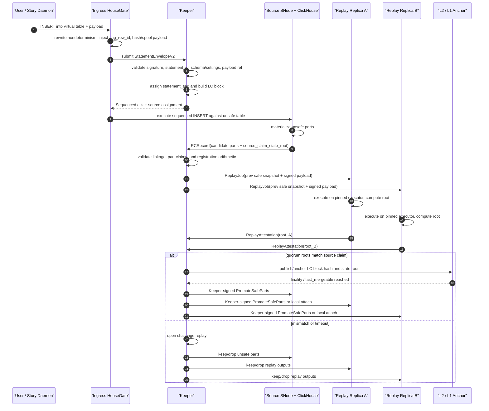
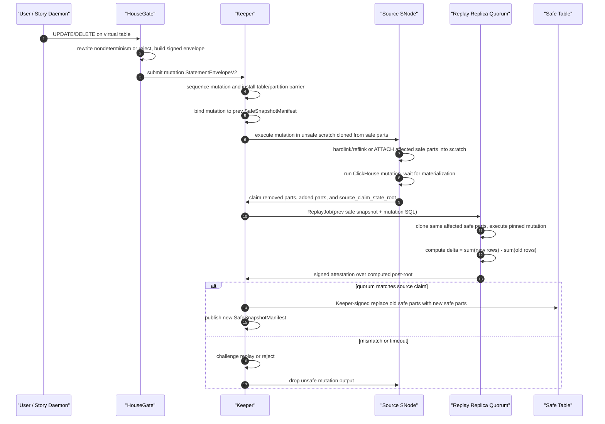
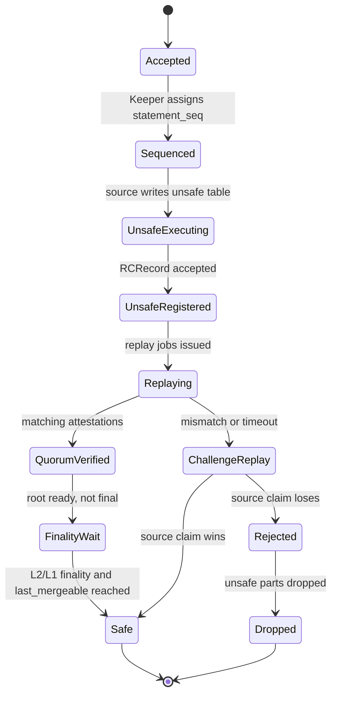

# Storage Network Data Integrity Verification Layer - Integrated Design

**Date:** 2026-06-22 **Status:** Proposed(v3, integrated after the 2026-06-17 storage integrity sync) **Base:** `2026-06-10-multi-replica-trust-design.md` + `/Users/uranuswch/dev/sentio_xyz/designs/sento-network/PROGRESS.md` as of 2026-06-17 + `/Users/uranuswch/dev/sentio_xyz/designs/sento-network/meetings/2026-06-17-storage-integrity-sync-summary.md` **Source of truth:** English version; regenerate the Chinese version from this file when changing protocol semantics.

This document folds the June 17 discussion back into the June 10 trust design. It keeps the Plan B / Keeper direction, but narrows the v1 integrity layer around three decisions: verified user tables are exposed as one virtual table backed by physical `unsafe` and `safe` tables; JSON/Map and mutation-class statements are verified by replay rather than HouseGate-side streaming LtHash; and `safe` is a published state transition controlled by Keeper after quorum replay, not a local label assigned by a ClickHouse operator.

## 1. Positioning and Decision Summary

The scope is the data integrity and anti-fraud layer for Sentio Storage Network. It answers one question: when a user submits a signed write, how do other parties know that the ClickHouse parts later served as `safe` are the faithful result of that signed input?

The base topology remains fixed: one HouseGate fronts one ClickHouse service; all client traffic and ClickHouse-to-Keeper traffic passes through HouseGate; ClickHouse is not exposed directly; replication reuses native ReplicatedMergeTree and ClickHouse Keeper mechanics; v1 Keeper is centralized and Sentio-operated; decentralization changes who checks and who bears economic consequences, not the evidence format.

The v1 verification baseline is **optimistic source execution plus quorum replay promotion**. One selected source node executes first and produces `unsafe` parts for freshness. Keeper records the signed input and the source's result claim. Verifier replicas replay the same L3 input against the previous safe snapshot on a pinned executor. Only a quorum matching the source claim, or a successful challenge replay, can promote parts into the `safe` table.

The full-node parallel replay route remains a fallback alternative: every replay node executes the sequenced input and produces its own candidate unsafe part, then Keeper chooses the majority/recomputable root. It is simpler and avoids part movement, but it lengthens the unsafe window and does not give the same fast source-write path.

## 2. Goals and Non-Goals

Goals:

1. Prevent polluted data from crossing into `safe`.
2. Preserve low-latency writes by allowing an `unsafe` acknowledgement before replay finality.
3. Make the relationship between signed SQL/payload and safe parts independently replayable.
4. Separate byte transport correctness from semantic execution correctness.
5. Define concrete responsibilities for HouseGate, Keeper, ClickHouse/SNode, and replay executors.
6. Keep v1 implementable without forking ClickHouse unless merge/promotion control proves impossible through the HouseGate-to-Keeper gate.

Non-goals:

1. Query-result attestation for arbitrary `SELECT` responses.
2. A complete economic challenge/slashing game.
3. Support for `INSERT ... SELECT`, materialized views that read mutable state, or large unbounded mutations in v1.
4. A claim that local `safe` table bytes cannot be maliciously served incorrectly after promotion. That is a separate serving-integrity problem with probabilistic/engineering mitigations.
5. Support for engines that change row identity during background processing, such as Replacing/Summing/Aggregating/Collapsing MergeTree, TTL deletes, lightweight deletes, or `OPTIMIZE ... DEDUPLICATE`.

## 3. Established Facts From the June 17 Sync

The June 17 meeting changed the shape of the design in four material ways.

First, the physical table model is now explicit: each verified virtual table is backed by an `unsafe` table and a `safe` table. HouseGate exposes one virtual table name. Normal reads hit only the safe table. If a product explicitly asks for intermediate state, HouseGate can rewrite to a union of safe and unsafe surfaces.

Second, HouseGate-side streaming LtHash is no longer the general INSERT verifier. It can work for narrow scalar profiles, but JSON and Map are materialized by ClickHouse through version-dependent logic: key ordering, null handling, precision loss, dynamic path limits, and deep nesting behavior can change the stored logical value. Reimplementing ClickHouse's materializer in HouseGate is too heavy and too brittle. General v1 INSERT verification therefore uses replay/executor equivalence.

Third, UPDATE and DELETE are replay-only. A mutation changes stored rows relative to pre-state; a wire-side row hash does not know which old rows are removed or rewritten. The verifier must replay the mutation against the previous safe snapshot or against cloned affected safe parts.

Fourth, safe-table serving integrity is a separate and larger topic. The integrity layer can prove that a safe manifest/root was derived correctly. It cannot, by itself, prove that a malicious serving node returned that safe data for every user query. Mitigations include row/chunk hashes, Merkle roots, periodic scans, sampled real query input/output, and cross-node comparison, but shadow-data attacks remain possible without query attestation or trusted serving.

## 4. Threat Model and Trust Boundary

Trusted in v1:

- The Sentio-operated Keeper authority and its Raft group for ordering, admission, and safe-state publication.
- The input normalizer before the user signature. This may be Story Daemon or the first ingress HouseGate, but non-deterministic functions such as `now()` and `random()` must be materialized before the signed envelope is created.
- The pinned executor profile selected by the protocol for a given L3 range.

Not trusted:

- Operator-side ClickHouse.
- Operator-side HouseGate once it is merely forwarding already signed input.
- Source SNode result claims.
- Local serving behavior after data has been promoted to a local safe table.
- Native ReplicatedMergeTree part checksums as semantic proof.

Native replication gives byte convergence. It does not prove that a first committer faithfully executed the signed SQL. The integrity layer adds an external content arbiter: signed statement log, previous safe snapshot, replay executor, state roots, and signed attestations.

## 5. System Roles and Responsibilities

### 5.1 HouseGate

HouseGate is the protocol and visibility boundary, not the SQL executor.

HouseGate responsibilities:

- Expose one virtual table for every verified user table.
- Rewrite virtual writes to the physical `unsafe` table and virtual safe reads to the physical `safe` table.
- Optionally rewrite an explicit intermediate-state read to `safe UNION unsafe`, with documented weaker semantics.
- Normalize or reject non-deterministic SQL before signature: `now()`, `random()`, unordered `LIMIT`, unordered `any()`, and similar constructs cannot remain implicit.
- Capture INSERT payload bytes, compute `payload_hash` and `payload_length`, and spool payload data into the DA/payload store referenced by Keeper.
- Build or forward `StatementEnvelopeV2`.
- Inject reserved columns such as `_hg_row_id` and protocol height/sequence columns.
- Hide reserved columns from the logical surface unless an operator/debug view explicitly asks for them.
- Reject user attempts to write, update, rename, or drop reserved columns.
- Proxy ClickHouse-to-Keeper requests and enforce Keeper-visible signatures/operation classes.
- Report candidate parts, ClickHouse system state, and metrics needed by Keeper and replay workers.

HouseGate must not be the final judge of correctness. It may compute expected claims for fast profiles, but `safe` depends on Keeper validation and replay attestations.

### 5.2 Keeper

Keeper is the sequencer, validator, registry, attestation collector, and safe-state publisher.

Keeper responsibilities:

- Assign `statement_seq` and build LC blocks over signed statement envelopes.
- Maintain deterministic `statement_id` uniqueness state, preferably as an L3-derived accumulator plus per-account high-water marks.
- Record payload references and ensure payload availability.
- Select the source node for optimistic execution.
- Accept source result claims only through the validation front.
- Store RC records for candidate parts, partition deltas, and source claimed roots.
- Build `ReplayJob` objects from LC block input, previous safe snapshot identity, schema snapshot, executor profile, and payload refs.
- Collect `ReplayAttestation` objects.
- Judge attestations by recomputable root equality, not by blind voting.
- Open challenge replay on root mismatch or timeout.
- Publish `SafeSnapshotManifest` and safe watermarks.
- Issue Keeper-signed promotion commands from unsafe parts into safe tables.
- Gate merges so only safe parts can merge.
- Coordinate reorg/drop cleanup for unsafe parts.
- Track node membership and the Active status of replicas after snapshot sync.

Keeper does not execute user SQL in the normal path. A challenge reference executor may be orchestrated by Keeper, but the signed replay receipt is still evidence produced by an executor profile.

### 5.3 ClickHouse and SNode

ClickHouse stores and materializes data; SNode runs local orchestration around it.

ClickHouse/SNode responsibilities:

- Store physical `unsafe` and `safe` tables.
- Execute the source write into `unsafe`.
- Produce candidate part metadata: part name, partition id, physical checksum/hash, row count, bytes, and optional row/content commitment.
- Run pinned replay execution in scratch or replay-local tables.
- Scan local parts and compute byte/content commitments required by the receipt.
- Promote verified local parts into `safe` only under Keeper-signed promotion.
- Detach/drop rejected unsafe parts.
- Keep `unsafe` parts out of background merges unless Keeper explicitly marks them merge-eligible.
- Run safe-table audit jobs and respond to cross-node sampling checks.

ClickHouse may be unmodified in the first prototype if the HouseGate-to-Keeper gate can reject unsafe operations and if merge/promotion control can be enforced externally. If not, a restricted MergeTree engine variant or a small ClickHouse patch becomes necessary.

### 5.4 Replay Executor

The replay executor is the deterministic execution witness.

Replay executor responsibilities:

- Start from a previous `SafeSnapshotManifest`, never from unsafe state.
- Load payload bytes only after `payload_hash` and `payload_length` match.
- Pin ClickHouse build, settings, schema snapshot, and executor profile.
- For payload-local INSERTs, materialize the signed payload and produce new part/root commitments.
- For mutations, clone or attach affected safe parts into scratch, execute the mutation, and compute old/new part deltas.
- Emit `ExecutionReceipt` and `ReplayAttestation`.
- Sign mismatches as challenge evidence rather than treating them as local protocol failure.

## 6. Physical Table Model

Each verified virtual table `Transfer` maps to two physical tables:

```text
hg_unsafe.Transfer_<table_id>
hg_safe.Transfer_<table_id>
```

Both tables use the same logical user columns plus reserved protocol columns. They should have the same partition key, order key, primary key, storage policy, and type profile so that `detach`/`attach`, `ATTACH PARTITION FROM`, or equivalent promotion can stay close to O(1).

Recommended reserved columns:

```sql
_hg_row_id FixedString(32),
_hg_lc_block_seq UInt64,
_hg_statement_seq UInt64,
_hg_source_node LowCardinality(String)
```

Optional audit acceleration columns:

```sql
_hg_row_hash FixedString(32),
_hg_payload_ordinal UInt64
```

`_hg_row_id` is load-bearing. It distinguishes duplicate user-visible rows and is included in row commitments. `_hg_lc_block_seq` and `_hg_statement_seq` provide stable ordering and support later `AS OF` or safe+unsafe union semantics. `_hg_row_hash` is not trusted by itself; it only accelerates scans and audits when covered by part/chunk/root commitments.

`_hg_row_id` can be derived before Keeper sequencing because it depends on `statement_id` and payload ordinal. `_hg_lc_block_seq` and `_hg_statement_seq` are filled only after Keeper returns the sequenced LC block; optimistic execution must wait for those values or use a pending namespace that is rewritten before part registration.

Example physical schema:

```sql
CREATE TABLE hg_unsafe.Transfer_0xT (
  _hg_row_id FixedString(32),
  _hg_lc_block_seq UInt64,
  _hg_statement_seq UInt64,
  _hg_source_node LowCardinality(String),
  from_address String,
  to_address String,
  token_address String,
  amount String,
  block_number UInt64,
  tx_hash FixedString(32),
  log_index UInt32,
  block_time DateTime
)
ENGINE = ReplicatedMergeTree('/sentio/{keeper_shard}/unsafe/{table_id}', '{replica}')
PARTITION BY toYYYYMM(block_time)
ORDER BY (block_number, tx_hash, log_index, _hg_row_id);
```

The `safe` table may use the same engine shape with a separate Keeper path:

```sql
ENGINE = ReplicatedMergeTree('/sentio/{keeper_shard}/safe/{table_id}', '{replica}')
```

If safe-table ReplicatedMergeTree is used, its Keeper path must accept only Keeper-signed promotion operations. A simpler prototype can use local MergeTree safe caches on each node, but then every active node must perform local promotion and local root validation before it can serve safe reads.

## 7. StatementEnvelopeV2 and L3 Data Model

The signed envelope covers what the user or trusted ingress can know before sequencing. It must not sign sequencer-assigned values.

```text
StatementEnvelopeV2 {
  envelope_version,
  network_id,
  keeper_shard_id,
  client_account,
  statement_id,
  statement_kind,
  virtual_table_id,
  rewritten_sql,
  sql_hash,
  settings_hash,
  schema_snapshot_id,
  payload_ref,
  payload_hash,
  payload_length,
  payload_format,
  row_id_profile_id,
  user_jws_v2,
}
```

`statement_id` should be structured:

```text
statement_id = client_account || client_seq || client_nonce
```

Keeper assigns and anchors:

```text
LCBlock {
  lc_block_seq,
  prev_lc_hash,
  l2_anchor_ref,
  statement_seq_start,
  statements: [StatementEnvelopeV2],
  schema_snapshot_id,
  executor_profile_id,
  prev_safe_snapshot_id,
  prev_state_root,
  spent_ids_root_after,
}
```

The source registers a result claim:

```text
RCRecord {
  lc_block_seq,
  statement_seq,
  source_node,
  unsafe_table,
  candidate_parts: [{
    part_name,
    partition_id,
    part_phys_hash,
    part_row_lthash,
    row_count,
    bytes,
  }],
  partition_deltas,
  source_claim_state_root,
}
```

Keeper builds replay jobs from LC + RC + previous safe state:

```text
ReplayJob {
  lc_block_seq,
  prev_safe_snapshot_id,
  prev_state_root,
  schema_snapshot_id,
  executor_profile_id,
  source_claim_state_root,
  statements,
}
```

Verifier output is an attestation row:

```text
ReplayAttestation {
  replica_id,
  receipt_hash,
  computed_state_root,
  match_source_root,
  signature,
}
```

## 8. Content Commitments and Safe Snapshot Manifests

The row commitment input is a unique row instance, not just user-visible row values.

```text
row_id = BLAKE3("housegate-row-id-v1" || network_id || table_id || statement_id || global_row_ordinal)
row_element = ("housegate-row-v1", table_id, row_id, sorted [(column_id, type_id, canonical_value)])
row_lthash = LtHash(row_element)
part_row_lthash = sum(row_lthash)
partition_commitment = sum(active part_row_lthash)
```

LtHash remains useful as an additive state accumulator, root comparison input, and dispute-localization handle. It is not the general proof that ClickHouse faithfully materialized JSON/Map/defaults/mutations. Replay is the proof for those paths.

`SafeSnapshotManifest` is the published safe state object. It contains:

```text
snapshot_id,
parent_snapshot_id,
safe_lc_block_seq,
schema_snapshot_id,
schema_root,
executor_profile_id,
data_root,
state_root,
manifest_root,
tables: [{
  table_id,
  schema_hash,
  partition_roots,
  active_parts: [{
    part_name,
    partition_id,
    part_phys_hash,
    part_row_lthash,
    row_count,
    bytes,
    storage_refs,
  }],
}]
```

The manifest is content-addressed and canonicalized. Table order, partition order, and part order must be normalized before hashing so independent verifiers derive the same roots.

## 9. INSERT Verification Flow



Important properties:

- The source's unsafe part may serve explicit unsafe/fresh reads before it is safe, if the product exposes that mode.
- Normal `SELECT` reads only the safe table.
- Replayed roots are computed from signed input and previous safe state, not from source part bytes.
- Promotion moves verified local parts into the safe table by `detach`/`attach`, `ATTACH PARTITION FROM`, or an equivalent Keeper-gated O(1) operation.
- A source part with valid ClickHouse checksums can still be fraudulent. It becomes safe only if the replay root agrees.

## 10. Mutation Verification Flow

Mutation-class statements include `ALTER ... UPDATE`, `ALTER ... DELETE`, large rewrites, and any write whose result depends on pre-state. v1 admits only bounded UPDATE/DELETE profiles; `INSERT ... SELECT` and large/unbounded mutations are deferred to v2.



Mutation constraints:

- Mutations read from a previous safe snapshot, not from arbitrary unsafe state.
- Keeper must serialize mutations against earlier writes to the same affected table/partition cut.
- The source must never mutate the safe table in place before verification.
- Replay cost is proportional to touched parts. Admission must cap touched bytes/parts for v1.
- Attempts to modify `_hg_row_id` or protocol columns are rejected.

## 11. Safe, Unsafe, and Read Semantics

State transitions:



Read modes:

| Mode | Rewrite | Semantics |
|---|---|---|
| `safe` default | virtual table -> `hg_safe.<table>` | Verified and finalized through Keeper safe watermark. Freshness may lag. |
| `unsafe_latest` explicit | virtual table -> `hg_safe.<table> UNION hg_unsafe.<table>` | Lower latency, may change or be dropped. Not integrity-final. |
| `as_of_safe(block)` future | safe table filtered by manifest/watermark | Time-travel over safe snapshots. Requires manifest-indexed reads. |

The default should be safe reads. If product freshness requires unsafe reads, the API must surface that the result is provisional.

## 12. Merge and Promotion Control

Only safe parts may merge. Unsafe parts may be stored, retried, replayed, or dropped, but not merged into a part that could later be mistaken for safe.

The preferred v1 gate is enforced through HouseGate as the ClickHouse-to-Keeper reverse proxy:

- Reject `MERGE_PARTS` for unsafe table parts unless Keeper explicitly creates the job.
- Reject any safe table attach/merge/mutation not carrying a Keeper-signed promotion or maintenance command.
- Reject direct safe-table writes from ordinary client sessions.
- Keep unsafe table merge scheduling disabled or strongly deprioritized until a prototype proves time-based settings are safe enough.

If native settings cannot express the gate precisely, the design should introduce a restricted engine variant or a minimal ClickHouse patch. Time-based merge avoidance, such as "merge parts older than 10 minutes," is a performance heuristic, not a safety rule.

## 13. Safe Table Serving Integrity

Promotion proves that a safe root was derived from the signed log. It does not prove that a malicious node always serves those bytes honestly.

The theoretical integrity object is:

```text
row hash -> chunk hash -> part root -> partition root -> table root -> SafeSnapshotManifest.state_root
```

Practical mitigations:

- Store or compute row/chunk hashes for safe table audit.
- Periodically scan safe parts and compare against the manifest.
- Sample real production query inputs and outputs, then replay the same query on other safe replicas.
- Cross-check read replicas before keeping them in the read set.
- Treat audit failures as grounds to remove a replica from serving and require re-sync from a known safe manifest.

Residual risk: a node can maintain correct bytes for audit but serve shadow data for selected user queries. Without query attestation or a trusted serving layer, this is probabilistic detection, not a perfect cryptographic guarantee.

## 14. Delivery Phases

P0: freeze protocol surfaces.

- `StatementEnvelopeV2` fields and signing payload.
- LC/RC record schemas.
- Reserved columns and physical table naming.
- Safe/unsafe read rewrite semantics.
- Executor profile governance for pinned ClickHouse.
- Admission bans for unsupported engines, types, and non-deterministic constructs.

P1: implement source execution and replay for payload-local INSERT.

- Payload spooling and hash validation.
- Unsafe table write path.
- Replay job construction from previous safe snapshot.
- Pinned executor materializer for scalar + JSON/Map through ClickHouse read-back.
- Quorum attestation collection.
- Safe promotion by Keeper-signed detach/attach.

P2: implement bounded UPDATE/DELETE.

- Mutation barriers.
- Affected safe part discovery.
- Scratch clone by hardlink/reflink/ATTACH.
- Old/new part delta computation.
- Admission caps for touched data.

P3: harden safe serving.

- Safe manifest audit jobs.
- Row/chunk/part root tooling.
- Real-query sampling and cross-node comparison.
- Read replica health scoring.

P4: expand language surface.

- `INSERT ... SELECT` strategy.
- Materialized views.
- Large mutation policy.
- `AS OF` safe snapshots and safe+unsafe ordered reads.

## 15. Open Questions

1. **Final v1 route:** confirm optimistic source execution plus quorum replay as the default, or switch to full-node parallel replay for simpler correctness at the cost of a longer unsafe window.
2. **Safe table engine:** use ReplicatedMergeTree with a strict Keeper-signed safe path, or local MergeTree safe caches promoted independently on every node.
3. **Merge control:** can the HouseGate-to-Keeper reverse proxy fully gate unsafe/safe merges without a ClickHouse fork, or is a restricted engine variant required?
4. **LC/RC naming and schema:** freeze whether the design calls these LC blocks and RC records, and define exact protobuf/JSON fields.
5. **Chain commitment:** decide whether L2 calldata stores the full LC block payload, a data availability reference, or only a block/root commitment.
6. **Payload DA:** define proof-of-custody and retention for signed payload bytes and mutation pre-state parts.
7. **Statement uniqueness:** choose the accumulator construction for permanent `statement_id` uniqueness.
8. **Non-determinism normalization:** decide whether Story Daemon, ingress HouseGate, or both are allowed to materialize `now()`/`random()` before signature.
9. **JSON/Map profile:** pin exact ClickHouse versions/settings and define executor-profile upgrade governance.
10. **Mutation limits:** choose v1 caps for touched parts/bytes and decide which mutations are rejected.
11. **`INSERT ... SELECT`:** choose between reject, split into SELECT-then-INSERT, or ordered safe+unsafe composition with `_hg_lc_block_seq`.
12. **Safe serving integrity:** decide how much row/chunk/Merkle metadata to store in v1 versus computing it during audit.
13. **Shadow-data detection:** define production query sampling rate and cross-node comparison policy.
14. **Dynamic node join:** define how a new node proves it has synced to the safe manifest before becoming Active.
15. **Keeper HA and sharding:** define multi-Raft group layout, shard routing by table/database, and cross-Keeper L2 height clock.
16. **Read API semantics:** decide whether unsafe reads are exposed, hidden, or limited to operator/debug APIs.

## 16. Alternatives Considered

**HouseGate streaming LtHash only.** Best performance for scalar INSERTs, but invalid as the general v1 proof because JSON/Map and server-side materialization do not preserve wire bytes.

**Append-only WAL table only.** Easier to reason about history and height, but read cost is high and the June 17 discussion converged on physical unsafe/safe tables instead.

**Full-node parallel replay.** Simpler and likely safer for the first correctness prototype, because each node produces its own local candidate part. It remains a fallback, but the chosen baseline preserves the faster optimistic unsafe path.

**Safe table needs no further audit.** False as a serving claim. Promotion proves the state root; it does not prove every future SELECT response from a malicious node.

## 17. References

- `docs/superpowers/specs/2026-06-10-multi-replica-trust-design.md`
- `/Users/uranuswch/dev/sentio_xyz/designs/sento-network/PROGRESS.md`
- `/Users/uranuswch/dev/sentio_xyz/designs/sento-network/meetings/2026-06-17-storage-integrity-sync-summary.md`
- `/Users/uranuswch/dev/sentio_xyz/designs/sento-network/meetings/2026-06-17-storage-integrity-sync.txt`
- `pkg/replay`
- `pkg/replay/payloadexec`
- `pkg/replay/chexec`
