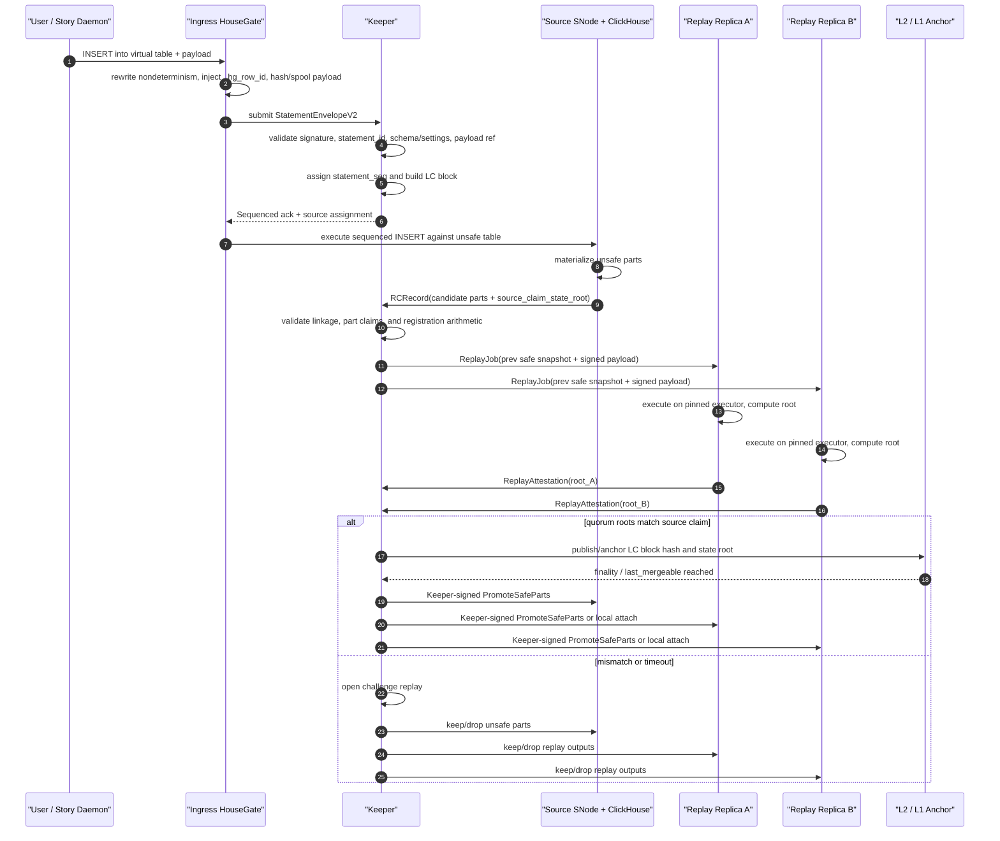
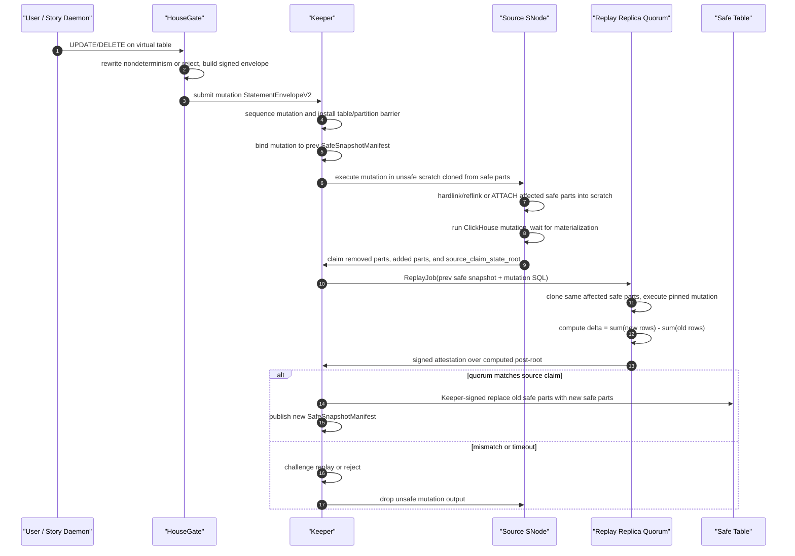
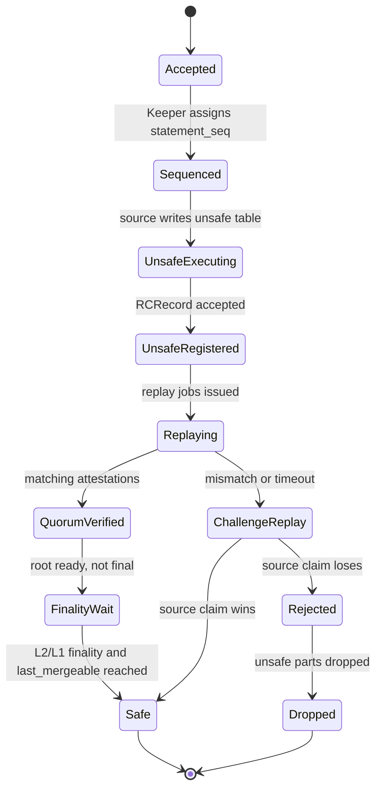

# Storage Network 数据完整性校验层 - 综合设计文档

**日期：** 2026-06-22 **状态：** Proposed(v3, integrated after the 2026-06-17 storage integrity sync) **基座：** `2026-06-10-multi-replica-trust-design.md` + 截至 2026-06-17 的 `/Users/uranuswch/dev/sentio_xyz/designs/sento-network/PROGRESS.md` + `/Users/uranuswch/dev/sentio_xyz/designs/sento-network/meetings/2026-06-17-storage-integrity-sync-summary.md` **事实源：** 英文版；协议语义变更时从英文版重新生成中文版。

本文把 6 月 17 日讨论合并回 6 月 10 日 trust design。它保留 Plan B / Keeper 路线，但把 v1 integrity layer 收窄到三个决策：verified user table 对外暴露为一张 virtual table，底层由物理 `unsafe` 表和 `safe` 表承载；JSON/Map 和 mutation-class statements 走 replay 校验，而不是 HouseGate 侧流式 LtHash；`safe` 是 Keeper 在 quorum replay 后发布的状态转换，不是 ClickHouse operator 本地打的标签。

## 1. 定位与决策摘要

本文档只设计 Sentio Storage Network 的数据完整性 / 防作恶层。它回答一个问题：当用户提交一条签名 write 后，其他人如何知道后续作为 `safe` 服务的 ClickHouse parts 是这条签名输入的忠实执行结果？

基础拓扑保持不变：一个 HouseGate 前置一个 ClickHouse service；所有 client traffic 和 ClickHouse-to-Keeper traffic 都经过 HouseGate；ClickHouse 不直接对外暴露；复制复用原生 ReplicatedMergeTree 和 ClickHouse Keeper 机制；v1 Keeper 中心化并由 Sentio 运行；后续去中心化改变谁来检查以及谁承担经济后果，不改变证据格式。

v1 verification baseline 是 **optimistic source execution plus quorum replay promotion**。一个被选中的 source node 先执行，产出用于 freshness 的 `unsafe` parts。Keeper 记录 signed input 和 source 的 result claim。Verifier replicas 在 pinned executor 上，从 previous safe snapshot 开始 replay 同一份 L3 input。只有 quorum 复现 source claim，或 challenge replay 成功后，parts 才能进入 `safe` 表。

全节点并行 replay 路线保留为 fallback：每个 replay node 都执行 sequenced input 并生成自己的 candidate unsafe part，然后 Keeper 选择 majority / recomputable root。它更简单，也避免搬 part，但 unsafe window 更长，且没有同样快的 source-write path。

## 2. 目标与非目标

目标：

1. 防止污染数据跨入 `safe`。
2. 允许在 replay finality 前返回 `unsafe` acknowledgement，从而保留低延迟写入。
3. 让 signed SQL/payload 与 safe parts 的关系可独立 replay。
4. 区分 byte transport correctness 和 semantic execution correctness。
5. 明确 HouseGate、Keeper、ClickHouse/SNode 和 replay executors 的职责。
6. 在不 fork ClickHouse 的前提下尽量实现 v1；只有 HouseGate-to-Keeper gate 无法可靠控制 merge/promotion 时才考虑 fork 或新 engine。

非目标：

1. 任意 `SELECT` response 的 query-result attestation。
2. 完整的经济 challenge/slashing game。
3. v1 支持 `INSERT ... SELECT`、读取 mutable state 的 materialized views，或无界大 mutation。
4. 声称本地 `safe` table bytes 在 promotion 后不会被恶意节点错误服务。那是独立的 serving-integrity 问题，只能先用概率性 / 工程性缓解。
5. 支持会在 background processing 中改变 row identity 的 engines，例如 Replacing/Summing/Aggregating/Collapsing MergeTree、TTL deletes、lightweight deletes 或 `OPTIMIZE ... DEDUPLICATE`。

## 3. 6 月 17 日同步会给设计带来的既定事实

6 月 17 日会议实质改变了设计形态，主要有四点。

第一，物理表模型已经显式化：每张 verified virtual table 底层是一张 `unsafe` 表和一张 `safe` 表。HouseGate 对外暴露一个 virtual table name。普通读只打 safe 表。如果产品显式要求中间态，HouseGate 可以 rewrite 成 safe 与 unsafe 的 union，但语义更弱。

第二，HouseGate-side streaming LtHash 不再是通用 INSERT verifier。它可以用于很窄的 scalar profiles，但 JSON 和 Map 会被 ClickHouse 通过版本相关逻辑 materialize：key ordering、null handling、precision loss、dynamic path limits、deep nesting behavior 都可能改变 stored logical value。在 HouseGate 里重写一套 ClickHouse materializer 太重也太脆。通用 v1 INSERT verification 因此采用 replay / executor equivalence。

第三，UPDATE 和 DELETE 只能 replay。Mutation 会相对 pre-state 改写 stored rows；wire-side row hash 不知道哪些 old rows 被删除或重写。Verifier 必须基于 previous safe snapshot 或 cloned affected safe parts 来 replay mutation。

第四，safe-table serving integrity 是独立且更大的话题。Integrity layer 可以证明某个 safe manifest/root 被正确派生。它无法单独证明恶意 serving node 对每次用户查询都返回了 safe 数据。缓解包括 row/chunk hashes、Merkle roots、periodic scans、sampled real query input/output、cross-node comparison，但没有 query attestation 或 trusted serving layer 时，shadow-data attack 仍然可能存在。

## 4. 威胁模型与信任边界

v1 信任：

- Sentio-operated Keeper authority 及其 Raft group，负责 ordering、admission 和 safe-state publication。
- 用户签名前的 input normalizer。它可以是 Story Daemon 或第一个 ingress HouseGate，但 `now()`、`random()` 等非确定性函数必须在 signed envelope 创建前被 materialize。
- 协议为某个 L3 range 选择的 pinned executor profile。

不信任：

- Operator-side ClickHouse。
- 只负责转发已签名输入的 operator-side HouseGate。
- Source SNode 的 result claims。
- 数据 promotion 到本地 safe 表后的 local serving behavior。
- 原生 ReplicatedMergeTree part checksums 作为 semantic proof。

Native replication 提供 byte convergence。它不能证明 first committer 忠实执行了 signed SQL。Integrity layer 增加了外部 content arbiter：signed statement log、previous safe snapshot、replay executor、state roots 和 signed attestations。

## 5. 系统角色与职责

### 5.1 HouseGate

HouseGate 是协议与可见性边界，不是 SQL executor。

HouseGate 职责：

- 为每张 verified user table 暴露一个 virtual table。
- 把 virtual writes rewrite 到物理 `unsafe` 表，把 virtual safe reads rewrite 到物理 `safe` 表。
- 可选地把显式 intermediate-state read rewrite 成 `safe UNION unsafe`，并文档化更弱语义。
- 在签名前 normalize 或 reject 非确定性 SQL：`now()`、`random()`、unordered `LIMIT`、unordered `any()` 等不能保持隐式。
- 捕获 INSERT payload bytes，计算 `payload_hash` 和 `payload_length`，并把 payload data spool 到 Keeper 引用的 DA/payload store。
- 构造或转发 `StatementEnvelopeV2`。
- 注入 `_hg_row_id` 等 reserved columns 和协议 height/sequence columns。
- 从逻辑表面隐藏 reserved columns，除非 operator/debug view 显式请求。
- 拒绝用户写入、更新、重命名或删除 reserved columns。
- 代理 ClickHouse-to-Keeper requests，并校验 Keeper 可见的 signatures / operation classes。
- 上报 Keeper 和 replay workers 所需的 candidate parts、ClickHouse system state 和 metrics。

HouseGate 不能成为 correctness 的最终裁判。它可以为 fast profiles 计算 expected claims，但 `safe` 依赖 Keeper validation 和 replay attestations。

### 5.2 Keeper

Keeper 是 sequencer、validator、registry、attestation collector 和 safe-state publisher。

Keeper 职责：

- 分配 `statement_seq`，围绕 signed statement envelopes 构造 LC blocks。
- 维护确定性的 `statement_id` uniqueness state，优先使用 L3-derived accumulator 加 per-account high-water marks。
- 记录 payload references 并确保 payload availability。
- 为 optimistic execution 选择 source node。
- 只通过 validation front 接收 source result claims。
- 存储候选 parts、partition deltas 和 source claimed roots 的 RC records。
- 基于 LC block input、previous safe snapshot identity、schema snapshot、executor profile 和 payload refs 构造 `ReplayJob`。
- 收集 `ReplayAttestation`。
- 按 recomputable root equality 判断 attestations，而不是盲目投票。
- 在 root mismatch 或 timeout 时打开 challenge replay。
- 发布 `SafeSnapshotManifest` 和 safe watermarks。
- 发出从 unsafe parts 到 safe tables 的 Keeper-signed promotion commands。
- gate merges，确保只有 safe parts 可以 merge。
- 协调 reorg/drop cleanup for unsafe parts。
- 跟踪 node membership，以及 replicas 完成 snapshot sync 后的 Active 状态。

Keeper 正常路径不执行用户 SQL。Challenge reference executor 可以由 Keeper 编排，但 signed replay receipt 仍然是 executor profile 产出的证据。

### 5.3 ClickHouse 与 SNode

ClickHouse 存储并 materialize 数据；SNode 运行围绕它的本地编排。

ClickHouse/SNode 职责：

- 存储物理 `unsafe` 表和 `safe` 表。
- 把 source write 执行到 `unsafe`。
- 产出 candidate part metadata：part name、partition id、physical checksum/hash、row count、bytes 以及可选 row/content commitment。
- 在 scratch 或 replay-local tables 中运行 pinned replay execution。
- 扫描本地 parts 并计算 receipt 需要的 byte/content commitments。
- 只有在 Keeper-signed promotion 下才能把 verified local parts promote 到 `safe`。
- detach/drop 被 reject 的 unsafe parts。
- 让 `unsafe` parts 不参与 background merges，除非 Keeper 显式标记它们 merge-eligible。
- 运行 safe-table audit jobs，并响应 cross-node sampling checks。

如果 HouseGate-to-Keeper gate 能拒绝 unsafe operations，并且 merge/promotion control 可以外部强制执行，第一个 prototype 可以不改 ClickHouse。如果不能，则需要一个受限的 MergeTree engine variant 或一个很小的 ClickHouse patch。

### 5.4 Replay Executor

Replay executor 是确定性执行见证者。

Replay executor 职责：

- 从 previous `SafeSnapshotManifest` 开始，绝不从 unsafe state 开始。
- 只有 `payload_hash` 和 `payload_length` 匹配后才加载 payload bytes。
- Pin ClickHouse build、settings、schema snapshot 和 executor profile。
- 对 payload-local INSERT，materialize signed payload 并产出 new part/root commitments。
- 对 mutations，把 affected safe parts clone 或 attach 到 scratch，执行 mutation，并计算 old/new part deltas。
- 产出 `ExecutionReceipt` 和 `ReplayAttestation`。
- 对 mismatch 签名作为 challenge evidence，而不是把 mismatch 当成本地协议失败。

## 6. 物理表模型

每张 verified virtual table `Transfer` 映射到两张物理表：

```text
hg_unsafe.Transfer_<table_id>
hg_safe.Transfer_<table_id>
```

两张表使用同一组逻辑 user columns，并追加 reserved protocol columns。它们应该拥有相同 partition key、order key、primary key、storage policy 和 type profile，使 `detach`/`attach`、`ATTACH PARTITION FROM` 或等价 promotion 尽量保持 O(1)。

推荐 reserved columns：

```sql
_hg_row_id FixedString(32),
_hg_lc_block_seq UInt64,
_hg_statement_seq UInt64,
_hg_source_node LowCardinality(String)
```

可选 audit acceleration columns：

```sql
_hg_row_hash FixedString(32),
_hg_payload_ordinal UInt64
```

`_hg_row_id` 是承重字段。它区分重复的用户可见行，并进入 row commitments。`_hg_lc_block_seq` 和 `_hg_statement_seq` 提供稳定顺序，并支持未来的 `AS OF` 或 safe+unsafe union 语义。`_hg_row_hash` 本身不可信；只有被 part/chunk/root commitments 覆盖时，它才是 scans 和 audits 的加速字段。

`_hg_row_id` 可以在 Keeper sequencing 前派生，因为它只依赖 `statement_id` 和 payload ordinal。`_hg_lc_block_seq` 和 `_hg_statement_seq` 只能在 Keeper 返回 sequenced LC block 后填入；optimistic execution 必须等待这些值，或使用 pending namespace 并在 part registration 前重写。

示例物理 schema：

```sql
CREATE TABLE hg_unsafe.Transfer_0xT (
  _hg_row_id FixedString(32),
  _hg_lc_block_seq UInt64,
  _hg_statement_seq UInt64,
  _hg_source_node LowCardinality(String),
  from_address String,
  to_address String,
  token_address String,
  amount String,
  block_number UInt64,
  tx_hash FixedString(32),
  log_index UInt32,
  block_time DateTime
)
ENGINE = ReplicatedMergeTree('/sentio/{keeper_shard}/unsafe/{table_id}', '{replica}')
PARTITION BY toYYYYMM(block_time)
ORDER BY (block_number, tx_hash, log_index, _hg_row_id);
```

`safe` 表可以使用相同 engine 形态，但 Keeper path 分开：

```sql
ENGINE = ReplicatedMergeTree('/sentio/{keeper_shard}/safe/{table_id}', '{replica}')
```

如果使用 safe-table ReplicatedMergeTree，它的 Keeper path 只能接受 Keeper-signed promotion operations。更简单的 prototype 可以在每个节点使用 local MergeTree safe cache，但这要求每个 active node 都独立执行 local promotion 和 local root validation 后，才能服务 safe reads。

## 7. StatementEnvelopeV2 与 L3 数据模型

Signed envelope 覆盖用户或 trusted ingress 在 sequencing 前能知道的内容。它不能签 sequencer-assigned values。

```text
StatementEnvelopeV2 {
  envelope_version,
  network_id,
  keeper_shard_id,
  client_account,
  statement_id,
  statement_kind,
  virtual_table_id,
  rewritten_sql,
  sql_hash,
  settings_hash,
  schema_snapshot_id,
  payload_ref,
  payload_hash,
  payload_length,
  payload_format,
  row_id_profile_id,
  user_jws_v2,
}
```

`statement_id` 应该结构化：

```text
statement_id = client_account || client_seq || client_nonce
```

Keeper 分配并锚定：

```text
LCBlock {
  lc_block_seq,
  prev_lc_hash,
  l2_anchor_ref,
  statement_seq_start,
  statements: [StatementEnvelopeV2],
  schema_snapshot_id,
  executor_profile_id,
  prev_safe_snapshot_id,
  prev_state_root,
  spent_ids_root_after,
}
```

Source 注册 result claim：

```text
RCRecord {
  lc_block_seq,
  statement_seq,
  source_node,
  unsafe_table,
  candidate_parts: [{
    part_name,
    partition_id,
    part_phys_hash,
    part_row_lthash,
    row_count,
    bytes,
  }],
  partition_deltas,
  source_claim_state_root,
}
```

Keeper 从 LC + RC + previous safe state 构造 replay jobs：

```text
ReplayJob {
  lc_block_seq,
  prev_safe_snapshot_id,
  prev_state_root,
  schema_snapshot_id,
  executor_profile_id,
  source_claim_state_root,
  statements,
}
```

Verifier output 是一条 attestation row：

```text
ReplayAttestation {
  replica_id,
  receipt_hash,
  computed_state_root,
  match_source_root,
  signature,
}
```

## 8. Content Commitments 与 Safe Snapshot Manifests

Row commitment 输入是唯一 row instance，而不只是用户可见 row values。

```text
row_id = BLAKE3("housegate-row-id-v1" || network_id || table_id || statement_id || global_row_ordinal)
row_element = ("housegate-row-v1", table_id, row_id, sorted [(column_id, type_id, canonical_value)])
row_lthash = LtHash(row_element)
part_row_lthash = sum(row_lthash)
partition_commitment = sum(active part_row_lthash)
```

LtHash 仍然适合作为 additive state accumulator、root comparison input 和 dispute-localization handle。它不是 ClickHouse 忠实 materialize JSON/Map/defaults/mutations 的通用证明。这些路径的证明是 replay。

`SafeSnapshotManifest` 是发布的 safe state object。它包含：

```text
snapshot_id,
parent_snapshot_id,
safe_lc_block_seq,
schema_snapshot_id,
schema_root,
executor_profile_id,
data_root,
state_root,
manifest_root,
tables: [{
  table_id,
  schema_hash,
  partition_roots,
  active_parts: [{
    part_name,
    partition_id,
    part_phys_hash,
    part_row_lthash,
    row_count,
    bytes,
    storage_refs,
  }],
}]
```

Manifest 是 content-addressed 且 canonicalized。Table order、partition order 和 part order 必须在 hash 前 normalized，使独立 verifiers 得到相同 roots。

## 9. INSERT 校验流程



关键性质：

- Source 的 unsafe part 可以在成为 safe 前服务显式 unsafe/fresh reads，如果产品暴露这种模式。
- 普通 `SELECT` 只读 safe 表。
- Replayed roots 从 signed input 和 previous safe state 计算，而不是从 source part bytes 计算。
- Promotion 通过 `detach`/`attach`、`ATTACH PARTITION FROM` 或等价的 Keeper-gated O(1) 操作，把 verified local parts 移入 safe 表。
- 一个拥有合法 ClickHouse checksums 的 source part 仍可能是 fraud。只有 replay root 一致后它才能成为 safe。

## 10. Mutation 校验流程

Mutation-class statements 包括 `ALTER ... UPDATE`、`ALTER ... DELETE`、large rewrites，以及任何结果依赖 pre-state 的 write。v1 只准入 bounded UPDATE/DELETE profiles；`INSERT ... SELECT` 与大规模 / 无界 mutations 推迟到 v2。



Mutation 约束：

- Mutations 从 previous safe snapshot 读取，而不是从任意 unsafe state 读取。
- Keeper 必须把 mutation 与同一 affected table/partition cut 上更早的 writes 序列化。
- Source 在 verification 前绝不能 in place mutate safe table。
- Replay cost 与 touched parts 成正比。v1 admission 必须限制 touched bytes/parts。
- 任何修改 `_hg_row_id` 或 protocol columns 的尝试都被拒绝。

## 11. Safe、Unsafe 与读语义

状态转换：



读模式：

| Mode | Rewrite | Semantics |
|---|---|---|
| `safe` default | virtual table -> `hg_safe.<table>` | 经过 Keeper safe watermark 验证并 finalized。Freshness 可能滞后。 |
| `unsafe_latest` explicit | virtual table -> `hg_safe.<table> UNION hg_unsafe.<table>` | 延迟更低，可能变化或被 drop。不是 integrity-final。 |
| `as_of_safe(block)` future | safe table filtered by manifest/watermark | 基于 safe snapshots 的 time-travel。需要 manifest-indexed reads。 |

默认应该是 safe reads。如果产品 freshness 需要 unsafe reads，API 必须暴露结果是 provisional。

## 12. Merge 与 Promotion Control

只有 safe parts 可以 merge。Unsafe parts 可以被存储、retry、replay 或 drop，但不能 merge 成一个后续可能被误认为 safe 的 part。

推荐的 v1 gate 由作为 ClickHouse-to-Keeper reverse proxy 的 HouseGate 强制：

- 拒绝 unsafe table parts 的 `MERGE_PARTS`，除非 Keeper 显式创建该 job。
- 拒绝任何没有 Keeper-signed promotion 或 maintenance command 的 safe table attach/merge/mutation。
- 拒绝普通 client session 直接写 safe table。
- 保持 unsafe table merge scheduling disabled 或强降权，直到 prototype 证明 time-based settings 足够安全。

如果 native settings 无法精确表达这个 gate，设计应引入 restricted engine variant 或最小 ClickHouse patch。基于时间的 merge avoidance，例如“只 merge 10 分钟前的 parts”，是性能启发式，不是 safety rule。

## 13. Safe Table Serving Integrity

Promotion 证明 safe root 是由 signed log 派生出来的。它不证明恶意节点永远诚实服务这些 bytes。

理论 integrity object 是：

```text
row hash -> chunk hash -> part root -> partition root -> table root -> SafeSnapshotManifest.state_root
```

实际缓解：

- 为 safe table audit 存储或计算 row/chunk hashes。
- 周期性扫描 safe parts，并与 manifest 对比。
- 采样真实 production query inputs 和 outputs，然后在其他 safe replicas 上重放同一查询。
- 在保留 replica 进入 read set 前做 cross-check。
- Audit failures 导致 replica 从 serving 中移除，并要求从 known safe manifest 重新同步。

剩余风险：一个节点可以为 audit 保持正确 bytes，却对特定用户查询返回 shadow data。没有 query attestation 或 trusted serving layer 时，这是概率性检测，不是完美密码学保证。

## 14. 交付阶段

P0：冻结协议表面。

- `StatementEnvelopeV2` fields 和 signing payload。
- LC/RC record schemas。
- Reserved columns 和物理表命名。
- Safe/unsafe read rewrite semantics。
- Pinned ClickHouse 的 executor profile governance。
- Unsupported engines、types 和 non-deterministic constructs 的 admission bans。

P1：实现 payload-local INSERT 的 source execution 和 replay。

- Payload spooling 和 hash validation。
- Unsafe table write path。
- 从 previous safe snapshot 构造 replay job。
- 通过 ClickHouse read-back 支持 scalar + JSON/Map 的 pinned executor materializer。
- Quorum attestation collection。
- Keeper-signed detach/attach safe promotion。

P2：实现 bounded UPDATE/DELETE。

- Mutation barriers。
- Affected safe part discovery。
- 通过 hardlink/reflink/ATTACH scratch clone。
- Old/new part delta computation。
- Touched data 的 admission caps。

P3：加固 safe serving。

- Safe manifest audit jobs。
- Row/chunk/part root tooling。
- Real-query sampling 和 cross-node comparison。
- Read replica health scoring。

P4：扩展语言表面。

- `INSERT ... SELECT` strategy。
- Materialized views。
- Large mutation policy。
- `AS OF` safe snapshots 和 safe+unsafe ordered reads。

## 15. Open Questions

1. **最终 v1 路线：** 确认 optimistic source execution plus quorum replay 是默认路线，还是切到 full-node parallel replay，用更长 unsafe window 换更简单 correctness。
2. **Safe table engine：** 使用带严格 Keeper-signed safe path 的 ReplicatedMergeTree，还是每个节点独立 promotion 的 local MergeTree safe cache。
3. **Merge control：** HouseGate-to-Keeper reverse proxy 能否完全 gate unsafe/safe merges，还是需要 ClickHouse fork 或 restricted engine variant。
4. **LC/RC naming and schema：** 是否正式使用 LC blocks 和 RC records 命名，并冻结精确 protobuf/JSON fields。
5. **Chain commitment：** L2 calldata 存完整 LC block payload、DA reference，还是只存 block/root commitment。
6. **Payload DA：** 定义 signed payload bytes 和 mutation pre-state parts 的 proof-of-custody 与 retention。
7. **Statement uniqueness：** 为永久 `statement_id` uniqueness 选择 accumulator construction。
8. **Non-determinism normalization：** 决定 Story Daemon、ingress HouseGate 或两者是否允许在 signature 前 materialize `now()`/`random()`。
9. **JSON/Map profile：** pin 精确 ClickHouse versions/settings，并定义 executor-profile upgrade governance。
10. **Mutation limits：** 选择 v1 的 touched parts/bytes caps，并决定哪些 mutations 被 reject。
11. **`INSERT ... SELECT`：** 在 reject、拆成 SELECT-then-INSERT、或用 `_hg_lc_block_seq` 组合 ordered safe+unsafe 三者之间选择。
12. **Safe serving integrity：** 决定 v1 存多少 row/chunk/Merkle metadata，多少在 audit 时计算。
13. **Shadow-data detection：** 定义 production query sampling rate 和 cross-node comparison policy。
14. **Dynamic node join：** 定义新节点如何证明它已 sync 到 safe manifest，才能变为 Active。
15. **Keeper HA and sharding：** 定义 multi-Raft group layout、按 table/database 的 shard routing，以及跨 Keeper 的 L2 height clock。
16. **Read API semantics：** 决定 unsafe reads 暴露给用户、隐藏，还是限制在 operator/debug APIs。

## 16. 备选方案

**只用 HouseGate streaming LtHash。** 对 scalar INSERTs 性能最好，但不能作为通用 v1 proof，因为 JSON/Map 和 server-side materialization 不保留 wire bytes。

**只用 append-only WAL table。** 历史和高度更容易推理，但读成本很高，且 6 月 17 日讨论已收敛到物理 unsafe/safe 表。

**Full-node parallel replay。** 对第一个 correctness prototype 更简单也可能更安全，因为每个节点都产出本地 candidate part。它保留为 fallback，但当前 baseline 保留更快的 optimistic unsafe path。

**Safe table 不需要后续 audit。** 作为 serving claim 是错的。Promotion 证明 state root；它不证明恶意节点未来每次 SELECT response 都诚实。

## 17. References

- `docs/superpowers/specs/2026-06-10-multi-replica-trust-design.md`
- `/Users/uranuswch/dev/sentio_xyz/designs/sento-network/PROGRESS.md`
- `/Users/uranuswch/dev/sentio_xyz/designs/sento-network/meetings/2026-06-17-storage-integrity-sync-summary.md`
- `/Users/uranuswch/dev/sentio_xyz/designs/sento-network/meetings/2026-06-17-storage-integrity-sync.txt`
- `pkg/replay`
- `pkg/replay/payloadexec`
- `pkg/replay/chexec`
