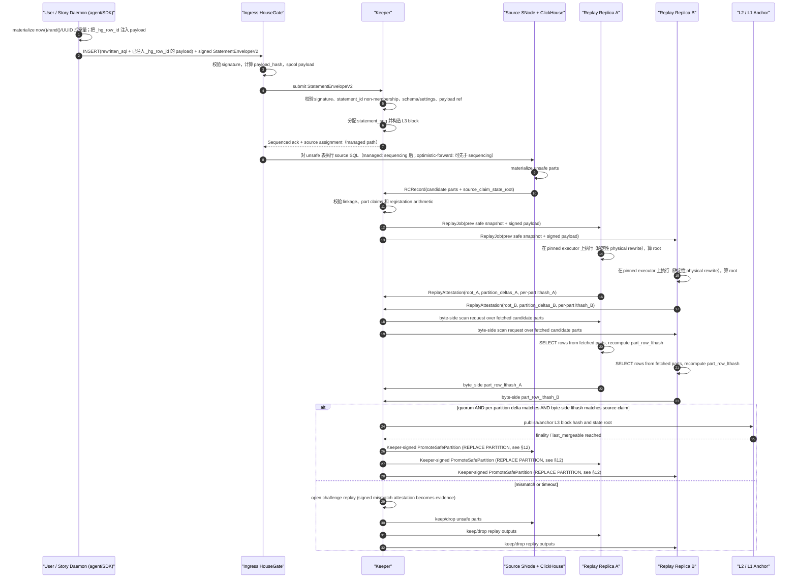
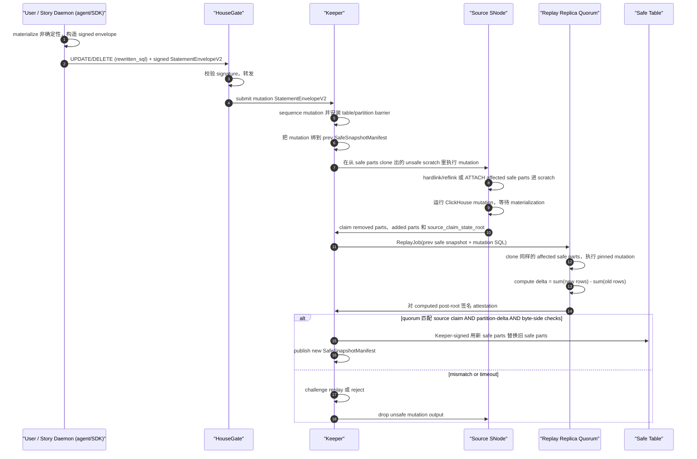
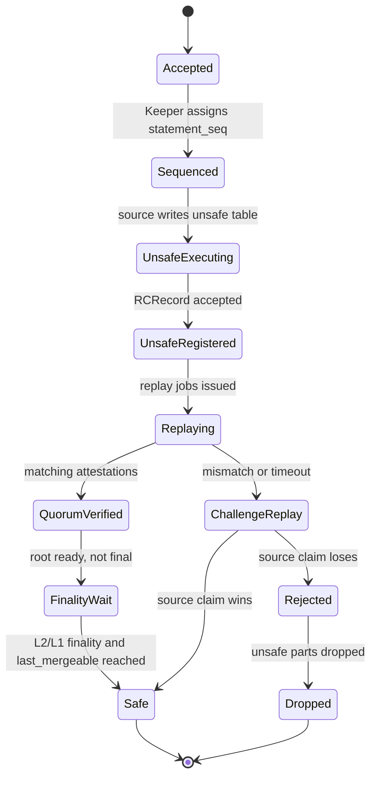

# Storage Network 数据完整性校验层 - 综合设计文档

**日期：** 2026-06-22 **状态：** Proposed(v3, integrated after the 2026-06-17 storage integrity sync) **基座：** [2026-06-10 multi-replica trust design](https://github.com/housegate/housegate/blob/main/docs/superpowers/specs/2026-06-10-multi-replica-trust-design.md) + 截至 2026-06-17 的 [sentio-network PROGRESS](https://github.com/sentioxyz/designs/blob/main/sento-network/PROGRESS.md) + [2026-06-17 storage integrity sync summary](https://github.com/sentioxyz/designs/blob/main/sento-network/meetings/2026-06-17-storage-integrity-sync-summary.md) **事实源：** 英文版；协议语义变更时从英文版重新生成中文版。

本文把 6 月 17 日讨论合并回 6 月 10 日 trust design。它保留 Plan B / Keeper 路线，但把 v1 integrity layer 收窄到三个决策：verified user table 对外暴露为一张 virtual table，底层由物理 `unsafe` 表和 `safe` 表承载；JSON/Map 和 mutation-class statements 走 replay 校验，而不是 HouseGate 侧流式 LtHash；`safe` 是 Keeper 在 quorum replay 后发布的状态转换，不是 ClickHouse operator 本地打的标签。

## 1. 定位与决策摘要

本文档只设计 Sentio Storage Network 的数据完整性 / 防作恶层。它回答一个问题：当用户提交一条签名 write 后，其他人如何知道后续作为 `safe` 服务的 ClickHouse parts 是这条签名输入的忠实执行结果？

基础拓扑在 integrity layer 相关边界上保持不变：一个 HouseGate 前置一个 ClickHouse service；所有 client traffic 都经过 HouseGate；ClickHouse 不直接对用户暴露；`hg_unsafe` 复制复用原生 ReplicatedMergeTree 和 ClickHouse Keeper 机制；Sentio Keeper 拥有 sequencing、attestation 和 safe-state publication；v1 Sentio Keeper 中心化并由 Sentio 运行；后续去中心化改变谁来检查以及谁承担经济后果，不改变证据格式。

v1 verification baseline 是 **optimistic source execution plus quorum replay promotion**。一个被选中的 source node 先执行，产出用于 freshness 的 `unsafe` parts。Keeper 记录 signed input 和 source 的 result claim。Verifier replicas 在 pinned executor 上，从 previous safe snapshot 开始 replay 同一份 L3 input。只有 quorum 复现 source claim，或 challenge replay 成功后，parts 才能进入 `safe` 表。

全节点并行 replay 路线保留为 fallback：每个 replay node 都执行 sequenced input 并生成自己的 candidate unsafe part，然后 Keeper 选择 majority / recomputable root。它更简单，也避免搬 part，但 unsafe window 更长，且没有同样快的 source-write path。

## 2. 目标与非目标

目标：

1. 防止污染数据跨入 `safe`。
2. 允许在 replay finality 前返回 `unsafe` acknowledgement，从而保留低延迟写入。
3. 让 signed SQL/payload 与 safe parts 的关系可独立 replay。
4. 区分 byte transport correctness 和 semantic execution correctness。
5. 明确 HouseGate、Keeper、ClickHouse/SNode 和 replay executors 的职责。
6. v1 不需要 fork ClickHouse。§12.1 的 engine 拆分（`hg_unsafe` ReplicatedMergeTree 不 gate，`hg_safe` MergeTree）就满足了：不需要 reverse-proxy gate，也不需要 ClickHouse patch。

非目标：

1. 任意 `SELECT` response 的 query-result attestation。
2. 完整的经济 challenge/slashing game。
3. v1 支持 `INSERT ... SELECT`、读取 mutable state 的 materialized views，或无界大 mutation。
4. 声称本地 `safe` table bytes 在 promotion 后不会被恶意节点错误服务。那是独立的 serving-integrity 问题，只能先用概率性 / 工程性缓解。
5. 支持会在 background processing 中改变 row identity 的 engines，例如 Replacing/Summing/Aggregating/Collapsing MergeTree、TTL deletes、lightweight deletes 或 `OPTIMIZE ... DEDUPLICATE`。

## 3. 6 月 17 日同步会给设计带来的既定事实

6 月 17 日会议实质改变了设计形态，主要有四点。

第一，物理表模型已经显式化：每张 verified virtual table 底层是一张 `unsafe` 表和一张 `safe` 表。HouseGate 对外暴露一个 virtual table name。普通读只打 safe 表。如果产品显式要求中间态，HouseGate 可以 rewrite 成 safe 与 unsafe 的 union，但语义更弱。

第二，HouseGate-side streaming LtHash 不再是通用 INSERT verifier。它可以用于很窄的 scalar profiles，但 JSON 和 Map 会被 ClickHouse 通过版本相关逻辑 materialize：key ordering、null handling、precision loss、dynamic path limits、deep nesting behavior 都可能改变 stored logical value。在 HouseGate 里重写一套 ClickHouse materializer 太重也太脆。通用 v1 INSERT verification 因此采用 replay / executor equivalence。

第三，UPDATE 和 DELETE 只能 replay。Mutation 会相对 pre-state 改写 stored rows；wire-side row hash 不知道哪些 old rows 被删除或重写。Verifier 必须基于 previous safe snapshot 或 cloned affected safe parts 来 replay mutation。

第四，safe-table serving integrity 是独立且更大的话题。Integrity layer 可以证明某个 safe manifest/root 被正确派生。它无法单独证明恶意 serving node 对每次用户查询都返回了 safe 数据。缓解包括 row/chunk hashes、Merkle roots、periodic scans、sampled real query input/output、cross-node comparison，但没有 query attestation 或 trusted serving layer 时，shadow-data attack 仍然可能存在。

## 4. 威胁模型与信任边界

v1 信任：

- Sentio-operated Keeper authority 及其 Raft group，负责 ordering、admission 和 safe-state publication。
- 用户签名前在 agent/SDK 处的 input normalizer。`now()`、`random()` 等非确定性函数被 materialize 成常量、`_hg_row_id` 被注入，都在 agent/SDK 签名前完成（§7、§9）。ingress HouseGate 不做 normalize。
- 协议为某个 L3 range 选择的 pinned executor profile。

不信任：

- Operator-side ClickHouse。
- 只负责转发已签名输入的 operator-side HouseGate。
- Source SNode 的 result claims。
- 数据 promotion 到本地 safe 表后的 local serving behavior。
- 原生 ReplicatedMergeTree part checksums 作为 semantic proof。

Native replication 提供 byte convergence。它不能证明 first committer 忠实执行了 signed SQL。Integrity layer 增加了外部 content arbiter：signed statement log、previous safe snapshot、replay executor、state roots 和 signed attestations。

## 5. 系统角色与职责

### 5.1 HouseGate

HouseGate 是协议与可见性边界，不是 SQL executor。

HouseGate 职责：

- 为每张 verified user table 暴露一个 virtual table。
- 按 runtime mode 应用 physical table rewrite：forward mode 下 HouseGate 原样转发已签名 source SQL；managed/proxy modes 下 HouseGate 确定性地把 virtual writes rewrite 到物理 `unsafe` 表，把 virtual safe reads rewrite 到物理 `safe` 表。
- 可选地把显式 intermediate-state read rewrite 成 `safe UNION unsafe`，并文档化更弱语义。
- **校验**进来的 signed envelope（signature、`sql_hash`、`payload_hash`），并把 payload **spool** 到 DA/payload store。HouseGate **不** materialize 非确定性、**不**注入 reserved columns——这些都在 agent/SDK 签名前完成（§7、§9）。Forward mode 下它原样转发已签名 SQL。Managed/proxy modes 下它对 source-path SQL 应用确定性的 physical rewrite；pinned executor 在 replay 时重算同一个 rewrite，所以恶意 HouseGate 的错误 rewrite 会表现为 source/byte mismatch，而不是被协议当成真。
- 构造或转发 `StatementEnvelopeV2`。
- 从逻辑表面隐藏 reserved columns，除非 operator/debug view 显式请求。
- 拒绝用户写入、更新、重命名或删除 reserved columns。
- 上报 Keeper 和 replay workers 所需的 candidate parts、ClickHouse system state 和 metrics。

HouseGate 不能成为 correctness 的最终裁判。它可以为 fast profiles 计算 expected claims，但 `safe` 依赖 Keeper validation 和 replay attestations。

### 5.2 Keeper

Keeper 是 sequencer、validator、registry、attestation collector 和 safe-state publisher。

Keeper 职责：

- 分配 `statement_seq`，围绕 signed statement envelopes 构造 L3 blocks。
- 通过 L3-derived mountain-range accumulator + per-account high-water mark 强制 `statement_id` 唯一性（§7）；用 non-membership proof 拒绝重复。这个 state 可从 L3 stream 重放重建，所以去中心化 Keeper 不改变 dedup 事实。
- 记录 payload references 并确保 payload availability。
- 为 optimistic execution 选择 source node。
- 只通过 validation front 接收 source result claims。
- 存储候选 parts、partition deltas 和 source claimed roots 的 RC records。
- 基于 L3 block input、previous safe snapshot identity、schema snapshot、executor profile 和 payload refs 构造 `ReplayJob`。
- 收集 `ReplayAttestation` 并执行三路 promotion check（replay + partition-delta + byte-side lthash，§9）。v1 中心化 Keeper 是 *编排* 2-of-3 replay quorum 并即时仲裁 promote/challenge 的信任根；recomputability 在 v1 是事后审计能力。去中心化阶段的安全模型（challenge window）见 §11。
- 在 root mismatch 或 timeout 时打开 challenge replay。
- 发布 `SafeSnapshotManifest` 和 safe watermarks。
- 发出进入 safe tables 的 Keeper-signed promotion commands（从 promotion shadow table `REPLACE PARTITION`，§12）。
- 通过 ledger equation gate safe-table merges（§12.4）。
- 协调 reorg/drop cleanup for unsafe parts。
- 跟踪 node membership，以及 replicas 完成 snapshot sync 后的 Active 状态。

Keeper 正常路径不执行用户 SQL。Challenge reference executor 可以由 Keeper 编排，但 signed replay receipt 仍然是 executor profile 产出的证据。

### 5.3 ClickHouse 与 SNode

ClickHouse 存储并 materialize 数据；SNode 运行围绕它的本地编排。

ClickHouse/SNode 职责：

- 按 §12.1 存储物理 `unsafe`（ReplicatedMergeTree）和 `safe`（MergeTree）表。
- 把 source write 执行到 `unsafe`。
- 产出 candidate part metadata：part name、partition id、physical checksum/hash、row count、bytes 以及可选 row/content commitment。
- 在 scratch 或 replay-local tables 中运行 pinned replay execution。
- 扫描本地 parts 并计算 receipt 需要的 byte/content commitments。
- 只有在 Keeper-signed `REPLACE PARTITION`（§12.2）下才能把 verified local partitions promote 到 `safe`。
- detach/drop 被 reject 的 unsafe parts。
- 运行 safe-table audit jobs，并响应 cross-node sampling checks。

ClickHouse 不需要修改：§12.1 的 engine 拆分意味着不需要 reverse-proxy gate，也不需要 ClickHouse patch。

### 5.4 Replay Executor

Replay executor 是确定性执行见证者。

Replay executor 职责：

- 从 previous `SafeSnapshotManifest` 开始，绝不从 unsafe state 开始。
- 只有 `payload_hash` 和 `payload_length` 匹配后才加载 payload bytes。
- Pin ClickHouse build、settings、schema snapshot 和 executor profile。
- 对 payload-local INSERT，在 runtime mode 需要时应用确定性的 Phase-2 physical rewrite（§7），materialize signed payload，并产出 new part/root commitments。
- 对 mutations，把 affected safe parts clone 或 attach 到 scratch，执行 mutation，并计算 old/new part deltas。
- 产出 `ExecutionReceipt` 和 `ReplayAttestation`。
- 对 mismatch 签名作为 challenge evidence，而不是把 mismatch 当成本地协议失败。

## 6. 物理表模型

每张 verified virtual table `Transfer` 映射到两张物理表：

```text
hg_unsafe.Transfer_<table_id>
hg_safe.Transfer_<table_id>
```

两张表使用同一组逻辑 user columns，并追加 reserved protocol columns。它们应该拥有相同 partition key、order key、primary key、storage policy 和 type profile，使 `detach`/`attach`、`ATTACH PARTITION FROM` 或等价 promotion 尽量保持 O(1)。

Reserved columns：

```sql
-- 每张 verified table 上强制
_hg_row_id FixedString(32)

-- 可选，按表 opt-in（默认关）；仅 forensic/debug
_hg_payload_ordinal UInt64
```

`_hg_row_id` 是唯一承重的 reserved column。它区分重复的用户可见行，是 LtHash row-instance identity（§8）；merge、mutation 和 byte-side promotion check 全都依赖它。agent 在签名时按 `BLAKE3("housegate-row-id-v1" || network_id || table_id || statement_id || global_row_ordinal)`（2026-06-10 设计 §5.2）注入，所以它在 sequencing 前就已固定，且行生命周期内稳定。存储代价是实打实的：32 bytes/row，不可压缩。Structured-integer 替代（`(client_account_hash, client_seq, global_row_ordinal)` 打包成定宽整数，可压缩到接近零）保留为备案，待 P0/P1 实测后再决定是否切换（open question 11）。

`_hg_payload_ordinal` 就是喂给 `_hg_row_id` 的 `global_row_ordinal`；因为 `_hg_row_id` 是 hash 无法反推，单独存 ordinal 纯粹是 forensic 用途（"这是 payload 的第几行"）。默认关。

**刻意不存进每行的 reserved columns 及其理由：**

- `_hg_l3_block_seq` / `_hg_statement_seq`（sequencer 分配）：**不存**。它们唯一的消费方是 `UNION(safe, unsafe)` 读路径和 `as_of_safe(block)` time-travel，两者都不需要 per-row 值：
  - **UNION 去重**用 `_hg_row_id` 加 Keeper unsafe-part registry。`REPLACE PARTITION` 会把数据复制进 `hg_safe`，不会自动从 `hg_unsafe` 删除，所以 promotion 包含 cleanup/exclusion 步骤：异步 unsafe cleanup 删除这些 parts 前，`unsafe_latest` 必须用 Keeper part registry / `_part` filter 排除已被 safe watermark 覆盖的 parts。
  - **UNION 排序**用表的 `ORDER BY`，不依赖协议 sequence 号。
  - **`as_of_safe(block=N)` time-travel** 由 `SafeSnapshotManifest` 提供，该 manifest 本身已按 `safe_l3_block_seq` 索引（§8）。读操作选第 N 个 block 的 manifest 读对应 safe snapshot，并不按 per-row block 号过滤行。
  - **Part↔statement 归属**由 ClickHouse part metadata 加 Keeper `RCRecord` 承载：sequencing-before-write mode 用 `insert_deduplication_token = statement_seq`，optimistic-forward path 用 `statement_id`（§12.2），不进每行。
  把它们逐行存会迫使 source 执行在写 `hg_unsafe` 前等 sequencing（或在 sequencing 后做一次"pending namespace"重写），这重新引入了 2026-06-10 设计 §5.2 刻意去掉的 sequencer 依赖，杀死 optimistic execution。见下面的 tradeoff。
- `_hg_source_node`：**不存**。Part 级 provenance 已在 `RCRecord.source_node`。逐行副本没有任何安全职责（safety 来自 root/lthash，不是 provenance），且 part 一旦复制就具有误导性——serving 节点 ≠ source 节点。
- `_hg_row_hash`：**不存**。`row_lthash` 已是 canonical row commitment；再加一个 BLAKE3 row hash 纯属冗余，audit 路径反正从存储行重算 `row_lthash`。

**Tradeoff：optimistic execution vs. per-row sequencing columns。** 省略 `_hg_l3_block_seq` / `_hg_statement_seq` 是一次刻意权衡。考虑过、被否决的方案：

- **B. 保留这些列，sequencing 之后才写 `hg_unsafe`。** 保住 per-row time-travel 和按 block 过滤的 unsafe 读。代价：source INSERT 延迟在任何 ClickHouse 写入之前多出一个 L3 batching round-trip，且 §5.2 为去掉 sequencer 依赖而做的 row-id 解耦工作被一笔勾销。Unsafe 写入也变成可被 sequencer 审查的——Keeper 拒绝 sequence，行就永远连 provisional 都落不了地。
- **C. 把这些列作为 mutable column，sequencing 后用 UPDATE 回填。** 保住 optimistic execution。代价：给 `hg_unsafe` 引入 mutation，违反 §12.2 下"`hg_unsafe` 是 `STOP MERGES` 下的 append-only buffer"这一不变式；该 mutation 本身未经验证，所以客户端在 UPDATE 跑完之前通过 `unsafe_latest` 看到的 provisional 行会带着 `0`/`NULL` 的 block seq——使这些列本想提供的 time-travel 语义在那个窗口里根本就不对。

选择方案 A（省略这些列、time-travel 走 manifest）是因为 unsafe 读按定义就是 provisional（`unsafe_latest` "may change or be dropped, not integrity-final"，§11），所以对 provisional 数据做 per-block time-travel 语义价值很低，而 manifest 已经为真正需要 time-travel 的 surface（safe snapshots）提供了 block 索引。

示例物理 schema：

```sql
CREATE TABLE hg_unsafe.Transfer_0xT (
  _hg_row_id FixedString(32),
  from_address String,
  to_address String,
  token_address String,
  amount String,
  block_number UInt64,
  tx_hash FixedString(32),
  log_index UInt32,
  block_time DateTime
)
ENGINE = ReplicatedMergeTree('/sentio/{keeper_shard}/unsafe/{table_id}', '{replica}')
PARTITION BY toYYYYMM(block_time)
ORDER BY (block_number, tx_hash, log_index, _hg_row_id);
```

`safe` 表使用普通 `MergeTree`（engine 拆分及其理由见 §12.1）：

```sql
CREATE TABLE hg_safe.Transfer_0xT ... ENGINE = MergeTree() ...
```

`hg_safe` 不在任何 ReplicatedMergeTree Keeper path 上，它只通过 §12.2 的 per-part promotion 操作接收 part。曾考虑过给 `hg_safe` 用 ReplicatedMergeTree，但被否决——那会重新引入"从 reverse proxy gate ClickHouse 复制 log"的需求；见 §12.1。

## 7. StatementEnvelopeV2 与 L3 数据模型

Signed envelope 覆盖用户或 trusted ingress 在 sequencing 前能知道的内容。它不能签 sequencer-assigned values。

```text
StatementEnvelopeV2 {
  envelope_version,
  network_id,
  keeper_shard_id,
  client_account,
  statement_id,
  statement_kind,
  virtual_table_id,
  rewritten_sql,          // materialized SQL（非确定性函数已解析为常量）；见下
  sql_hash,               // H(rewritten_sql)——materialized 之后、physical rewrite 之前的 SQL
  settings_hash,
  schema_snapshot_id,
  payload_ref,
  payload_hash,
  payload_length,
  payload_format,
  row_id_profile_id,
  user_jws_v2,
}
```

**`rewritten_sql` / `sql_hash` 覆盖什么，以及 rewrite 拆分。** SQL rewriting 分两个阶段，信任边界和 runtime placement 不同：

- **Phase 1——非确定性 materialization（agent/SDK，被信任，签名前）。** agent/SDK 在签名前把 SQL *文本* 里的非确定性函数改写成字面常量：`now()` → `'2026-06-22 10:00:00'`、`rand()` → `0.732`、`generateUUIDv4()` → `'...'`。这纯粹是本地的（当前时间、本地 RNG、本地 UUID），不需要外部状态。结果就是用户签的 `rewritten_sql`；`sql_hash = H(rewritten_sql)`。每个 executor 重放这个 envelope 时执行同样的常量，determinism 天然成立。
- **Phase 2——确定性 physical rewrite（取决于 runtime mode）。** Table-name / schema rewriting（`db1.t` → physical、`SHOW TABLES` → metadata SELECT）是 `(rewritten_sql, anchored schema_snapshot, anchored settings, target_surface)` 的纯函数。Forward mode 下 HouseGate 不 rewrite，`rewritten_sql` 已经是发给 ClickHouse 的 source SQL。Managed/proxy modes 下，HouseGate 在 source path 上应用这个确定性 rewrite，目标是 `hg_unsafe`；pinned executor 在 replay 时重算同一个 rewrite。Physical rewrite **不**被 user 签名，也**不**信任 source/HouseGate；replay recomputation 才是 authority。

因此 envelope 只签 Phase-1 的输出。source 不得重新 materialize 非确定性。Managed/proxy mode 下被攻陷的 HouseGate 可以向 ClickHouse 发送错误 physical SQL，但这只会制造 source claim / byte-side mismatch：verifier 会从已签名的 Phase-1 SQL 重算确定性 physical rewrite，并在 source bytes 不匹配时拒绝。

**`user_jws_v2` 签名 payload**（P0 freeze）：

```text
{
  "purpose": "housegate-statement-v2",
  "network_id": ...,
  "keeper_shard_id": ...,
  "iat": <unix seconds>,
  "statement_id": "...",
  "sql_hash": "0x...",          // H(rewritten_sql)，materialize 之后
  "settings_hash": "0x...",
  "schema_snapshot_id": "...",
  "payload_hash": "0x...",
  "payload_length": ...,
  "payload_format": "...",
  "target_table_id": "...",
  "row_id_profile_id": "..."
}
```

明确**不签**的字段（后分配或非用户控制）：`statement_seq`（Keeper 在提交后分配）、`source_node`、`executor_profile_id`（block 级，在 `L3Block` 里）、Phase-2 physical rewrite。

**`statement_seq` 与 `statement_id` 的分工。** `statement_seq` 是 sequencer（Keeper）给每条 statement 分配的全局单调序号，确立一个**全序（total order）**（§5.2 sequencing 职责的前半："assign `statement_seq` and build L3 blocks"）。它和客户端的 `statement_id` 刻意分开：

| | `statement_id` | `statement_seq` |
|---|---|---|
| 谁生成 | 客户端 / agent | Keeper（提交之后） |
| 是否被签名 | **是**（在 `user_jws_v2` 里） | **否** |
| 结构 | `client_account \|\| client_seq \|\| client_nonce` | 单调整数 |
| 作用 | 身份 / 去重 / 喂进 `_hg_row_id` | 定序 / part 归属 |

为什么 `statement_seq` 不能被签名？因为**签名发生在提交之前，而序号是提交之后才分配的——签名者在签的那一刻根本不知道自己会排到第几号**（base 设计 §6）。所以客户端只签自己生成的 `statement_id`，Keeper 事后建立 `statement_id → statement_seq` 的绑定并记进 L3 block，使映射可审计。下游用途（§6、§12.2）：sequencing-before-write 模式下用 `insert_deduplication_token = statement_seq` 做 part↔statement 归属；optimistic-forward 模式下还没有 seq，就先用 `statement_id` 顶着，等 Keeper 后面再补绑定。

`statement_id` 应该结构化（per-account 单调，支持 L3-derived uniqueness 强制）：

```text
statement_id = client_account || client_seq || client_nonce
```

**`statement_id` 唯一性——已解决（采纳 2026-06-10 Appendix B.2）。** `statement_id` 唯一性是承重的：`_hg_row_id = BLAKE3(... || statement_id || global_row_ordinal)`，所以 `statement_id` 复用会复活 duplicate-row LtHash cancellation 攻击。强制方式是 **L3-derived accumulator**，不是 Keeper 内存，这样去中心化 Keeper 权威不改变 dedup 事实：

- 一个 **mountain-range Merkle accumulator**（P0 推荐构造；无 trusted setup、append-only、O(log n) non-membership proof）在每个 L3 block 里随 `partition_commitments_after` 一起提交 `spent_ids_root`。它是 sequenced `statement_id` 的纯函数——任何 honest 节点重放 L3 stream 都能一致重建。（RSA/pairing accumulator 证明 O(1) 但需要 trusted-setup / modulus governance，v1 否决；sparse Merkle 可接受但常数更大。）
- 接受新 `statement_id` 需要 **non-membership proof**，证明它不在上一个 `spent_ids_root` 下；只有如此 `statement_id → statement_seq` 绑定才被锚定。
- **per-account high-water mark** `hi_seq[account]`（该 account 已 sequenced 的最大 `client_seq`）让 well-behaved traffic 的接受代价是 O(1)——新的 `client_seq > hi_seq` 不需要 non-membership proof；只有乱序的 `client_seq ≤ hi_seq` 才回退到 accumulator proof。这把 dedup state 限制在每 active account 一个整数加一个 gap set，而且**按 `client_account` shard**，解决扩展性异议。
- accumulator 是 append-only 且永久的；`statement_id` 一旦进了 `spent_ids_root` 就永不移除。范围是 **per-account-global**。

`schema_snapshot_id` 范围（分阶段）：

- **v1：block 级。** `schema_snapshot_id` 对一个 L3 block 内所有 statement 相同；block 不允许 schema 变化（改变 schema 的 DDL statement 必须独占一个 block，或在 block 边界生效）。executor 在同一个 schema 下重放整个 block。简单且无歧义。
- **P4（mutation/DDL completeness）：statement 级。** 放开更多 DDL 后，DDL statement 会铸造新 schema snapshot，后续 statement 带新 `schema_snapshot_id`。

Keeper 分配并锚定：

```text
L3Block {
  l3_block_seq,
  prev_l3_hash,
  l2_anchor_ref,
  statement_seq_start,
  statements: [StatementEnvelopeV2],
  schema_snapshot_id,
  executor_profile_id,
  prev_safe_snapshot_id,
  prev_state_root,
  spent_ids_root_after,
}
```

Source 注册 result claim：

```text
RCRecord {
  l3_block_seq,
  statement_seq,
  source_node,
  unsafe_table,
  candidate_parts: [{
    part_name,
    partition_id,
    part_phys_hash,
    part_row_lthash,
    row_count,
    bytes,
  }],
  partition_deltas,
  source_claim_state_root,
}
```

Keeper 从 L3 + RC + previous safe state 构造 replay jobs：

```text
ReplayJob {
  l3_block_seq,
  prev_safe_snapshot_id,
  prev_state_root,
  schema_snapshot_id,
  executor_profile_id,
  source_claim_state_root,
  statements,
}
```

Verifier output 是一条 attestation row：

```text
ReplayAttestation {
  replica_id,
  receipt_hash,
  computed_state_root,
  match_source_root,
  signature,
}
```

## 8. Content Commitments 与 Safe Snapshot Manifests

Row commitment 输入是唯一 row instance，而不只是用户可见 row values。Commitments 维护在四个层级，每一级职责不同；把它们混为一谈是引入安全缺口最容易的方式。

```text
row_id = BLAKE3("housegate-row-id-v1" || network_id || table_id || statement_id || global_row_ordinal)
row_element = ("housegate-row-v1", table_id, row_id, sorted [(column_id, type_id, canonical_value)])
row_lthash = LtHash(row_element)                          // 每行；只计算，不存储
part_row_lthash = sum(row_lthash)                         // 每 part；存进 RCRecord 和 manifest
partition_commitment = sum(active part_row_lthash)        // 每 partition；promotion 判据（LtHash accumulator，2048 bytes）
data_root = H(canonicalized [(table_id, schema_hash, partition_roots, active_parts)])
state_root = H(schema_snapshot_id, schema_root, executor_profile_id, data_root)
```

两个层级，两种用途：LtHash 是**止于 partition 级**的算术对象（可加，支持 mutation delta）。partition 之上，`data_root` 和 `state_root` 是普通 hash 折叠——它们把 replay 绑定到 anchored snapshot，但不是算术的，不能加减。Mutation delta 在 partition 级用 LtHash；snapshot 比对用 `state_root`。不要混为一谈。

**LtHash 不在 HouseGate wire path 上计算。** 三处计算它，全在 executor/verifier 侧：(a) pinned executor 在 replay 时从 materialized 值算；(b) §9 第 3 路 byte-side scan，从 fetch 到的字节算；(c) §13 audit，从 safe parts 算。HouseGate 只注入 `_hg_row_id`（在 agent，见 §9）并计算 `payload_hash`。

**Partition 级抗 cancellation。** `partition_commitment` 的抗碰撞性继承自 row 级：不同 part 的 row-ID 集合互不相交（`statement_id` 全局唯一、`global_row_ordinal` per-statement），所以 partition 的元素集合是各 part 元素集合的不相交并。2^16-lane cancellation 攻击在 row 级被 `_hg_row_id` 挡死后，在 partition 级同样不成立——不需要单独论证。

四个层级各自负责什么：

| 层级 | 计算来源 | 职责 | 是否单独存储 |
|---|---|---|---|
| `row_lthash` | canonical row element（含 `_hg_row_id`） | 原子单位；本身没有独立的安全职责 | 否——`_hg_row_id` 在行里，任何持有字节的人都能重算 |
| `part_row_lthash` | part 内 `sum(row_lthash)` | **纠纷定位**——哪个 part 出现了分歧 | 是——进 `RCRecord.candidate_parts` 和 `SafeSnapshotManifest.active_parts` |
| `partition_commitment` | partition 内 active parts 的 `sum(part_row_lthash)` | **promotion 的判据**——见 §9；LtHash 在这一级的抗碰撞性成立，因为不同的 row ID 使不同 part 的元素集合互不相交 | 是——`RCRecord.partition_deltas`、manifest 的 `partition_roots` |
| `state_root` | schema + executor profile + 所有 partition commitments 的折叠 | 必要（把 replay 绑定到 anchored snapshot），但 promotion 上**不充分** | 是——`SafeSnapshotManifest.state_root` |

**为什么 promotion 上仅凭 `state_root` 相等是不充分的。** Replay root 是从签名的 L3 payload 和上一个 safe snapshot 算出来的，不是从 source 的 part 字节算出来的（§9）。Source 可以一边把篡改过的 part 字节 `bytes_evil` 写进 `hg_unsafe`，一边上报 `source_claim_state_root = R`；replicas 各自 replay 也得到 `R`；`R == R` 对 source 磁盘上的字节什么也没证明。一个作恶的 source 还可以为"错误的 materialized 值"注册一个自洽的逻辑 hash（LtHash 对同时控制 claim 和底层 rows 的攻击者不提供 non-membership 证明）。因此 promotion 必须额外做一道 byte-side 校验，把 root 绑定到 replica 实际 fetch 到的字节；见 §9。

LtHash 仍然适合作为 additive state accumulator、root comparison input 和 dispute-localization handle。它不是 ClickHouse 忠实 materialize JSON/Map/defaults/mutations 的通用证明。这些路径的证明是 replay；byte-side partition-delta 校验则是"replay 出来的 root 真的对应进入 safe 表的那批字节"的证明。

`SafeSnapshotManifest` 是发布的 safe state object。它包含：

```text
snapshot_id,
parent_snapshot_id,
safe_l3_block_seq,
schema_snapshot_id,
schema_root,
executor_profile_id,
data_root,
state_root,
manifest_root,
tables: [{
  table_id,
  schema_hash,
  partition_roots,
  active_parts: [{
    part_name,
    partition_id,
    part_phys_hash,
    part_row_lthash,
    row_count,
    bytes,
    storage_refs,
  }],
}]
```

Manifest 是 content-addressed 且 canonicalized。Table order、partition order 和 part order 必须在 hash 前 normalized，使独立 verifiers 得到相同 roots。

## 9. INSERT 校验流程



关键性质：

- **Rewrite 拆分（见 §7）：** agent/SDK 在签名前 materialize 非确定性函数并注入 `_hg_row_id`；HouseGate 校验 signature、计算 `payload_hash`、spool payload。Forward mode 下 HouseGate 原样转发已签名 SQL。Managed/proxy modes 下 HouseGate 为 source write 应用确定性的 physical rewrite，而 replay executors 在执行前独立重算同一个 rewrite。HouseGate 永不重新 materialize 非确定性，也不修改 signed payload。
- **Execution timing split：** 图中展示 managed/sequencing-before-write path，此时 source write 前已有 `statement_seq`。Optimistic-forward path 可以在 sequencing 前写入 `hg_unsafe`，并用 `statement_id` 做 dedup/part attribution，直到 Keeper 后续绑定 `statement_id -> statement_seq`；promotion 仍必须等待 sequencing、replay、finality 和 §9 的三路校验。
- Source 的 unsafe part 可以在成为 safe 前服务显式 unsafe/fresh reads，如果产品暴露这种模式。
- 普通 `SELECT` 只读 safe 表。
- Replayed roots 从 signed input 和 previous safe state 计算，而不是从 source part bytes 计算。
- Promotion 是三路校验，不是仅看 root 相等。一个拥有合法 ClickHouse checksums、且 `source_claim_state_root` 自洽的 source part 仍可能是 fraud。Promotion 必须三件事同时成立：
  1. **Replay check：** 一组 quorum replicas 各自独立 replay 签名的 L3 payload，得到与 `source_claim_state_root` 相同的 `computed_state_root`。证明 payload 的正确执行结果就是这个 root。
  2. **Partition-delta check：** 对语句触及的每个 partition，source 上报的 `Σ(part_row_lthash of new parts)` 等于 replicas replay 时算出的 partition delta。证明 source 的 per-part claim 与 root 内部自洽，并把分歧定位到 partition。由于这一级的 LtHash 对不相交的 row-ID 集合抗碰撞，这是真正 gate 字节的层级。
  3. **Byte-side part-lthash check：** 每个 attesting replica 读出它实际 fetch 到的 part 字节（`SELECT ... WHERE _part IN (...)`），重算 `part_row_lthash`，确认与 `RCRecord.candidate_parts` 里的值一致。证明磁盘上的字节对应所 claim 的 root；这三路里只有这一路真正碰 source 的 part 字节。
- 缺少第 2、3 路的 root 匹配**不是** promotion。这正是合谋 source 会钻的缺口：它写 `bytes_evil`，为一个正确的 payload 注册一个看起来合法的 root，让 replicas replay 到同一个 root；没有 byte-side scan，evil 字节会毫无阻碍地进 `hg_safe`。
- **v1 quorum 参数（P0 freeze）：** promote 需要 ≥2/3 个独立 replay replicas attest 相同的 `computed_state_root`，且 source 自己的自证不算数。v1 中心化 Keeper 是*编排*这个 quorum（选 replicas、收 attestations、决定 promote、开 challenge）的信任根；recomputability 在 v1 是*事后审计*能力，不是运行时 promote 机制。去中心化阶段的安全模型（challenge window）见 §11。
- 物理 promotion 操作（verified 字节究竟如何从 `hg_unsafe` 进 `hg_safe`）在 §12 规定。

## 10. Mutation 校验流程

Mutation-class statements 包括 `ALTER ... UPDATE`、`ALTER ... DELETE`、large rewrites，以及任何结果依赖 pre-state 的 write。v1 只准入 bounded UPDATE/DELETE profiles；`INSERT ... SELECT` 与大规模 / 无界 mutations 推迟到 v2。



Mutation 约束：

- Mutations 从 previous safe snapshot 读取，而不是从任意 unsafe state 读取。
- Keeper 必须把 mutation 与同一 affected table/partition cut 上更早的 writes 序列化。
- Source 在 verification 前绝不能 in place mutate safe table。
- Replay cost 与 touched parts 成正比。v1 admission 必须限制 touched bytes/parts。
- 拒绝修改 `_hg_row_id` 或协议 columns 的尝试。
- **Pre-state data availability（已解决）。** Mutation replay 需要 affected safe parts 作为 pre-state。这些 parts 可用，因为 promotion 通过 Keeper-signed `REPLACE PARTITION`（§12.2）把 verified post-state partition 发布到每个 attesting replica 的 `hg_safe`，且 `SafeSnapshotManifest` 索引它们。只要有一个 honest replica 持有 pre-state part，challenge replay 就能进行；source 单方面隐藏自己的副本挡不住验证。全员 replica 隐瞒是 liveness 攻击（无 safety 修复），但 §13 audit 会发现 missing parts 并把隐瞒的 replica 移出 read set。这在不为 pre-state 单设 proof-of-custody 的前提下解决了 v2 R3 的关切。
- 任何修改 `_hg_row_id` 或 protocol columns 的尝试都被拒绝。

## 11. Safe、Unsafe 与读语义

状态转换：



读模式：

| Mode | Rewrite | Semantics |
|---|---|---|
| `safe` default | virtual table -> `hg_safe.<table>` | 经过 Keeper safe watermark 验证并 finalized。Freshness 可能滞后。 |
| `unsafe_latest` explicit | virtual table -> `hg_safe.<table> UNION hg_unsafe.<table>` | 延迟更低，可能变化或被 drop。不是 integrity-final。 |
| `as_of_safe(block)` future | 第 N 个 block 的 safe snapshot（从 `SafeSnapshotManifest` 选，§8） | 基于 safe snapshots 的 time-travel。通过 manifest-indexed reads 实现；**不**需要 per-row `_hg_l3_block_seq` 列（见 §6）。 |

默认应该是 safe reads。如果产品 freshness 需要 unsafe reads，API 必须暴露结果是 provisional。

**`safe` 定义分阶段**（这细化了 §5.2 "recomputability > voting" 的口号——它只在去中心化阶段才无条件成立）：

| 阶段 | `safe` = | 运行时 promote 机制 | Safe-read 延迟 |
|---|---|---|---|
| v1 中心化 | `Keeper-quorum-reproduced-root AND finalized` | 中心化 Keeper 编排 2-of-3 replay quorum（§9）并即时仲裁；无 challenge window。Keeper 是 v1 编排的信任根。 | = L2 finality |
| 去中心化（P5+）| `quorum-reproduced-root AND finalized AND past-challenge-window` | quorum 仍可能被俘获，所以 bad part 可能短暂进入 safe reads，直到 honest verifier 开 challenge。recomputability 保证 fraud *最终* 被发现并回滚，不保证它从不出现。 | = finality + challenge window |

challenge window 长度（safety vs latency）是 P5 参数；工作假设是与 L2 finality window 同量级（例如 ~1 小时）。这让 §5.2 的 recomputability 口号按阶段准确：v1 是审计能力；去中心化阶段是安全机制，由 challenge window 把守。

## 12. Merge 与 Promotion Control

只有 safe parts 可以 merge。Unsafe parts 可以被存储、retry、replay 或 drop，但不能 merge 成一个后续可能被误认为 safe 的 part。

### 12.1 Engine 拆分：为什么不需要 gate ClickHouse/Keeper

v1 的物理布局是 **`hg_unsafe` = ReplicatedMergeTree，`hg_safe` = MergeTree。** 这个拆分让 HouseGate 完全不需要去 gate ClickHouse 的复制机制：

- `hg_unsafe` 是未验证的 buffer。它的原生 ReplicatedMergeTree 复制通过 interserver HTTP 免费把 part 分发到每个 replica；`hg_unsafe` 内部的 background merge 也不影响安全，因为 promotion 反正会校验实际 fetch 到的字节（§9）。这里没有任何东西需要 gate。
- `hg_safe` 是普通 MergeTree。它不在任何 ReplicatedMergeTree Keeper path 上，没有 `MERGE_PARTS`/`ATTACH_PART` log entry 需要 gate，只通过下面描述的 promotion 操作接收写入。

因为两个 engine 都不需要 HouseGate 拦截或解析 ClickHouse 的 ZooKeeper 协议，早期草案里"HouseGate 作为 ClickHouse-to-Keeper reverse proxy"的框架被放弃。ClickHouse 直连自己的 Keeper 做 `hg_unsafe` 复制；HouseGate 只驱动 promotion 操作和 Sentio 的 attestation 层。早期草案曾提出从 reverse proxy 去 gate-enforce ReplicatedMergeTree Keeper path 和 interserver HTTP 端口；这在本拆分下既无必要，又必须深度解析 ClickHouse 内部的 `ReplicationLogEntry` 序列化（跨版本不是稳定 API）才能实现，因此不采用。

两个"Keeper"角色仍要明确命名以避免歧义：

- **ClickHouse Keeper**（ZooKeeper 兼容）：ClickHouse 自己拥有，仅用于 `hg_unsafe` 的 ReplicatedMergeTree 状态。HouseGate 从不读写它。
- **Sentio Keeper**（§5.2 的 L3-block sequencer 和 attestation collector）：integrity 层拥有。驱动 sequencing、replay job 下发和 promotion。

### 12.2 Promotion = `REPLACE PARTITION`，`hg_unsafe` 停 merge

Promotion 在每个已经 fetch 到 candidate parts 的 replica 上本地执行。因为 `hg_unsafe` 是 ReplicatedMergeTree，每个健康 replica 最终都会持有同样的 candidate parts；promote 时不需要跨节点分发。

**`hg_unsafe` 在表的整个生命周期里运行在 `SYSTEM STOP MERGES` 下。** 这是关键简化。它用结构方式消除 merge/promotion 竞争，而不是用锁去协调：

- 一个 background merge 若把"即将 promote 的 part"和"尚未验证的 part"合在一起，会产生混合 part（部分行已验证、部分未验证），而 partition-level publication 会把未验证的行拖进 `hg_safe`。停掉 merge 直接消除了这种情况。
- 停 merge 后，`hg_unsafe` 里的 part 边界始终等于 statement 边界（sequencing-before-write mode 用 `insert_deduplication_token = statement_seq` 锚定，optimistic-forward path 用 `statement_id` 锚定），所以 verified candidate-part set 毫无歧义。
- `hg_unsafe` 是薄 buffer，不是查询目标；永远不 merge 它带来的读放大代价可以忽略，因为读走 `hg_safe`，`hg_unsafe` 只充当最新的未验证薄层（§11）。

ClickHouse 的 cross-table publication primitive 是 partition-level，所以 promotion 使用 **Keeper-signed `REPLACE PARTITION` from promotion shadow table**，不是从 `hg_unsafe` 直接 move：

```sql
-- 对每个 touched partition，在每个 attested 过的 replica 上
ALTER TABLE hg_safe.Transfer_<table_id>
  REPLACE PARTITION <partition_expr>
  FROM hg_promote.Transfer_<table_id>_<snapshot_id>;
```

`hg_promote` 是本地临时或协议管理的 MergeTree 表，与 `hg_safe` 具有相同 structure、partition key、primary key、order key、storage policy、indices 和 projections。对每个 touched partition，SNode 构造 promotion table，使它**恰好**包含 promotion 后的 partition：previous safe partition 加上那些 replica 从 fetch 字节重算 `part_row_lthash` 并与 `RCRecord` 匹配的 candidate parts。它绝不能直接复制整个 `hg_unsafe` partition，因为那个 partition 可能包含无关的未验证 parts。

`REPLACE PARTITION` 对目标 partition 是本地原子操作。它用 verified post-state partition 替换 safe partition。它从 promotion table 复制，而不是从 `hg_unsafe` 删除，所以 promotion 还必须在 Sentio Keeper 里把 candidate parts 标记为 safe，并调度 `hg_unsafe` cleanup。Cleanup 完成前，`unsafe_latest` 必须通过 Keeper part registry / `_part` filter 排除已 promote 的 unsafe parts。

### 12.3 Parts-per-partition 上限把 promotion 延迟变成容量阀门

停 merge 之后，parts 在 `hg_unsafe` 里堆积。ClickHouse 有硬性 `parts_per_partition` 上限（默认 300）；超过会以 `Too many parts` 拒绝新 INSERT。这把 promotion 延迟从一个性能问题升级为**容量安全阀**：如果 promotion 跟不上，对该表的写入会被直接拒绝。

三条推论：

1. **Promotion 必须跑在 ingest 前面。** Unsafe 窗口大小受 `ingest_rate × promote_latency ≤ remaining_parts_budget` 约束。这才是 integrity 层真正的 SLA，而不只是 L2 finality 窗口。
2. **Admission throttle 是必须的，不是可选的。** 当某个 partition 的 `hg_unsafe` part 数接近上限时，admission 必须对该 partition 的新 INSERT 做背压。这是 admission-cap 需求（open question 8）的具体形态。
3. **Partition cardinality 是一个调参旋钮。** `hg_unsafe` 跑得热的表可以把 partition key 拆细，让 parts 分散到更多 partition，抬高总预算。这是 schema 时刻的决定，记进 anchored DDL。

### 12.4 `hg_safe` merges：受 ledger equation 约束

`hg_safe` 是 MergeTree，所以 merges 在每个节点本地进行，不被 ReplicatedMergeTree 协调。它们仍然必须遵守 row-instance-preserving 的 ledger equation（来自 2026-06-10 设计 §9.1）：

```text
sum(part_row_lthash of merge inputs) == sum(part_row_lthash of merge outputs)
```

一个 safe-table merge 只在以下条件全满足时才准入：inputs 全是 safe、表在 row-instance-preserving feature whitelist 上、merge 后方程成立。由于每个节点本地拥有自己的 `hg_safe`，该校验在本地跑；违反它的节点会被 §13 的 safe-serving audit 发现并从 read set 移除。Replacing/Summing/Aggregating/Collapsing engine、TTL、lightweight DELETE、`OPTIMIZE ... DEDUPLICATE` 在 v1 仍被禁，因为它们破坏 row-instance preservation。

### 12.5 复制延迟与冷启动 bootstrap

上述流程没法免费处理两种运维场景：

- **Promote 时刻的 lagging replica。** ReplicatedMergeTree 复制是异步的。Keeper 在 quorum attest 之后下发 promotion 决定；一个还没通过 interserver HTTP fetch 到 candidate parts 的 replica 还无法构造 promotion table。这是 liveness 问题不是 safety 问题（lagging replica 没 attest，不在 quorum 内）。该 replica 在自己的 ReplicatedMergeTree 把 parts fetch 到之后，再构造同一个 `hg_promote` partition，并运行同一个 Keeper-signed `REPLACE PARTITION`。Promotion-shadow-table 构造和 delayed local replace 行为仍是 P1 spike。

- **新节点或长期离线 replica 的冷启动 bootstrap。** 一个全新节点启动时 `hg_unsafe` 是空的。已经在 promotion 后从其他 replicas 的 `hg_unsafe` cleanup 掉的 parts 永远不会通过 ReplicatedMergeTree 到达，所以光靠 ReplicatedMergeTree 没法给新节点的 `hg_safe` 填数据。两条恢复路径，都不在热路径上：
  1. **从 L3 stream replay。** 从 genesis（或从最老的保留 safe snapshot）开始 replay 签名 payload，通过 pinned executor 重建 `hg_safe`。这是 recomputability 论证（§7）所保证的自救路径。
  2. **从 peer 的 `hg_safe` 拷贝。** 从另一个 replica 的 `hg_safe` 拉取 safe parts（文件层或通过 attach），对每个 part 校验 `part_phys_hash` 和 `part_row_lthash` 是否匹配已发布的 `SafeSnapshotManifest`，然后 attach。这是快速路径；它依赖至少一个 honest peer 可用，而这是 §13 audit 强制的。

  新节点在能产出与网络当前 safe watermark 一致的 `SafeSnapshotManifest` 之前，不得进入 Active/read set（open question 14）。

## 13. Safe Table Serving Integrity

Promotion 证明 safe root 是由 signed log 派生出来的。它不证明恶意节点永远诚实服务这些 bytes。

理论 integrity object 是：

```text
row hash -> chunk hash -> part root -> partition root -> table root -> SafeSnapshotManifest.state_root
```

实际缓解：

- 为 safe table audit 存储或计算 row/chunk hashes。
- 周期性扫描 safe parts，并与 manifest 对比。
- 采样真实 production query inputs 和 outputs，然后在其他 safe replicas 上重放同一查询。
- 在保留 replica 进入 read set 前做 cross-check。
- Audit failures 导致 replica 从 serving 中移除，并要求从 known safe manifest 重新同步。

剩余风险：一个节点可以为 audit 保持正确 bytes，却对特定用户查询返回 shadow data。没有 query attestation 或 trusted serving layer 时，这是概率性检测，不是完美密码学保证。

## 14. 交付阶段

P0：冻结协议表面。

- `StatementEnvelopeV2` fields 和 signing payload（§7），包括 `sql_hash = H(rewritten_sql)` 覆盖 materialize 之后的 SQL。
- L3/RC record schemas，包括 L3 block 里的 `spent_ids_root_after`。
- Reserved columns 和物理表命名。
- Safe/unsafe read rewrite semantics。
- Pinned ClickHouse 的 executor profile governance。
- Unsupported engines、types 和 non-deterministic constructs 的 admission bans（包括 schema 级 `DEFAULT now()`，agent 无法 materialize）。
- Mountain-range accumulator 构造 + `statement_id` non-membership proof 的 test vectors。

P1：实现 payload-local INSERT 的 source execution 和 replay。

- agent/SDK materializer（非确定性函数 → 常量）和 `_hg_row_id` 注入，签名前。
- per-account `client_seq` 单调计数器 + nonce 生成。
- Keeper 侧 accumulator、non-membership proof 校验、per-account high-water mark、重复拒绝。
- Payload spooling 和 hash validation（HouseGate 侧，签名后）。
- Unsafe table write path。
- 从 previous safe snapshot 构造 replay job。
- 通过 ClickHouse read-back 支持 scalar + JSON/Map 的 pinned executor materializer，包括确定性 Phase-2 physical rewrite。
- Quorum attestation collection（2-of-3 独立 replicas）。
- promotion 时的 byte-side partition-delta 和 part-lthash 校验。
- Keeper-signed `REPLACE PARTITION` from promotion shadow table 的 safe promotion（§12）。

P2：实现 bounded UPDATE/DELETE。

- Mutation barriers。
- Affected safe part discovery。
- 通过 hardlink/reflink/ATTACH scratch clone。
- Old/new part delta computation。
- Touched data 的 admission caps。

P3：加固 safe serving。

- Safe manifest audit jobs。
- Row/chunk/part root tooling。
- Real-query sampling 和 cross-node comparison。
- Read replica health scoring。

P4：扩展语言表面。

- `INSERT ... SELECT` strategy。
- Materialized views。
- Large mutation policy。
- `AS OF` safe snapshots 和 safe+unsafe ordered reads。

## 15. Open Questions

1. **最终 v1 路线：** 确认 optimistic source execution plus quorum replay 是默认路线，还是切到 full-node parallel replay，用更长 unsafe window 换更简单 correctness。
2. **Safe table engine：** ~~使用带严格 Keeper-signed safe path 的 ReplicatedMergeTree，还是每个节点独立 promotion 的 local MergeTree safe cache。~~ 已解决：`hg_safe` 在每个节点上是 local MergeTree，通过 Keeper-signed `REPLACE PARTITION` from promotion shadow table promote（§12）。降级，不再是 open question。
3. **Merge control：** ~~HouseGate-to-Keeper reverse proxy 能否完全 gate unsafe/safe merges，还是需要 ClickHouse fork 或 restricted engine variant。~~ 已解决：在 §12.1 的 engine 拆分下（`hg_unsafe` ReplicatedMergeTree 不 gate，`hg_safe` MergeTree）不需要 reverse-proxy gate。Lagging replica 上的 `REPLACE PARTITION` promotion-shadow-table 构造（§12.5）仍是 P1 spike。降级，不再是 open question。
4. **L3/RC schema：** ~~是否正式使用 L3 blocks 和 RC records 命名~~——命名已定为 `L3Block` / `RCRecord`（§5.2、§7）。仍未决：定义并冻结精确 protobuf/JSON fields 与 wire schema。
5. **Chain commitment：** L2 calldata 存完整 L3 block payload、DA reference，还是只存 block/root commitment。
6. **Payload DA：** 定义 signed payload bytes 的 proof-of-custody 与 retention。~~Mutation pre-state parts~~ 已解决：pre-state availability 来自 multi-replica `hg_safe` + manifest 索引 + §13 audit（§10），不是单独的 proof-of-custody。降级，不再是 open question。
7. **Statement uniqueness：** ~~为永久 `statement_id` uniqueness 选择 accumulator construction。~~ 已解决：mountain-range Merkle accumulator + per-account high-water mark，per-account-global 范围，L3-derived（§7，采纳 2026-06-10 Appendix B.2）。降级，不再是 open question。
8. **Non-determinism normalization：** ~~决定 Story Daemon、ingress HouseGate 或两者是否允许在 signature 前 materialize `now()`/`random()`。~~ 已解决：materialization 在 agent/SDK 签名前完成；HouseGate 不做 normalize（§7、§9）。剩余 open item：精确的白名单函数集和 SDK 语言覆盖度（TS/Go）。已收窄。
9. **JSON/Map profile：** pin 精确 ClickHouse versions/settings，并定义 executor-profile upgrade governance。
10. **Mutation limits：** 选择 v1 的 touched parts/bytes caps，并决定哪些 mutations 被 reject。
11. **`INSERT ... SELECT`：** 在 reject、拆成 SELECT-then-INSERT、或 ordered safe+unsafe 组合三者之间选择（组合用 manifest-indexed reads，见 §6/§11，不依赖 per-row `_hg_l3_block_seq` 列）。
12. **Safe serving integrity：** 决定 v1 存多少 row/chunk/Merkle metadata，多少在 audit 时计算。
13. **Shadow-data detection：** 定义 production query sampling rate 和 cross-node comparison policy。
14. **Dynamic node join：** 定义新节点如何证明它已 sync 到 safe manifest，才能变为 Active。
15. **Keeper HA and sharding：** 定义 multi-Raft group layout、按 table/database 的 shard routing，以及跨 Keeper 的 L2 height clock。
16. **Read API semantics：** 决定 unsafe reads 暴露给用户、隐藏，还是限制在 operator/debug APIs。

## 16. 备选方案

**只用 HouseGate streaming LtHash。** 对 scalar INSERTs 性能最好，但不能作为通用 v1 proof，因为 JSON/Map 和 server-side materialization 不保留 wire bytes。

**HouseGate 作为 ClickHouse-to-Keeper reverse proxy 来 gate merges。** 考虑过，被否决。纯 TCP proxy 看不见 ZooKeeper 请求边界和 `ReplicationLogEntry` payload，所以 gate 必须深度解析 ClickHouse 内部序列化——这不是跨版本的稳定 API；即便做到了，part *字节*走的是 interserver HTTP 端口而不是 Keeper，所以只 gate Keeper 控制不了字节流。§12.1 的 engine 拆分（`hg_unsafe` ReplicatedMergeTree 不 gate，`hg_safe` MergeTree）让 gate 变得没必要：ClickHouse 复制机制根本不碰 `hg_safe`，所以没什么需要拦截的。

**只用 append-only WAL table。** 历史和高度更容易推理，但读成本很高，且 6 月 17 日讨论已收敛到物理 unsafe/safe 表。

**Full-node parallel replay。** 对第一个 correctness prototype 更简单也可能更安全，因为每个节点都产出本地 candidate part。它保留为 fallback，但当前 baseline 保留更快的 optimistic unsafe path。

**Safe table 不需要后续 audit。** 作为 serving claim 是错的。Promotion 证明 state root；它不证明恶意节点未来每次 SELECT response 都诚实。

## 17. References

- [2026-06-10 multi-replica trust design](https://github.com/housegate/housegate/blob/main/docs/superpowers/specs/2026-06-10-multi-replica-trust-design.md)
- [sentio-network PROGRESS](https://github.com/sentioxyz/designs/blob/main/sento-network/PROGRESS.md)
- [2026-06-17 storage integrity sync summary](https://github.com/sentioxyz/designs/blob/main/sento-network/meetings/2026-06-17-storage-integrity-sync-summary.md)
- [2026-06-17 storage integrity sync transcript](https://github.com/sentioxyz/designs/blob/main/sento-network/meetings/2026-06-17-storage-integrity-sync.txt)
- [pkg/replay](https://github.com/housegate/housegate/tree/main/pkg/replay)
- [pkg/replay/payloadexec](https://github.com/housegate/housegate/tree/main/pkg/replay/payloadexec)
- [pkg/replay/chexec](https://github.com/housegate/housegate/tree/main/pkg/replay/chexec)
