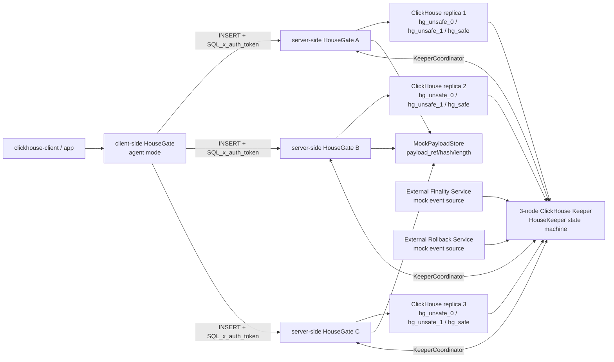
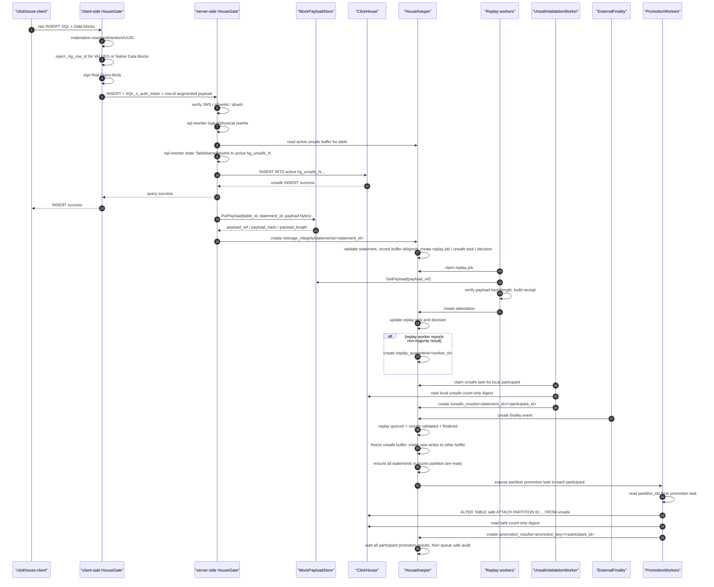
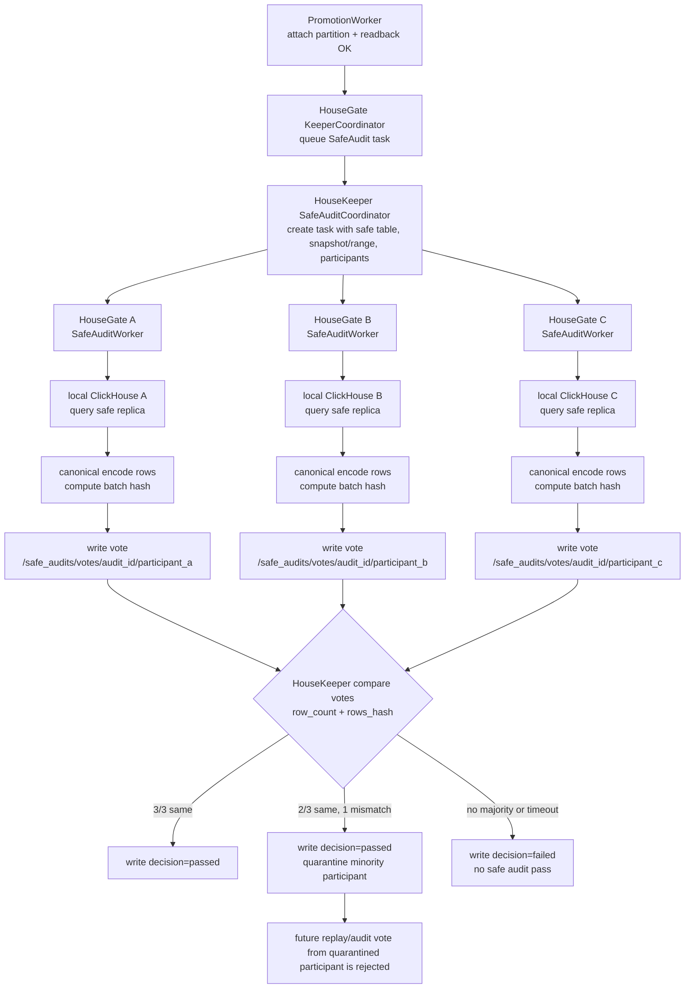

# HouseKeeper Storage Integrity 当前实现设计

## 1. 当前实现结论

当前代码覆盖 INSERT-only storage integrity 路径：

1. `clickhouse-client` 不修改，只发送原生 SQL 和 INSERT Data blocks。
2. client-side HouseGate 作为可信入口，先把 SQL 文本里的白名单非确定性零参数函数 materialize 成常量；启用 `agent.storage_integrity.enabled` 时按 `agent.storage_integrity.network_id` 和 statement/table/ordinal 注入 `_hg_row_id`。SQL `VALUES` 路径把 row id 写入最终 `Query.Body` 后再生成 `SQL_x_auth_token`；Native Data block 路径在 Data packet 转发前追加 `_hg_row_id FixedString(32)` 列，row ordinal 跨同一 statement 的多个 block 递增。
3. server-side HouseGate 验证入口签名、allowlist 和 query hash。
4. sql-rewriter 先执行原有 logical/physical rewrite；storage-integrity plugin 根据读写类型构造 static table map，再调用 sql-rewriter 的 `TableNameRewrite`：SELECT target -> `hg_safe`；INSERT target 默认 -> `hg_unsafe`，启用 `unsafe_buffer_databases` 时 -> 当前 active unsafe buffer，例如 `hg_unsafe_0` 或 `hg_unsafe_1`。
5. ClickHouse 执行 unsafe INSERT。该 INSERT 写入 unsafe 成功后，client 可以收到成功响应；进入 safe 由异步 worker 流程完成。
6. HouseGate 捕获 INSERT Data payload，写入 `MockPayloadStore`，得到 `payload_ref`、`payload_hash`、`payload_length`，并提交 statement input znode。
7. ClickHouse Keeper fork 内的 HouseKeeper C++ 状态机持久化 statement，冻结当前 HouseGate membership participants，记录 statement 所属 `unsafe_buffer_id` / `unsafe_buffer_epoch`，生成 replay job、unsafe validation task、unsafe result parent ledger、decision ledger、promotion task 或 rollback task。
8. 3 个 server-side HouseGate 分别以独立 worker identity 提交 replay attestation；HouseKeeper 对相同 replay result hash 做 `2/3` quorum 判定。
9. replay quorum 形成后，HouseKeeper 对少数不一致 worker 写 `/replay_quarantine/<worker_id>` active marker；HouseGate 不再让该 worker 领取 replay / unsafe / promotion / rollback / safe audit 任务，Keeper admission 也拒绝该 worker 后续 attestation / safe audit vote。
10. UnsafeValidationWorker 不配置全量 replica list；每个 server-side HouseGate 只查询自己一对一连接的本地 ClickHouse unsafe 表，提交 `/unsafe_results/<statement_id>/<participant_id>`。HouseKeeper 按 statement 冻结的 participants 聚合，要求所有 participant 的 row count / rows hash 一致。
11. external finality service 或 rollback service 把 event 写入 HouseKeeper。finality 只在 replay quorum 和 unsafe validation 都成立时触发 promotion；rollback 优先阻断 promotion。
12. PromotionWorker 在每个 server-side HouseGate 内本地执行 `ALTER TABLE <safe> ATTACH PARTITION ID '<partition_id>' FROM <unsafe>`；partition id 来自 statement / part registry metadata，并由 HouseKeeper 复制到 promotion task。启用双 unsafe buffer 后，promotion task 的粒度是 `unsafe_buffer_epoch + table + partition`，不是单条 statement；同一个 frozen buffer partition 内所有将被 attach/promote 的 unsafe parts 对应 statement 必须全部 replay quorum、unsafe validation 和 finality 通过。当前验证环境用 `mock_part_registry.partition_ids` 模拟真实 part registry。`hg_safe` 是本地 MergeTree，所以 HouseKeeper 必须等所有冻结 participants 都写入 `/promotion_results/<promotion_key>/<participant_id>` 后，才生成 safe audit task。
13. SafeAuditCoordinator 已在 ClickHouse Keeper fork 内提供 znode RPC、decision ledger 和 minority quarantine marker；HouseGate 侧 safe audit task 同样按 statement participants 生成，每个 HouseGate 只读取自己的本地 safe 副本并投票。

真实二进制验证已经覆盖 `3 ClickHouse / 3 HouseGate / 3 HouseKeeper` 拓扑：

```text
历史 E2E PASS: 3 Keeper / 3 ClickHouse / 3 HouseGate insert -> unsafe quorum -> finality -> promotion
```

## 2. 部署拓扑



每个 ClickHouse 对应一个 server-side HouseGate。每个 server-side HouseGate 内部运行 replay、unsafe validation、promotion、rollback、safe audit worker。HouseKeeper 只保存控制面状态，不执行 SQL、不读取 ClickHouse 行数据、不访问 DA/L2 网络。

## 3. 组件职责

| 组件 | 当前部署位置 | 当前职责 |
| --- | --- | --- |
| `clickhouse-client` / 应用 | client side | 不修改、不签名，发送原始 ClickHouse SQL 和 INSERT Data blocks。 |
| Client-side HouseGate | HouseGate agent mode | 接收原始 SQL；签名前 materialize 白名单非确定性零参数函数；启用 `agent.storage_integrity` 时注入 `_hg_row_id`；用 `agent.private_key_hex` 生成 `SQL_x_auth_token`，再转发到 server-side HouseGate。 |
| Server-side HouseGate ingress | HouseGate server mode | 验证入口 JWS、allowlist、`qhash`；执行 sql-rewriter logical/physical rewrite 和 storage-integrity static table rewrite；捕获 INSERT payload；提交 HouseKeeper input znodes；运行后台 workers。 |
| Storage-integrity plugin | HouseGate plugin | 插在原有 sql-rewriter 之后，根据读写类型生成 unsafe/safe table map，并通过 sql-rewriter static `TableNameRewrite` 做最终 SQL 改写；启用 `unsafe_buffer_databases` 时从 control plane 读取 active unsafe buffer；捕获 INSERT Data payload。 |
| MockPayloadStore | HouseGate 内置 adapter | 本地 content-addressed payload store，返回 `mockda://...` ref；HouseKeeper 只保存 ref/hash/length。 |
| KeeperCoordinator | HouseGate worker control plane adapter | 使用 ZooKeeper/ClickHouse Keeper znode API 写 input ledger，读取 HouseKeeper 生成的 task source，并提交 worker result；statement/promotion task 兼容 `unsafe_buffer_id`、`unsafe_buffer_epoch` 和 `statement_ids`；领取任何 worker task 前都会检查 replay quarantine marker。 |
| Replay Verifier | 每个 server-side HouseGate 一个 worker identity | 按 replay job 读取 payload，重新校验 hash/length，提交 replay attestation。 |
| UnsafeValidationWorker | HouseGate worker | 只连接本地 ClickHouse unsafe 表，优先用 `SELECT count()` 读取本地 row count，并在 HouseGate 侧派生 rows hash，提交本 participant 的 row count / rows hash。 |
| PromotionWorker | HouseGate worker | 每个 server-side HouseGate 各自领取 participant-scoped promotion lease，使用 HouseKeeper task 下发的 `partition_ids` 执行 `ATTACH PARTITION ... FROM unsafe` 到本地 safe MergeTree，并提交本 participant 的 readback result；task 可覆盖一个 frozen buffer partition 下的多个 statement。 |
| RollbackWorker | HouseGate worker | 领取 rollback task 和 lease，执行 unsafe cleanup / truncate，并提交 rollback result。 |
| SafeAuditWorker | HouseGate worker | 按 audit task 读取本地 safe 副本，计算 batch hash，提交 audit vote。 |
| HouseKeeper storage-integrity 状态机 | ClickHouse Keeper fork | admission、statement ledger、active/frozen unsafe buffer、replay quorum、replay minority quarantine、unsafe gate、finality/rollback gate、partition-level promotion/rollback task source、decision ledger。 |
| SafeAuditCoordinator | ClickHouse Keeper fork | 接收 audit task / vote，生成 decision ledger，给 minority replica 写 quarantine marker。 |
| ClickHouse server | `26.3-lts-decimal512` | 原生执行 unsafe INSERT、safe promotion SQL 和 readback 查询。 |

## 4. INSERT 全流程



关键语义：

- INSERT 的同步成功语义是“unsafe 写入成功”，不是“safe promotion 已完成”。
- replay、unsafe validation、finality、promotion 都是异步控制面流程。
- replay 多数通过不等于所有 worker 都通过；达到 `2/3` 后，少数不一致 worker 会被 HouseKeeper 标记为 active quarantine，不能继续领取本方案 worker 任务。
- external finality event 可以先到达 HouseKeeper，但只有 replay quorum 和 unsafe validation 都成立时才生成 promotion task。
- rollback event 存在时，HouseKeeper 生成 rollback task，并阻断同一 statement 的 promotion task。

## 5. HouseGate 实现细节

### 5.1 入口签名

client-side HouseGate 生成 `SQL_x_auth_token`。token payload 包含：

```text
purpose = housegate-query
iss     = <client-side HouseGate signer address>
qhash   = Keccak256(Query.Body)
```

server-side HouseGate 校验：

- JWS 格式和签名。
- signer address 在 allowlist 内。
- `purpose=housegate-query`。
- `qhash` 与当前 `Query.Body` 匹配。

终端 client 和 ClickHouse driver 不参与签名。

client-side HouseGate 在签名前处理非确定性函数和 `_hg_row_id`：

- 支持白名单零参数函数：`now()`、`rand()`、`random()`、`rand64()`、`generateUUIDv4()`。
- materializer 只扫描 SQL 代码区，不改字符串字面量、反引号标识符和注释里的同名文本。
- `qhash` 绑定的是 client-side HouseGate materialize / row-id SQL 改写后的最终 `Query.Body`。
- server-side HouseGate 不重新 materialize；storage-integrity INSERT 如果仍包含这些未 materialize 函数，会 fail closed。
- `agent.storage_integrity.enabled=true` 时必须配置 `agent.storage_integrity.network_id`。
- `_hg_row_id` 计算公式为 `BLAKE3("housegate-row-id-v1" || network_id || table_id || statement_id || global_row_ordinal)`，输出 32 bytes，写入 `_hg_row_id FixedString(32)`。
- `statement_id` 使用 ClickHouse Query ID；如果 client 没有设置 Query ID，client-side HouseGate 会生成 UUID 并写回 Query ID。
- SQL `INSERT ... VALUES` 路径：client-side HouseGate 在每个 values tuple 前追加 `unhex('<row_id_hex>')`，必要时给显式列清单前置 `_hg_row_id`，然后 signer 对最终 `Query.Body` 计算 `qhash`。
- Native Data block 路径：client-side HouseGate 在 Data packet 转发前将 `_hg_row_id FixedString(32)` 作为第一列写入未压缩 Native block；同一 statement 内 `global_row_ordinal` 跨多个 Data block 递增，empty Data terminator 清理该 statement 的 row-id 状态。
- 当前 row-id 注入支持 `INSERT ... VALUES` 和未压缩 `FORMAT Native`；压缩 Native Data block 和 `INSERT ... SELECT` 会在 client-side HouseGate fail closed。

### 5.2 SQL rewrite 顺序

当前执行顺序是：

```text
raw SQL
-> client-side materialize non-deterministic zero-arg functions
-> client-side inject _hg_row_id for storage-integrity INSERT
-> client-side sign final Query.Body
-> server-side verify qhash
-> sql-rewriter 原有 logical/physical rewrite
-> storage-integrity plugin
-> storage-integrity 构造 static table map
-> sql-rewriter static TableNameRewrite
   - INSERT target -> active hg_unsafe_N, or hg_unsafe when buffer rotation is disabled
   - SELECT target -> hg_safe
```

storage-integrity plugin 不手写 SQL target 字符串替换。plugin 通过 `QueryContext.AccessedTables` 或 SQL target fallback 推导 table id，再按 `TableLayout` 生成 unsafe/safe 目标，并把 source target -> integrity target 作为 static table map 交给 sql-rewriter。跨 database 改写使用 sql-rewriter static `table_with_database_map` 语义。

默认布局：

```text
unsafe database = hg_unsafe
safe database   = hg_safe
unsafe suffix   = <empty>
```

因此默认表名是 `hg_unsafe.<table_id>` 和 `hg_safe.<table_id>`；不再给 unsafe 表追加 `_a` 后缀。隔离语义只依赖 `hg_unsafe` / `hg_safe` database。

双 unsafe buffer 布局通过 `storage_integrity.unsafe_buffer_databases` 显式启用：

```yaml
storage_integrity:
  unsafe_buffer_databases:
    - hg_unsafe_0
    - hg_unsafe_1
  safe_database: hg_safe
```

启用后：

- INSERT rewrite target 来自 control plane 返回的 active buffer，例如 `hg_unsafe_0.<table_id>`。
- SELECT rewrite target 始终是 `hg_safe.<table_id>`。
- HouseGate statement ledger 记录 `unsafe_table`、`unsafe_buffer_id`、`unsafe_buffer_epoch`。
- HouseKeeper freeze 当前 active buffer 做 promotion 时，新 INSERT 会切到另一个 unsafe buffer；已经 frozen 的 buffer 拒绝继续写入，保证本次 promotion 的 part 集合固定、可验证、可预期。
- `unsafe_table_suffix` 保持默认空值，不用 `_a` / `_b` 后缀表达 buffer。

### 5.3 INSERT capture

plugin 在 INSERT query 阶段创建 `insertCapture`，记录：

```text
table_id
statement_id
original_sql
unsafe_sql
unsafe_table
safe_table
unsafe_buffer_id
unsafe_buffer_epoch
data_packets
started_at
terminator_seen
```

`OnClientData` 捕获原始 Data packet bytes。收到 ClickHouse empty Data block terminator 后，capture 进入 terminated 状态并启动短延迟 finalize timer。

finalize 有两条路径：

- `OnQueryComplete`：正常 query complete 时提交 payload。
- `OnClose`：如果 client 已发送 Data terminator 但连接关闭，仍 finalize capture；如果没有 terminator，则丢弃 capture。

finalize 动作：

```text
payload = concat(data_packets)
MockPayloadStore.PutPayload(table_id, statement_id, payload)
IngressSink.SubmitInsert(InsertRecord)
```

`OnException` 会 drop capture，不提交 statement。

## 6. Payload / DA commitment

当前代码使用 HouseGate 内置 `MockPayloadStore`：

```text
PutPayload(table_id, statement_id, payload)
  -> payload_hash = replay.DigestBytes(payload)
  -> payload_length = len(payload)
  -> payload_ref = mockda://<table_id>/<statement_id>/<hash_without_0x>

GetPayload(payload_ref)
  -> read bytes by digest
  -> recompute replay.DigestBytes(payload)
  -> mismatch fail
```

HouseKeeper statement 中只保存：

```text
payload_ref
payload_hash
payload_length
```

Replay Verifier 必须重新读取 bytes 并校验 hash/length，不能只信任 statement metadata。

独立 DA Store 的对接字段与当前 commitment 一致，接口文档见：

```text
2026-06-29-da-store-interface-design.zh-CN.md
```

## 7. HouseKeeper znode ledger

默认根路径：

```text
/housekeeper/v1/storage_integrity
```

### 7.1 输入 path

这些 path 由 HouseGate 或外部 event service 写入，HouseKeeper admission policy 会校验格式和依赖关系：

| Path | 写入方 | 作用 |
| --- | --- | --- |
| `/statements/<statement_id>` | HouseGate ingress | statement input；包含 table、unsafe/safe table、unsafe buffer id/epoch、payload commitment、replay quorum、冻结的 HouseGate participants、original/unsafe SQL。 |
| `/attestations/<statement_id>/<worker_id>` | Replay Verifier | replay vote；包含 computed state root / receipt hash / match flag / signature。 |
| `/unsafe_results/<statement_id>/<participant_id>` | UnsafeValidationWorker | 该 HouseGate 本地 unsafe ClickHouse 的 row count / rows hash。 |
| `/unsafe_failures/<statement_id>` | UnsafeValidationWorker | unsafe validation failure。 |
| `/finality/<statement_id>` | External Finality Service | finalized event。 |
| `/rollbacks/<statement_id>` | External Rollback Service | rollback event。 |
| `/promotion_results/<promotion_key>/<participant_id>` | PromotionWorker | 该 HouseGate 本地 safe MergeTree promotion success 和 readback result。旧 statement 级 promotion 中 `promotion_key=statement_id`。 |
| `/promotion_failures/<promotion_key>/<participant_id>` | PromotionWorker | 该 HouseGate 本地 promotion failure。旧 statement 级 promotion 中 `promotion_key=statement_id`。 |
| `/rollback_results/<statement_id>` | RollbackWorker | rollback success。 |
| `/rollback_failures/<statement_id>` | RollbackWorker | rollback failure。 |

### 7.2 HouseKeeper managed path

这些 path 由 ClickHouse Keeper fork 内的 HouseKeeper 状态机生成，外部直接写入会 fail closed：

| Path | 作用 |
| --- | --- |
| `/replay_jobs/<statement_id>` | replay task source。 |
| `/unsafe_tasks/<statement_id>` | unsafe validation task source。 |
| `/unsafe_results/<statement_id>` | unsafe result parent ledger；由 HouseKeeper 创建，worker 只能写 participant child。 |
| `/unsafe_buffers/<table_id>/active` | 当前 table 的 active unsafe buffer；包含 `buffer_id`、`epoch`、可选 `unsafe_table`。HouseGate INSERT rewrite 读取该节点；缺失时默认 buffer 0 / epoch 1。 |
| `/decisions/<statement_id>` | replay/unsafe/finality/rollback/promotion readiness decision ledger。 |
| `/replay_quarantine/<worker_id>` | replay minority worker quarantine marker；由 HouseKeeper 在 replay quorum 形成后写入。 |
| `/promotions/<promotion_key>` | promotion task source；默认旧路径 `promotion_key=statement_id`，启用双 unsafe buffer 后 `promotion_key` 表示 frozen buffer + table + partition 的 group key，task 内包含 `statement_ids`。 |
| `/rollback_tasks/<statement_id>` | rollback task source。 |

### 7.3 Worker lease / task path

HouseGate worker 领取任务时会写 lease：

| Path | 作用 |
| --- | --- |
| `/promotion_leases/<promotion_key>/<participant_id>` | promotion participant worker claim。旧 statement 级 promotion 中 `promotion_key=statement_id`。 |
| `/rollback_leases/<statement_id>` | rollback worker claim。 |
| `/safe_audit_tasks/<audit_id>/<participant_id>` | HouseGate worker-facing safe audit task。 |
| `/safe_audit_votes/<audit_id>/<participant_id>` | HouseGate worker-facing safe audit vote。 |

## 8. HouseKeeper 决策状态机

HouseKeeper 对每个 statement 维护 decision：

```text
statement_id
unsafe_buffer_id
unsafe_buffer_epoch
replay_quorum_met
unsafe_validated
finalized
rollback_requested
promotion_ready
rollback_ready
replay_result_hash
replay_tally
```

状态更新规则：

1. `statements/<statement_id>` 创建成功后，HouseKeeper 生成 replay job、unsafe task 和初始 decision。
2. 每条 attestation 写入后，HouseKeeper 按 `computed_state_root` 或 receipt result 聚合 replay tally。
3. 同一 replay result 的票数达到 `replay_quorum` 后，`replay_quorum_met=true`。
4. replay quorum 形成时，HouseKeeper 以多数 `replay_result_hash` 为准扫描该 statement 已提交 attestation；任何 `computed_state_root` / `receipt_hash` 与多数不一致的 worker 会被写入 `/replay_quarantine/<worker_id>`，marker 内容包含 `worker_id`、`statement_id`、`majority_hash`、`reported_hash`、`reason=replay_minority_mismatch`、`status=active`。
5. unsafe result 必须覆盖 statement 冻结的所有 participants，且每个 participant 的本地 `row_count` 和 `rows_hash` 一致，才设置 `unsafe_validated=true`。
6. finality event 有效时，`finalized=true`。
7. rollback event 有效时，`rollback_requested=true`，`rollback_ready=true`。
8. 单 statement 的 `promotion_ready=true` 只在以下条件同时满足时成立：

```text
!rollback_requested
&& replay_quorum_met
&& unsafe_validated
&& finalized
```

9. 启用双 unsafe buffer 时，HouseKeeper 先 freeze 当前 active buffer 并把新写入切到另一个 buffer；然后按 `unsafe_buffer_epoch + table + partition_id` 汇总同一 frozen partition 内的 statement 集合。只有该集合里每个 statement 都满足 replay quorum、unsafe validation、finality，且没有 rollback，才生成 `/promotions/<promotion_key>`。
10. `/promotions/<promotion_key>` task 必须包含 `unsafe_table`、`safe_table`、`unsafe_buffer_id`、`unsafe_buffer_epoch`、`partition_ids`、`statement_ids`。`statement_ids` 是该 partition 本次 attach/promote 覆盖的 statement 列表。
11. `rollback_requested=true` 时 HouseKeeper 生成 `/rollback_tasks/<statement_id>`，并阻断包含该 statement 的 promotion group。

## 9. Replay 验证

HouseGate `KeeperCoordinator` 从 `/replay_jobs` 读取 job。每个 worker 只在自己还没有提交 attestation 时领取该 job。

ReplayJob 由 statement 派生：

```text
block_seq           = replayBlockSeq(statement_id)
prev_safe_snapshot  = housekeeper-genesis
schema_snapshot_id  = housekeeper-schema
executor_profile_id = housekeeper-replay
source_claim_root   = digest(statement fields)
statement.sql       = unsafe_sql 优先，缺失时 fallback 到 original_sql
statement.sql_hash  = DigestBytes(statement.sql)
payload_ref/hash/length = statement payload commitment
```

Replay Verifier 行为：

1. 从 PayloadStore 读取 `payload_ref`。
2. 校验 bytes 长度等于 `payload_length`。
3. 重新计算 `payload_hash`。
4. 生成 execution receipt。
5. 提交 attestation 到 `/attestations/<statement_id>/<worker_id>`。

在 3 HouseGate 拓扑中，`replay_quorum=2` 表示 3 个 worker 中至少 2 个对同一 replay result 一致。达到 `2/3` 后：

- 多数 result 进入 decision ledger，后续 unsafe validation / finality / promotion 可以继续推进。
- 少数不一致 worker 会进入 `/replay_quarantine/<worker_id>`。
- HouseGate `KeeperCoordinator` 在 `ClaimReplayJob`、`ClaimUnsafeValidation`、`ClaimPromotion`、`ClaimRollback`、`ClaimSafeAudit` 前检查 marker；`status=active` 或缺省 status 都视为隔离，`status=inactive` 才允许恢复领取。
- Keeper admission policy 同时拒绝被隔离 worker 的后续 replay attestation 和 safe audit vote，避免绕过 HouseGate worker claim 直接写 input znode。

## 10. Unsafe validation

UnsafeValidationWorker 从 `/unsafe_tasks/<statement_id>` 领取任务，任务包含：

```text
validation_id
statement_id
table_id
unsafe_table
participants[]
```

当前实现使用 `ClickHouseUnsafeDigestReader` 连接本 HouseGate 的本地 ClickHouse。HouseGate 不配置 `local_replica`、`expected_replicas`、`worker_id` 或全量 replica list；它一对一连接的 `upstream` 就是本地副本。HouseKeeper 根据 `/members/<participant_id>` 冻结 statement participants，并在 Keeper C++ 状态机里聚合 `/unsafe_results/<statement_id>/<participant_id>`。

为避免普通 table scan 在 ReplicatedMergeTree 上等待 EOS 卡住，reader 优先使用 ClickHouse trivial count 路径：

```text
row_count = SELECT count() FROM <unsafe_table>
rows_hash = replay.DigestBytes("count:<row_count>")
```

这条查询只用于本地副本的 unsafe validation，不用于发现 promotion partition。旧的 `system.parts` active parts digest 保留为兼容 fallback，但方案二的端到端验证不依赖它。

验证规则：

- statement 冻结的 participants 至少满足 replay/unsafe 策略要求；3 HG 拓扑下是 3 个 participants。
- 每个冻结 participant 都必须返回本地 unsafe result。
- 所有 participant 的 `row_count` 必须一致。
- 所有 participant 的 `rows_hash` 必须一致。
- 每个 HouseGate 读取自己本地 ClickHouse 时使用独立 query timeout。
- 任何 mismatch 或 timeout 都提交 failure，不允许 promotion。

## 11. Finality、rollback 与 promotion

Finality / rollback 都由外部服务写 HouseKeeper event：

```text
/finality/<statement_id>
/rollbacks/<statement_id>
```

当前验证环境使用 mock event source；它不在 HouseGate runtime 内轮询，也不直接触发 promotion。HouseKeeper 只把它当作控制面输入。

Promotion task 内容由 HouseKeeper 生成，HouseGate `KeeperCoordinator` 转换成 worker task：

```text
promotion_key = <statement_id>                  # 默认单 unsafe 兼容路径
promotion_key = <table + unsafe_buffer_epoch + partition_id group key>  # 双 unsafe buffer 路径
promotion_id  = promotion-<promotion_key>
lease_id      = lease-<promotion_key>-<participant_id>
unsafe_table
safe_table
unsafe_buffer_id
unsafe_buffer_epoch
partition_ids
statement_ids = <本次 frozen partition attach 覆盖的 statement 列表>
generated SQL:
  ALTER TABLE <safe_table> ATTACH PARTITION ID '<partition_id>' FROM <unsafe_table>
readback:
  table = <safe_table>
  expected_rows = unsafe validation row_count
  expected_hash = unsafe validation rows_hash
```

PromotionWorker 行为：

1. 写 `/promotion_leases/<promotion_key>/<participant_id>` claim；同一个 promotion group 下每个冻结 participant 都需要独立 claim。
2. 从 promotion task 读取 `partition_ids`；该字段由 statement 的 part registry metadata 传入，当前 E2E 使用 `mock_part_registry.partition_ids`。
3. 如果 task 没有 `partition_ids`，直接写 `/promotion_failures/<promotion_key>/<participant_id>`，不扫描 unsafe 表、不查询 `_partition_id` 或 `system.parts`。
4. 对每个 partition 执行 `ALTER TABLE <safe_table> ATTACH PARTITION ID '<partition_id>' FROM <unsafe_table>`；当前 E2E 中 unsafe 是 ReplicatedMergeTree，safe 是本地 MergeTree，因此每个 HouseGate/ClickHouse pair 都要在本地执行一次 attach。
5. promotion SQL 设置 statement timeout；如果 ClickHouse 已应用但连接等待 EOS 超时，worker 继续依赖 readback 判断。
6. 读取 safe count-only digest。
7. readback 与 expected rows/hash 一致后，写 `/promotion_results/<promotion_key>/<participant_id>`。
8. readback 不一致或 SQL 明确失败时，写 `/promotion_failures/<promotion_key>/<participant_id>`。
9. HouseKeeper / `KeeperCoordinator` 只有在该 promotion group 冻结的所有 participants 都完成 promotion result 后，才按 task 中的 `statement_ids` 生成 safe audit task。

双 unsafe buffer promotion 额外限制：

- 同一 table 的写入只进入当前 active unsafe buffer。
- HouseKeeper 决定 promotion 前先 freeze 当前 active buffer，并把后续 INSERT 切到另一个 unsafe buffer。
- frozen buffer 内同一 partition 的 part 集合固定后，HouseKeeper 以该 partition 为 promotion group。
- 一个 partition 内所有将被 attach/promote 的 unsafe parts，都必须已经 unsafe validation 通过，且对应 statement 都已经 replay quorum 和 finality，才能对这个 partition 下发 `ATTACH PARTITION`。
- 如果 group 内任意 statement rollback、unsafe validation 失败、replay 无 quorum或缺 finality，整个 partition promotion group 不生成。

Rollback task 当前转换为：

```text
TRUNCATE TABLE <unsafe_table>
```

RollbackWorker 通过 `/rollback_leases/<statement_id>` claim，并把结果写入 `/rollback_results/<statement_id>` 或 `/rollback_failures/<statement_id>`。

## 12. Safe audit

Safe audit 当前有两层接口：

1. HouseGate `KeeperCoordinator` 在 promotion finish 后按 statement 冻结 participants 创建 worker-facing audit tasks。
2. ClickHouse Keeper fork 内建 `SafeAuditCoordinator`，通过 `/housekeeper/v1/safe_audits/...` znode RPC 接收 task / vote，持久化 decision，并给 minority replica 写 quarantine marker。

SafeAudit 流程：



Keeper 侧 SafeAudit paths：

```text
/housekeeper/v1/safe_audits/tasks/<audit_id>
/housekeeper/v1/safe_audits/votes/<audit_id>/<replica_id>
/housekeeper/v1/safe_audits/decisions/<audit_id>
/housekeeper/v1/safe_audits/quarantine/<audit_id>/<replica_id>
```

SafeAuditCoordinator 不读取 ClickHouse 行数据，也不计算大范围 hash。SafeAuditWorker 在 HouseGate 内读取 safe replica、canonical encode rows、计算 batch hash，并提交 vote。

Keeper admission policy 对 safe audit 做以下校验：

- task 必须格式完整。
- vote 必须引用存在的 task。
- vote 的 replica、snapshot、range 必须匹配 task。
- duplicate vote fail closed。
- managed decision/quarantine path 不能由外部直接写。
- 如果 vote 的 worker / replica id 已存在 active replay quarantine marker，则拒绝该 vote。

## 13. ClickHouse Keeper admission policy

ClickHouse fork 在 Keeper write admission 路径增加 HouseKeeper policy。

Storage-integrity root 下：

- control root path 可以存在。
- managed ledger path 不允许外部直接写。
- statement、attestation、unsafe result、finality、rollback event 必须是单独 create，并通过字段校验。
- active replay quarantine marker 存在时，拒绝对应 worker 继续提交 replay attestation 或 safe audit vote。
- worker result / lease path 允许 create 或 set。

Verified RMT metadata path 下：

- 对 marked verified table，Keeper policy 解析 RMT log entry。
- 未知 log entry 格式 fail closed。
- `MERGE_PARTS` 被拒绝。
- `GET_PART` / `ATTACH_PART` 需要存在 source claim marker。
- 非 verified Keeper path 不受 storage-integrity policy 影响。

## 14. 配置

HouseGate storage integrity 配置入口：

```yaml
storage_integrity:
  enabled: true
  mock_payload_store:
    path: "/var/lib/housegate/mock-payloads"
  mock_part_registry:
    partition_ids:
      - "202606"
  housekeeper:
    endpoints:
      - "keeper1:2181"
      - "keeper2:2181"
      - "keeper3:2181"
    root: "/housekeeper/v1/storage_integrity"
    replay_quorum: 2
    session_timeout: "10s"
  unsafe_validation:
    query_timeout: "10s"
  workers:
    poll_interval: "1s"
    replay: true
    unsafe_validation: true
    promotion: true
    rollback: true
    safe_audit: true
```

配置校验规则：

- storage integrity 只在 HouseGate server mode 生效。
- enabled 后必须配置 `mock_payload_store.path`。
- `mock_part_registry.partition_ids` 是当前验证环境的 part registry 输入源；HouseGate 会把它写入 statement，HouseKeeper 生成 promotion task 时复制到 `partition_ids`。
- 配置 HouseKeeper endpoints 后，HouseGate 自动用本实例信息派生 participant id 并注册到 `/members/<participant_id>`；`housekeeper.worker_id` 仅保留为调试/兼容 override，不是必填配置。
- HouseGate 不配置 `local_replica`、`expected_replicas` 或 `unsafe_validation.replicas`；unsafe/safe audit 的参与者由 HouseKeeper membership 冻结。
- `unsafe_validation.query_timeout` 控制本地 ClickHouse digest query timeout。
