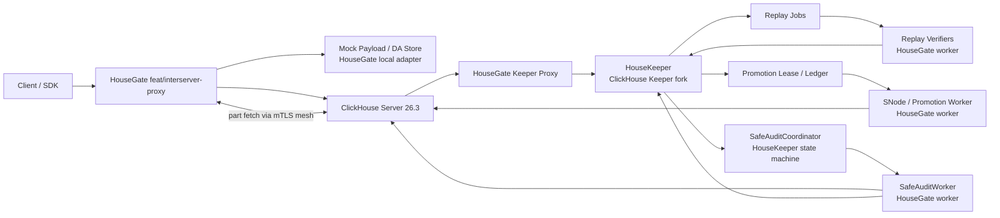
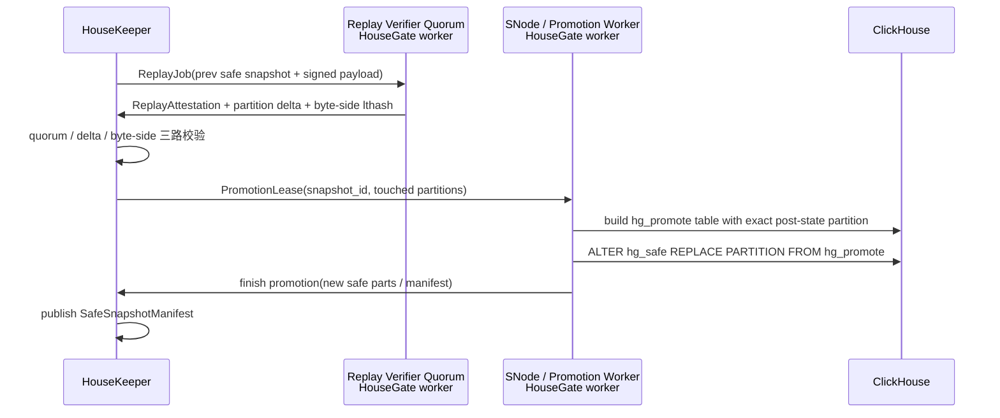
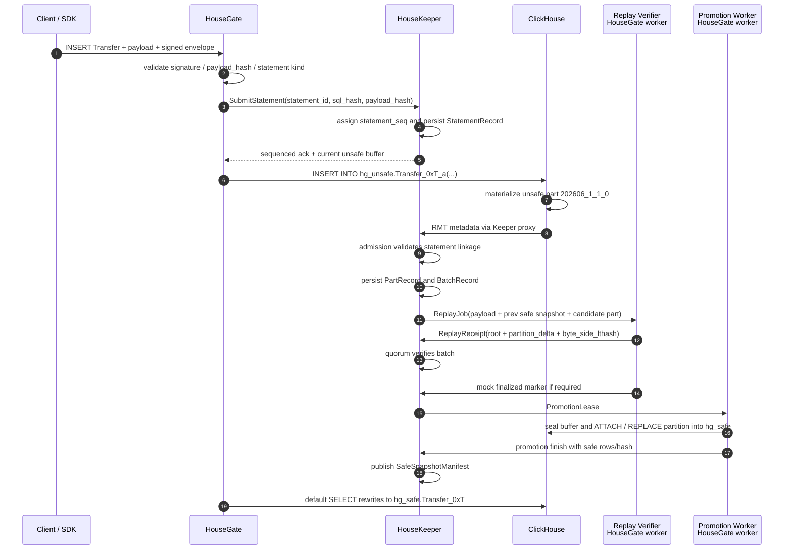
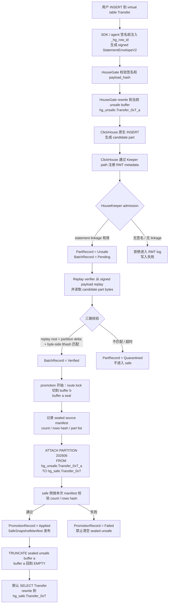

# HouseKeeper Storage Integrity 整体方案

**日期：** 2026-06-25
**状态：** Proposed
**HouseGate 基线：** `feat/interserver-proxy`，核心能力是 Keeper proxy、interserver mTLS mesh、keeper shard/orchestrator。
**ClickHouse 基线：** `git@github.com:sentioxyz/ClickHouse.git` / `26.3-lts-decimal512`。本轮只允许修改 Keeper / HouseKeeper 相关代码，不改 `StorageReplicatedMergeTree`、`MergeTree`、SQL parser / interpreter、part format。
**输入方案：**

- `housegate/docs/superpowers/specs/2026-06-22-storage-integrity-design.zh-CN.md`
- `housegate-insert-only-attach-promotion-design.md`
- `2026-06-24-safe-table-majority-hash-detection-design.md`

注：当前 `feat/interserver-proxy` 本地分支不包含 6/22 storage integrity spec；本文把它作为本轮评审输入，而不是分支内依赖文件。

## 1. 总结结论

推荐路线是 **HouseGate sidecar 网络边界 + ClickHouse Keeper fork 内的 HouseKeeper policy/state + dual-table physical model + replay quorum promotion + safe serving audit**。

三份方案分别落在不同层：

1. 6/22 storage integrity 方案是主干 correctness 模型：签名输入、statement sequencing、replay quorum、partition/part commitment、SafeSnapshotManifest、safe/unsafe 读语义。
2. INSERT-only attach promotion 是一个可落地的 P0 快路径，但只能处理 sealed append buffer；它不能替代通用 safe transition，因为 `ATTACH PARTITION FROM` 是 append/copy，不幂等、不去重、不能表达 UPDATE/DELETE。
3. safe 表多数 hash 检测是 serving-integrity 审计层；它能发现 promotion 后某个节点服务了不同 safe bytes，但不能证明写入是由签名 payload 正确执行而来。

因此整体方案把系统拆成三层：

```text
写入正确性层：StatementEnvelope + HouseKeeper sequencing + replay quorum + byte-side part check
发布层：HouseKeeper-signed promotion lease + promotion ledger + REPLACE/ATTACH partition
运行时服务审计层：HouseKeeper 内的 SafeAuditCoordinator 协调任务，HouseGate SafeAuditWorker 做多副本现场 hash / batch hash 比较
```

## 2. 约束与边界

### 2.1 必须遵守

- HouseGate 基于 `feat/interserver-proxy`：ClickHouse 的 Keeper 连接和 interserver fetch 都经 sidecar 收口。
- ClickHouse fork 基于 `26.3-lts-decimal512`。
- 只改 Keeper / HouseKeeper 相关路径：
  - `src/Coordination/*`
  - `programs/keeper/*`
  - 必要时 `src/Server/Keeper*` 用于 Keeper 控制面暴露
- 不改 ClickHouse server 写入、merge selector、ReplicatedMergeTree 执行、part 文件格式。
- Verified table 的协议真相在 HouseKeeper，不在 HouseGate 内存，也不在单个 ClickHouse 节点。

### 2.2 不能承诺

- 不承诺单个恶意 serving node 对每次 SELECT 都诚实返回；这由 safe audit 概率性发现。
- 不承诺 P1 支持 UPDATE/DELETE、`INSERT SELECT`、materialized view sink 自动补算。
- 不承诺 `ATTACH PARTITION FROM` 幂等。所有 attach 类 promotion 必须有 ledger。

## 3. 三个方案的取舍

### 3.1 6/22 Storage Integrity

应采纳为主干：

- `StatementEnvelopeV2` 绑定 signed SQL、payload hash、schema/settings、row id profile。
- `_hg_row_id` 是行实例唯一性基础，必须进入 unsafe/safe 表。
- JSON/Map/default/mutation 不靠 HouseGate streaming hash，而靠 pinned ClickHouse executor replay。
- promotion 不是只看 `state_root` 相等，而是三路同时成立：
  - replay quorum root match
  - partition delta match
  - byte-side part lthash match
- `SafeSnapshotManifest` 是 safe state 的发布对象。

需要调整的地方：

- 原文倾向 v1 不改 ClickHouse；本轮约束允许改 ClickHouse Keeper，因此 HouseKeeper policy 可以直接进 `clickhouse-keeper` fork，但仍不改 clickhouse-server。
- 原文中 `hg_safe = MergeTree` 的选择保留为 P1 推荐。它意味着 safe 本地 merge 不能被 Keeper admission 直接 gate，只能靠禁用 merge 或后置 audit 约束。

### 3.2 INSERT-only Attach Promotion

应作为 P0 fast path，而不是通用方案。

适用条件：

- 纯 INSERT append。
- unsafe buffer 已 seal，且本轮 promotion 的 rows 可被 `_hg_promotion_id` 或等价 manifest 精确定位。
- 业务接受多 partition promotion 的部分可见性，或上层有 commit marker。
- materialized view 依赖已禁用或纳入单独 promotion。

不适用：

- UPDATE/DELETE。
- 需要替换已有 safe partition 的场景。
- retry 后不能容忍重复 rows 的场景。
- safe target partition 已有历史 rows，且不能用 `_hg_promotion_id` 精确筛选本次新增 rows。

推荐用法：

- P0 可以保留双 unsafe buffer + route lock + sealed manifest。
- 若 target safe partition 已存在，优先构造 `hg_promote` shadow table，再执行 `REPLACE PARTITION FROM hg_promote`，不要直接 attach 整个 unsafe partition。
- 只有在 append-only 且 ledger 能证明未重复 attach 时，才使用 `ATTACH PARTITION FROM sealed_unsafe`。

### 3.3 Safe 表多数 Hash 检测

应作为 P1 serving audit。

推荐先采用“验证时现场计算 hash”：

- 不改 safe 表 schema。
- 每轮 audit 固定 table、partition、row id/range、schema hash。
- 多副本返回 rows 后由 HouseGate SafeAuditWorker canonical encode，计算 row hash / batch hash；SafeAuditCoordinator 只做任务编排、vote 校验和多数仲裁。
- 有多数则隔离 minority；无多数进入 full audit / dispute。

后续如果成本过高，再加 row/batch hash cache。不要 P1 就把 `_hg_row_hash` 加进 safe 表作为安全承诺，因为保存的 hash 与业务列可能一起被恶意节点篡改；它只是加速缓存。

## 4. 推荐架构



组件职责：

| 组件 | 部署归属 | 职责 |
|---|---|---|
| SDK / agent | client side | 签名前 materialize 非确定性函数，注入 `_hg_row_id`，构造 signed envelope |
| HouseGate ingress | HouseGate process | 校验签名和 payload hash，执行 virtual/physical rewrite，作为 ClickHouse SQL 入口、Keeper proxy、interserver mesh |
| Mock Payload / DA Store | HouseGate process 内置 mock adapter | 本轮不接真实 DA。HouseGate 把 signed payload 写入本地 durable mock store，生成 `mockda://...` 风格 `payload_ref`；Keeper 只保存 digest/ref，不保存大 payload |
| Replay verifier | HouseGate process 内置 worker | 在 pinned executor 上 replay payload，读取 actual candidate part bytes，计算 replay root / partition delta / byte-side lthash，提交 signed attestation |
| Promotion Worker / SNode | HouseGate process 内置 worker | 持有 HouseKeeper promotion lease，执行 `ATTACH` / `REPLACE PARTITION`，做 safe readback count/hash，提交 promotion finish |
| Mock Finality / L2 Anchor Watcher | HouseGate process 内置 mock worker | 本轮不接真实 L2 anchor。按配置立即 finality 或延迟 N 秒 finality，把 mock finalized marker 写回 HouseKeeper |
| SafeAuditCoordinator | HouseKeeper / ClickHouse Keeper fork | 维护 audit task、replica set、vote、majority decision、quarantine action；不直接访问 ClickHouse 行数据，不计算大范围 hash |
| SafeAuditWorker | HouseGate process 内置 worker | 按 audit task 读取多个 safe replica，canonical encode rows，计算 row/batch hash，提交 signed audit vote |
| HouseKeeper | ClickHouse Keeper fork | sequencing、statement uniqueness、RMT metadata admission、ReplayJob、attestation quorum、promotion ledger、safe manifest、SafeAuditCoordinator 状态 |
| ClickHouse | ClickHouse server 26.3 | 原生执行 SQL、生成 unsafe parts、通过 interserver fetch 复制 parts、执行 promotion SQL |

部署边界：

- P0/P1 不新增独立服务：Replay Verifier、Promotion Worker / SNode、SafeAuditWorker、Mock Payload / DA Store、Mock Finality / L2 Anchor Watcher 都作为 HouseGate 后台 worker / local adapter。
- Keeper / HouseKeeper 只承载强一致控制面：statement sequencing、part registry、replay quorum decision、promotion lease/ledger、safe snapshot、audit coordinator/vote state。
- Keeper / HouseKeeper 不做重计算和外部 IO：不 replay SQL、不扫 ClickHouse safe 表、不计算大范围 row hash、不直接访问 DA/L2 网络、不执行 promotion SQL。
- 后续如果 replay、promotion 或 finality watcher 的负载独立扩展需求明显，可以把 HouseGate worker 拆成独立服务；接口仍然保持 `HouseGate worker <-> HouseKeeper control plane`，不改变 HouseKeeper 的状态所有权。

本轮外部依赖模拟策略：

- `MockPayloadStore`：content-addressed 本地存储，key 至少包含 `payload_hash`、`statement_id`、`table_id`。Replay Verifier 只能通过 `payload_ref` 读 payload，并重新校验 bytes hash 等于 HouseKeeper 中的 `payload_hash`。
- `MockFinalityWatcher`：不访问真实 DA/L2。P0 默认 `immediate_finality=true`；需要测试延迟/重试时可配置 `finality_delay_ms`，由 HouseGate worker 到期后写入 `FinalityRecord(kind=mock, finalized=true)`。
- HouseKeeper 把 mock finality 当作普通 finalized marker 处理，但 manifest 和 audit record 必须标注 `finality_kind=mock`，避免和真实 DA/L2 安全承诺混淆。
- 真实 Payload / DA Store、真实 L2 Anchor Watcher 后移到 P2+；替换时只替换 HouseGate adapter，不改变 HouseKeeper state machine 的输入字段。

## 5. 物理表模型

P1 推荐：

```text
hg_unsafe.<table_id> = ReplicatedMergeTree
hg_safe.<table_id>   = MergeTree
hg_promote.<table_id>_<snapshot_id> = MergeTree shadow table
```

关键规则：

- `hg_unsafe` 只作为 thin buffer 和 candidate part 来源。
- `hg_unsafe` 在 verified table 生命周期内应 `SYSTEM STOP MERGES`；HouseKeeper policy 同时拒绝 verified unsafe table 的 `MERGE_PARTS` log entry，fail closed。
- `hg_safe` 是每个 replica 的本地 safe cache，只能在 HouseKeeper-signed promotion lease 下写入。
- `hg_promote` 必须精确包含 promotion 后的目标 partition，而不是简单复制整个 unsafe partition。
- `unsafe_latest` 读必须通过 HouseKeeper part registry 排除已 promoted / quarantined / replaced unsafe parts。

P2 可选：

- 若必须让 safe merge 也被 Keeper admission gate，可以把 `hg_safe` 改为 ReplicatedMergeTree，并让 HouseKeeper 解析 safe table 的 `MERGE_PARTS`。这仍然只改 Keeper/HouseKeeper，但会重新引入 safe RMT log policy、merge reservation、output attestation 和更复杂的故障恢复。P1 不推荐。

## 6. HouseKeeper 状态模型

HouseKeeper 在自己的 Raft/Keeper state 内维护协议状态。逻辑路径建议：

```text
/housekeeper/v1/tables/<table_id>
/housekeeper/v1/statements/<account>/<statement_id>
/housekeeper/v1/lc_blocks/<lc_block_seq>
/housekeeper/v1/source_claims/<lc_block_seq>/<statement_seq>
/housekeeper/v1/parts/<table_id>/<table_role>/<part_name>
/housekeeper/v1/replay_jobs/<job_id>
/housekeeper/v1/attestations/<job_id>/<verifier_id>
/housekeeper/v1/promotions/<promotion_id>
/housekeeper/v1/safe_snapshots/<snapshot_id>
/housekeeper/v1/audits/<audit_id>
```

核心记录：

```text
StatementRecord {
  statement_id,
  statement_seq,
  client_account,
  virtual_table_id,
  rewritten_sql_hash,
  payload_hash,
  payload_length,
  schema_snapshot_id,
  settings_hash,
  row_id_profile_id,
  status
}

PartRecord {
  table_id,
  table_role,          // Unsafe / Safe / Promote
  part_name,
  partition_id,
  source_replica,
  statement_seq_range,
  part_phys_hash,
  part_row_lthash,
  row_count,
  bytes,
  state,               // Unsafe / Verifying / Verified / Safe / Quarantined / Replaced
  state_version
}

PromotionRecord {
  promotion_id,
  table_id,
  snapshot_id,
  touched_partitions,
  source_unsafe_parts,
  promote_table,
  mode,                // replace_partition / attach_insert_only
  state,               // Prepared / Applying / Applied / Failed
  replay_quorum_hash,
  byte_side_hash,
  lease_signature
}
```

Statement / batch 状态：

```text
Accepted
-> Sequenced
-> UnsafeRegistered
-> Replaying
-> QuorumVerified
-> PromotionPrepared
-> PromotionApplied
-> SafePublished
```

失败分支：

```text
ReplayMismatch / Timeout -> Challenge / Quarantined
PromotionApplyFailed -> Failed, source unsafe 不清理
AuditMinority -> ReplicaSuspect, 移出 read set
```

## 7. Keeper / HouseKeeper 改造点

### 7.1 新增 HouseKeeper policy 模块

建议新增：

```text
src/Coordination/HouseKeeperState.h
src/Coordination/HouseKeeperState.cpp
src/Coordination/HouseKeeperAdmissionPolicy.h
src/Coordination/HouseKeeperAdmissionPolicy.cpp
src/Coordination/HouseKeeperRMTLogParser.h
src/Coordination/HouseKeeperRMTLogParser.cpp
src/Coordination/HouseKeeperControlPlane.h
src/Coordination/HouseKeeperControlPlane.cpp
```

policy 接口：

```text
class HouseKeeperAdmissionPolicy {
  classifyKeeperRequest(request) -> RequestKind
  parseRMTLogEntry(path, data) -> ParsedRMTLogEntry
  validateRMTCreate(path, data, session_context) -> AdmissionDecision
  buildStateDeltas(decision) -> vector<HouseKeeperDelta>
}
```

### 7.2 KeeperStorage 接入点

在 `src/Coordination/KeeperStorage.cpp` 的 `preprocessRequest` 路径中，在 native deltas commit 前调用 policy：

```text
ZooKeeper create / multi request
-> native ACL / basic syntax preprocess
-> HouseKeeperAdmissionPolicy classify verified-table paths
-> allow: append HouseKeeper state deltas into same zxid
-> reject: return failed delta / Keeper error, 不进入 RMT log
```

需要覆盖的 RMT path：

```text
/clickhouse/tables/<table_path>/log/log-*
/clickhouse/tables/<table_path>/blocks/*
/clickhouse/tables/<table_path>/replicas/<replica>/parts/*
/clickhouse/tables/<table_path>/replicas/<replica>/queue/*
```

P1 policy：

| RMT entry | `hg_unsafe` | `hg_safe` if RMT optional |
|---|---|---|
| `GET_PART` / `ATTACH_PART` | 必须有 statement/source claim linkage | 必须有 promotion lease |
| `MERGE_PARTS` | 拒绝 verified unsafe table | 仅 Safe source parts 可 reserve |
| `MUTATE_PART` | 拒绝 | P1 拒绝，P2 mutation rebuild |
| `DROP_RANGE` / `DROP_PART` | 仅 HouseKeeper cleanup lease | 仅 HouseKeeper rollback/admin lease |
| `REPLACE_RANGE` | 拒绝普通来源 | 仅 promotion lease |
| `ALTER_METADATA` | P1 拒绝或只允许 anchored DDL lease | 同左 |

### 7.3 RMT log parser 边界

不要让 `src/Coordination` 直接依赖 `src/Storages/MergeTree`。虽然 ClickHouse 已有 `ReplicatedMergeTreeLogEntryData::readText`，但把 Storages 链进 standalone Keeper 会扩大依赖和升级风险。

P1 在 HouseKeeper 内实现最小 parser：

- 识别 `get`、`attach`、`merge`、`mutate`、`drop`、`replace_range`。
- 解析 `source replica`、`block_id`、`new_part_name`、`source_parts`、`replace_range_entry` 必要字段。
- 用 26.3 `ReplicatedMergeTreeLogEntry` 文本样本做 golden tests。
- 对未知格式 fail closed，并暴露 metrics。

### 7.4 HouseKeeper 控制面

在 `programs/keeper` 增加 HouseKeeper mode 或独立 binary：

```text
clickhouse-housekeeper
```

控制面可以先用 HTTP/JSON，P2 再替换为 gRPC/protobuf。所有写接口必须 mTLS 或 JWS 认证。

接口：

```text
POST /v1/statements/submit
POST /v1/source_claims/register
POST /v1/replay_jobs/acquire
POST /v1/attestations/submit
POST /v1/promotions/prepare
POST /v1/promotions/finish
POST /v1/audits/report
GET  /v1/safe_snapshots/latest?table_id=...
GET  /v1/state
```

现有原型 `HouseKeeperPartState` / `HouseKeeperDualTableState` 可复用状态机思路，但需要升级为 Keeper Raft 持久状态，而不是进程内 map。

## 8. Promotion 流程

### 8.1 通用推荐：promotion shadow + REPLACE PARTITION



优点：

- 目标 partition 原子替换。
- 对已有 safe partition、UPDATE/DELETE rebuild、append 都统一。
- retry 可由 `PromotionRecord` 幂等化：`Prepared -> Applying -> Applied`。

代价：

- 需要构造 `hg_promote`。
- INSERT-only 比直接 attach 多一步。

### 8.2 P0 INSERT-only 快路径：sealed attach

仅当满足 fast-path 条件时使用：

```text
dual unsafe buffer
-> route lock
-> seal old buffer
-> source manifest / rows hash
-> HouseKeeper replay quorum verified
-> ATTACH PARTITION FROM sealed unsafe
-> safe 本次 rows hash 校验
-> ledger Applied
-> truncate sealed unsafe
```

必须约束：

- 每个 partition attach 前检查 `PromotionRecord`，不能盲目重试。
- attach 超时后先查 query log 和 safe rows/hash，再决定是否继续。
- 多 partition 部分成功时，只恢复未完成 partition。
- safe 校验失败时禁止清空 sealed unsafe。

### 8.3 INSERT-only 例子

当前 P0 只支持 `INSERT` append，不支持 `UPDATE`、`DELETE`、`INSERT SELECT` 或 materialized view sink 自动补算。

假设 verified virtual table 是 `Transfer`：

```sql
CREATE TABLE Transfer (
  from_address String,
  to_address String,
  amount UInt64,
  block_time DateTime
);
```

物理表：

```text
hg_unsafe.Transfer_0xT_a   -- 当前 WRITING buffer
hg_unsafe.Transfer_0xT_b   -- 当前 EMPTY buffer
hg_safe.Transfer_0xT       -- 默认 safe read 表
```

用户提交：

```sql
INSERT INTO Transfer (from_address, to_address, amount, block_time) VALUES
  ('alice', 'bob', 10, '2026-06-25 10:00:00'),
  ('carol', 'dave', 20, '2026-06-25 10:00:01');
```

SDK / agent 在签名前做两件事：

```text
1. materialize 非确定性函数；本例没有 now()/rand()，所以 SQL 不变。
2. 为两行分别注入稳定 _hg_row_id：
   row 0 -> BLAKE3("housegate-row-id-v1" || table_id || statement_id || 0)
   row 1 -> BLAKE3("housegate-row-id-v1" || table_id || statement_id || 1)
```

HouseGate 校验 signed envelope 后，把 virtual table rewrite 到当前 unsafe buffer：

```sql
INSERT INTO hg_unsafe.Transfer_0xT_a
  (_hg_row_id, from_address, to_address, amount, block_time)
VALUES
  (...row_id_0..., 'alice', 'bob', 10, '2026-06-25 10:00:00'),
  (...row_id_1..., 'carol', 'dave', 20, '2026-06-25 10:00:01');
```

ClickHouse 生成 candidate part，例如：

```text
part = 202606_1_1_0
partition = 202606
rows = 2
state = Unsafe
```

HouseKeeper 记录：

```text
StatementRecord(statement_id, statement_seq, payload_hash, table_id=Transfer_0xT)
PartRecord(part=202606_1_1_0, table_role=Unsafe, state=Unsafe)
BatchRecord(batch_id=batch_42, candidate_part_ids=[202606_1_1_0])
```

从 HouseGate 往下的生成步骤：

| 步骤 | 组件 | 输入 | 生成 / 写入 | 说明 |
|---:|---|---|---|---|
| 1 | HouseGate | client SQL + payload + signed envelope | `IngressRequest` | 识别这是 verified table `Transfer` 的 `INSERT`。如果是 `UPDATE/DELETE/INSERT SELECT`，P0 直接拒绝。 |
| 2 | HouseGate | `IngressRequest` | `payload_hash` / `payload_length` / `payload_ref` | 重新计算 payload hash，与 envelope 中的签名字段比对；本轮写入 HouseGate 本地 `MockPayloadStore`，生成 `mockda://...` ref，HouseKeeper 只保存 digest/ref。 |
| 3 | HouseGate | envelope | `StatementSubmit` | 提交给 HouseKeeper，包含 `statement_id`、`sql_hash`、`payload_hash`、`payload_ref`、table id、schema/settings hash。 |
| 4 | HouseKeeper | `StatementSubmit` | `StatementRecord` | 校验签名、table/schema、`statement_id` 未重复。 |
| 5 | HouseKeeper | `StatementRecord` | `statement_seq` / `LCBlock` | 给这条 statement 排序；P0 可以先用单条 statement batch，后续再聚合成 block。 |
| 6 | HouseGate | sequenced ack + route state | rewritten SQL | 把 virtual table `Transfer` 改写成当前 unsafe buffer：`hg_unsafe.Transfer_0xT_a`。 |
| 7 | HouseGate | rewritten SQL + payload | ClickHouse native INSERT | 发送给本机 ClickHouse；payload 中必须已有 `_hg_row_id`。P0 demo 可由 ingress adapter 代注入，但最终协议以签名前注入为准。 |
| 8 | ClickHouse | native INSERT | unsafe data part | 生成 active part，例如 `202606_1_1_0`。 |
| 9 | ClickHouse | RMT metadata write | Keeper create / multi request | 通过 `feat/interserver-proxy` 的 Keeper proxy 写入 HouseKeeper。 |
| 10 | HouseKeeper policy | Keeper request + RMT log entry | `PartRecord(state=Unsafe)` | 解析 part name、partition、source replica、block id；确认能反查到 `StatementRecord`，否则拒绝进入 RMT log。 |
| 11 | HouseKeeper | `StatementRecord` + `PartRecord` | `BatchRecord` / `ReplayJob` | 把 candidate part 纳入待验证 batch，并生成 replay job。 |
| 12 | Replay verifier（HouseGate worker） | `ReplayJob` + payload store + candidate part bytes | `ReplayReceipt` | 从 HouseGate worker 拉 payload 并在 pinned executor 上 replay signed payload，读取 actual part bytes 计算 byte-side lthash。 |
| 13 | HouseKeeper | quorum receipts | `BatchRecord(status=Verified)` | 三路校验通过：replay root、partition delta、byte-side part lthash。失败则 part quarantine。 |
| 14 | HouseKeeper | verified batch + mock finality marker | `PromotionRecord` / promotion lease | Mock Finality Watcher 作为 HouseGate worker 写入 finalized marker；HouseKeeper 只根据 marker 和 verified batch 发放 lease。 |
| 15 | Promotion worker（HouseGate worker） | promotion lease | `ATTACH PARTITION FROM sealed unsafe` 或 `REPLACE PARTITION FROM hg_promote` | P0 INSERT-only 可走 sealed attach；更通用路径走 promote shadow + replace。 |
| 16 | Promotion worker（HouseGate worker） | safe table readback | `verified_rows_count` / `verified_rows_hash` | 校验 safe 中本次 rows 与 sealed manifest 一致，并把结果写回 HouseKeeper；Keeper 不直接扫表算 hash。 |
| 17 | HouseKeeper | promotion finish | `SafeSnapshotManifest` | 发布新的 safe snapshot / safe watermark。 |
| 18 | HouseGate | latest safe snapshot | read rewrite rule | 默认 `SELECT Transfer` 改写到 `hg_safe.Transfer_0xT`；`unsafe_latest` 才 union unsafe。 |

简化序列图：



INSERT-only 流程图：



这个例子的读语义：

```text
promotion 前：
  SELECT Transfer                 -> 只读 hg_safe，查不到这两行
  SELECT Transfer WITH unsafe     -> 可读 safe + 当前 unsafe，结果是 provisional

promotion 后：
  SELECT Transfer                 -> 读 hg_safe，能查到这两行
  unsafe buffer a                 -> 清理后不再包含这两行
```

如果用户提交的是：

```sql
ALTER TABLE Transfer DELETE WHERE amount = 10;
```

当前 P0 直接拒绝，不进入上述流程。后续 P2 才走 mutation rebuild：

```text
clone affected safe partition -> scratch apply mutation -> replay verify -> REPLACE PARTITION
```

## 9. Safe Audit

P1 采用现场计算，但计算不在 Keeper 进程内发生：

```text
SafeAuditCoordinator（HouseKeeper）
-> 选择 table / partition / row_id set / range
-> 持久化 AuditTask
-> 等待多个 SafeAuditWorker vote
-> 对相同 batch_hash 做 majority decision
-> 标记 minority / quarantine / full audit

SafeAuditWorker（HouseGate worker）
-> 拉取 AuditTask
-> 向 N 个 safe replicas 读取同一范围
-> canonical encode rows
-> 计算 row_hash 与 batch_hash
-> 提交 signed SafeAuditVote
```

因此 safe 验证时的 hash 由 HouseGate worker 计算；SafeAuditCoordinator 只验证 worker 身份、audit epoch、snapshot id、range、签名和 vote hash，并在 HouseKeeper Raft state 内做多数仲裁。

hash domain：

```text
row_hash = H(
  "housegate-safe-row-v1",
  network_id,
  table_id,
  schema_hash,
  _hg_row_id,
  canonical(user_columns...)
)
```

审计结果写回 HouseKeeper：

```text
SafeAuditVote {
  audit_id,
  worker_id,
  replica_id,
  snapshot_id,
  range,
  batch_hash,
  row_count,
  signature
}

AuditRecord {
  audit_id,
  table_id,
  snapshot_id,
  range,
  majority_hash,
  minority_replicas,
  action
}
```

控制面动作：

- minority replica 移出 read set。
- 要求 replica 从 SafeSnapshotManifest 重新 sync。
- 连续失败进入 quarantine。

## 10. 与 `feat/interserver-proxy` 的结合点

该分支已有能力直接作为部署边界：

- `pkg/keeper`：ClickHouse 只连本地 Keeper proxy。上游从 vanilla Keeper quorum 切换为 HouseKeeper quorum。
- `pkg/interserver`：ClickHouse part fetch 走 mTLS mesh，避免直接暴露 interserver 端口。
- keeper shard：verified table 可以按 database/table 绑定不同 HouseKeeper shard。
- orchestrator：用于 HouseKeeper quorum 成员变更，但 reconfig session 也应通过 keeper proxy 路径覆盖测试。

HouseGate 不应维护第二套 PartState 真相。它只缓存 HouseKeeper 响应用于 rewrite/route，重启后可从 HouseKeeper 恢复。

## 11. 交付阶段

### P0：Keeper/HouseKeeper 骨架与 INSERT-only demo

- HouseKeeper state/control plane 持久化到 Keeper Raft state。
- HouseGate 内置 `MockPayloadStore`：本地 content-addressed payload 存储，产出 `mockda://...` ref。
- HouseGate 内置 `MockFinalityWatcher`：支持 immediate finality 和可配置延迟 finality，写入 mock `FinalityRecord`。
- RMT log 最小 parser golden tests。
- verified table policy：无 statement linkage 的 unsafe RMT metadata fail closed。
- unsafe `MERGE_PARTS` 拒绝。
- sealed attach fast path + promotion ledger。
- Replay Verifier / Promotion Worker / SafeAuditWorker 以 HouseGate worker 形态运行。
- HouseKeeper 内置 SafeAuditCoordinator，SafeAuditWorker 现场 hash PoC。

### P1：主干 replay promotion

- `StatementEnvelopeV2`、LCBlock、RCRecord。
- replay job / attestation quorum。
- byte-side part lthash check。
- `hg_promote` + `REPLACE PARTITION FROM` promotion。
- `SafeSnapshotManifest` 发布与 latest snapshot API。
- HouseGate safe/unsafe read rewrite 对接 latest manifest。

### P2：mutation rebuild 与 safe serving 加固

- bounded UPDATE/DELETE admission。
- affected safe partition clone/rebuild。
- audit batch hash cache。
- lagging replica safe bootstrap。
- optional safe RMT / Keeper-gated safe merge 评估。
- 真实 Payload / DA Store adapter 替换 `MockPayloadStore`。
- 真实 Finality / L2 Anchor Watcher 替换 `MockFinalityWatcher`。

## 12. 验证计划

单元测试：

- HouseKeeper state machine：statement、part、promotion、audit 状态转换。
- RMT log parser：26.3 `GET_PART`、`ATTACH_PART`、`MERGE_PARTS`、`MUTATE_PART`、`REPLACE_RANGE` golden input。
- Admission policy：verified path fail closed，非 verified Keeper path 不受影响。

Keeper 集成测试：

- vanilla ClickHouse Keeper client session、watch、multi request 不回归。
- verified `hg_unsafe` insert metadata 有 linkage 才允许。
- unsafe merge entry 被拒绝且 ClickHouse replica 可恢复。
- promotion lease 允许 `REPLACE_RANGE` / cleanup 操作。

HouseGate 集成测试：

- 使用 `feat/interserver-proxy` 的生产 sidecar 启动路径，不只测 kpx/imesh wrapper。
- ClickHouse -> HouseGate Keeper proxy -> HouseKeeper。
- ClickHouse interserver fetch 经过 mTLS mesh。
- keeper shard routing 可把 verified database 指向 HouseKeeper shard。
- `MockPayloadStore` 可在 HouseGate 重启后按 `payload_ref` 找回 payload，并校验 hash。
- `MockFinalityWatcher` immediate / delayed 两种模式都能驱动 promotion lease。

端到端：

- 3 HouseKeeper + 2 ClickHouse replica + 2 HouseGate sidecar。
- INSERT 写入 unsafe，HouseKeeper 记录 source claim。
- replay quorum 通过。
- promotion 到 safe。
- safe read 可见，unsafe_latest 排除已 promote parts。
- 篡改一个 replica safe row，SafeAuditCoordinator 标记 minority。

## 13. 主要风险

| 风险 | 影响 | 缓解 |
|---|---|---|
| RMT log text format 是 ClickHouse 内部实现 | 26.3 升级可能破 parser | 固定 `26.3-lts-decimal512` golden tests；未知格式 fail closed |
| `ATTACH PARTITION FROM` 非幂等 | retry 可能重复 rows | Promotion ledger + query log / rows hash 恢复检查 |
| `hg_safe` 为 MergeTree 时 Keeper 不能 admission-gate local merge | safe merge 只能后置发现 | P1 可 `STOP MERGES` 或低频 merge + audit；P2 评估 safe RMT |
| materialized view 不会因 attach 自动补算 | safe source 与 MV sink 不一致 | P1 禁用 verified table MV；P2 把 MV sink 纳入 manifest |
| majority audit 依赖 honest majority | 多数合谋无法发现 | 这是 serving audit，不替代 replay proof；后续加 challenge / slashing |
| HouseGate 缓存状态与 HouseKeeper 不一致 | rewrite/read route 错误 | HouseGate 只缓存，HouseKeeper 为 source of truth；重启后重拉 |

## 14. 最终推荐

P1 不走“只靠 attach”或“只靠多数 hash”。推荐按以下组合落地：

```text
HouseGate feat/interserver-proxy 负责网络收口
+ ClickHouse Keeper fork 内新增 HouseKeeper state/policy
+ Replay Verifier / Promotion Worker / SafeAuditWorker 内置在 HouseGate
+ MockPayloadStore / MockFinalityWatcher 内置在 HouseGate，真实 DA/L2 后移
+ hg_unsafe ReplicatedMergeTree 作为 candidate buffer
+ replay quorum + byte-side check 证明写入正确性
+ hg_promote shadow table + REPLACE PARTITION 发布 safe
+ INSERT-only sealed attach 作为受限 fast path
+ SafeAuditCoordinator 在 HouseKeeper 内做 promotion 后 serving 检测协调
```

这条路线满足“只改 Keeper/HouseKeeper 相关代码”的约束，同时保留 6/22 方案的核心安全性，并把 6/24 两个方案放在正确层级：attach 是发布优化，majority hash 是运行时审计。
