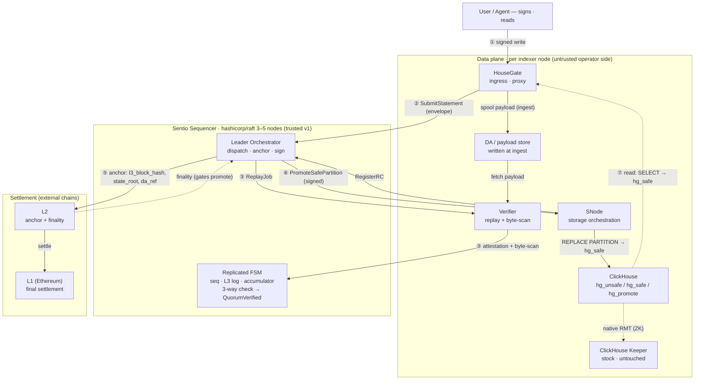

# Sentio Sequencer — Go Service Design

**Date:** 2026-06-30 **Status:** Proposed (v1) **Base:** [2026-06-22 storage integrity design](2026-06-22-storage-integrity-design.md) (the component called "Sentio Keeper" there is the **Sentio Sequencer** specified here) + [2026-06-10 multi-replica trust design](2026-06-10-multi-replica-trust-design.md) **Source of truth:** English version; regenerate the Chinese version from this file when changing semantics.

This document designs the **Sentio Sequencer**: the Go service that plays the §5.2 "Keeper" role of the storage-integrity design — sequencing signed statements, building L3 blocks, enforcing `statement_id` uniqueness, dispatching replay jobs, running the 2-of-3 three-way promotion check, issuing Keeper-signed promotion commands, and publishing safe-state manifests. It is implemented from scratch in Go on top of `hashicorp/raft`, not forked or ported from ClickHouse Keeper.

## 1. Positioning and the naming decision

The storage-integrity design uses the name "Keeper" for two unrelated things, and §12.1 of that document spends a paragraph disambiguating them. This design renames the integrity-layer authority to **Sequencer** to end that ambiguity permanently. The two roles are:

| | **ClickHouse Keeper** | **Sentio Sequencer** (this document) |
|---|---|---|
| What it is | ZooKeeper-compatible coordination service | L3-block sequencer + admission + attestation collector + safe-state publisher |
| Language / home | C++, in the ClickHouse monorepo (`programs/keeper`, `src/Coordination`) | Go, new, built on `hashicorp/raft` |
| Job | Coordinates `hg_unsafe` ReplicatedMergeTree state (part replication, merges) | Sequences signed statements, runs the 2-of-3 three-way promotion check, issues `REPLACE PARTITION` promotion commands, publishes `SafeSnapshotManifest` |
| Wire protocol | ZooKeeper wire protocol | Its own gRPC contract — **no ZooKeeper compatibility** |
| In this design | Stays as **stock, unmodified** ClickHouse Keeper | The component built here |

The Sequencer speaks no ZooKeeper protocol and never touches ReplicatedMergeTree coordination (that stays on a separate stock ClickHouse Keeper). It is therefore a brand-new replicated state machine, not a fork of clickhouse-keeper. Go is a natural fit: the only reusable piece of a clickhouse-keeper fork was the consensus layer, and Go has mature Raft libraries; the integrity-specific state machine is green-field regardless of language, and the Sequencer reuses this repo's existing Go `pkg/replay` verifier core in-process.

The earlier replay replicas (R1/R2 in the base spec's §9 diagrams) are called **Verifiers** here. This sets up the standard rollup decomposition the base spec is heading toward (§1: decentralization "changes who checks and who bears economic consequences"): a central **Sequencer** (ordering + admission + safe-state publication) and a **Verifier** network (the "checkers" that decentralize in P5+).

## 2. Goals and Non-Goals

Goals:

1. Sequence signed statements into a total order and build the L3 block stream, deterministically and replayably.
2. Enforce permanent `statement_id` uniqueness via an L3-derived accumulator, so the dedup fact survives decentralization.
3. Orchestrate replay-quorum verification and evaluate the §9 three-way promotion check (replay root + partition-commitment + byte-side LtHash) over logged, signed evidence, so any honest node re-derives the same promote/reject verdict from that evidence.
4. Issue Keeper-signed `PromoteSafePartition` commands and publish `SafeSnapshotManifest` safe watermarks.
5. Survive single-node and leader failure via a `hashicorp/raft` group, with all side effects idempotent across failover.
6. Reuse this repo's `pkg/replay`, `pkg/lthash`, and `pkg/auth` rather than reimplement verification, hashing, or signing.

Non-Goals (v1):

1. Executing user SQL on the hot path (the Sequencer dispatches replay; Verifiers execute).
2. Multi-Raft sharding by `keeper_shard` (forward-looking §10.6; v1 is a single Raft group).
3. Threshold/multisig authority signing, the challenge window, and on-chain DA (P5+; the structure leaves room for all three).
4. Mutation (`UPDATE`/`DELETE`) sequencing detail beyond the v1 INSERT path (P2; named only as an extensibility note in §9).
5. ZooKeeper-protocol compatibility or any interaction with ClickHouse Keeper.

## 3. Component and Process Architecture

### 3.1 Control plane vs data plane

The Sequencer is **control plane only** — it sequences, adjudicates, and signs. It never stores user parts, never executes user SQL on the hot path, and never talks to ClickHouse Keeper. All bytes live in the data plane.

**SNode is a role, not a separate daemon.** Throughout this document "SNode" denotes the storage-orchestration responsibilities — execute the source write, build `hg_promote`, run the Sequencer-signed `REPLACE PARTITION`, drop rejected parts, run `hg_unsafe` cleanup and safe-table audits, and carry the Sequencer-facing client (`RegisterRC`, subscribe promotions, ack). In deployment these are realized by the co-located Go process that already embeds the HouseGate proxy library (today's `sentio-node`); there is no separate SNode daemon. SNode and HouseGate are kept as distinct *roles* because they are different kinds of work — HouseGate is an on-path dataplane proxy (client↔ClickHouse native protocol) while the SNode role is off-path control-plane orchestration against ClickHouse storage — and they are best organized as distinct modules in that one process, not as more relay plugins. Both sit on the untrusted operator side (base-spec §4), so co-locating them changes nothing about the trust model: integrity comes from the Sequencer + the Verifier quorum regardless. The one boundary that must not be collapsed is operator-side (HouseGate/SNode/Verifier) vs the trusted, independent Sequencer control plane — folding the Sequencer into the operator process would remove the external arbiter §1 depends on.

```text
                         ┌─────────────────────────────────────────────┐
                         │   SENTIO SEQUENCER  (control plane, new, Go)  │
   submit envelope       │   hashicorp/raft group, 3 or 5 nodes          │
  ┌──────────────┐       │  ┌────────────┐  leader-only                  │
  │  HouseGate   │──gRPC─┼─▶│ gRPC server │──┐                           │
  │  (ingress)   │       │  └────────────┘  │                           │
  └──────────────┘       │  ┌──────────────▼───────────────┐            │
                         │  │  Orchestrator (leader only)   │  side-     │
   RegisterRC            │  │  dispatch ReplayJob, collect  │  effectful │
  ┌──────────────┐       │  │  attestations, poll parts,    │            │
  │ source SNode │──gRPC─┼─▶│  run 3-way check, sign+issue  │            │
  └──────────────┘       │  │  PromoteSafePartition, anchor │            │
                         │  └──────────────┬───────────────┘            │
   SubmitAttestation     │      proposes commands │ (raft.Apply)         │
  ┌──────────────┐       │  ┌──────────────▼───────────────┐            │
  │ Verifier     │──gRPC─┼─▶│  Replicated FSM (every node)  │  determin- │
  │ (per replica)│       │  │  seq · L3 log · id-accumulator│  istic     │
  └──────────────┘       │  │  · RC records · attestations  │            │
         ▲               │  │  · promotion_seq · manifests  │            │
         │ ReplayJob      │  └───────────────────────────────┘            │
         │ (stream)      └─────────────────────────────────────────────┘
         │                              │ Sequencer-signed PromoteSafePartition
   ┌─────┴───────────────── data plane (per indexer / replica) ──────────┐
   │  Verifier  ──embeds──▶ pkg/replay.Verifier + chexec + ed25519        │
   │  SNode  ──▶  ClickHouse  ── hg_unsafe (ReplicatedMergeTree) ─────────┤
   │                          ── hg_safe (MergeTree) ◀── REPLACE PARTITION │
   │                          ── hg_promote (shadow)                       │
   │  ClickHouse ◀──ZK──▶  stock ClickHouse Keeper  (separate, untouched)  │
   └───────────────────────────────────────────────────────────────────┘
```

### 3.2 The core pattern: deterministic FSM ↔ leader-only orchestrator

This is the single most important structural decision and is what makes a Raft-backed Go service correct.

- **The replicated FSM** runs identically on every Sequencer node: `Apply(command) → mutate derived state`. It performs no network I/O, reads no clock, and uses no randomness inside `Apply`. It owns `statement_seq`, the L3 block log, the `statement_id` accumulator and per-account high-water marks, `RCRecord`s, the recorded attestations, `promotion_seq`, published manifest references, the promoted-unsafe-part registry, and node membership. Snapshot/Restore provide log compaction. This maps 1:1 onto `hashicorp/raft`'s `FSM` interface.
- **The orchestrator** is the leader-only, side-effectful bridge to the outside world. It watches FSM state transitions, performs all I/O (dispatch `ReplayJob`s, gather signed attestations, poll SNode `system.parts`, wait for L2 finality, sign and send the promotion command), and feeds every result back into the log as a new proposed command. It never mutates FSM state directly.

**What "evaluated in the FSM" does and does not mean.** The three-way promotion predicate (base-spec §9) is *decided by the FSM, not ad-hoc by the leader* — but be precise about the scope of that claim. The FSM does **not** re-execute replay and does **not** re-run the byte-side ClickHouse scan; those are irreducible executor-side I/O performed by the Verifiers. What the FSM does is **deterministically evaluate the predicate over the recorded, signed evidence**: every node applies the same comparison to the same logged scalars (the signed `ExecutionReceipt`s, the source's `RCRecord`, the attested byte-side `part_row_lthash`s) and so reaches the same `Replaying → QuorumVerified` verdict. ed25519/secp256k1 signature verification is pure crypto and deterministic, so the *authenticity* of each piece of evidence is re-checkable on every node too. Trust in byte-level reality is therefore **attested** — ≥2 independent honest Verifiers signing matching values — not FSM-recomputed; "recomputability over voting" (base-spec §5.2) means a single honest Verifier's signed dissent is itself logged, non-repudiable evidence an auditor can act on, not that the FSM re-runs ClickHouse. The leader's only privileged act is *signing* the outbound promotion command (every node holds the authority key per §7/§8.1, but only the leader uses it); even that issuance is recorded as a command for audit. A captured leader cannot forge a promotion the logged evidence does not support, because every follower evaluates the same predicate over the same signed evidence.

**How the orchestrator learns of transitions.** `hashicorp/raft`'s `FSM.Apply` runs on every node and returns only to the local `ApplyFuture`; it provides no transition-event stream. So `Apply`, after mutating state, appends a transition event (the statement/partition plus its new `Status`) to a **leader-local, bounded, in-memory channel** that the orchestrator drains. On acquiring leadership the orchestrator first **scans current FSM state** to rebuild its work set (recovering events that predate its leadership), then consumes the channel. This notification path is leader-local and non-deterministic; it must never feed back into `Apply`'s state mutation (a follower simply discards these events).

### 3.3 Binary and package layout

The Sequencer is a separate deployable (it is clustered control-plane infrastructure, not a per-connection proxy), reusing this repo's libraries and conventions:

```text
cmd/sequencer/main.go            # new binary: flags, config load, signal ctx, gRPC + raft bootstrap
pkg/sequencer/
  fsm/         # deterministic state machine: command types, Apply/Snapshot/Restore, derived state
  accumulator/ # mountain-range Merkle accumulator + per-account high-water marks (pure Go, §6)
  orchestrator/# leader-only side-effectful loop (replay dispatch, 3-way check driver, promotion issuance)
  server/      # gRPC service impl + listenerRunner-style Serve(ctx, ln)
  raftnode/    # hashicorp/raft wiring: FSM adapter, boltdb log store, snapshot store, transport
reuse from pkg/replay:  ReplayJob · ReplayAttestation · ExecutionReceipt · SafeSnapshotManifest ·
                        PartitionCommitment · PartManifestEntry · Verifier · Seal/Validate
reuse elsewhere:        pkg/lthash · pkg/auth (secp256k1 sign + EthValidator recovery) ·
                        pkg/config · pkg/log · the listenerRunner/serverListener lifecycle
NEW Go types (sequencer-go proto + pkg/sequencer): StatementEnvelopeV2 · RCRecord · ThreeWayVerdict ·
                        PartitionState · AnchorRef · PartRef · OpenL3Block · SeqGapSet · StatementState
external (to be created): github.com/housegate/sequencer-go/gen/pb   # wire contract, mirrors rewriter-go/gen/pb
```

The reuse boundary matters and was easy to overstate: `pkg/replay` today has `ReplayJob`, `ReplayAttestation`, `ExecutionReceipt`, `SafeSnapshotManifest`, `PartitionCommitment`, `PartManifestEntry`, and the `Statement` *replay projection* — it has **no** `StatementEnvelopeV2` (the signed envelope), **no** `RCRecord` (result claim), and **no** delta type. Those are new types this design introduces in the `sequencer-go` proto and `pkg/sequencer`. The `sequencer-go` module does not exist yet; it is created in P0 (§12).

The **Verifier** is a co-located data-plane component (with each ClickHouse replica) that embeds `pkg/replay.Verifier` + `chexec` + `payloadexec.Ed25519Signer` and a **new byte-side scanner** (net-new code using `pkg/lthash` primitives — `chexec` only materializes scratch tables, it does not scan existing on-disk parts by `_part`). It is a Sequencer client, distinct from the Sequencer process; it may run standalone or in the same node process as the HouseGate/SNode role, since quorum independence is required across nodes (>= 2 non-source verifiers), not within a process. The Sequencer may embed `pkg/replay` too, but only for the optional challenge reference executor of base-spec §5.2.

The `cmd/sequencer` binary follows the same lifecycle conventions as the rest of the repo: it loads `pkg/config`, threads a signal-cancelled context, exposes its gRPC listener through the `listenerRunner`/`serverListener` pattern used by `pkg/replicationproxy` (`Serve(ctx, ln) error`, graceful shutdown on context cancel), and logs via `pkg/log` `FromContext`/`Infow`.

### 3.4 Internal interface seams (frozen for P0/P1)

The base spec (§5.2) asks this sub-design to freeze "the key interface signatures so P0/P1 work proceeds against a fixed target." The seams below are those frozen Go boundaries — signatures only, no implementations. They deliberately keep the three-way predicate **inside the FSM** (a pure function over committed `State`), not as an `Orchestrator` method: the Orchestrator is I/O-only and is never the promotion authority (§3.2).

```go
// pkg/sequencer/accumulator — statement_id uniqueness (§6)
type Accumulator interface {
    Root() []byte                                        // spent_ids_root
    Insert(c StatementCoord)                             // (account, client_seq); advances the root
    ProveNonMembership(c StatementCoord) (Proof, error)  // leader/prover side, OUTSIDE Apply
    VerifyNonMembership(c StatementCoord, p Proof) bool  // deterministic; the only form used IN Apply
}

// pkg/sequencer/fsm — the deterministic replicated state machine (a raft.FSM)
type FSM interface {
    Apply(l *raft.Log) any                               // deterministic; mutates State and evaluates the
    Snapshot() (raft.FSMSnapshot, error)                 // three-way predicate over committed evidence
    Restore(rc io.ReadCloser) error
}
// the three-way verdict is FSM-internal — func (s *State) threeWay(seq uint64) Verdict — NOT exported and
// NOT an Orchestrator call; every node recomputes the same verdict from logged signed evidence (§7.3).

// pkg/sequencer/orchestrator — leader-only, side-effectful; proposes commands, never mutates State
type Orchestrator interface {
    Run(ctx context.Context) error                       // drain the transition channel; per event do the I/O
}                                                        // (dispatch ReplayJob, collect attestations, poll
                                                         // parts, anchor, sign+send PromoteSafePartition) and
                                                         // propose the resulting Record* command

// signing — reuses pkg/auth (secp256k1) + payloadexec (ed25519); see the §8.1 table
type PromotionSigner    interface { Sign(cmd PromoteSafePartition) (sig []byte, err error) }            // secp256k1, leader-only use
type PromotionValidator interface { Authorize(cmd PromoteSafePartition, sig []byte) (addr string, ok bool) } // SNode side, EthValidator

// pkg/sequencer/raftnode — the consensus seam, so the raft library is swappable/testable
type ConsensusNode interface {
    Apply(cmd []byte, timeout time.Duration) raft.ApplyFuture
    VerifyLeader() error
    LeaderCh() <-chan bool
    Barrier(timeout time.Duration) error                 // read-index for linearizable SafeState reads
}

// sharding seam (§10.6) — the v1 implementation returns group 0 for everything
type Sharder interface {
    GroupForStatement(StatementEnvelopeV2) GroupID
    GroupForPartition(TablePartition) GroupID
    GroupForSchema(schemaSnapshotID string) GroupID
    Groups() []GroupID
}
```

### 3.5 End-to-end flow and the L1/L2/L3 layering

The three layers form a **commitment hierarchy**, and the Sequencer is the component that *authors* L3 and *anchors* it down to an external L2/L1 — it uses those chains, it does not run them. **L3** is Sentio's own hash-linked chain of signed write-statement blocks (authored by the Sequencer, §5.1); each L3 block's commitment is posted to an external **L2** (cheaper/faster finality), which settles to **L1** (Ethereum). Commitments flow *down* (L3 → L2 → L1); finality is inherited *up* (L1 → L2 → the anchored L3 block), and that finality gates promotion to `safe`.



End-to-end flow of one write:

1. **① enter L3** — User/Agent signs a write → HouseGate. HouseGate validates the signature and **spools the payload to the DA / payload store at ingest** (base-spec §5.1).
2. **② sequence** — HouseGate submits `StatementEnvelopeV2` to the Sequencer; the FSM assigns `statement_seq` and seals it into an L3 block. The source SNode optimistically writes `hg_unsafe` and registers its `RCRecord`.
3. **③ verify** — the Orchestrator dispatches `ReplayJob` to Verifiers; each Verifier **fetches the payload from DA**, replays via ClickHouse (`chexec`) and byte-side-scans the candidate parts, then returns a signed attestation.
4. **④ adjudicate** — the FSM evaluates the three-way check `(replay-root ∧ partition-commitment ∧ byte-side)` over the logged signed evidence → `QuorumVerified`.
5. **⑤ anchor + finality** — the Orchestrator posts the commitment `(l3_block_hash, state_root, da_ref)` to L2; L2 settles to L1; finality flows back and **gates promotion**.
6. **⑥ promote to safe** — after finality the leader signs `PromoteSafePartition` (secp256k1); SNode runs `REPLACE PARTITION` into `hg_safe`.
7. **⑦ read** — `SELECT` hits `hg_safe` directly via HouseGate and **never enters the Sequencer**.

**Where DA is written vs referenced (a timing point worth pinning).** The payload is written to DA at **ingest** (step 1) and read back at **verify** (step 3); the anchor at step 5 only posts a **commitment + `da_ref` pointer** to L2 — it is *not* the moment data is written to DA. Data must be available on DA before the commitment that references it, so a verifier/challenger following the on-chain anchor can always fetch it. (v1 uses a trusted payload store and delivers envelopes to Verifiers via `ReplayJob`, so this ordering only becomes load-bearing once decentralized challenge arrives in P5+.)

**Positioning.** In rollup terms the Sequencer is the *ordering authority*; in v1 it additionally wears the *verifier-orchestration* (replay quorum + three-way check) and *settlement* (safe-state publication) hats, which the P5+ decomposition splits into the Sequencer vs the Verifier network (§1). It is optimistic-rollup-flavored (optimistic source execution + quorum replay + a P5+ challenge window), not validity-proof-based.

## 4. The Replicated State Machine

The Sequencer's source of truth is one Raft log and the derived state it feeds. This section defines the command alphabet, the FSM state, the `Apply`/`Snapshot`/`Restore` mapping, the determinism rules, and the lifecycle mapping.

### 4.1 The Raft log = the command alphabet

Each Raft log entry is a command (a proposal). Every "when to do X" timing decision lives in the leader's orchestrator; once decided, it lands as a command at a fixed log index, and the FSM performs only the deterministic state mutation.

| Command | Proposed by | Deterministic effect in `Apply` |
|---|---|---|
| `SubmitStatement` | leader (after HouseGate ingress) | Deterministic admission: verify the envelope signature, **verify** the carried `statement_id` non-membership proof against the accumulator (the proof is supplied with the command, not generated in `Apply`), check schema/settings on the allowlist, check `statement_kind` admitted → assign `statement_seq` (monotonic ++), advance the accumulator + the account's high-water mark, record the statement in the open block buffer |
| `SealL3Block` | leader (count/bytes/age trigger) | Seal the open buffer into an L3 block: compute `prev_l3_hash`, anchor the `statement_id → statement_seq` bindings, snapshot `spent_ids_root_after`, open a new block |
| `RegisterRC` | leader (on source SNode `RCRecord`) | Validate linkage (seq exists, from the assigned source), record the `RCRecord` (candidate parts with source-claimed `part_row_lthash`, `source_claim_root`, and the source's claimed per-partition new-part LtHash sum) |
| `RecordAttestation` | leader (on Verifier attestation) | Verify the verifier's ed25519 signature; recompute and check `receipt_hash` over the receipt verbatim; record the `ExecutionReceipt`; **recompute check 1 in the FSM** as `receipt.ComputedStateRoot == RCRecord.SourceClaimRoot` (the verifier's `MatchSourceRoot` flag is advisory only); re-evaluate the three-way predicate → promote to `QuorumVerified` on success |
| `RecordByteSideScan` | leader (on Verifier byte-side scan) | Record the verifier's attested `part_row_lthash` per scanned part; the FSM **compares** this recorded scalar against `RCRecord.candidate_parts` for check 3 (it does not re-run the scan) |
| `RecordAnchorFinality` | leader (after L2/L1 anchoring is final and `last_mergeable` is reached) | Record `anchor_ref`; `QuorumVerified` + finality + `last_mergeable` → promotable |
| `RecordPromotionIssued` | leader (after signing `PromoteSafePartition`) | Record `promotion_seq`, `base_safe_snapshot_id`, `base_partition_root`, and the leader signature for audit |
| `PublishSafeSnapshot` | leader | Record the new `SafeSnapshotManifest` (validated via `pkg/replay` `Seal`/`Validate`), advance the safe watermark |
| `ScheduleUnsafeCleanup` / `RecordCleanupAck` | leader | Mark promoted `hg_unsafe` parts for cleanup and record SNode cleanup acks; maintains the promoted-unsafe-part registry that `unsafe_latest` reads (§8.5) |
| `OpenChallenge` / `ResolveChallenge` | leader (mismatch / timeout) | Mark challenge; on adjudication drive to `Safe` or `Rejected` |
| `RegisterNode` / `MarkActive` / `EvictNode` | leader | Maintain Verifier/replica membership and the Active read set (Active only after snapshot sync) |

The Sequencer cluster's own membership changes (adding/removing Raft nodes) use `hashicorp/raft`'s native configuration-change mechanism; that is a separate concern from the business commands above and must not be conflated with them.

### 4.2 FSM derived state

```go
type State struct {
    // sequencing
    NextStatementSeq uint64
    OpenBlock        *OpenL3Block            // statements buffered since the last seal
    Blocks           []L3BlockHeader         // sealed block headers (bodies may live in the snapshot)

    // dedup (§6 accumulator, pure Go)
    Accumulator      *accumulator.MountainRange   // spent_ids_root authenticator
    HiSeq            map[Account]uint64           // per-account high-water mark
    Gaps             map[Account]*SeqGapSet       // out-of-order client_seq <= hi fallback set

    // per-statement lifecycle
    Statements       map[uint64]*StatementState   // key = statement_seq
    ByStatementID    map[StatementID]uint64       // route-A late-binding index

    // promotion / safe state
    PromotionSeq     uint64
    Partitions       map[TablePartition]*PartitionState
    SafeWatermark    SnapshotID
    Manifests        map[SnapshotID]ManifestRef   // by snapshot id and by SafeBlockSeq
    PromotedUnsafe   map[TablePartition]map[PartCommitment]bool  // registry unsafe_latest filters against

    // membership
    Nodes            map[NodeID]*NodeInfo         // Active / Syncing, role, ed25519 pubkey
}

type PartitionState struct {
    BaseSafeSnapshotID SnapshotID
    BasePartitionRoot  []byte   // base partition's raw 2048-byte LtHash accumulator (for check 2, §7.3)
    PublishSeq         uint64   // last promotion_seq published into this partition
}

type StatementState struct {
    Env            StatementEnvelopeV2          // NEW type (sequencer-go), carries user_jws + non-membership proof
    Seq            uint64
    Status         Status                       // §4.4
    RC             *RCRecord                    // NEW type: candidate parts + source_claim_root + claimed per-partition new-part lthash
    Attestations   map[ReplicaID]ReplayAttestation   // reused pkg/replay type; computed_state_root lives in .Receipt
    ByteSideLtHash map[ReplicaID]map[PartName][]byte
    Verdict        *ThreeWayVerdict             // NEW: recomputable three-way result
    AnchorRef      *AnchorRef                   // NEW
}
```

Reuse honesty: `ReplayJob`, `ReplayAttestation`, `ExecutionReceipt`, `SafeSnapshotManifest`, `PartitionCommitment`, `PartManifestEntry` are reused verbatim from `pkg/replay`, along with `Seal`/`Validate`. `StatementEnvelopeV2`, `RCRecord`, `ThreeWayVerdict`, `PartitionState`, `AnchorRef`, `PartRef`, `OpenL3Block`, and `SeqGapSet` are **new** types defined in the `sequencer-go` proto and `pkg/sequencer`. The accumulator is the only entirely new pure-Go algorithm component (§6).

Note `PartitionState.BasePartitionRoot` holds the base partition's **raw 2048-byte LtHash accumulator** (the same raw form `SafeSnapshotManifest` stores per base-spec §8), because check 2 (§7.3) needs to add the source's claimed new-part LtHash to the base and compare against the verifier's absolute post-state commitment.

### 4.3 Apply / Snapshot / Restore and the determinism rules

The FSM implements `hashicorp/raft`'s `raft.FSM`:

- `Apply(*raft.Log) interface{}` — decode the command, switch, mutate `State`, return a result (e.g. the assigned `statement_seq`) to the leader's gRPC handler via the `ApplyFuture`.
- `Snapshot() (raft.FSMSnapshot, error)` — serialize the whole `State`. The accumulator is a mountain range storing only its peaks, so it is small and compressible; the `pkg/lthash` 2048-byte accumulators serialize verbatim via `Bytes()` so deltas stay additive.
- `Restore(io.ReadCloser)` — deserialize and rebuild `State`.

Determinism red lines (violating any one forks the replicas):

1. `Apply` must not call `time.Now()`, use `rand`, perform network I/O, or depend on map iteration order (sort keys before hashing — reuse `pkg/replay` canonicalization). Any selection over membership (source/verifier picking, §5.4/§7.1) reads the committed Active subset of `State.Nodes` as of the applying log entry, sorted by `NodeID`.
2. All root/manifest folds use integers (`pkg/lthash` uses integer lanes, no floating-point ambiguity). `Apply` recomputes `receipt_hash` over the received receipt **verbatim** (no slice reordering before hashing) and verifies the signature against that.
3. Every timing decision ("when to seal a block / anchor / sign a promotion") lives in the orchestrator and enters the log as an explicit command at a fixed index.
4. `Apply` only **verifies** proofs (e.g. the `statement_id` non-membership proof carried in `SubmitStatement`); it never **generates** them. Proof generation needs the full element set and happens on the leader/prover side outside `Apply` (§6.4).

**One canonicalization profile across the integrity layer.** Every root/commitment the Sequencer computes must go through `pkg/replay`'s canonicalization (`canonicalDigest`) with a new domain tag per commitment kind — never a second, parallel hash profile — because the entire safety argument rests on independent nodes deriving *identical* roots from the same evidence. `canonicalDigest` is currently unexported (`pkg/replay/hash.go`); **P0 exports it as `replay.CanonicalDigest`** (or adds a typed helper) so the Sequencer FSM, the Verifiers, and the §13/base-spec §13 audit all share one profile by construction rather than by convention.

### 4.4 Command → lifecycle mapping

Each statement's `Status` follows the base-spec §11 state machine. The mapping below lists the command that drives each *durable* transition; `Accepted` and `UnsafeExecuting` are transient in base-spec §11 and are not separately command-driven in the FSM (the source's optimistic write is a data-plane event the FSM observes only when `RegisterRC` lands):

```text
SubmitStatement                          -> Sequenced            (base-spec Accepted->Sequenced collapsed)
RegisterRC                               -> UnsafeRegistered     (base-spec UnsafeExecuting elided; data-plane event)
(first ReplayJob dispatched, leader marks)-> Replaying
RecordAttestation x N satisfying 3-way    -> QuorumVerified
RecordAnchorFinality (finality + last_mergeable) -> FinalityWait -> (promotable)
RecordPromotionIssued + SNode ack         -> Safe
OpenChallenge                            -> ChallengeReplay -> Safe | Rejected
Rejected                                 -> Dropped
```

The `QuorumVerified` transition is computed deterministically by the FSM over logged, signed evidence — three-way = quorum-reproduced root AND per-partition commitment AND byte-side `part_row_lthash` (with the scoping precision of §3.2) — not decided by the leader. The promotability gate is `QuorumVerified AND L2/L1 finality AND last_mergeable` (base-spec §11), all recorded via `RecordAnchorFinality`.

## 5. Sequencing and L3 Blocks

### 5.1 Block sealing: non-deterministic trigger, deterministic seal

The open block buffer absorbs admitted statements. The *trigger* to seal lives in the orchestrator (max statements, max bytes, or max age — whichever first). On trigger the leader proposes `SealL3Block`, and the FSM deterministically seals the current buffer:

```go
type L3BlockHeader struct {
    L3BlockSeq         uint64
    PrevL3Hash         Hash        // = H(previous sealed header) -> hash chain
    StatementSeqStart  uint64
    StatementCount     uint32
    SchemaSnapshotID   string      // one schema per block (§5.3)
    ExecutorProfileID  string      // block-level pinned executor profile
    PrevSafeSnapshotID SnapshotID  // safe watermark at seal time
    PrevStateRoot      Hash
    SpentIDsRootAfter  Hash        // accumulator root at seal time (base-spec §7)
    L2AnchorRef        *AnchorRef  // empty at seal; back-filled after on-chain finality (§5.2)
}
```

A block may not contain schema changes (v1 block-level schema). If a `SubmitStatement` is schema-changing DDL, the orchestrator seals the current block first, gives the DDL its own block, and triggers the schema-transition lane (§5.3).

### 5.2 Hash chain and the chain commitment

`PrevL3Hash` chains all block headers into a tamper-evident hash chain that any honest node reconstructs by replaying the L3 stream. `L2AnchorRef` is back-filled: sealing produces seq/hashes/roots only; on-chain anchoring happens after `QuorumVerified` + finality, and `RecordAnchorFinality` writes the anchor reference back into the header.

**L2 calldata policy (resolves base-spec §15 Q5 for v1).** v1 posts **commitment only**: L2 calldata carries `l3_block_hash` + `state_root` and nothing else; payload bytes live in a retention-guaranteed payload store (the base-spec §15 Q6 problem, independent of anchoring). The trade is data availability: with commitment-only, only a party that retained a copy can replay/challenge — acceptable in v1 where the Sequencer is trusted (base-spec §4) and challenges are an after-the-fact audit, not the runtime promote mechanism. The `AnchorRef` structure reserves an optional DA-reference field so the decentralized phase can switch to "commitment + DA reference" (Celestia/EigenDA/blob) as a configuration change, not a protocol change.

### 5.3 schema_snapshot_id scoping

v1 is block-level: one `schema_snapshot_id` per block, no schema changes inside a block, and the executor replays the whole block under one schema. Schema-changing DDL uses a separate schema-transition lane: the DDL takes its own block — **labeled with the OLD (pre-transition) `schema_snapshot_id`**, since the DDL block is the *event that mints* the new id for subsequent blocks, and Verifiers replay the DDL block under that old labeled schema. The Sequencer installs a schema barrier (stops admitting new writes under the old schema, drains or rejects outstanding old-schema unsafe writes), the DDL mints a new `schema_snapshot_id` + `schema_root`, SNode applies the DDL to all protocol surfaces (`hg_safe`/`hg_unsafe`/`hg_promote`/scratch templates) and reports the observed `schema_hash`, and normal writes resume only after the local schema matches the anchored root. Verifiers derive the schema exclusively from the anchored DDL/settings log, not from source-side `system.columns`. Statement-level scoping is P4.

### 5.4 Source selection (deterministic)

Base-spec §5.2 requires the Sequencer to select the source node for optimistic execution. This must be deterministic, or Sequencer nodes disagree on who the source is. The FSM selects `source_node` at `SubmitStatement` time by a deterministic function over the **committed Active-writer subset of `State.Nodes`** (sorted by `NodeID` for canonical order), e.g. `hash(statement_id) mod len(active_writers)` or a deterministic round-robin — never the live, health-dependent writable set (that would violate §4.3 red line 1). It records `source_node` in `StatementState`; the orchestrator notifies that source to execute. Membership-changing commands (`MarkActive`/`EvictNode`) are ordered in the log relative to `SubmitStatement`, so all nodes see the same Active set at that index.

### 5.5 Execution timing: route A only, with late binding

v1 implements **route A / optimistic-forward only** (the base-spec §16 default; managed/sequencing-before-write is out of v1 scope). The source writes `hg_unsafe` first (write-speed unsafe ack), using `statement_id` for dedup and part attribution; the envelope is submitted to the Sequencer in parallel, and the Sequencer later binds `statement_id → statement_seq`. Promotion still waits for sequencing, replay, finality, and the three-way check; optimistic execution buys only an earlier *unsafe* ack, never an earlier *safe* ack.

The engineering consequence is **late binding**: a `RegisterRC` can arrive carrying a `statement_id` before its `statement_seq` exists. The FSM therefore keeps the `ByStatementID` index alongside the primary `Statements[seq]` map; `RegisterRC` parks the claim under `statement_id`, and `SubmitStatement` completes the binding once it assigns the seq.

### 5.6 ReplayJob construction

After sealing, the orchestrator assembles a `pkg/replay.ReplayJob` from the L3 block + `RCRecord` + current safe state (base-spec §7) and dispatches it to the selected Verifiers. The reused field names are `BlockSeq`, `PrevSafeSnapshotID`, `PrevStateRoot`, `SchemaSnapshotID`, `ExecutorProfileID`, `SourceClaimRoot` (json `source_claim_root`), and `Statements []Statement` — this design uses those names exactly, since the type is reused verbatim. The `Statement` carried is `pkg/replay`'s replay projection, not the full signed `StatementEnvelopeV2` (which stays Sequencer-side).

## 6. statement_id Uniqueness Accumulator

### 6.1 Why it is load-bearing

`_hg_row_id = BLAKE3(... || statement_id || global_row_ordinal)`. A reused `statement_id` resurrects the duplicate-row LtHash cancellation attack (the 2^16 same-lane cancellation blocked at row level in base-spec §8). So `statement_id` global uniqueness is the foundation of the §8 anti-cancellation argument. The base spec further requires enforcement via an L3-derived accumulator rather than Sequencer memory, so decentralizing the authority does not change the dedup fact.

**Dedup identity.** The uniqueness key is `(client_account, client_seq)`. `statement_id = client_account || client_seq || client_nonce` and the `client_nonce` contributes entropy to `_hg_row_id` but is **not** part of the uniqueness key. A reused `client_seq` for an account is rejected regardless of nonce, with a distinct error code so the SDK surfaces it (a client bug) rather than silently dropping the losing payload. Equivalently: the accumulator commits the spent `(account, client_seq)` coordinates (one statement per coordinate).

### 6.2 Required properties and construction

The FSM accumulator must be append-only, permanent, per-account-global in scope (a coordinate once in `spent_ids_root` is never removed); have no trusted setup; be deterministically replayable from the L3 stream; commit `spent_ids_root_after` in each L3 block; and support O(log n) non-membership proofs.

Construction (adopting base-spec §7 / 2026-06-10 Appendix B.2): the recommended P0 construction is a **mountain-range Merkle accumulator** whose non-membership rests on a predecessor/low-leaf argument (the sorted/indexed-Merkle family — append-only, O(log n), no trusted setup). RSA/pairing accumulators give O(1) proofs but require trusted setup / modulus governance and are rejected for v1; sparse Merkle is acceptable but carries larger constants. The byte-exact construction plus test vectors is the base-spec §14 **P0 freeze deliverable**; this document specifies the required properties, the recommended construction, and the FSM landing, leaving the byte encoding to the P0 spike.

### 6.3 FSM acceptance algorithm

Most traffic never reaches an accumulator proof; the per-account high-water mark makes the common path O(1). The non-membership proof, when needed, is computed by the **leader** (outside `Apply`, from prover-side storage) and **carried in the `SubmitStatement` command**; `Apply` only verifies it against the in-FSM root (§4.3 red line 4):

```text
Accept(statement_id = (account, client_seq, nonce)):
  hi := HiSeq[account]                      // new account defaults to 0
  if client_seq > hi:                       // fast path: strictly increasing => definitely new
      mark [hi+1, client_seq-1] as Gaps[account]   // skipped seqs become open gaps
      HiSeq[account] = client_seq
      accumulator.Insert((account, client_seq))     // advance spent_ids_root
      assignSeq + bind; return Accepted
  else:                                     // client_seq <= hi: out-of-order or replay
      if client_seq in Gaps[account]:        // a legitimately-skipped earlier seq arriving late
          verify the carried non-membership proof against the current spent_ids_root
          accumulator.Insert((account, client_seq)); Gaps[account].remove(client_seq)
          assignSeq + bind; return Accepted
      else:
          reject as duplicate (with the distinct reused-client_seq error)
```

Normal increasing traffic is O(1) with no proof; only out-of-order gap-fill (`client_seq <= hi`) requires the carried non-membership proof, which is the rare path.

### 6.4 State size and sharding

The FSM dedup state is one integer `HiSeq` per account plus a sparse `Gaps` set, plus the accumulator's compact authenticator (root + frontier peaks, O(log n)). The full element set, needed only to *generate* proofs, lives on the leader/prover side or in external storage; *verifying* a proof needs only the root (which is why `Apply` can verify without holding the full set). The accumulator shards cleanly by `client_account`, which maps directly onto the base-spec §15 Q15 sharding path. The whole structure is replayable from the L3 stream, so decentralization does not change the dedup fact.

## 7. Replay-Quorum Orchestration and the Three-Way Promotion Check

This is the safety core. A self-consistent root is not sufficient for promotion.

### 7.1 Orchestration (leader, with I/O)

```text
block sealed + RC registered  ->  (1) FSM deterministically selects the verifier set (committed Active set,
                                      sorted by NodeID, excluding source_node)
                                  (2) orchestrator dispatches ReplayJob to each verifier (gRPC stream)
                                  (3) after the replay attestation, dispatches a byte-side scan request
                                  (4) proposes each verifier's two results as Record* commands into Raft
```

Verifier selection is deterministic (computed in the FSM like source selection, over the committed Active set excluding `source_node`) so all Sequencer nodes agree on who was asked, and so the choice is auditable; the orchestrator only performs the dispatch I/O. It is a two-round flow (matching base-spec §9 timing): replay attestation first, then the byte-side scan. The two rounds can be pipelined but are kept as distinct command kinds for auditability.

### 7.2 What a Verifier does (data-plane process, reuses `pkg/replay`)

Each Verifier calls `pkg/replay.Verifier.Verify(ctx, job)`, which runs the `chexec` executor (real ClickHouse materialized read-back), produces an `ExecutionReceipt` (carrying `ComputedStateRoot`, absolute `PartitionCommitmentsAfter []PartitionCommitment`, and `AffectedParts []PartManifestEntry` with per-part `PartRowLtHash`), hashes the receipt, and returns a fully-signed `ReplayAttestation{ReplicaID, Receipt, ReceiptHash, Signature, MatchSourceRoot}` — the library owns the injected ed25519 `Signer`, so the Verifier does not hand-build or separately sign the attestation. Note `ComputedStateRoot` lives in `att.Receipt.ComputedStateRoot`, not at the attestation top level.

For the byte-side scan (base-spec §9 check 3), the Verifier's **new byte-side scanner** runs `SELECT ... WHERE _part IN (...)` over the candidate parts it actually fetched, recomputes `part_row_lthash` from the real on-disk bytes using `pkg/lthash`, and reports it. The Sequencer FSM verifies the verifier's ed25519 signature (public key from `RegisterNode`) and recomputes `receipt_hash` over the receipt verbatim to confirm the receipt content is covered by the signature.

### 7.3 The three-way predicate (in the FSM, over recorded signed evidence)

A block reaches `QuorumVerified` only when all three hold (any one failing means no promotion). The FSM evaluates each over logged scalars with the §3.2 scoping (it compares signed evidence; it does not re-execute replay or re-scan bytes):

| Check | Content | What it binds |
|---|---|---|
| **1. Replay** | >= 2 independent verifiers, each with `att.Receipt.ComputedStateRoot == RCRecord.SourceClaimRoot` — **recomputed by the FSM** from the logged receipt and RC, not taken from the verifier's advisory `MatchSourceRoot` flag (the source's own self-attestation does not count) | Proves correct execution of the signed payload yields this root |
| **2. Partition-commitment** | For each touched partition, absolute-against-absolute: `BasePartitionRoot (raw LtHash accumulator from the base manifest) + Sum(source-claimed new-part part_row_lthash in RCRecord) == verifier's PartitionCommitmentsAfter[p]` (LtHash additivity makes this exact) | **root -> the source's per-part claims**: a colluding source controls both its disk bytes and its own part claims, but to reconcile it must report per-part hashes that sum to the verifier-computed absolute commitment — infeasible without an LtHash collision, which per-row `_hg_row_id` uniqueness rules out. Note the receipt carries *absolute* `PartitionCommitmentsAfter`, not deltas, so the check is phrased additively (`base + claimed == post`), the same form base-spec §10 uses for mutations |
| **3. Byte-side part-lthash** | For each verifier in the quorum: its attested `part_row_lthash` (recorded via `RecordByteSideScan`) == the value in `RCRecord.candidate_parts` | **the source's claims -> the actual disk bytes**: catches a source that reports `LtHash(bytes_evil)` but stores different bytes on disk. This is *attested* reality — the FSM compares the signed recorded scalar; the scan itself is verifier I/O, and trust comes from >= 2 honest verifiers signing matching values (§3.2) |

Checks 2 and 3 are complementary and both load-bearing. Promotion is the chain `post-commitment —(2)→ Sum source per-part claims —(3)→ actual disk bytes`. With only check 3, a source that truthfully reports `LtHash(bytes_evil)` passes — only check 2 stops it. With only check 2, a source that reports a correct hash but stores divergent bytes passes — only check 3 stops it. With only check 1, `R == R` proves nothing.

**Completeness / closure (defeats hidden extra parts and slipped merges).** Checks 2 and 3 are scoped to the parts the statement is *supposed* to touch, so they must be paired with a closure check or a source could write extra evil parts into a partition the payload does not touch and omit them from `RCRecord`. The FSM enforces closure two ways: (a) the signed `PromoteSafePartition` command lists *exactly* the verified `CandidateParts`, and SNode builds `hg_promote` from `base + those only` (§8.2), so a non-listed part cannot enter `hg_safe`; and (b) after `REPLACE PARTITION`, the post-promotion `partition_commitment` SNode reports must equal `BasePartitionRoot + Sum(verified new-part part_row_lthash)`. Any part not accounted for by a verified contribution — an extra evil part, or a part produced by a merge that slipped past STOP MERGES (§8.4) — breaks this equality and blocks promotion, independent of whether it appears in `candidate_parts`.

### 7.4 Quorum parameter and member keys

v1 freezes the quorum at >= 2 of 3 **independent** replay replicas, where the three replicas are distinct from the source (the source's self-attestation does not count, base-spec §9). A deployment therefore needs **>= 4 participating nodes** — one source plus at least three verifiers — so that excluding the source still leaves three verifiers and the 2-of-3 quorum tolerates one malicious or faulty verifier. With a pool of exactly three including the source, only two verifiers remain (2-of-2, zero fault tolerance), so v1 requires the Active verifier pool (excluding the source) to be >= 3. The v1 safety assumption is an honest majority among the non-source verifier quorum. Each verifier's ed25519 public key enters FSM state at `RegisterNode`; only `MarkActive` (snapshot-synced) replicas enter the verifier selection pool. (Open Question 3 confirms pool sizing before the P1 freeze.)

### 7.5 Challenge / timeout

The orchestrator detects a timeout, or a verifier reports a mismatch, and proposes `OpenChallenge` → `ChallengeReplay`. The challenge uses the **same three-way predicate** (base-spec §11): a challenger's independent replay reproduces `SourceClaimRoot` AND the partition-commitment check holds AND the byte-side check holds → the claim passes (`Safe`); any one failing → `Rejected` → unsafe parts dropped. v1's trusted Sequencer adjudicates immediately with no challenge window; the challenge window is the P5+ decentralized safety mechanism (base-spec §11 phased definition). This protocol-semantics rule is in v1 scope; the economic challenge/slashing parameters are deferred (base-spec §2 non-goal).

## 8. Promotion Command Issuance, hg_promote, and the Manifest

The Sequencer issues commands, serializes them, and records safe state; the actual ClickHouse SQL runs on the SNode.

### 8.1 Trigger and command content

```text
QuorumVerified + RecordAnchorFinality (finality + last_mergeable)
   ->  FSM marks (table, partition) promotable, assigns a monotonic promotion_seq,
       deterministically computes the command content
   ->  leader signs PromoteSafePartition with secp256k1
   ->  sends to every attesting SNode (gRPC)
```

```go
type PromoteSafePartition struct {
    TableID            string
    PartitionID        string
    PromotionSeq       uint64       // monotonic, orders promotions per (table, partition)
    BaseSafeSnapshotID SnapshotID   // the safe snapshot this promotion is based on
    BasePartitionRoot  Hash         // base partition root (for the CAS check)
    CandidateParts     []PartRef    // exactly the candidate parts that passed the three-way check (by content commitment)
    // the leader's secp256k1 signature wraps all of the above
}
```

The signature is the leader's only privileged act; the issuance is recorded via `RecordPromotionIssued` for audit. The authority secp256k1 key is **shared across all Raft nodes** (provisioned identically) so any elected leader can sign after failover; leader-only *use* is enforced by `VerifyLeader()` (§10.2). The SNode verifies the signature by recovering the secp256k1 address and checking it against the authority allowlist (the `pkg/auth` `EthValidator` pattern), which is why the authority key is secp256k1 (address-recoverable) rather than ed25519. The promotion-signing payload + purpose claim is new work (§12 P0); `pkg/auth`'s existing `SignToken`/`SignPeerLogin` are SQL-/peer-login-bound and not reused verbatim, but the secp256k1 key + `EthValidator` recovery are.

The two-signature scheme at a glance (the `PromotionSigner` / `PromotionValidator` seams of §3.4):

| Signed object | Scheme | Identity | Reused type | Why this scheme |
|---|---|---|---|---|
| `ExecutionReceipt` → `ReplayAttestation` | ed25519 | per-Verifier (a distinct key each) | `payloadexec.Ed25519Signer` (satisfies `replay.Signer`) | a colluding verifier quorum is the threat, so verifiers must not share a key |
| `PromoteSafePartition` / `UnsafeCleanup` | secp256k1 | single Sequencer authority, key shared across Raft nodes, leader-only use | `pkg/auth.RelaySigner` to sign + `EthValidator` to recover | one command-issuing trust root; SNodes already verify identities with an address allowlist |

### 8.2 SNode execution (mechanical, base-spec §12.2)

Each attesting replica locally and atomically performs:

```sql
-- 1) bring the CAS-base safe partition in whole (cross-table hardlink, metadata-only)
ALTER TABLE hg_promote.Tbl_<id> ATTACH PARTITION <id> FROM hg_safe.Tbl_<id>;
-- 2) per verified candidate part: hardlink from hg_unsafe into hg_promote's detached/, then attach
ALTER TABLE hg_promote.Tbl_<id> ATTACH PART '<part_name>';
-- 3) atomically replace the destination partition
ALTER TABLE hg_safe.Tbl_<id> REPLACE PARTITION <id> FROM hg_promote.Tbl_<id>;
```

This is metadata-only hardlink work, O(candidate + prior parts), close-to-O(1) — but only when the three tables share one storage policy on the same disk and identical structure; otherwise ClickHouse falls back to a full byte copy. `hg_promote` is a copy-on-write commit buffer holding exactly the base partition plus this round's `CandidateParts` (and nothing else — that exact-set rule is the closure check of §7.3); it must never copy the whole `hg_unsafe` partition (which may hold unrelated unverified parts). `REPLACE PARTITION` copies in rather than deleting from `hg_unsafe`, so the Sequencer also records the candidates as safe and schedules `hg_unsafe` cleanup (§8.5); until cleanup completes, `unsafe_latest` filters out the promoted unsafe parts via the promoted-unsafe-part registry. Part names change after attach/replace, so SNode re-reads `system.parts` and records the safe part mapping by `(table_id, partition_id, content commitment, part_phys_hash)`, never assuming the original `hg_unsafe` part names survived.

### 8.3 Two-layer serialization and exactly-once promotion

Because `REPLACE PARTITION` replaces a whole partition atomically, two statements that both touch partition P and each base their shadow on a snapshot taken before the other's replace would cause the second to silently overwrite the first's just-promoted rows (a lost update, not an append). Two layers prevent this:

1. **Sequencer level**: the FSM serializes promotions per `(table, partition_id)`, with each promotion's base being the CAS-verified safe snapshot at *publish time* (not at statement-execution time); it may batch several promotable statements into one `REPLACE PARTITION`.
2. **SNode level**: before building or publishing `hg_promote`, SNode takes a local `(table, partition_id)` publish lock and CAS-checks that the active `hg_safe` partition root still equals the command's `BasePartitionRoot`; if another promotion / mutation / safe-merge advanced it, SNode drops the shadow and rebuilds from the new base or waits for the Sequencer to rebase. The publish lock serializes only partition publication, not ordinary `SELECT` reads.

**Exactly-once across restarts and idle partitions.** SNode additionally persists the last-applied `promotion_seq` per `(table, partition_id)` durably and rejects any promotion whose `promotion_seq <= that watermark`, independent of the base-CAS. This makes replay rejection hold even when the base has not advanced (an idle partition) and across SNode restarts, so a stale promotion re-sent by an old/captured leader is rejected even if nothing else moved. This base-CAS + monotonic-seq mechanism is also the failover/partition idempotency guard (§10.3).

### 8.4 The hg_unsafe STOP MERGES invariant

`hg_unsafe` runs `SYSTEM STOP MERGES` for the table's lifetime and pins `max_bytes_to_merge_at_max_space_in_pool = 0` in the anchored DDL (declarative, survives restart); HouseGate re-asserts `SYSTEM STOP MERGES` on startup. This makes the part boundary always equal the statement boundary, so the candidate-part set is unambiguous. A merge that slips through is not a safety hole, and the guarantee is now FSM-checked rather than merely operational: the merged part is not in the command's `CandidateParts` and its `part_row_lthash` is not a verified contribution, so the §7.3 closure equality (`post == base + Sum verified`) fails and promotion is blocked.

### 8.5 SafeSnapshotManifest publishing and unsafe cleanup

Once promotion acks are in, the FSM advances the partition's and the global `SafeWatermark`; the leader assembles the new `pkg/replay.SafeSnapshotManifest` (`SnapshotID / ParentSnapshotID / SafeBlockSeq / StateRoot / SchemaSnapshotID / SchemaRoot / ExecutorProfileID / DataRoot / ManifestRoot / Tables[]TableManifest`, with `PartitionCommitment` and `PartManifestEntry` records inside), proposes `PublishSafeSnapshot`, and the FSM validates it via `pkg/replay` `Seal`/`Validate` before recording it. The manifest is content-addressed and canonicalized (table/partition/part order normalized before hashing) so independent verifiers derive the same roots. This is the safe watermark; `as_of_safe(block)` time-travel selects the manifest by `SafeBlockSeq` (no per-row block-seq column needed, base-spec §6).

Cleanup of promoted `hg_unsafe` parts is explicit: `ScheduleUnsafeCleanup` records (in the `PromotedUnsafe` registry) which parts are promoted-but-not-yet-cleaned and dispatches the drop to SNode via `PromotionGateway`; `RecordCleanupAck` clears them once SNode confirms. Until an entry is cleared, `unsafe_latest` excludes it (base-spec §6). The cleanup carries the idempotency anchor in §10.3.

### 8.6 Lagging replica promotion replay (base-spec §12.5)

A replica that was not in the quorum catches up via ReplicatedMergeTree fetch, then replays the recorded per-`(table, partition)` promotion sequence in order, resolving each promotion's base against its recorded `BaseSafeSnapshotID`/`BasePartitionRoot` (not the replica's current local watermark). The Sequencer's Raft log holds this ordered promotion sequence, which the lagging SNode pulls. Replaying the ordered sequence (rather than rebasing on the current watermark) is what lets a replica that arrives after later statements already promoted into the same partition still reproduce each step. Note this reproduces the partition's **logical** commitment (the LtHash root), not necessarily byte-identical physical parts when the local `hg_safe` base has been independently merged (base-spec §12.4 allows ledger-gated `hg_safe` merges); the base-spec §13 serving audit must therefore compare such partitions logically (root/LtHash), or local `hg_safe` merges must be held off on partitions with outstanding promotion-replay debt.

## 9. Mutation Path (P2, out of v1 scope)

Mutations (`ALTER ... UPDATE`/`DELETE`, bounded in P2) are specified in base-spec §10 and are **not** built in v1. They add a `(table, partition)` mutation barrier serialized against earlier writes to the same partition cut, and a third check that is a recomputed-commitment match (each verifier regenerates the mutated parts in its own scratch, so part bytes differ legitimately) rather than a fetched-byte scan. The only Sequencer-design implication is extensibility: `PartitionState` and the command alphabet leave room for a barrier and a mutation `RCRecord`; the detailed semantics live in base-spec §10, not here.

## 10. HA / Failover and the Write-Availability Coupling

This is base-spec §15 Q15's named critical path.

### 10.1 The single Raft group baseline

A 3- or 5-node `hashicorp/raft` group provides election, log replication, and snapshot catch-up natively (3 nodes tolerate 1 failure, 5 tolerate 2). The FSM is consistent across the whole group; the orchestrator runs only on the leader, started/stopped on leadership change via `hashicorp/raft`'s `LeaderCh()`/`RegisterObserver`. Every node runs a gRPC server; on a write-class RPC a non-leader returns `NotLeader{leader_addr}` for the client to retry (or transparently forwards), and subscribe streams are established only against the leader.

### 10.2 Leader-only orchestrator re-entry

The orchestrator performs I/O, so a new leader after failover must resume in-flight work from FSM state (a crash between "did the I/O" and "recorded the result command" means the new leader redoes that I/O):

```text
Replaying but attestations insufficient    -> re-dispatch ReplayJob
QuorumVerified but not anchored             -> anchor
promotable but PromoteSafePartition unacked -> re-sign + re-send
```

All side effects must be idempotent or gated by FSM-recorded progress, and the orchestrator calls `raft.VerifyLeader()` before each side effect to confirm it is still leader (defending against an old leader during a network partition), with the idempotency anchors below as the backstop. Because any elected leader may re-sign promotions, the secp256k1 authority key is provisioned to all nodes (§8.1); the key is *held* by every node but *used* only by the verified leader.

### 10.3 Idempotency anchors

| Operation | Idempotency mechanism |
|---|---|
| Promotion | `promotion_seq` monotonic + SNode-side base CAS + SNode-persisted last-applied `promotion_seq` watermark (rejects seq <= watermark even on an idle partition or after restart, §8.3): exactly-once, and defends against an old leader signing a stale promotion. |
| `RegisterRC` | deduplicated by statement (same statement, same RC) |
| `RecordAttestation` | deduplicated by `(replica_id, block_seq)` (one vote per replica per block) |
| Unsafe cleanup | keyed by `promotion_seq` / content commitment in the `PromotedUnsafe` registry; `RecordCleanupAck` is idempotent |
| On-chain anchoring | keyed deterministically by `l3_block_hash` / check-before-anchor -> re-entrant |

### 10.4 The write-availability coupling (base-spec §12.3 consequence 4)

This must be stated plainly rather than hidden. Because `hg_unsafe` runs STOP MERGES with a pinned parts ceiling, the only action that drains parts is promotion, and promotion requires the Sequencer to sequence, orchestrate the quorum, and sign `REPLACE PARTITION`. If the Sequencer is unavailable, promotion stops, parts accumulate, the partition hits `parts_to_throw_insert`, and writes are refused network-wide — and the node has no local escape valve (it cannot merge `hg_unsafe`, and it cannot promote without the Sequencer). Formally, v1 network-wide write availability is `Sequencer_liveness x promotion_throughput >= ingest_rate`, and a partition survives for `remaining_parts_budget / ingest_rate`. "Trusted" (base-spec §4) is not "highly available."

Mitigations, layered:

1. HA itself is the primary v1 mitigation: a 3/5-node group with tightened election timeouts keeps leader failover to seconds so promotion barely pauses.
2. Promotion-throughput headroom: promote partitions in parallel and batch same-partition statements into one `REPLACE PARTITION`.
3. HouseGate admission throttling (base-spec §12.3 consequence 2) turns the hard `Too many parts` into retryable backpressure, buying recovery time (it delays the coupling, not removes it).
4. Wider survival window: raise the parts ceiling and split partition keys to spread parts (a schema-time decision recorded in the anchored DDL).
5. Operational discipline: Sequencer maintenance must be rolling, never a full stop.

Honest boundary: HA addresses single-node/leader failure; a full-group outage (majority down, bad deploy) still stops writes. This is an accepted v1 consequence of the centralized authority plus the engine split, and it is why base-spec §15 Q15 puts Sequencer HA on the critical path ahead of decentralization.

### 10.5 Relation to the §12.5 recovery paths

The base-spec §12.5 recovery paths (replay from the L3 stream, copy from a peer's `hg_safe`) rebuild `hg_safe` *after* the Sequencer recovers; they do not drain `hg_unsafe` while the Sequencer is still down. They are after-the-fact `hg_safe` recovery, not a during-outage write escape valve.

### 10.6 Sharding is deferred — the Sharder seam, and why multi-Raft is not v1

v1 is a **single Raft group**. Multi-Raft sharding by `keeper_shard` is the natural scale-out (base-spec §15 Q15), but it is a multi-quarter subsystem, not a quick post-P1 hardening, and v1 only commits to a seam.

The honest library picture: **`hashicorp/raft` hosts one group per instance** — it is single-group, exactly like `go.etcd.io/raft`. Neither library makes multi-Raft native; the systems that need it (TiKV, CockroachDB) each built their own routing layer, and that layer owns real correctness hazards — cross-group ordering of statements that touch partitions in different groups, group split/merge, and heartbeat coalescing across many groups. So "shard later" means either running one `hashicorp/raft` instance per shard behind a router or building a multi-group manager; both inherit that cross-group tax, which is why bundling it into v1 would be the wrong longest pole.

The one thing v1 commits to is the `Sharder` seam (§3.4): every shard-routing decision flows through it, and the v1 implementation returns group 0 for everything. This turns the P5+ work from a rewrite into a single-interface replacement. Two cross-shard concerns the seam defers but does not yet solve — a statement spanning partitions in two shards, and a cross-shard L2-height clock for ordering anchors — are named here so they are designed deliberately, not discovered late.

## 11. gRPC Service Surface

### 11.1 Two directions, with the data plane always dialing in

The Sequencer is both called and dispatches work. For operational simplicity (the Sequencer need not dial each SNode/Verifier, it traverses NAT/firewalls, and failover is a reconnect), both directions have the data-plane node dial the Sequencer: clients call the Sequencer (unary) for ingress, RC registration, and safe-state reads; the Sequencer dispatches to the data plane through node-initiated subscription streams (server-streaming dispatch + unary result/ack). Dispatch happens only on the leader; a leader change breaks the stream and the client reconnects to the new leader.

### 11.2 Services and main methods

The proto lives in the new external module `github.com/housegate/sequencer-go` (to be created in P0), mirroring `rewriter-go`: the `.proto` and generated Go live there, housegate only imports the generated `pb`. Message bodies for `ReplayJob` / `ReplayAttestation` / `SafeSnapshotManifest` are the wire form of the reused `pkg/replay` Go types, with field names matching those types (`block_seq`, `source_claim_root`, nested `receipt`); `StatementEnvelopeV2` / `RCRecord` / `PromoteSafePartition` / `ByteSideScanMsg` are new messages.

```protobuf
service SequencerIngress {                       // <- HouseGate
  rpc SubmitStatement(StatementEnvelopeV2) returns (SequencedAck);   // idempotency key: (account, client_seq)
}
service SourceClaims {                           // <- source SNode
  rpc RegisterResultClaim(RCRecord) returns (Ack);                   // idempotency key: statement_id
}
service VerifierGateway {                        // <- Verifier (data-plane subscribes)
  rpc SubscribeReplayJobs(VerifierHello) returns (stream ReplayJob); // leader dispatch
  rpc SubmitAttestation(ReplayAttestation) returns (Ack);            // idempotency key: (replica_id, block_seq)
  rpc SubmitByteSideScan(ByteSideScanMsg) returns (Ack);             // candidate parts by (partition_id, content commitment)
}
service PromotionGateway {                        // <- SNode (data-plane subscribes)
  rpc SubscribePromotions(SNodeHello) returns (stream PromotionCommand);  // PromoteSafePartition | UnsafeCleanup, secp256k1-signed
  rpc AckPromotion(PromotionAck) returns (Ack);                      // idempotency key: promotion_seq
  rpc AckCleanup(CleanupAck) returns (Ack);
}
service SafeState {                               // <- HouseGate / clients (read-only)
  rpc GetSafeWatermark(Empty) returns (SafeWatermark);
  rpc GetManifest(SnapshotRef) returns (SafeSnapshotManifest);
  rpc GetManifestByBlock(BlockRef) returns (SafeSnapshotManifest);   // as_of_safe time-travel, by SafeBlockSeq
}
service Membership {                              // <- SNode / Verifier
  rpc RegisterNode(NodeRegistration) returns (Ack);   // carries ed25519 pubkey + role
  rpc MarkActive(NodeRef) returns (Ack);              // after snapshot sync
}
```

`ByteSideScanMsg` carries the candidate-part set identified by `(partition_id, content commitment)` plus the verifier's recomputed `part_row_lthash` per part; because `hg_unsafe` part names are unstable after attach (base-spec §12.2), the verifier maps content commitments to live `_part` names locally before issuing `WHERE _part IN (...)`. The byte-side-scan *request* (the dispatch direction) likewise identifies parts by content commitment, not by name.

### 11.3 NotLeader, idempotency, and follower reads

All write/dispatch RPCs return `NotLeader{leader_addr}` when the receiver is not the leader, and subscribe streams are only established against the leader. The idempotency keys (`(account, client_seq)`, `statement_id`, `(replica_id, block_seq)`, `promotion_seq`) make failover retries safe (§10.3). The `SafeState` reads are read-only and can be served by any follower (the FSM is replicated) with bounded staleness, or routed to the leader via read-index/barrier for linearizability — giving safe-state reads horizontal scale.

### 11.4 Proto location

`github.com/housegate/sequencer-go` is a new module to be created in P0; housegate's `go.mod` adds one require and the Sequencer imports `pb "github.com/housegate/sequencer-go/gen/pb"`. No `.proto` lives in the housegate repo and no protoc runs there — exactly the `rewriter-go` pattern.

## 12. Delivery Phases

v1 = P0 (freeze protocol surfaces) + P1 (INSERT end-to-end). P2 (mutation) and P3 (serving hardening) follow.

| Phase | Sequencer deliverable | Reuse / new |
|---|---|---|
| **P0 freeze** | `sequencer-go` proto module (`StatementEnvelopeV2`/`RCRecord`/`PromoteSafePartition`/`ByteSideScanMsg` new messages + wire form of reused replay types), Raft command alphabet, accumulator construction + test vectors, authority signing payload + purpose claims, export `replay.CanonicalDigest` (single canonicalization profile, §4.3), the §3.4 interface seams | proto module + accumulator + signing payload + `CanonicalDigest` export = **new**; ed25519 attestation + secp256k1 primitives = **reuse** (`pkg/replay`, `pkg/auth`) |
| **P1 INSERT end-to-end (v1 body)** | raft node + FSM (Apply/Snapshot/Restore); admission (verify sig + verify non-membership proof + high-water); `statement_seq` + L3 sealing; RC + late binding; ReplayJob dispatch + attestation collection; in-FSM three-way check + closure check; byte-side scanner (data plane); `PromoteSafePartition` issuance + unsafe cleanup; `PublishSafeSnapshot`; leader-only orchestrator + transition-notification + failover re-entry + idempotency; the gRPC services; `cmd/sequencer` + config + build wiring | FSM/orchestrator/raftnode/server/accumulator, cmd, SNode-side promotion execution, byte-side scanner = **new**; `pkg/replay` Verifier/`chexec`, manifest `Seal`/`Validate`, `pkg/lthash`, `pkg/auth` recovery, config/log/listener conventions = **reuse** |
| **P2 bounded UPDATE/DELETE** | mutation barrier + same-partition-cut serialization; the recomputed-commitment third check (base-spec §10); touched-volume admission caps | FSM variant logic = **new**; scratch clone/delta on the data plane |
| **P3 harden safe serving (base-spec §13)** | maintain the Active read set, `EvictNode` on audit failure, orchestrate cross-node sampling | Sequencer side = **new** (membership / read set); scans on the data plane |
| **P4 expand language surface** | statement-level `schema_snapshot_id`; orchestrate `as_of_safe` + ordered safe+unsafe reads | mostly out of v1; small Sequencer changes |

Reuse vs new summary. **Reused as-is from `pkg/replay`:** `ReplayJob`, `ReplayAttestation`, `ExecutionReceipt`, `SafeSnapshotManifest`, `PartitionCommitment`, `PartManifestEntry`, the `Verifier`, and `Seal`/`Validate`. **Reused elsewhere:** `pkg/replay/chexec` + `payloadexec` (executor + ed25519 + `RowID`), `pkg/lthash` (accumulator), `pkg/auth` (secp256k1 key + `EthValidator` address recovery), and the `pkg/config`/`pkg/log`/`listenerRunner` conventions. **New:** the `StatementEnvelopeV2`/`RCRecord`/`PromoteSafePartition`/`ByteSideScanMsg` types and the whole `sequencer-go` proto module; `pkg/sequencer/{fsm, accumulator, orchestrator, server, raftnode}`; the authority promotion-signing payload; `cmd/sequencer`; the SNode-side promotion executor + byte-side scanner (data plane); and the `hashicorp/raft` wiring.

Two cross-phase future lines, kept out of v1 but with structure reserved: base-spec §15 Q15 multi-Raft sharding by `keeper_shard` — a multi-quarter subsystem (§10.6) reserved behind the `Sharder` seam (v1 returns group 0), not a quick post-P1 hardening — and P5+ decentralization (threshold authority signing via an allowlist that becomes a threshold pubkey, the challenge window, and an on-chain DA reference via the reserved `AnchorRef` field).

## 13. Acceptance / Self-Verification

A spec is only useful if it stays true to its own invariants as code lands. These are machine-checkable tripwires for review — necessary, not sufficient (they guard against gross regression, they do not prove the predicate is correctly specified).

Must hold:
- the promotion verdict is computed **in the FSM** over logged signed evidence (`QuorumVerified` set inside `Apply`), never by a leader-side method that returns a decision;
- the three-way predicate is `(1) replay-root AND (2) partition-commitment AND (3) byte-side` — it must never degenerate to root equality alone (a root-only path admitting a part into `hg_safe` is a correctness regression);
- check 1 is recomputed in the FSM (`ComputedStateRoot == SourceClaimRoot`), not read from the verifier's advisory `MatchSourceRoot` flag;
- promotion is authorized by a secp256k1 signature recovered against the authority allowlist; SNode never promotes on its own;
- `hg_unsafe` carries `STOP MERGES` + `max_bytes_to_merge_at_max_space_in_pool = 0`, and promotion enforces the closure equality `post == base + Σ verified` (§7.3, §8.4).

Must NOT appear:
- any path that makes the stock ClickHouse Keeper the promotion authority, or speaks ZooKeeper from the Sequencer;
- a second canonicalization profile — anything hashing roots through something other than the exported `replay.CanonicalDigest` (§4.3);
- a per-row `_hg_l3_block_seq` / `_hg_statement_seq` column (time-travel is manifest-indexed, base-spec §6).

## 14. Open Questions

1. **Accumulator byte encoding and test vectors** (base-spec §14 P0): freeze the mountain-range construction's exact leaf/predecessor encoding and produce cross-implementation test vectors.
2. **Raft tuning**: election/heartbeat timeouts and snapshot thresholds that minimize failover time without false elections, given the write-availability coupling (§10.4).
3. **Verifier pool sizing**: v1 freezes 2-of-3 over verifiers distinct from the source, so the Active non-source pool must be >= 3 (>= 4 nodes total). Confirm whether the pool is exactly 3 verifiers or a larger pool with deterministic 3-selection, before the P1 freeze (it changes the claim from "tolerates 1 malicious verifier" to "tolerates 0").
4. **Authority key custody in v1**: the secp256k1 key is shared across all Raft nodes (leader-only use via `VerifyLeader`); confirm the provisioning and rotation mechanism (allowlist overlap window) and that this trusted-key model is acceptable until P5+ threshold signing.
5. **Leader-side anchoring idempotency**: confirm the L2 anchor client is idempotent or check-before-anchor under failover (§10.3).
6. **Payload store retention** (base-spec §15 Q6): retention window and proof-of-custody for spooled payloads under the commitment-only L2 policy (§5.2).
7. **Backpressure signal**: the precise interface by which the Sequencer's promotion lag drives HouseGate admission throttling (§10.4 mitigation 3).
8. **Config schema**: enumerate the `pkg/config` `Sequencer` section fields (`node_id`, `raft.peers`, `raft.data_dir`, `raft.election_timeout`/`heartbeat`, `grpc_listen`, verifier pool / quorum sizing, authority key source, payload-store endpoint, `metrics_listen`) and which are required, mirroring how `replicationproxy_config.go` validates per-mode.

## 15. References

- [2026-06-22 storage integrity design](2026-06-22-storage-integrity-design.md) — the "Sentio Keeper" there is this Sequencer
- [2026-06-10 multi-replica trust design](2026-06-10-multi-replica-trust-design.md)
- [pkg/replay](../../../pkg/replay) — verifier core reused in-process (`ReplayJob`/`ReplayAttestation`/`ExecutionReceipt`/`SafeSnapshotManifest`/`PartitionCommitment`)
- [pkg/replay/payloadexec](../../../pkg/replay/payloadexec) — executor + ed25519 signer
- [pkg/replay/chexec](../../../pkg/replay/chexec) — ClickHouse-backed materializer
- [pkg/lthash](../../../pkg/lthash) — lattice-hash accumulator
- [pkg/auth](../../../pkg/auth) — secp256k1 signing + `EthValidator` address recovery reused for the authority key
- [pkg/replicationproxy](../../../pkg/replicationproxy) — listener/lifecycle conventions mirrored by `cmd/sequencer`
