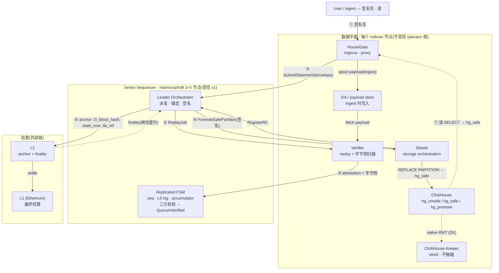

# Sentio Sequencer —— Go 服务设计

**日期:** 2026-06-30 **状态:** 提案 (v1) **基线:** [2026-06-22 存储完整性设计](2026-06-22-storage-integrity-design.md)(其中称作 "Sentio Keeper" 的组件,就是本文规范的 **Sentio Sequencer**) + [2026-06-10 多副本信任设计](2026-06-10-multi-replica-trust-design.md) **真相来源:** 英文版;语义变更时由英文版重新生成本中文版。

本文设计 **Sentio Sequencer**:承担存储完整性设计 §5.2 "Keeper" 角色的 Go 服务——对签名 statement 定序、构建 L3 区块、强制 `statement_id` 唯一、派发 replay 任务、运行 2-of-3 三方提升校验、签发 Keeper 签名的提升命令、发布安全态 manifest。它在 `hashicorp/raft` 之上**从零用 Go 实现**,而非 fork 或移植 ClickHouse Keeper。

## 1. 定位与命名决定

存储完整性设计里 "Keeper" 这个词被用在两件互不相关的事上,该文 §12.1 专门花了一段去消歧。本设计把完整性层的这个权威重命名为 **Sequencer**,一劳永逸地终结歧义。两个角色是:

| | **ClickHouse Keeper** | **Sentio Sequencer**(本文) |
|---|---|---|
| 是什么 | 兼容 ZooKeeper 的协调服务 | L3 区块定序器 + 准入 + attestation 收集器 + 安全态发布者 |
| 语言 / 出处 | C++,在 ClickHouse 单体仓(`programs/keeper`、`src/Coordination`) | Go,新建,基于 `hashicorp/raft` |
| 职责 | 协调 `hg_unsafe` 这张 ReplicatedMergeTree 的状态(part 复制、merge) | 对签名 statement 定序、运行 2-of-3 三方提升校验、签发 `REPLACE PARTITION` 提升命令、发布 `SafeSnapshotManifest` |
| 线协议 | ZooKeeper 线协议 | 自有 gRPC 契约——**不兼容 ZooKeeper** |
| 在本设计中 | 保持**原版、不改动**的 ClickHouse Keeper | 这里要构建的组件 |

Sequencer 不讲 ZooKeeper 协议,也绝不碰 ReplicatedMergeTree 协调(那由一个独立的原版 ClickHouse Keeper 负责)。所以它是一个全新的复制状态机,不是 clickhouse-keeper 的 fork。Go 是天然之选:fork clickhouse-keeper 唯一能复用的就是共识层,而 Go 有成熟的 Raft 库;完整性相关的状态机无论用什么语言都是全新的,而且 Sequencer 在进程内直接复用本仓库已有的 Go `pkg/replay` 验证核心。

base spec §9 图里的 replay 副本(R1/R2)在本文中称为 **Verifier**。这套用上了 base spec 正在走向的标准 rollup 分解(§1:去中心化"改变的是谁来检查、谁承担经济后果"):中心化的 **Sequencer**(定序 + 准入 + 安全态发布)+ **Verifier** 网络(在 P5+ 去中心化的"检查者")。

## 2. 目标与非目标

目标:

1. 把签名 statement 定序成全序、构建 L3 区块流,过程确定且可重放。
2. 用 L3 派生的累加器强制 `statement_id` 永久唯一,使去重事实在去中心化后依然成立。
3. 编排 replay 法定多数验证,并在已落日志的**签名证据**上求值 §9 三方提升校验(replay root + 分区 commitment + 字节侧 LtHash),使任何诚实节点都能从该证据复算出同一个提升/拒绝裁决。
4. 签发 Keeper 签名的 `PromoteSafePartition` 命令,发布 `SafeSnapshotManifest` 安全水位。
5. 通过 `hashicorp/raft` 集群扛住单节点与 leader 故障,所有副作用在 failover 下幂等。
6. 复用本仓库的 `pkg/replay`、`pkg/lthash`、`pkg/auth`,而非重造验证、哈希、签名。

非目标 (v1):

1. 在热路径上执行用户 SQL(Sequencer 派发 replay;Verifier 执行)。
2. 按 `keeper_shard` 的多 Raft 分片(前瞻见 §10.6;v1 是单 Raft 组)。
3. 阈值/多签 authority 签名、challenge 窗口、链上 DA(P5+;结构上给三者都留了口)。
4. v1 INSERT 路径之外的 mutation(`UPDATE`/`DELETE`)定序细节(P2;§9 仅作为可扩展性说明点名)。
5. 兼容 ZooKeeper 协议,或与 ClickHouse Keeper 有任何交互。

## 3. 组件与进程架构

### 3.1 控制平面 vs 数据平面

Sequencer **只做控制平面**——定序、裁决、签名。它不存用户 part、热路径上不执行用户 SQL、也绝不和 ClickHouse Keeper 通信。所有字节都在数据平面。

**SNode 是一个角色,不是独立守护进程。** 本文中的 "SNode" 指存储编排职责——执行 source 写、建 `hg_promote`、跑 Sequencer 签名的 `REPLACE PARTITION`、drop 被拒 part、跑 `hg_unsafe` 清理与 safe 表审计,以及承载面向 Sequencer 的客户端(`RegisterRC`、订阅提升、ack)。部署上,这些由与 ClickHouse 同机、**已内嵌 HouseGate 代理库**的那个 Go 进程(今天的 `sentio-node`)实现;**没有独立的 SNode 守护进程**。把 SNode 与 HouseGate 保留为两个**角色**,是因为它们是两种不同性质的活——HouseGate 是在 client↔ClickHouse 原生协议**路径上**的 dataplane 代理,而 SNode 角色是**带外**、针对 ClickHouse 存储的控制面编排——工程上最好组织成同进程内的独立模块,而不是又往转发链上加 plugin。两者都在**不受信的 operator 侧**(base-spec §4),所以同机不改变信任模型:完整性始终来自 Sequencer + Verifier 法定多数。唯一不能合并的边界是 operator 侧(HouseGate/SNode/Verifier) vs **受信、独立的 Sequencer 控制面**——把 Sequencer 折进 operator 进程会抹掉 §1 依赖的外部仲裁者。

```text
                         ┌─────────────────────────────────────────────┐
                         │   SENTIO SEQUENCER  (control plane, new, Go)  │
   submit envelope       │   hashicorp/raft group, 3 or 5 nodes          │
  ┌──────────────┐       │  ┌────────────┐  leader-only                  │
  │  HouseGate   │──gRPC─┼─▶│ gRPC server │──┐                           │
  │  (ingress)   │       │  └────────────┘  │                           │
  └──────────────┘       │  ┌──────────────▼───────────────┐            │
                         │  │  Orchestrator (leader only)   │  side-     │
   RegisterRC            │  │  dispatch ReplayJob, collect  │  effectful │
  ┌──────────────┐       │  │  attestations, poll parts,    │            │
  │ source SNode │──gRPC─┼─▶│  run 3-way check, sign+issue  │            │
  └──────────────┘       │  │  PromoteSafePartition, anchor │            │
                         │  └──────────────┬───────────────┘            │
   SubmitAttestation     │      proposes commands │ (raft.Apply)         │
  ┌──────────────┐       │  ┌──────────────▼───────────────┐            │
  │ Verifier     │──gRPC─┼─▶│  Replicated FSM (every node)  │  determin- │
  │ (per replica)│       │  │  seq · L3 log · id-accumulator│  istic     │
  └──────────────┘       │  │  · RC records · attestations  │            │
         ▲               │  │  · promotion_seq · manifests  │            │
         │ ReplayJob      │  └───────────────────────────────┘            │
         │ (stream)      └─────────────────────────────────────────────┘
         │                              │ Sequencer-signed PromoteSafePartition
   ┌─────┴───────────────── data plane (per indexer / replica) ──────────┐
   │  Verifier  ──embeds──▶ pkg/replay.Verifier + chexec + ed25519        │
   │  SNode  ──▶  ClickHouse  ── hg_unsafe (ReplicatedMergeTree) ─────────┤
   │                          ── hg_safe (MergeTree) ◀── REPLACE PARTITION │
   │                          ── hg_promote (shadow)                       │
   │  ClickHouse ◀──ZK──▶  stock ClickHouse Keeper  (separate, untouched)  │
   └───────────────────────────────────────────────────────────────────┘
```

### 3.2 核心模式:确定性 FSM ↔ 仅 leader 的 orchestrator

这是最关键的结构性决定,也是用 Raft 把 Go 服务做对的前提。

- **复制 FSM** 在每个 Sequencer 节点上跑出来都一样:`Apply(command) → 改写派生状态`。它在 `Apply` 内**不做网络 I/O、不读时钟、不用随机数**。它持有 `statement_seq`、L3 区块日志、`statement_id` 累加器与每账户 high-water mark、`RCRecord`、已记录的 attestation、`promotion_seq`、已发布的 manifest 引用、已提升 unsafe part 的 registry、节点成员关系。Snapshot/Restore 做日志压缩。这和 `hashicorp/raft` 的 `FSM` 接口 1:1 对应。
- **orchestrator** 是仅 leader、有副作用、通往外部世界的桥。它观察 FSM 状态跃迁,做所有 I/O(派发 `ReplayJob`、收集签名后的 attestation、轮询 SNode 的 `system.parts`、等 L2 finality、签名并下发提升命令),再把每个结果**作为新命令提议回日志**。它从不直接改 FSM 状态。

**"在 FSM 内求值"的确切含义。** 三方提升判定式(base-spec §9)是*由 FSM 裁决、而非 leader 临时拍板*——但要精确界定这句话的范围。FSM **不**重跑 replay,也**不**重跑字节侧 ClickHouse 扫描;这些都是 Verifier 侧不可约简的 executor I/O。FSM 做的是**在已记录的签名证据上确定性地求值判定式**:每个节点对同一批已落日志的标量(签名后的 `ExecutionReceipt`、source 的 `RCRecord`、被背书的字节侧 `part_row_lthash`)施加同一个比较,因而得到同一个 `Replaying → QuorumVerified` 裁决。ed25519/secp256k1 验签是纯密码学、确定性,所以每条证据的*真实性*在每个节点上也都可复核。因此对字节层真相的信任是**背书式的**——≥2 个独立诚实 Verifier 签出一致的值——而非 FSM 重算;"可重算优先于投票"(base-spec §5.2)的意思是:一个诚实 Verifier 的签名异议本身就是已落日志、不可抵赖的证据,审计者可据此行动,而不是说 FSM 会重跑 ClickHouse。leader 唯一的特权动作是**签**那条对外的提升命令(按 §7/§8.1 每个节点都持有 authority key,但只有 leader 使用它);连这次签发也以命令记录下来供审计。被攻陷的 leader 无法伪造一个"日志证据不支持"的提升,因为每个 follower 都在同一批签名证据上跑同一个判定式。

**orchestrator 如何感知跃迁。** `hashicorp/raft` 的 `FSM.Apply` 在每个节点都跑,且只把结果返回给本地 `ApplyFuture`,并不提供跃迁事件流。所以 `Apply` 在改完状态后,把一条跃迁事件(statement/分区 + 新 `Status`)追加到一个 **leader 本地、有界、内存** channel,由 orchestrator 消费。orchestrator 在获得 leadership 时先**扫一遍当前 FSM 状态**重建工作集(补回它成为 leader 之前发生的事件),再消费该 channel。这条通知通路是 leader 本地、非确定性的;它绝不能反馈进 `Apply` 的状态改写(follower 直接丢弃这些事件)。

### 3.3 二进制与包布局

Sequencer 是一个独立可部署单元(它是集群化的控制平面基础设施,不是逐连接代理),同时复用本仓库的库与约定:

```text
cmd/sequencer/main.go            # new binary: flags, config load, signal ctx, gRPC + raft bootstrap
pkg/sequencer/
  fsm/         # deterministic state machine: command types, Apply/Snapshot/Restore, derived state
  accumulator/ # mountain-range Merkle accumulator + per-account high-water marks (pure Go, §6)
  orchestrator/# leader-only side-effectful loop (replay dispatch, 3-way check driver, promotion issuance)
  server/      # gRPC service impl + listenerRunner-style Serve(ctx, ln)
  raftnode/    # hashicorp/raft wiring: FSM adapter, boltdb log store, snapshot store, transport
reuse from pkg/replay:  ReplayJob · ReplayAttestation · ExecutionReceipt · SafeSnapshotManifest ·
                        PartitionCommitment · PartManifestEntry · Verifier · Seal/Validate
reuse elsewhere:        pkg/lthash · pkg/auth (secp256k1 sign + EthValidator recovery) ·
                        pkg/config · pkg/log · the listenerRunner/serverListener lifecycle
NEW Go types (sequencer-go proto + pkg/sequencer): StatementEnvelopeV2 · RCRecord · ThreeWayVerdict ·
                        PartitionState · AnchorRef · PartRef · OpenL3Block · SeqGapSet · StatementState
external (to be created): github.com/housegate/sequencer-go/gen/pb   # wire contract, mirrors rewriter-go/gen/pb
```

复用边界很重要、而且容易写过头:`pkg/replay` 今天有 `ReplayJob`、`ReplayAttestation`、`ExecutionReceipt`、`SafeSnapshotManifest`、`PartitionCommitment`、`PartManifestEntry`,以及 `Statement` 这个 *replay 投影* ——但**没有** `StatementEnvelopeV2`(签名 envelope)、**没有** `RCRecord`(结果声明)、**没有**任何 delta 类型。这些都是本设计在 `sequencer-go` proto 与 `pkg/sequencer` 中**新引入**的类型。`sequencer-go` 模块尚不存在,在 P0 创建(§12)。

**Verifier** 是数据平面上与每个 ClickHouse 副本同机的组件,内嵌 `pkg/replay.Verifier` + `chexec` + `payloadexec.Ed25519Signer`,以及一个**新的字节侧扫描器**(全新代码,用 `pkg/lthash` 原语——`chexec` 只物化 scratch 表,不会按 `_part` 扫已有的磁盘 part)。它是 Sequencer 的**客户端**、独立于 Sequencer 进程;它可以独立运行,也可以和 HouseGate/SNode 角色同进程——因为 quorum 独立性要求的是**跨节点** ≥2 个非 source verifier,而非进程内。Sequencer 也可以内嵌 `pkg/replay`,但只用于 base-spec §5.2 那个可选的 challenge 参考执行器。

`cmd/sequencer` 二进制遵循仓库其余部分的生命周期约定:加载 `pkg/config`、串一个 signal 取消的 context、通过 `pkg/replicationproxy` 那套 `listenerRunner`/`serverListener` 模式暴露 gRPC listener(`Serve(ctx, ln) error`,context 取消时优雅关闭),用 `pkg/log` 的 `FromContext`/`Infow` 打日志。

### 3.4 内部接口缝(为 P0/P1 冻结)

base spec(§5.2)要求本子设计冻结"关键接口签名,使 P0/P1 对着一个固定目标推进"。下面就是这些冻结的 Go 边界——只给签名,不给实现。它们刻意把三方判定式**留在 FSM 内**(对已提交 `State` 的纯函数),而非做成 `Orchestrator` 的方法:Orchestrator 只做 I/O,永远不是提升权威(§3.2)。

```go
// pkg/sequencer/accumulator — statement_id uniqueness (§6)
type Accumulator interface {
    Root() []byte                                        // spent_ids_root
    Insert(c StatementCoord)                             // (account, client_seq); advances the root
    ProveNonMembership(c StatementCoord) (Proof, error)  // leader/prover side, OUTSIDE Apply
    VerifyNonMembership(c StatementCoord, p Proof) bool  // deterministic; the only form used IN Apply
}

// pkg/sequencer/fsm — the deterministic replicated state machine (a raft.FSM)
type FSM interface {
    Apply(l *raft.Log) any                               // deterministic; mutates State and evaluates the
    Snapshot() (raft.FSMSnapshot, error)                 // three-way predicate over committed evidence
    Restore(rc io.ReadCloser) error
}
// the three-way verdict is FSM-internal — func (s *State) threeWay(seq uint64) Verdict — NOT exported and
// NOT an Orchestrator call; every node recomputes the same verdict from logged signed evidence (§7.3).

// pkg/sequencer/orchestrator — leader-only, side-effectful; proposes commands, never mutates State
type Orchestrator interface {
    Run(ctx context.Context) error                       // drain the transition channel; per event do the I/O
}                                                        // (dispatch ReplayJob, collect attestations, poll
                                                         // parts, anchor, sign+send PromoteSafePartition) and
                                                         // propose the resulting Record* command

// signing — reuses pkg/auth (secp256k1) + payloadexec (ed25519); see the §8.1 table
type PromotionSigner    interface { Sign(cmd PromoteSafePartition) (sig []byte, err error) }            // secp256k1, leader-only use
type PromotionValidator interface { Authorize(cmd PromoteSafePartition, sig []byte) (addr string, ok bool) } // SNode side, EthValidator

// pkg/sequencer/raftnode — the consensus seam, so the raft library is swappable/testable
type ConsensusNode interface {
    Apply(cmd []byte, timeout time.Duration) raft.ApplyFuture
    VerifyLeader() error
    LeaderCh() <-chan bool
    Barrier(timeout time.Duration) error                 // read-index for linearizable SafeState reads
}

// sharding seam (§10.6) — the v1 implementation returns group 0 for everything
type Sharder interface {
    GroupForStatement(StatementEnvelopeV2) GroupID
    GroupForPartition(TablePartition) GroupID
    GroupForSchema(schemaSnapshotID string) GroupID
    Groups() []GroupID
}
```

### 3.5 端到端流程与 L1/L2/L3 分层

三层构成一个**承诺层级(commitment hierarchy)**,Sequencer 是那个**亲手产出 L3、并把它锚进外部 L2/L1** 的角色——它**使用**这些链,而不运营它们。**L3** 是 Sentio 自己的签名写语句块的哈希链(由 Sequencer 产出,§5.1);每个 L3 块的承诺被发到外部 **L2**(更快更便宜的 finality),L2 再 settle 到 **L1**(Ethereum)。承诺**往下**流(L3 → L2 → L1);finality **往上**继承(L1 → L2 → 被锚的 L3 块),而这个 finality 正是放行 `safe` 的闸。



一条写的端到端流程:

1. **① 进入 L3** —— User/Agent 签名写 → HouseGate。HouseGate 验签,并在 **ingest 时把 payload spool 进 DA / payload store**(base-spec §5.1)。
2. **② 定序** —— HouseGate 把 `StatementEnvelopeV2` 提给 Sequencer;FSM 分配 `statement_seq`、封进 L3 块。source SNode 乐观写 `hg_unsafe` 并登记 `RCRecord`。
3. **③ 验证** —— Orchestrator 派 `ReplayJob` 给 Verifier;每个 Verifier **从 DA 取回 payload**,经 ClickHouse(`chexec`)重放并对候选 part 做字节侧扫描,回传签名 attestation。
4. **④ 裁决** —— FSM 在已落日志的签名证据上算三方校验 `(replay-root ∧ 分区 commitment ∧ 字节侧)` → `QuorumVerified`。
5. **⑤ 锚定 + finality** —— Orchestrator 把承诺 `(l3_block_hash, state_root, da_ref)` 发到 L2;L2 settle 到 L1;finality 回流并**闸住提升**。
6. **⑥ 放行 safe** —— finality 之后 leader 签 `PromoteSafePartition`(secp256k1);SNode 跑 `REPLACE PARTITION` 进 `hg_safe`。
7. **⑦ 读** —— `SELECT` 直接经 HouseGate 打 `hg_safe`,**完全不经过 Sequencer**。

**DA 何时"写"、何时只是"被引用"(一个值得钉死的时序点)。** payload 在 **ingest(第 1 步)** 就写进 DA,在**验证(第 3 步)** 被读回;第 5 步的 anchor 只是把**承诺 + `da_ref` 指针**发到 L2——**不是**把数据写进 DA 的时刻。数据必须在"引用它的承诺"之前就在 DA 上,跟着链上锚点走的验证者/挑战者才总能取到。(v1 用受信 payload store,且 envelope 经 `ReplayJob` 从受信 Sequencer 给 Verifier,所以这条排序到 **P5+ 无需信任挑战**时才变成硬约束。)

**定位。** 用 rollup 的话说,Sequencer 是**排序权威**;v1 里它还兼了 **verifier 编排**(replay 法定多数 + 三方校验)和**结算**(安全态发布)两顶帽子,P5+ 分解会把它拆成 Sequencer 与 Verifier 网络(§1)。它是 **optimistic-rollup 风味**(乐观 source 执行 + 法定多数 replay + P5+ challenge 窗口),不是有效性证明式。

## 4. 复制状态机

Sequencer 的真相来源就是一条 Raft 日志和它喂出来的派生状态。本节定义命令字母表、FSM 状态、`Apply`/`Snapshot`/`Restore` 映射、确定性规则、生命周期映射。

### 4.1 Raft 日志 = 命令字母表

每条 Raft log entry 是一个命令(提议)。所有"何时做"的时序决定都在 leader 的 orchestrator;一旦决定,就以一条命令落在某个固定 log index,FSM 只做确定性的状态改写。

| 命令 | 谁提议 | `Apply` 里的确定性效果 |
|---|---|---|
| `SubmitStatement` | leader(收到 HouseGate ingress 后) | 确定性准入:验 envelope 签名、对累加器**验证**随命令携带的 `statement_id` 非成员证明(证明随命令带来,**不**在 `Apply` 里生成)、检查 schema/settings 在白名单、检查 `statement_kind` 允许 → 分配 `statement_seq`(单调 ++)、推进累加器 + 该账户 high-water mark、把 statement 记入开放块缓冲 |
| `SealL3Block` | leader(条数/字节/年龄触发) | 把开放缓冲封成 L3 块:算 `prev_l3_hash`、锚定 `statement_id → statement_seq` 绑定、快照 `spent_ids_root_after`、开新块 |
| `RegisterRC` | leader(收到 source SNode 的 `RCRecord`) | 校验 linkage(seq 存在、来自被指派 source),记录 `RCRecord`(候选 part 及其 source 声明的 `part_row_lthash`、`source_claim_root`、source 声明的每分区新 part LtHash 之和) |
| `RecordAttestation` | leader(收到 Verifier attestation) | 验 verifier 的 ed25519 签名;对 receipt 逐字重算并核对 `receipt_hash`;记录 `ExecutionReceipt`;**在 FSM 内重算 check 1**,即 `receipt.ComputedStateRoot == RCRecord.SourceClaimRoot`(verifier 的 `MatchSourceRoot` flag 仅作参考);重算三方判定式 → 满足则跃迁 `QuorumVerified` |
| `RecordByteSideScan` | leader(收到 Verifier 字节侧扫描) | 记录 verifier 对每个被扫 part 背书的 `part_row_lthash`;FSM 把这个已记录标量与 `RCRecord.candidate_parts` **比对**(check 3),它**不**重跑扫描 |
| `RecordAnchorFinality` | leader(L2/L1 上链 final 且 `last_mergeable` 达到后) | 记录 `anchor_ref`;`QuorumVerified` + finality + `last_mergeable` → 可提升 |
| `RecordPromotionIssued` | leader(签完 `PromoteSafePartition` 后) | 记录 `promotion_seq`、`base_safe_snapshot_id`、`base_partition_root`、leader 签名,供审计 |
| `PublishSafeSnapshot` | leader | 记录新的 `SafeSnapshotManifest`(用 `pkg/replay` 的 `Seal`/`Validate` 校验),推进 safe watermark |
| `ScheduleUnsafeCleanup` / `RecordCleanupAck` | leader | 标记已提升的 `hg_unsafe` part 待清理、记录 SNode 清理 ack;维护 `unsafe_latest` 读取的已提升 unsafe part registry(§8.5) |
| `OpenChallenge` / `ResolveChallenge` | leader(mismatch / 超时) | 标记 challenge;裁决后促成 `Safe` 或 `Rejected` |
| `RegisterNode` / `MarkActive` / `EvictNode` | leader | 维护 Verifier/副本成员与 Active 读集(snapshot 同步完成后才 Active) |

Sequencer 集群自身的成员变更(加/减 Raft 节点)走 `hashicorp/raft` 原生 config-change,和上面这些业务命令是两套东西,不要混。

### 4.2 FSM 派生状态

```go
type State struct {
    // sequencing
    NextStatementSeq uint64
    OpenBlock        *OpenL3Block            // statements buffered since the last seal
    Blocks           []L3BlockHeader         // sealed block headers (bodies may live in the snapshot)

    // dedup (§6 accumulator, pure Go)
    Accumulator      *accumulator.MountainRange   // spent_ids_root authenticator
    HiSeq            map[Account]uint64           // per-account high-water mark
    Gaps             map[Account]*SeqGapSet       // out-of-order client_seq <= hi fallback set

    // per-statement lifecycle
    Statements       map[uint64]*StatementState   // key = statement_seq
    ByStatementID    map[StatementID]uint64       // route-A late-binding index

    // promotion / safe state
    PromotionSeq     uint64
    Partitions       map[TablePartition]*PartitionState
    SafeWatermark    SnapshotID
    Manifests        map[SnapshotID]ManifestRef   // by snapshot id and by SafeBlockSeq
    PromotedUnsafe   map[TablePartition]map[PartCommitment]bool  // registry unsafe_latest filters against

    // membership
    Nodes            map[NodeID]*NodeInfo         // Active / Syncing, role, ed25519 pubkey
}

type PartitionState struct {
    BaseSafeSnapshotID SnapshotID
    BasePartitionRoot  []byte   // base partition's raw 2048-byte LtHash accumulator (for check 2, §7.3)
    PublishSeq         uint64   // last promotion_seq published into this partition
}

type StatementState struct {
    Env            StatementEnvelopeV2          // NEW type (sequencer-go), carries user_jws + non-membership proof
    Seq            uint64
    Status         Status                       // §4.4
    RC             *RCRecord                    // NEW type: candidate parts + source_claim_root + claimed per-partition new-part lthash
    Attestations   map[ReplicaID]ReplayAttestation   // reused pkg/replay type; computed_state_root lives in .Receipt
    ByteSideLtHash map[ReplicaID]map[PartName][]byte
    Verdict        *ThreeWayVerdict             // NEW: recomputable three-way result
    AnchorRef      *AnchorRef                   // NEW
}
```

复用诚实声明:`ReplayJob`、`ReplayAttestation`、`ExecutionReceipt`、`SafeSnapshotManifest`、`PartitionCommitment`、`PartManifestEntry` 连同 `Seal`/`Validate` 从 `pkg/replay` 原样复用。`StatementEnvelopeV2`、`RCRecord`、`ThreeWayVerdict`、`PartitionState`、`AnchorRef`、`PartRef`、`OpenL3Block`、`SeqGapSet` 是在 `sequencer-go` proto 与 `pkg/sequencer` 中定义的**新**类型。累加器是唯一全新的纯 Go 算法组件(§6)。

注意 `PartitionState.BasePartitionRoot` 存的是基线分区的**原始 2048 字节 LtHash 累加器**(与 `SafeSnapshotManifest` 按 base-spec §8 存的原始形式一致),因为 check 2(§7.3)需要把 source 声明的新 part LtHash 加到基线上,再与 verifier 的绝对 post-state commitment 比较。

### 4.3 Apply / Snapshot / Restore 与确定性规则

FSM 实现 `hashicorp/raft` 的 `raft.FSM`:

- `Apply(*raft.Log) interface{}` —— 解码命令、switch、改写 `State`、通过 `ApplyFuture` 把结果(如分配到的 `statement_seq`)返回给 leader 的 gRPC handler。
- `Snapshot() (raft.FSMSnapshot, error)` —— 序列化整个 `State`。累加器是 mountain range,只存 peaks,体积小、可压缩;`pkg/lthash` 的 2048 字节累加器用 `Bytes()` 原样序列化,保证增量可加。
- `Restore(io.ReadCloser)` —— 反序列化、重建 `State`。

确定性红线(违反任一条副本就分叉):

1. `Apply` 不得调 `time.Now()`、用 `rand`、做网络 I/O,或依赖 map 迭代顺序(要 hash 的地方先排序——复用 `pkg/replay` 的 canonical 化)。任何对成员的选择(source/verifier 选择,§5.4/§7.1)都读取**应用该 log entry 时已提交的 `State.Nodes` 中 Active 子集**,并按 `NodeID` 排序。
2. 所有 root/manifest 折叠用整型(`pkg/lthash` 是整型 lane,无浮点歧义)。`Apply` 对收到的 receipt **逐字**重算 `receipt_hash`(hash 前不重排 slice),并据此验签。
3. 所有时序决定("何时 seal 块 / anchor / 签提升")都在 orchestrator,以显式命令在固定 index 进入日志。
4. `Apply` 只**验证**证明(如 `SubmitStatement` 携带的 `statement_id` 非成员证明),从不**生成**证明。生成证明需要完整元素集,发生在 leader/prover 侧、`Apply` 之外(§6.4)。

**全层一个 canonical 化 profile。** Sequencer 算的每个 root/commitment 都必须走 `pkg/replay` 的 canonical 化(`canonicalDigest`),每类 commitment 用一个新 domain tag——绝不另起第二套 hash profile——因为整个安全论证都建立在"独立节点从同一证据算出**相同**的根"之上。`canonicalDigest` 目前未导出(`pkg/replay/hash.go`);**P0 把它导出为 `replay.CanonicalDigest`**(或加一个带类型的 helper),使 Sequencer FSM、Verifier、§13/base-spec §13 审计天然共用一个 profile,而非靠约定。

### 4.4 命令 → 生命周期映射

每条 statement 的 `Status` 遵循 base-spec §11 状态机。下表列出驱动每个*持久*跃迁的命令;`Accepted` 与 `UnsafeExecuting` 在 base-spec §11 里是瞬态、在 FSM 中不单独由命令驱动(source 的乐观写是数据平面事件,FSM 只在 `RegisterRC` 落定时才观测到):

```text
SubmitStatement                          -> Sequenced            (base-spec Accepted->Sequenced collapsed)
RegisterRC                               -> UnsafeRegistered     (base-spec UnsafeExecuting elided; data-plane event)
(first ReplayJob dispatched, leader marks)-> Replaying
RecordAttestation x N satisfying 3-way    -> QuorumVerified
RecordAnchorFinality (finality + last_mergeable) -> FinalityWait -> (promotable)
RecordPromotionIssued + SNode ack         -> Safe
OpenChallenge                            -> ChallengeReplay -> Safe | Rejected
Rejected                                 -> Dropped
```

`QuorumVerified` 这个跃迁由 FSM 在已落日志的签名证据上确定性算出——三方 = 法定多数复现 root **且** 每分区 commitment **且** 字节侧 `part_row_lthash`(精确范围见 §3.2)——不是 leader 拍板。可提升门是 `QuorumVerified 且 L2/L1 finality 且 last_mergeable`(base-spec §11),都由 `RecordAnchorFinality` 记录。

## 5. 定序与 L3 区块

### 5.1 封块:非确定的触发,确定的 seal

开放块缓冲吸纳已准入的 statement。封块的*触发*在 orchestrator(每块最大条数、最大字节、最大年龄,谁先到)。触发后 leader 提议 `SealL3Block`,FSM 确定性地把当前缓冲封成块:

```go
type L3BlockHeader struct {
    L3BlockSeq         uint64
    PrevL3Hash         Hash        // = H(previous sealed header) -> hash chain
    StatementSeqStart  uint64
    StatementCount     uint32
    SchemaSnapshotID   string      // one schema per block (§5.3)
    ExecutorProfileID  string      // block-level pinned executor profile
    PrevSafeSnapshotID SnapshotID  // safe watermark at seal time
    PrevStateRoot      Hash
    SpentIDsRootAfter  Hash        // accumulator root at seal time (base-spec §7)
    L2AnchorRef        *AnchorRef  // empty at seal; back-filled after on-chain finality (§5.2)
}
```

一个块不允许夹带 schema 变更(v1 块级 schema)。若 `SubmitStatement` 是改 schema 的 DDL,orchestrator 先把当前块 seal 掉,让 DDL 独占一块,并触发 schema-transition lane(§5.3)。

### 5.2 hash 链与上链承诺

`PrevL3Hash` 把所有块头串成一条防篡改 hash 链,任何诚实节点重放 L3 流都能重建它。`L2AnchorRef` 是回填的:封块只产出 seq/hash/root;上链发生在 `QuorumVerified` + finality 之后,由 `RecordAnchorFinality` 把锚点写回块头。

**L2 calldata 策略(为 v1 解决 base-spec §15 Q5)。** v1 只放**承诺**:calldata 只放 `l3_block_hash` + `state_root`,别无其他;payload 字节进**带保留期的 payload store**(base-spec §15 Q6 的问题,与上链无关)。代价是数据可用性:只放承诺时,只有还留着副本的人能 replay/challenge——这在 v1 可接受,因为 Sequencer 受信(base-spec §4),challenge 是事后审计而非运行期提升机制。`AnchorRef` 结构预留一个可选 DA 引用字段,使去中心化阶段切到"承诺 + DA 引用"(Celestia/EigenDA/blob)是配置变更而非协议变更。

### 5.3 schema_snapshot_id 作用域

v1 块级:一块一个 `schema_snapshot_id`、块内无 schema 变更、执行器以单一 schema 重放整块。改 schema 的 DDL 走单独的 schema-transition lane:DDL 独占一块——**标注为 OLD(转换前)的 `schema_snapshot_id`**,因为 DDL 块是*铸出*后续块新 id 的那个事件,Verifier 以该旧标注 schema 重放 DDL 块。Sequencer 装一道 schema 屏障(停止准入旧 schema 的新写,把在途旧 schema 的 unsafe 写排空或拒绝),DDL 铸出新 `schema_snapshot_id` + `schema_root`,SNode 把 DDL 应用到所有协议表面(`hg_safe`/`hg_unsafe`/`hg_promote`/scratch 模板)并上报观测到的 `schema_hash`,本地 schema 与锚定根一致后才恢复正常写。Verifier 只从锚定的 DDL/settings 日志推导 schema,不认 source 侧的 `system.columns`。语句级作用域是 P4。

### 5.4 source 选择(确定性)

base-spec §5.2 要求 Sequencer 为乐观执行选 source 节点。这必须确定性,否则各 Sequencer 节点对 source 是谁会分叉。FSM 在 `SubmitStatement` 时按一个确定性函数,对**已提交的 `State.Nodes` 中 Active-writer 子集**(按 `NodeID` 排序得到 canonical 顺序)选出 `source_node`,如 `hash(statement_id) mod len(active_writers)` 或确定性轮询——绝不读 live、依赖健康态的可写集(那会违反 §4.3 红线 1)。把 `source_node` 记入 `StatementState`;orchestrator 据此通知该 source 执行。成员变更命令(`MarkActive`/`EvictNode`)在日志中相对 `SubmitStatement` 有序,所以所有节点在该 index 看到同一个 Active 集。

### 5.5 执行时序:只做 route A,带晚绑定

v1 只实现 **route A / optimistic-forward**(base-spec §16 默认;managed/先定序后写不在 v1 范围)。source 先写 `hg_unsafe`(写速 unsafe ack),用 `statement_id` 做 dedup 与 part 归属;envelope 并行提交给 Sequencer,Sequencer 稍后把 `statement_id → statement_seq` 绑定。提升仍然要等定序、replay、finality、三方校验;乐观执行只换来更早的 *unsafe* ack,绝不换来更早的 *safe* ack。

工程后果是**晚绑定**:`RegisterRC` 可能带着 `statement_id`(seq 还不存在)就到了。FSM 因此在主索引 `Statements[seq]` 之外维护 `ByStatementID` 索引;`RegisterRC` 先按 `statement_id` 挂起,`SubmitStatement` 分配 seq 后完成绑定。

### 5.6 ReplayJob 构建

封块后,orchestrator 按 base-spec §7 从 `L3 块 + RCRecord + 当前 safe 态` 组装一个 `pkg/replay.ReplayJob` 派发给被选中的 Verifier。复用的字段名是 `BlockSeq`、`PrevSafeSnapshotID`、`PrevStateRoot`、`SchemaSnapshotID`、`ExecutorProfileID`、`SourceClaimRoot`(json `source_claim_root`)、`Statements []Statement`——本设计精确沿用这些名字,因为类型是原样复用的。携带的 `Statement` 是 `pkg/replay` 的 replay 投影,不是完整的签名 `StatementEnvelopeV2`(后者留在 Sequencer 侧)。

## 6. statement_id 唯一性累加器

### 6.1 为什么它是承重墙

`_hg_row_id = BLAKE3(... || statement_id || global_row_ordinal)`。复用 `statement_id` 会复活重复行 LtHash 抵消攻击(base-spec §8 在行级挡住的 2^16 同 lane 相消)。所以 `statement_id` 全局唯一是 §8 抗抵消论证的地基。base spec 进一步要求用 L3 派生的累加器(而非 Sequencer 内存)来强制,这样去中心化不改变去重事实。

**去重身份。** 唯一性键是 `(client_account, client_seq)`。`statement_id = client_account || client_seq || client_nonce`,其中 `client_nonce` 给 `_hg_row_id` 贡献熵,但**不**进唯一性键。某账户复用 `client_seq` 一律被拒(无论 nonce 是否不同),并返回一个独立错误码,让 SDK 浮现它(客户端 bug)而不是悄悄丢掉输的那一份。等价地说:累加器提交的是已用的 `(account, client_seq)` 坐标(一坐标一 statement)。

### 6.2 必备性质与构造

FSM 累加器必须 append-only、永久、per-account-global 作用域(坐标一旦入 `spent_ids_root` 永不移除);无 trusted setup;可从 L3 流确定性重放;每个 L3 块提交一次 `spent_ids_root_after`;支持 O(log n) 非成员证明。

构造(沿用 base-spec §7 / 2026-06-10 Appendix B.2):P0 推荐 **mountain-range Merkle 累加器**,非成员性靠前驱/低叶论证(sorted/indexed-Merkle 家族——append-only、O(log n)、无 trusted setup)。RSA/pairing 累加器给 O(1) 证明但需 trusted setup / 模数治理,v1 拒绝;sparse Merkle 可接受但常数更大。字节级构造 + **test vectors** 是 base-spec §14 的 **P0 冻结交付物**;本文定到性质 + 推荐构造 + 在 FSM 的落地,字节编码留给 P0 spike。

### 6.3 FSM 接受算法

绝大多数流量走不到累加器证明;每账户 high-water mark 让常路径 O(1)。需要时,非成员证明由 **leader** 计算(在 `Apply` 之外、从 prover 侧存储),并**随 `SubmitStatement` 命令携带**;`Apply` 只对 in-FSM 根验证它(§4.3 红线 4):

```text
Accept(statement_id = (account, client_seq, nonce)):
  hi := HiSeq[account]                      // new account defaults to 0
  if client_seq > hi:                       // fast path: strictly increasing => definitely new
      mark [hi+1, client_seq-1] as Gaps[account]   // skipped seqs become open gaps
      HiSeq[account] = client_seq
      accumulator.Insert((account, client_seq))     // advance spent_ids_root
      assignSeq + bind; return Accepted
  else:                                     // client_seq <= hi: out-of-order or replay
      if client_seq in Gaps[account]:        // a legitimately-skipped earlier seq arriving late
          verify the carried non-membership proof against the current spent_ids_root
          accumulator.Insert((account, client_seq)); Gaps[account].remove(client_seq)
          assignSeq + bind; return Accepted
      else:
          reject as duplicate (with the distinct reused-client_seq error)
```

正常递增流量 O(1)、零证明;只有乱序补洞(`client_seq <= hi`)才需要携带的非成员证明,属罕见路径。

### 6.4 状态规模与分片

FSM 去重态 = 每账户一个整数 `HiSeq` + 一个稀疏 `Gaps` 集,加累加器的紧凑认证元(根 + frontier peaks,O(log n))。完整元素集只用于*生成*证明,放在 leader/prover 侧或外部存储;*验证*证明只需根(所以 `Apply` 不持有完整集也能验证)。累加器按 `client_account` 干净分片,直接对上 base-spec §15 Q15 的分片路径。整个结构可从 L3 流重放,所以去中心化不改变去重事实。

## 7. Replay 法定多数编排与三方提升校验

这是安全核心。一个 root 自洽不足以提升。

### 7.1 编排(leader,有 I/O)

```text
block sealed + RC registered  ->  (1) FSM deterministically selects the verifier set (committed Active set,
                                      sorted by NodeID, excluding source_node)
                                  (2) orchestrator dispatches ReplayJob to each verifier (gRPC stream)
                                  (3) after the replay attestation, dispatches a byte-side scan request
                                  (4) proposes each verifier's two results as Record* commands into Raft
```

verifier 选择确定性(在 FSM 里像 source 选择一样、对已提交 Active 集排除 `source_node` 计算),使所有 Sequencer 节点对"问了谁"一致、可审计;orchestrator 只做派发 I/O。这是两轮流程(对齐 base-spec §9 时序):先 replay attestation,再字节侧扫描。两轮可流水线,但保留为不同命令类型以利审计。

### 7.2 Verifier 做什么(数据平面进程,复用 `pkg/replay`)

每个 Verifier 调 `pkg/replay.Verifier.Verify(ctx, job)`,它跑 `chexec` 执行器(真 ClickHouse 物化读回),产出 `ExecutionReceipt`(含 `ComputedStateRoot`、绝对的 `PartitionCommitmentsAfter []PartitionCommitment`、以及带每 part `PartRowLtHash` 的 `AffectedParts []PartManifestEntry`),对 receipt 做 hash,并返回一个**已完整签名**的 `ReplayAttestation{ReplicaID, Receipt, ReceiptHash, Signature, MatchSourceRoot}`——库自己持有注入的 ed25519 `Signer`,所以 Verifier 不手搓、也不单独签 attestation。注意 `ComputedStateRoot` 在 `att.Receipt.ComputedStateRoot`,不在 attestation 顶层。

字节侧扫描(base-spec §9 check 3)由 Verifier 的**新字节侧扫描器**完成:对它实际 fetch 到的候选 part 跑 `SELECT ... WHERE _part IN (...)`,用 `pkg/lthash` 从真实磁盘字节重算 `part_row_lthash` 并回报。Sequencer FSM 用该 verifier 的 ed25519 公钥(来自 `RegisterNode`)验签,并对 receipt 逐字重算 `receipt_hash`,确认 receipt 内容被签名覆盖。

### 7.3 三方判定式(在 FSM 内,对已记录的签名证据求值)

一个块达到 `QuorumVerified` 必须三条同时成立(任一不成立 → 不提升)。FSM 按 §3.2 的范围在已落日志的标量上求值每条(它**比对签名证据**,不重跑 replay、不重扫字节):

| Check | 内容 | 它锁住的环节 |
|---|---|---|
| **1. Replay** | ≥2 个独立 verifier,各自 `att.Receipt.ComputedStateRoot == RCRecord.SourceClaimRoot` ——由 **FSM 从已落日志的 receipt 与 RC 重算**,不取 verifier 的参考性 `MatchSourceRoot` flag(source 自证不计) | 证明"按签名 payload 正确执行就得到这个 root" |
| **2. 分区 commitment** | 每个被触及分区,绝对对绝对:`BasePartitionRoot(来自基线 manifest 的原始 LtHash 累加器) + Σ(RCRecord 中 source 声明的新 part part_row_lthash) == verifier 的 PartitionCommitmentsAfter[p]`(LtHash 可加性使其精确成立) | **root → source 的逐 part 声明**:合谋 source 同时控制磁盘字节和自己的 part 声明,但要对上必须报出能加到 verifier 算出的绝对 commitment 的逐 part hash——除非 LtHash 碰撞,而 `_hg_row_id` 唯一性排除了它。注意 receipt 给的是*绝对* `PartitionCommitmentsAfter`(非 delta),所以判定写成可加形式(`base + 声明 == post`),与 base-spec §10 mutation 用的形式一致 |
| **3. 字节侧 part-lthash** | quorum 内每个 verifier:其背书的 `part_row_lthash`(经 `RecordByteSideScan` 记录) == `RCRecord.candidate_parts` 里的值 | **source 的声明 → 磁盘真实字节**:抓"报 `LtHash(bytes_evil)` 却存别的字节"的 source。这是*背书式*真相——FSM 比对签名后的已记录标量;扫描本身是 verifier I/O,信任来自 ≥2 个诚实 verifier 签出一致值(§3.2) |

②③ 互补且都承重。提升是一条链 `post-commitment —②→ Σ source 逐 part 声明 —③→ 磁盘真实字节`。只有 ③ 没有 ②:source 如实报 `LtHash(bytes_evil)` 会过——只有 ② 拦。只有 ② 没有 ③:source 报对 hash 却存错字节会过——只有 ③ 拦。只有 ①:`R == R` 什么都没证明。

**完整性 / 闭包(挡掉隐藏的额外 part 与漏网 merge)。** ②③ 都只覆盖 statement *应当*触及的 part,所以必须配一个闭包检查,否则 source 可往 payload 不触及的分区塞额外 evil part 并从 `RCRecord` 里省掉它们。FSM 用两种方式强制闭包:(a) 签名后的 `PromoteSafePartition` 命令*恰好*列出已验证的 `CandidateParts`,SNode 从 `base + 仅这些` 构建 `hg_promote`(§8.2),所以未列出的 part 进不了 `hg_safe`;(b) `REPLACE PARTITION` 之后,SNode 报告的 post-promotion `partition_commitment` 必须等于 `BasePartitionRoot + Σ(已验证的新 part part_row_lthash)`。任何没被已验证贡献覆盖的 part——额外 evil part,或绕过 STOP MERGES(§8.4)的 merge 产物——都会破坏这个等式、挡住提升,无论它是否出现在 `candidate_parts` 里。

### 7.4 quorum 参数与成员公钥

v1 冻结 quorum 为 ≥2 of 3 个**独立**replay 副本,且这三个副本与 source 不同(source 自证不计,base-spec §9)。因此一次部署需要 **≥4 个参与节点**——一个 source 加至少三个 verifier——这样排除 source 后仍剩三个 verifier,2-of-3 quorum 能容 1 个恶意/故障 verifier。若池子恰好三个且含 source,排除后只剩两个(2-of-2,零容错),所以 v1 要求(排除 source 的)Active verifier 池 ≥3。v1 安全假设是非 source verifier quorum 中诚实占多数。每个 verifier 的 ed25519 公钥在 `RegisterNode` 时入 FSM 状态;只有 `MarkActive`(snapshot 同步完成)的副本进入 verifier 选择池。(Open Q3 在 P1 冻结前确认池大小。)

### 7.5 Challenge / 超时

orchestrator 检测到超时,或某 verifier 报 mismatch,提议 `OpenChallenge` → `ChallengeReplay`。challenge 用**同一个三方判定式**(base-spec §11):挑战者独立 replay 复现 `SourceClaimRoot` **且**分区 commitment 检查成立 **且**字节侧检查成立 → claim 通过(`Safe`);任一不成立 → `Rejected` → unsafe parts drop。v1 受信 Sequencer 立即裁决、无 challenge 窗口;challenge 窗口是 P5+ 去中心化阶段的安全机制(base-spec §11 分阶段定义)。这条协议语义规则在 v1 范围;经济 challenge/slashing 参数延后(base-spec §2 非目标)。

## 8. 提升命令签发、hg_promote、与 manifest

Sequencer 签发命令、串行化、记安全态;真正的 ClickHouse SQL 在 SNode 上跑。

### 8.1 触发与命令内容

```text
QuorumVerified + RecordAnchorFinality (finality + last_mergeable)
   ->  FSM marks (table, partition) promotable, assigns a monotonic promotion_seq,
       deterministically computes the command content
   ->  leader signs PromoteSafePartition with secp256k1
   ->  sends to every attesting SNode (gRPC)
```

```go
type PromoteSafePartition struct {
    TableID            string
    PartitionID        string
    PromotionSeq       uint64       // monotonic, orders promotions per (table, partition)
    BaseSafeSnapshotID SnapshotID   // the safe snapshot this promotion is based on
    BasePartitionRoot  Hash         // base partition root (for the CAS check)
    CandidateParts     []PartRef    // exactly the candidate parts that passed the three-way check (by content commitment)
    // the leader's secp256k1 signature wraps all of the above
}
```

签名是 leader 唯一的特权动作;签发以 `RecordPromotionIssued` 记录供审计。authority secp256k1 key **在所有 Raft 节点上共享**(同样下发),使 failover 后任何被选中的 leader 都能签;leader-only *使用*由 `VerifyLeader()` 强制(§10.2)。SNode 通过恢复 secp256k1 地址并核对 authority allowlist(`pkg/auth` 的 `EthValidator` 模式)来验签——这正是 authority key 用可恢复地址的 secp256k1 而非 ed25519 的原因。提升签名 payload + purpose claim 是新工作(§12 P0);`pkg/auth` 现有的 `SignToken`/`SignPeerLogin` 绑定 SQL/peer-login,不原样复用,但 secp256k1 key + `EthValidator` 恢复复用。

双签名体系一览(对应 §3.4 的 `PromotionSigner` / `PromotionValidator` 缝):

| 被签对象 | 算法 | 身份 | 复用类型 | 为何这么选 |
|---|---|---|---|---|
| `ExecutionReceipt` → `ReplayAttestation` | ed25519 | 每个 Verifier 一把(各不相同) | `payloadexec.Ed25519Signer`(满足 `replay.Signer`) | 威胁是合谋的 verifier quorum,所以 verifier 之间不能共享 key |
| `PromoteSafePartition` / `UnsafeCleanup` | secp256k1 | 单一 Sequencer authority,key 全节点共享、仅 leader 使用 | `pkg/auth.RelaySigner` 签 + `EthValidator` 恢复 | 单一命令签发信任根;SNode 本就用地址 allowlist 验身份 |

### 8.2 SNode 执行(机械,base-spec §12.2)

每个 attesting 副本本地、原子地完成:

```sql
-- 1) bring the CAS-base safe partition in whole (cross-table hardlink, metadata-only)
ALTER TABLE hg_promote.Tbl_<id> ATTACH PARTITION <id> FROM hg_safe.Tbl_<id>;
-- 2) per verified candidate part: hardlink from hg_unsafe into hg_promote's detached/, then attach
ALTER TABLE hg_promote.Tbl_<id> ATTACH PART '<part_name>';
-- 3) atomically replace the destination partition
ALTER TABLE hg_safe.Tbl_<id> REPLACE PARTITION <id> FROM hg_promote.Tbl_<id>;
```

全程 metadata-only hardlink,O(候选 + 既有 part),接近 O(1)——但仅当三张表同 storage policy、同盘、结构一致;否则 ClickHouse 退化为全量字节拷贝。`hg_promote` 是 copy-on-write 提交缓冲,只装基线分区 + 本轮 `CandidateParts`(别无其他——这条"恰好集合"规则就是 §7.3 的闭包检查);它绝不整块拷 `hg_unsafe` 分区(里面可能混着无关的未验证 part)。`REPLACE PARTITION` 是拷入而非从 `hg_unsafe` 删除,所以 Sequencer 同时把候选记为 safe 并排程 `hg_unsafe` 清理(§8.5);清理完成前,`unsafe_latest` 用已提升 unsafe part registry 过滤掉它们。part 名在 attach/replace 后会变,所以 SNode 重读 `system.parts`,按 `(table_id, partition_id, 内容承诺, part_phys_hash)` 记安全 part 映射,绝不假设原 `hg_unsafe` part 名还在。

### 8.3 两层串行化与 exactly-once 提升

`REPLACE PARTITION` 是整分区原子替换,两个都触及分区 P 的 statement 若各自基于"对方落地前"的快照,第二次 replace 会静默覆盖第一次刚提升的行(丢更新,非追加)。两层防御:

1. **Sequencer 级**:FSM 按 `(table, partition_id)` 串行化提升,每次提升的 base = **发布时刻** CAS 校验过的 safe 快照(不是语句执行时刻);可把同一轮多个可提升 statement 批成一次 `REPLACE PARTITION`。
2. **SNode 级**:建/发布 `hg_promote` 前,SNode 取 `(table, partition_id)` 本地发布锁,CAS 校验当前 active `hg_safe` 分区根仍等于命令里的 `BasePartitionRoot`;若被别的提升/mutation/safe-merge 推进,SNode 丢影子表并按新 base 重建或等 Sequencer rebase。发布锁只串行化分区发布,不挡普通 `SELECT` 读。

**跨重启与空闲分区的 exactly-once。** SNode 另外按 `(table, partition_id)` **持久化** last-applied `promotion_seq`,并拒绝任何 `promotion_seq <= 该水位` 的提升,**独立于** base-CAS。这让重放拒绝即便在 base 未推进(空闲分区)和 SNode 重启后也成立,因此旧/被攻陷 leader 重发的 stale 提升即使别的都没动也会被拒。这套 base-CAS + 单调 seq 机制同时也是 failover/分区的幂等护栏(§10.3)。

### 8.4 hg_unsafe STOP MERGES 不变量

`hg_unsafe` 全生命周期 `SYSTEM STOP MERGES`,并在锚定 DDL 里钉死 `max_bytes_to_merge_at_max_space_in_pool = 0`(声明式、扛重启);HouseGate 启动时重断言 `SYSTEM STOP MERGES`。这使 part 边界恒等于 statement 边界,候选 part 集合无歧义。漏过的 merge 不是安全洞,且现在是 FSM 校验而非仅运维保证:合并 part 不在命令的 `CandidateParts` 里、其 `part_row_lthash` 不是已验证贡献,所以 §7.3 的闭包等式(`post == base + Σ 已验证`)失败、提升被挡。

### 8.5 SafeSnapshotManifest 发布与 unsafe 清理

提升 ack 齐后,FSM 推进该分区与全局 `SafeWatermark`;leader 组装新的 `pkg/replay.SafeSnapshotManifest`(`SnapshotID / ParentSnapshotID / SafeBlockSeq / StateRoot / SchemaSnapshotID / SchemaRoot / ExecutorProfileID / DataRoot / ManifestRoot / Tables[]TableManifest`,内含 `PartitionCommitment` 与 `PartManifestEntry` 记录),提议 `PublishSafeSnapshot`,FSM 用 `pkg/replay` 的 `Seal`/`Validate` 校验后记录。manifest 内容寻址 + canonical 化(表/分区/part 顺序归一后再 hash),独立验证者复算出同一组根。这就是 safe watermark;`as_of_safe(block)` 时光旅行按 `SafeBlockSeq` 选 manifest(不需要每行的 block-seq 列,base-spec §6)。

已提升 `hg_unsafe` part 的清理是显式的:`ScheduleUnsafeCleanup` 在 `PromotedUnsafe` registry 里记录哪些 part 已提升但未清理,并经 `PromotionGateway` 把 drop 派给 SNode;`RecordCleanupAck` 在 SNode 确认后清掉它们。某项被清掉之前,`unsafe_latest` 排除它(base-spec §6)。清理的幂等锚点见 §10.3。

### 8.6 滞后副本补提升(base-spec §12.5)

不在本轮 quorum 里的滞后副本:等 ReplicatedMergeTree fetch 到 part 后,按记录的 per-`(table, partition)` 提升序列顺序重放,每次提升的 base 用**命令里记录的** `BaseSafeSnapshotID`/`BasePartitionRoot` 解析(不是本地当前 watermark)。Sequencer 的 Raft 日志保有这份有序提升序列,滞后 SNode 向它拉取。按有序序列重放(而非对当前 watermark rebase)正是让"晚到、且其间已有后续 statement 提升进同一分区"的副本仍能复现每一步的原因。注意这复现的是分区的**逻辑** commitment(LtHash 根),当本地 `hg_safe` 基线被独立 merge 过时(base-spec §12.4 允许 ledger 门控的 `hg_safe` merge)未必是字节一致的物理 part;因此 base-spec §13 的 serving 审计对这类分区须按逻辑(root/LtHash)比较,或对有未结提升重放欠账的分区暂停本地 `hg_safe` merge。

## 9. Mutation 路径(P2,不在 v1 范围)

Mutation(`ALTER ... UPDATE`/`DELETE`,P2 中有界)在 base-spec §10 规范,**不**在 v1 构建。它增加一道 `(table, partition)` mutation 屏障(对同分区 cut 的早前写串行化),以及一个"重算承诺匹配"的第三检查(每个 verifier 在各自 scratch 里重新生成被改 part,所以 part 字节合法地不同),而非 fetched-byte 扫描。对 Sequencer 设计的唯一影响是可扩展性:`PartitionState` 与命令字母表为屏障和 mutation `RCRecord` 留了口;详细语义在 base-spec §10,不在此重复。

## 10. HA / Failover 与写可用性耦合

这是 base-spec §15 Q15 点名的关键路径。

### 10.1 单 Raft 组基本盘

3 或 5 节点的 `hashicorp/raft` 组原生提供选举、日志复制、snapshot 追赶(3 节点容 1 故障,5 节点容 2)。FSM 在全组一致;orchestrator 只在 leader 上跑,经 `hashicorp/raft` 的 `LeaderCh()`/`RegisterObserver` 在 leadership 变更时启/停。每个节点起 gRPC server;收到写类 RPC 时非 leader 返回 `NotLeader{leader_addr}` 让客户端重试(或透明转发),订阅流只对 leader 建立。

### 10.2 orchestrator 的 leader-only 重入

orchestrator 做 I/O,所以 failover 后新 leader 必须从 FSM 状态接着干在途工作("做了 I/O"与"把结果记成命令"之间崩溃,意味着新 leader 会重做那段 I/O):

```text
Replaying but attestations insufficient    -> re-dispatch ReplayJob
QuorumVerified but not anchored             -> anchor
promotable but PromoteSafePartition unacked -> re-sign + re-send
```

所有副作用必须幂等或被 FSM 已记录的进度门控,且 orchestrator 在每个副作用前调 `raft.VerifyLeader()` 确认仍是 leader(防分区期间旧 leader 误发),并以下面的幂等锚点兜底。因为任何被选中的 leader 都可能重签提升,secp256k1 authority key 下发到所有节点(§8.1);key 由每个节点*持有*,但只由已验证的 leader *使用*。

### 10.3 幂等锚点

| 操作 | 幂等机制 |
|---|---|
| 提升 | `promotion_seq` 单调 + SNode 侧 base CAS + SNode 持久化的 last-applied `promotion_seq` 水位(即便空闲分区或重启后也拒绝 seq <= 水位,§8.3):exactly-once,并防旧 leader 签 stale 提升 |
| `RegisterRC` | 按 statement 去重(同 statement 同 RC) |
| `RecordAttestation` | 按 `(replica_id, block_seq)` 去重(每副本每块一票) |
| Unsafe 清理 | 在 `PromotedUnsafe` registry 里按 `promotion_seq` / 内容承诺为键;`RecordCleanupAck` 幂等 |
| 上链 anchor | 按 `l3_block_hash` 确定性键 / 先查后锚 → 可重入 |

### 10.4 写可用性耦合(base-spec §12.3 consequence 4)

这必须如实写出而非藏起来。因为 `hg_unsafe` 是 STOP MERGES + 钉死 parts ceiling,唯一能排空 part 的动作就是提升,而提升要 Sequencer 定序、编排 quorum、签 `REPLACE PARTITION`。Sequencer 一旦不可用,提升停 → part 堆积 → 撞 `parts_to_throw_insert` → 全网拒写,且节点没有本地逃生阀(不能 merge `hg_unsafe`,不能本地提升)。形式化:v1 全网写可用性 = `Sequencer_liveness x promotion_throughput >= ingest_rate`,某分区能撑 `remaining_parts_budget / ingest_rate`。"受信"(base-spec §4)不等于"高可用"。

缓解措施(分层):

1. HA 本身是 v1 首要缓解:3/5 节点 + 调紧选举超时,把 leader failover 压到秒级,提升几乎不断流。
2. 提升吞吐留余量:跨分区并行提升、同分区批量 `REPLACE PARTITION`。
3. HouseGate 准入限流(base-spec §12.3 consequence 2)把硬 `Too many parts` 变成可重试 backpressure,争取恢复时间(只延后耦合,不解除)。
4. 加宽生存窗口:调大 parts ceiling、拆分区键分散 parts(schema-time 决策,记入锚定 DDL)。
5. 运维纪律:Sequencer 维护必须滚动,绝不全停。

诚实边界:HA 解决单节点/leader 故障;全组停机(多数挂、坏部署)仍停写。这是集中式权威 + 引擎拆分在 v1 接受的后果,也是 base-spec §15 Q15 把 Sequencer HA 放在关键路径、排在去中心化之前的原因。

### 10.5 与 §12.5 恢复路径的关系

base-spec §12.5 的恢复路径(从 L3 流重放、从 peer 的 `hg_safe` 拷贝)在 Sequencer 恢复*之后*重建 `hg_safe`;它们不能在 Sequencer 仍宕机时排空 `hg_unsafe`。它们是事后恢复 `hg_safe`,不是停机期间的写逃生阀。

### 10.6 分片延后——`Sharder` 缝,以及为何 multi-Raft 不进 v1

v1 是**单 Raft 组**。按 `keeper_shard` 的多 Raft 分片是自然的横向扩展(base-spec §15 Q15),但它是个多季度子系统,不是 P1 之后顺手就能硬化的事,v1 只承诺一个缝。

诚实地讲库的现状:**`hashicorp/raft` 每个实例只托管一个组**——和 `go.etcd.io/raft` 一样是单组。两个库都不原生支持 multi-Raft;需要它的系统(TiKV、CockroachDB)各自自建了路由层,而那层自带真实的正确性风险——跨组排序(一条 statement 触及不同组里的分区)、组 split/merge、跨大量组的心跳合并。所以"以后再分片"意味着要么在路由器后面每 shard 跑一个 `hashicorp/raft` 实例,要么自建多组管理器;两者都继承这份跨组税,这正是把它塞进 v1 会成为"最长杆装错"的原因。

v1 唯一承诺的是 `Sharder` 缝(§3.4):每个分片路由决定都走它,v1 实现对一切返回 group 0。这把 P5+ 的工作从重写变成单接口替换。两个该缝先延后、尚未解决的跨片问题——一条 statement 跨两个 shard 的分区、以及为锚点排序的跨片 L2-height 时钟——在此点名,以便将来刻意去设计,而非晚发现。

## 11. gRPC 服务面

### 11.1 两个方向,统一让数据平面来 dial

Sequencer 既被调用,也派发工作。为运维简单(Sequencer 不必反向 dial 每个 SNode/Verifier,穿 NAT/防火墙,failover 靠重连),两个方向都让数据平面节点主动连 Sequencer:clients 一元调用 Sequencer(ingress、RC 注册、读 safe 态);Sequencer 经节点发起的订阅流(server-streaming 下发 + 一元回结果/ack)向数据平面派发。下发只发生在 leader;leader 变更则流断、客户端重连新 leader。

### 11.2 服务与主要方法

proto 住在新外部模块 `github.com/housegate/sequencer-go`(P0 创建),照搬 `rewriter-go`:`.proto` 与生成的 Go 在那边,housegate 只 import 生成的 `pb`。`ReplayJob`/`ReplayAttestation`/`SafeSnapshotManifest` 的消息体是复用的 `pkg/replay` Go 类型的线形式,字段名与那些类型一致(`block_seq`、`source_claim_root`、嵌套 `receipt`);`StatementEnvelopeV2`/`RCRecord`/`PromoteSafePartition`/`ByteSideScanMsg` 是新消息。

```protobuf
service SequencerIngress {                       // <- HouseGate
  rpc SubmitStatement(StatementEnvelopeV2) returns (SequencedAck);   // idempotency key: (account, client_seq)
}
service SourceClaims {                           // <- source SNode
  rpc RegisterResultClaim(RCRecord) returns (Ack);                   // idempotency key: statement_id
}
service VerifierGateway {                        // <- Verifier (data-plane subscribes)
  rpc SubscribeReplayJobs(VerifierHello) returns (stream ReplayJob); // leader dispatch
  rpc SubmitAttestation(ReplayAttestation) returns (Ack);            // idempotency key: (replica_id, block_seq)
  rpc SubmitByteSideScan(ByteSideScanMsg) returns (Ack);             // candidate parts by (partition_id, content commitment)
}
service PromotionGateway {                        // <- SNode (data-plane subscribes)
  rpc SubscribePromotions(SNodeHello) returns (stream PromotionCommand);  // PromoteSafePartition | UnsafeCleanup, secp256k1-signed
  rpc AckPromotion(PromotionAck) returns (Ack);                      // idempotency key: promotion_seq
  rpc AckCleanup(CleanupAck) returns (Ack);
}
service SafeState {                               // <- HouseGate / clients (read-only)
  rpc GetSafeWatermark(Empty) returns (SafeWatermark);
  rpc GetManifest(SnapshotRef) returns (SafeSnapshotManifest);
  rpc GetManifestByBlock(BlockRef) returns (SafeSnapshotManifest);   // as_of_safe time-travel, by SafeBlockSeq
}
service Membership {                              // <- SNode / Verifier
  rpc RegisterNode(NodeRegistration) returns (Ack);   // carries ed25519 pubkey + role
  rpc MarkActive(NodeRef) returns (Ack);              // after snapshot sync
}
```

`ByteSideScanMsg` 携带由 `(partition_id, 内容承诺)` 标识的候选 part 集合,以及 verifier 对每 part 重算的 `part_row_lthash`;因为 `hg_unsafe` part 名在 attach 后不稳定(base-spec §12.2),verifier 在发 `WHERE _part IN (...)` 前本地把内容承诺映射到 live `_part` 名。字节侧扫描*请求*(下发方向)同样按内容承诺标识 part,不按名。

### 11.3 NotLeader、幂等、follower 读

所有写/下发类 RPC 在接收方非 leader 时返回 `NotLeader{leader_addr}`,订阅流只对 leader 建立。幂等键(`(account, client_seq)`、`statement_id`、`(replica_id, block_seq)`、`promotion_seq`)让 failover 重试安全(§10.3)。`SafeState` 只读,可由任意 follower 服务(FSM 已复制),带有界陈旧;需线性一致时走 leader 的 read-index/barrier——给 safe 态读扩了水平扩容空间。

### 11.4 proto 放哪

`github.com/housegate/sequencer-go` 是 P0 待创建的新模块;housegate 的 `go.mod` 加一行 require,Sequencer `import pb "github.com/housegate/sequencer-go/gen/pb"`。housegate 仓库内不放 `.proto`、不跑 protoc——和 `rewriter-go` 完全一致。

## 12. 交付分期

v1 = P0(冻结协议表面) + P1(INSERT 端到端)。P2(mutation)与 P3(serving 加固)随后。

| 阶段 | Sequencer 交付物 | 复用 / 新建 |
|---|---|---|
| **P0 冻结** | `sequencer-go` proto 模块(`StatementEnvelopeV2`/`RCRecord`/`PromoteSafePartition`/`ByteSideScanMsg` 新消息 + 复用 replay 类型的线形式)、Raft 命令字母表、累加器构造 + test vectors、authority 签名 payload + purpose claim、导出 `replay.CanonicalDigest`(单一 canonical 化 profile,§4.3)、§3.4 接口缝 | proto 模块 + 累加器 + 签名 payload + `CanonicalDigest` 导出 = **新**;ed25519 attestation + secp256k1 原语 = **复用**(`pkg/replay`、`pkg/auth`) |
| **P1 INSERT 端到端(v1 主体)** | raft 节点 + FSM(Apply/Snapshot/Restore);准入(验签 + 验非成员证明 + high-water);`statement_seq` + L3 封块;RC + 晚绑定;ReplayJob 派发 + attestation 收集;FSM 内三方校验 + 闭包检查;字节侧扫描器(数据平面);`PromoteSafePartition` 签发 + unsafe 清理;`PublishSafeSnapshot`;leader-only orchestrator + 跃迁通知 + failover 重入 + 幂等;各 gRPC 服务;`cmd/sequencer` + config + build 接线 | FSM/orchestrator/raftnode/server/accumulator、cmd、SNode 侧提升执行、字节侧扫描器 = **新**;`pkg/replay` Verifier/`chexec`、manifest `Seal`/`Validate`、`pkg/lthash`、`pkg/auth` 恢复、config/log/listener 约定 = **复用** |
| **P2 有界 UPDATE/DELETE** | mutation 屏障 + 同分区 cut 串行化;重算承诺第三检查(base-spec §10);触及量准入上限 | FSM 变体逻辑 = **新**;scratch clone/delta 在数据平面 |
| **P3 加固 safe serving(base-spec §13)** | 维护 Active 读集、审计失败 `EvictNode`、编排跨节点抽样 | Sequencer 侧 = **新**(成员/读集);扫描在数据平面 |
| **P4 扩语言面** | 语句级 `schema_snapshot_id`;编排 `as_of_safe` + 有序 safe+unsafe 读 | 多为 v1 外;Sequencer 改动小 |

复用 vs 新建小结。**从 `pkg/replay` 原样复用:** `ReplayJob`、`ReplayAttestation`、`ExecutionReceipt`、`SafeSnapshotManifest`、`PartitionCommitment`、`PartManifestEntry`、`Verifier`、`Seal`/`Validate`。**其余复用:** `pkg/replay/chexec` + `payloadexec`(执行器 + ed25519 + `RowID`)、`pkg/lthash`(累加器)、`pkg/auth`(secp256k1 key + `EthValidator` 地址恢复)、`pkg/config`/`pkg/log`/`listenerRunner` 约定。**新建:** `StatementEnvelopeV2`/`RCRecord`/`PromoteSafePartition`/`ByteSideScanMsg` 类型与整个 `sequencer-go` proto 模块;`pkg/sequencer/{fsm, accumulator, orchestrator, server, raftnode}`;authority 提升签名 payload;`cmd/sequencer`;SNode 侧提升执行器 + 字节侧扫描器(数据平面);以及 `hashicorp/raft` 接线。

两条跨阶段的未来线,v1 不做但结构上留口:base-spec §15 Q15 的按 `keeper_shard` 多 Raft 分片——一个多季度子系统(§10.6),藏在 `Sharder` 缝后(v1 全返回 group 0),不是 P1 之后顺手的硬化——以及 P5+ 去中心化(allowlist 变阈值公钥的阈值 authority 签名、challenge 窗口、经预留 `AnchorRef` 字段的链上 DA 引用)。

## 13. 验收 / 自检

设计只有在代码落地时仍忠于自身不变量才有用。下面是给 review 的可机检 tripwire——必要而非充分(防粗暴回归,不证明判定式定义正确)。

必须成立:
- 提升裁决在 **FSM 内**对已落日志的签名证据算出(`QuorumVerified` 在 `Apply` 内置位),绝不由 leader 侧某个返回 decision 的方法决定;
- 三方判定式是 `(1) replay-root 且 (2) 分区 commitment 且 (3) 字节侧`——绝不退化成仅 root 相等(任何"仅 root"就让 part 进 `hg_safe` 的路径都是正确性回归);
- check 1 在 FSM 内重算(`ComputedStateRoot == SourceClaimRoot`),不读 verifier 的参考性 `MatchSourceRoot` flag;
- 提升由对 authority allowlist 恢复出的 secp256k1 签名授权;SNode 绝不自行提升;
- `hg_unsafe` 带 `STOP MERGES` + `max_bytes_to_merge_at_max_space_in_pool = 0`,且提升强制闭包等式 `post == base + Σ 已验证`(§7.3、§8.4)。

不得出现:
- 任何让原版 ClickHouse Keeper 成为提升权威、或让 Sequencer 讲 ZooKeeper 的路径;
- 第二套 canonical 化 profile——任何不走已导出的 `replay.CanonicalDigest` 去 hash 根的做法(§4.3);
- 每行的 `_hg_l3_block_seq` / `_hg_statement_seq` 列(时光旅行按 manifest 索引,base-spec §6)。

## 14. 开放问题

1. **累加器字节编码与 test vectors**(base-spec §14 P0):冻结 mountain-range 构造的叶/前驱编码,产出跨实现 test vectors。
2. **Raft 调参**:在写可用性耦合(§10.4)下,使 failover 时间最短而不误选举的选举/心跳超时与 snapshot 阈值。
3. **Verifier 池大小**:v1 冻结对"与 source 不同的 verifier"做 2-of-3,所以排除 source 的 Active 池须 ≥3(总节点 ≥4)。在 P1 冻结前确认池是恰好 3 个 verifier 还是更大池 + 确定性选 3(这关系到安全声明是"容 1 个恶意 verifier"还是"容 0")。
4. **v1 authority key 托管**:secp256k1 key 在所有 Raft 节点共享(经 `VerifyLeader` 仅 leader 使用);确认下发与轮换机制(allowlist 重叠窗口),以及这套受信 key 模型在 P5+ 阈值签名之前可接受。
5. **leader 侧上链幂等**:确认 L2 anchor 客户端在 failover 下幂等或先查后锚(§10.3)。
6. **payload store 保留**(base-spec §15 Q6):仅承诺 L2 策略下(§5.2),spool 的 payload 的保留期与 proof-of-custody。
7. **backpressure 信号**:Sequencer 的提升滞后驱动 HouseGate 准入限流(§10.4 缓解 3)的精确接口。
8. **config schema**:枚举 `pkg/config` 的 `Sequencer` 段字段(`node_id`、`raft.peers`、`raft.data_dir`、`raft.election_timeout`/`heartbeat`、`grpc_listen`、verifier 池 / quorum 大小、authority key 来源、payload-store 端点、`metrics_listen`)及哪些必填,照 `replicationproxy_config.go` 的 per-mode 校验。

## 15. 参考

- [2026-06-22 存储完整性设计](2026-06-22-storage-integrity-design.md) —— 其中的 "Sentio Keeper" 即本 Sequencer
- [2026-06-10 多副本信任设计](2026-06-10-multi-replica-trust-design.md)
- [pkg/replay](../../../pkg/replay) —— 进程内复用的验证核心(`ReplayJob`/`ReplayAttestation`/`ExecutionReceipt`/`SafeSnapshotManifest`/`PartitionCommitment`)
- [pkg/replay/payloadexec](../../../pkg/replay/payloadexec) —— 执行器 + ed25519 签名器
- [pkg/replay/chexec](../../../pkg/replay/chexec) —— ClickHouse 后端的 materializer
- [pkg/lthash](../../../pkg/lthash) —— lattice-hash 累加器
- [pkg/auth](../../../pkg/auth) —— secp256k1 签名 + `EthValidator` 地址恢复,authority key 复用
- [pkg/replicationproxy](../../../pkg/replicationproxy) —— `cmd/sequencer` 镜像的 listener/生命周期约定
