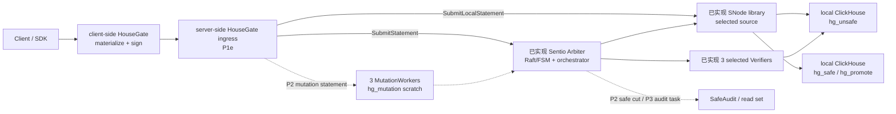
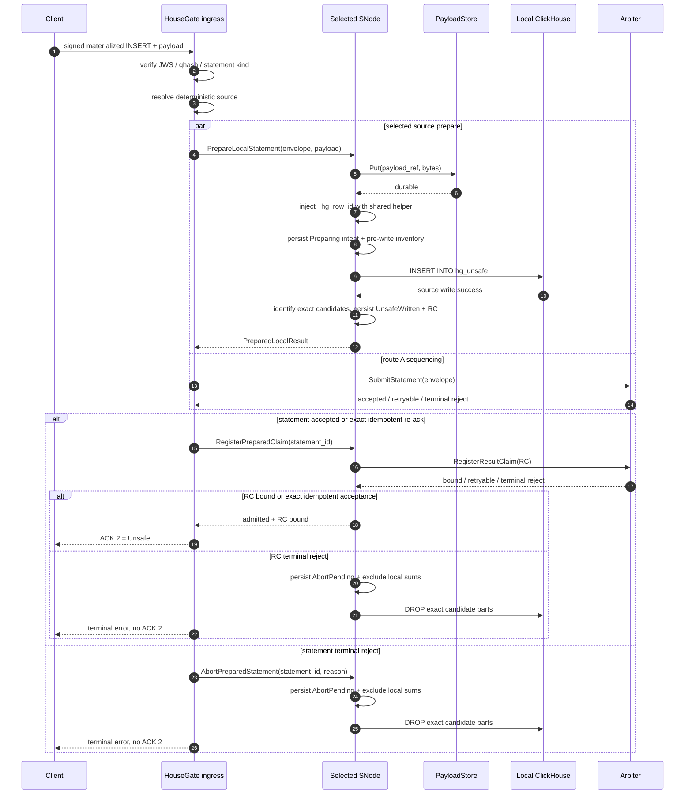
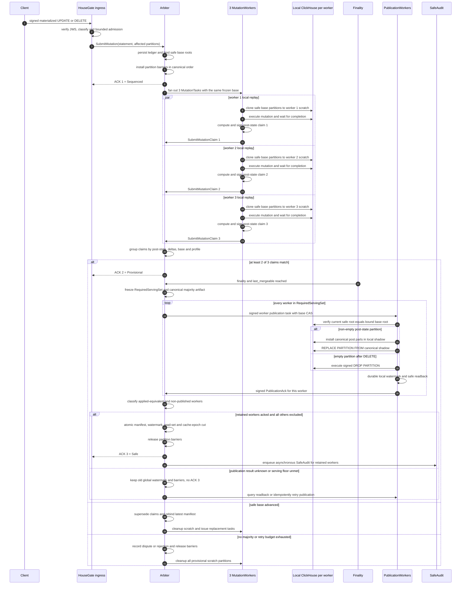
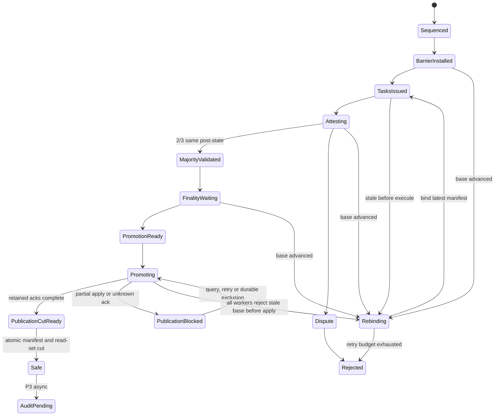

# Sentio Arbiter Storage Integrity：INSERT + Bounded UPDATE/DELETE 增量设计

日期：2026-07-01
更新基线：2026-07-15，已 rebase 到包含 Arbiter P0/P1a/P1b/P1c 的 main 分支。

## 1. 文档定位

本文不再重复定义已经由 main 分支实现并冻结的 Arbiter INSERT 控制面和数据面。已实现能力直接引用下列设计：

| 已实现基线 | 本文直接复用的合同 |
| --- | --- |
| [2026-06-30 Sentio Arbiter](2026-06-30-sentio-arbiter-design.zh-CN.md) | Raft/FSM 与 leader-only orchestrator 边界、L3 block、three-way predicate、promotion authority |
| [2026-07-04 Accumulator](2026-07-04-arbiter-accumulator-design.md) | account-granularity SMT、proof-free v1 admission、`spent_ids_root` |
| [2026-07-05 P1a FSM + raftnode](2026-07-05-arbiter-p1a-fsm-raftnode-design.md) | 17-command INSERT-only FSM、block-level evidence、deterministic source/select-3、固定 2-of-3 quorum |
| [2026-07-05 P1b Orchestrator + Server](2026-07-05-arbiter-p1b-orchestrator-server-design.md) | WorkSet failover re-entry、gRPC streams、manifest-debt gate、exact `Parts[]` ack |
| [2026-07-06 P1c Data Plane](2026-07-06-arbiter-p1c-dataplane-design.md) | Verifier/SNode、payload-before-write、absolute source view、genesis manifest、`hg_promote + REPLACE PARTITION` |
| [2026-07-01 Materialize](2026-07-01-agent-materialize-nondeterminism-design.md) | client-side HouseGate 在签名前物化非确定函数 |

本文只设计尚未由上述阶段完成的增量：

1. **P1e HouseGate ingress 集成**：把签名写入口接到已实现的 SNode/Arbiter 接口，并保留本地性能优化边界。
2. **P2 bounded UPDATE/DELETE**：扩展当前 INSERT-only proto、command alphabet 和 FSM，增加 mutation barrier、parallel local replay、post-state quorum、per-worker publication ack 与 atomic manifest/read-set cut。
3. **P3 serving integrity**：在 P2 最小 publication read-set gate 之上增加 SafeAudit、unified quarantine、repair 和 read-set re-entry hardening。
4. **P4 controlled compaction**：在 `hg_safe STOP MERGES` 前提下，由 Arbiter 管理 safe part merge publication。

以下内容不在本文重新设计：Accumulator 字节编码、P1a command handler、P1b orchestrator WorkSet、P1c three-way predicate、genesis bootstrap、INSERT promotion SQL、authority JWS、exact-parts mapping、manifest canonicalization。实现和测试应直接服从相应基线文档。

## 2. 增量拓扑与职责



职责边界：

- P1c 的 `dataplane/`、`verifier/`、`snode/` 库和参考二进制已经存在；P1e 只负责 HouseGate ingress 接线，不复制这些实现。
- P1c v1 是 single-writer SNode、statement single-flight。multi-writer 必须实现与 FSM 相同的 source selection 和 committed membership view，不能由 HouseGate 自行选择“健康节点”。
- Verifier 固定由 FSM 从 Active 非 source 集合中确定性选择 3 个，quorum 固定 2-of-3；这不是配置项。
- MutationWorker 和 mutation publication read-set coordinator 属于 P2；SafeAuditWorker、audit-driven quarantine/repair/re-entry 属于 P3。它们都不得伪装成当前 P1c 已实现能力。
- 每个数据面角色只操作自己的本地 ClickHouse；Arbiter FSM 不执行 SQL、不读取 `system.parts`、不扫描行数据。

## 3. P1e HouseGate INSERT ingress

### 3.1 Client-side HouseGate

client-side HouseGate 只完成 Phase 1 materialize 和签名：

1. 调用 `MaterializeSQL`，把 `now()`、`rand()`、`generateUUIDv4()` 等白名单非确定函数替换成 literal。
2. 对 materialized `Query.Body` 生成 `SQL_x_auth_token`，`qhash = Keccak256(Query.Body)`。
3. materialize plugin 对普通流量可以 fail open；进入 storage-integrity lane 的 INSERT/UPDATE/DELETE 必须由 server-side ingress 再做 fail-closed 检查，不能把仍含未物化非确定函数的写入提交给 Arbiter。
4. P1c 当前由 SNode 使用共享 `payloadexec.RowID` 注入 `_hg_row_id`；client-side HouseGate 不重复注入。未来若前移注入位置，必须仍调用同一 helper，并关闭 SNode 重复注入。

`_hg_row_id` 公式沿用已实现 profile：

```text
BLAKE3("housegate-row-id-v1" || network_id || table_id || statement_id || global_row_ordinal)
```

### 3.2 Server-side ingress 时序

HouseGate ingress 对一条 INSERT 执行：



必须满足：

- payload hash/length 校验和 `PayloadStore.Put` 必须先于 unsafe write；Put 失败时不能产生 `hg_unsafe` part。
- `PrepareLocalStatement` 与 `SubmitStatement` 可以并行，但 HouseGate 只有在 `SubmitStatement` 被接纳后才调用 `RegisterPreparedClaim`。这保留 route-A 的本地执行并行度，同时避免在当前 P1a command alphabet 中留下无法撤销的 orphan `PendingRC`。
- `PrepareLocalStatement` 必须在返回前持久化 `{statement_id, payload_ref/hash/length, table_id, partition_id, exact_candidate_parts, PartitionNewPartSums, SourceClaimRoot, lifecycle}`。后续重试只能复用该 prepared record，不能再次执行 unsafe INSERT。
- unsafe write 前必须先持久化 `Preparing` intent、预期 `_hg_row_id` 集合或其 commitment，以及 touched-partition pre-write inventory。若进程在 ClickHouse commit 与 `UnsafeWritten` 落盘之间崩溃，恢复流程先用这些信息扫描并归属 exact candidate parts，再决定完成 prepare 或清理；不能盲目重放 INSERT。
- `RegisterPreparedClaim` 仍通过 `statement_id` 晚绑定；RC 的 `source_node` 必须等于 FSM 已记录的 deterministic source。P1c 当前一体化 `SubmitLocalStatement` 可以保留为兼容 wrapper，但 HouseGate ingress 的 P1e 接线使用上述 staged seam。
- 若仍允许 RC 先于 `SubmitStatement` 到达，则必须版本化增加 `DiscardPendingRC` 或等价的 FSM retention/cleanup 语义；它不属于“不修改 Arbiter 核心协议”的 P1e 范围。
- v1 保持 P1c 的 source statement 串行约束：同一 source absolute-claim frontier 上，前一条 intake record 未到达 `RCBound` 或 `Cleaned` 前，不执行后一条 source write。否则后一条 claim 可能包含随后被 terminal reject 清理的前序贡献。未来并行 intake 必须显式记录 claim dependencies，并在 abort 时级联重算或作废后继 claims。
- P1c 当前 payload executor 使用 CSV；Native Data block 支持需要单独扩展 payload encoding/replay profile，不能只改 ingress 声明已支持。
- HouseGate 不能重新实现 row canonicalization、row-id、part LtHash、schema root 或 state-root assembly；统一调用 `payloadexec`、`chexec`、`pkg/lthash` 共享 helper。

### 3.3 Source claim 接线约束

`RCRecord.SourceClaimRoot` 的算法已经在 P1c 冻结，P1e 只负责保持输入完整：

```text
source_absolute_partition_root[p] =
  persisted_safe_base_root[p]
  + sum(all locally executed, not-yet-promoted part_row_lthash values through this statement)
```

HouseGate/SNode 必须：

- 持久化 safe base roots、per-partition unpromoted sums、promotion watermarks 和 last acks。
- source write 后追加当前 `PartitionNewPartSums`；`Applied=true` promotion ack 后按 exact candidate set 扣减。
- 对 safe manifest table set 的全部已知 partition roots overlay local activity，再调用共享 state-root helper；不能只计算“上一版 safe + 当前 INSERT”。
- 不把 eventual `L3BlockHeader.PrevSafeSnapshotID` 当作封块前 source claim 的输入。

P1e 还必须补一条 block-frontier 运行约束：若某个前序 block 的贡献既未进入当前 `PrevSafeSnapshotID`，也不在当前 `ReplayJob.Statements[]` 中，则当前 block 的 verifier view 不覆盖 source absolute view。v1 必须通过 serial frontier/barrier 阻止这种 dispatch；不满足时 fail closed。放开多个未 safe block 并行前，必须先给出等价的 frontier 证明或协议扩展。

### 3.4 ACK2 gate、terminal reject 与恢复

ACK 2 只能在以下条件全部成立时返回：

```text
payload_durable
&& unsafe_write_complete
&& SubmitStatement in {Accepted, ExactIdempotentReAck}
&& RegisterResultClaim in {Bound, ExactIdempotentAcceptance}
&& local_intake_journal.lifecycle == RCBound
```

`SubmitStatement` 和 `RegisterResultClaim` 的结果必须按以下类别处理：

| 结果类别 | 示例 | ACK2 与本地处理 |
| --- | --- | --- |
| 成功或精确幂等 | accepted、相同 envelope 的 re-ack、逐字节相同 RC 的重复绑定 | 两个 gate 均完成后返回 ACK 2 |
| 可重试 | `NotLeader`、临时不可用、明确的 retryable 错误 | 不返回 ACK 2，不清理 candidate parts；复用 journal 重试 |
| 结果未知 | timeout、连接中断且无法判断服务端是否已接纳 | 不返回 ACK 2，也不能清理；先按同一 `statement_id` 查询或幂等重试以收敛结果 |
| 终态拒绝 | conflicting duplicate、source mismatch、malformed、gap budget exceeded 等 | 不返回 ACK 2；进入 exact candidate cleanup |

本地 intake journal 使用 crash-safe 生命周期：

```text
Preparing -> UnsafeWritten -> SubmitAccepted -> RCBound -> Ack2
                  |                 |
                  +---- terminal ---+-> AbortPending -> Cleaned
```

恢复与清理规则：

1. unsafe write 前先 durable `Preparing` intent；write 完成后再原子持久化 exact candidate inventory、`PartitionNewPartSums`、RC 和 `UnsafeWritten` lifecycle，才能对外报告 prepare 成功。
2. recovery 遇到 `Preparing` 时，必须按 persisted pre-write inventory 与预期 `_hg_row_id` 扫描 touched partitions：完整且唯一匹配则补齐 `UnsafeWritten`；完全未写入才允许重试 INSERT；部分或歧义匹配时 fail closed，并只对已证明属于该 statement 的 exact parts 执行清理后再恢复。不能用“当前 partition 新增的所有 parts”作猜测。
3. 收到权威 terminal reject 后，原子地把 journal 标记为 `AbortPending`，并从 source absolute view 的 unpromoted sums 中逻辑排除这些 candidate；先完成该 durable step，再执行物理删除。
4. 物理清理只允许对 journal 中的 exact part name 执行幂等 `ALTER TABLE hg_unsafe.<table> DROP PART '<part_name>'`，不能删除整个 partition；part 不存在视为已清理。
5. 全部 exact candidate parts 删除后持久化 `Cleaned`。进程重启时扫描 `Preparing` 和 `AbortPending` 并继续未完成步骤，因此在任意一步崩溃都不会重复写入、重新纳入 claim view 或遗留永久 orphan part。
6. retryable/unknown intake record 会占住 source claim frontier；只有结果收敛到 `RCBound` 或完成 `Cleaned`，后继 source write 才能开始。
7. 相同 `statement_id` 的请求必须读取既有 journal：`RCBound/Ack2` 返回原结果，retryable/unknown 状态继续收敛，`AbortPending/Cleaned` 返回原 terminal outcome；任何状态都不能重复写入 unsafe。
8. content-addressed payload 不随 candidate part 立即删除；按既有 retention/refcount GC 回收，避免与并发重试或审计读取竞态。

### 3.5 ACK 语义

| ACK | 条件 | 客户端和读路径语义 |
| --- | --- | --- |
| ACK 1 = Sequenced | Arbiter 已准入并持久化 statement | ordered + durable；不是当前 route-A 默认返回点 |
| ACK 2 = Unsafe | payload durable、unsafe write 完成、`SubmitStatement` 已接纳且 RC 已确认绑定，local journal 为 `RCBound` | 当前同步成功语义；不代表 safe，普通 SELECT 仍读旧 manifest |
| ACK 3 = Safe | three-way check、finality、`last_mergeable`、P1c promotion ack 和 manifest publication 全部完成 | integrity-final；不等待 SafeAudit task 完成 |

### 3.6 HouseGate 本地优化边界

可以新增 `PartInspector` / `PartLtHashCache`，但它们只是可丢弃、可重建的本地性能层：

- cache key 至少绑定 `row_hash_version`、`table_id`、`schema_hash`、`part_phys_hash`、rows/bytes。
- byte-side scan 先按 `PartName` 定位；复制延迟时才扫描 partition active parts，并按 `(PartRowLtHash, RowCount)` 回退匹配。
- cache miss 扫描真实 rows，调用共享 scan helper；无法定位或读取 part 时拒绝 attestation 并等待重试。
- claimed/scanned LtHash 不一致不是本地错误，Verifier 必须如实提交 mismatch evidence，让 FSM 记录 check 3 失败。
- `part_phys_hash` 只用于本地 inventory/cache，不进入 content-addressed `DataRoot`，也不是 three-way check 的跨实现比较字段。
- promotion readback fast path 必须产生与严格扫描相同的 exact `Parts[]` 双射；不能只比较 partition root 就省略 safe-part mapping。
- 本地优化不得修改 Arbiter proto、Raft command、three-way predicate、`PromoteSafePartition`、manifest canonicalization 或 hash profile。

旧 HouseGate `ATTACH PARTITION FROM hg_unsafe` 不是目标路径。main 的 P1c 已实现 `hg_promote + REPLACE PARTITION`；legacy attach 仅可作为 migration 开关存在，并必须证明 partition barrier、exact unsafe active set、authority、base CAS、durable watermark、readback、manifest debt 和 cleanup 的等价性。

## 4. P2 Bounded UPDATE/DELETE

### 4.1 协议扩展边界

当前 P1a FSM 和 arbiter-proto 是 INSERT-only。Mutation 不能通过新增 HouseGate 本地 worker 绕过 Arbiter；P2 必须版本化扩展：

- statement kind / envelope projection；
- Raft command alphabet 和 wire converters；
- mutation ledger、partition barrier、claim、decision、per-worker publication ack 和 atomic safe cut；
- WorkSet/read facade、orchestrator action 和 gRPC surface；
- snapshot/restore 与 deterministic replay tests。

P1e 的 cache/readback 优化可以不改 Arbiter 协议，P2 mutation 不受这条限制。

### 4.2 支持与拒绝矩阵

支持：

```sql
ALTER TABLE <db>.<table> UPDATE ... WHERE ...;
ALTER TABLE <db>.<table> DELETE WHERE ...;
```

以及能唯一归一化为 ClickHouse mutation 的：

```sql
UPDATE <db>.<table> SET ... WHERE ...;
DELETE FROM <db>.<table> WHERE ...;
```

v1 bounded admission 拒绝：

- 没有可证明的 partition predicate。
- affected partitions、touched parts 或 touched bytes 超过配置上限。
- 用户入口 `TRUNCATE`、`DROP PARTITION` 或直接修改 `hg_safe`。
- ClickHouse lightweight DELETE mask。
- 修改 `_hg_*` 协议列；UPDATE 必须保持 `_hg_row_id` 不变。
- 修改 partition key、order key、primary key 相关列。
- subquery、join、dictionary lookup、remote/table function 等无法稳定冻结 touched set 的表达式。
- 签名后仍含未物化非确定函数。
- schema snapshot 与 worker 本地 schema-root assertion 不一致。

bounded 的单位是 partition。admission 按 latest manifest 的 active parts/bytes 估算成本，不依赖 data-skipping index 把范围解释成更小的正确性边界。

### 4.3 Mutation ACK

| ACK | 条件 | 语义 |
| --- | --- | --- |
| ACK 1 = Sequenced | mutation statement 已持久化，affected partitions 和 base roots 已绑定，barriers 已安装 | ordered + durable；safe 读仍是旧 snapshot |
| ACK 2 = Provisional | 至少 2/3 MutationWorker 对 post-state claim 达成一致 | scratch provisional state；不进入普通 SELECT |
| ACK 3 = Safe | post-state quorum、finality、`last_mergeable` 完成；每个 retained serving worker 均已 publication + readback ack，未完成者已在同一 publication cut 中移出 read set；manifest/watermark 已发布 | 普通 safe SELECT 才能读取新状态；不等待 SafeAudit |

### 4.4 端到端流程

Mutation 与 INSERT 一样由 HouseGate ingress，但不写 `hg_unsafe`。Arbiter 先绑定 safe base 并安装 partition barriers，再把同一任务分发给 3 个 MutationWorker：



图中的 `CH` 表示每个 worker 自己的本地 ClickHouse，不是三个 worker 共用一个 scratch。3 个 MutationWorker 必须从相同 `prev_safe_snapshot_id` 和 base roots 独立 clone、执行并签名；2/3 claim quorum 只证明逻辑 post-state，不代表任意一个本地 publication 可以推进全局 watermark。

publication issue 时，Arbiter 从 committed read-set state 冻结：

```text
RequiredServingSet = workers currently eligible to serve the affected tables
AppliedEquivalentSet = workers with durable Applied=true ack whose readback matches the majority post-state
RetainedServingSet subset_of AppliedEquivalentSet
RequiredServingSet = RetainedServingSet disjoint_union ExcludedBeforeCut
```

`SafeSnapshotManifest` 只能在 `RetainedServingSet` 满足 serving availability floor，且 `ExcludedBeforeCut` 已在同一 FSM publication cut 中移出 read set 后发布。manifest、global safe watermark、per-worker logical watermark、read-set membership 和 route-cache epoch 必须由一个原子状态转换提交；之后才能释放 barriers 和返回 ACK 3。仅有一条 publication ack、或某条 ack 结果未知时，都不能发布 manifest。

独立 scratch 允许产生物理上不同但逻辑等价的 parts，然而冻结的全局 `ManifestRoot` 仍覆盖单一 `ActiveParts` inventory。P2 当前 profile 因此必须从 majority claim group 记录一个 canonical publication artifact，并让所有 retained workers 安装同一套 canonical post parts，或通过同一 ReplicatedMergeTree publication log 收敛到相同 active-part metadata。只做到 logical root 相同、但 retained workers 的 part names/phys metadata 不同的拓扑不受当前 profile 支持；支持它需要版本化 per-worker physical inventory，而不能复用现有全局 manifest。

### 4.5 状态机和 barrier



规则：

- barrier 粒度是 `(table_id, partition_id)`，覆盖 mutation execution/publication、INSERT promotion 和 controlled compaction publication。
- 多 partition mutation 按 canonical partition order 一次性获取所有 barriers，避免死锁和部分安装。
- 同 partition 更早 INSERT 尚未 Safe/Rejected 时，mutation 必须留在 pending write queue，不能基于看不到该 INSERT 的旧 safe snapshot 执行。
- snapshot 在 dispatch、execution、majority、finality wait 或 promotion 前推进时，旧 scratch 和 claims 全部 supersede；rebind 必须重新 clone、执行和 attestation。
- 任一 worker 已本地 apply 后，不允许把整个 mutation 当作“未执行”直接 rebind；该 worker 必须保持不可服务，直到 publication cut 接纳其等价 readback，或 repair 回 current manifest。
- `Promoting`、`PublicationBlocked` 和 `PublicationCutReady` 都持有 affected partition barriers；只有 atomic publication cut 或 terminal reject 后的完整 repair/cleanup 才能释放。
- 超过 `max_rebind_attempts` 或 `max_rebind_duration` 后返回 retryable rejection。

### 4.6 MutationWorker

每个 worker 只操作本地 ClickHouse：

1. 从 task 读取 `prev_safe_snapshot_id`、base partition roots、affected partitions、materialized mutation SQL 和 schema/executor profile。
2. 使用 `SafeSnapshotManifest` 验证本地 `hg_safe` active set；不把瞬时 `system.parts` 当成 integrity snapshot。
3. 创建或清空 `hg_mutation.<table_id>__<worker_id>` scratch，结构和 storage policy 与 safe table 一致。
4. `ATTACH PARTITION ... FROM hg_safe` 只用于把 frozen base clone 到 scratch；校验 scratch 初始 commitment 等于 manifest base root。
5. 在 scratch 执行 UPDATE/DELETE，等待 `system.mutations` 完成。
6. 计算 `post_state_root`、每 partition 的 delta/post commitment，以及 rows before/after/updated/deleted。
7. 签名提交 `MutationClaim`；scratch 不是 serving surface。

scratch 可以按 `(table_id, worker_id)` 池化，但每次任务前必须清空 affected partitions，schema hash 不一致时 drop/recreate，任务结束后不能残留 provisional rows。

### 4.7 Post-state quorum

Arbiter 不能只按 `post_state_root` 分组。一个 claim group 的 equality key 至少包含：

```text
post_state_root
partition_deltas
post_partition_commitments
schema_snapshot_id
executor_profile_id
prev_safe_snapshot_id
base_partition_roots
affected_partitions
```

固定 participants 中至少 2/3 相同才进入 `MajorityValidated`。minority evidence 保留供 P3 quarantine；无多数进入 dispute/reject，不能 promotion。

### 4.8 Mutation publication

Mutation claim 是 per worker evidence，mutation publication 也是 per serving worker apply/ack；全局 manifest 仍然只有一个。Arbiter 在 `RecordMutationPublicationIssued` 中持久化 `publication_seq`、`RequiredServingSet`、majority equality key、canonical artifact commitment/source、base roots 和 expected post commitments。

每个 retained worker 对非空 post-state 执行：

```sql
ALTER TABLE hg_safe.`<table>`
REPLACE PARTITION ID '<partition_id>'
FROM hg_mutation_publish.`<mutation_id>__<publication_seq>`;
```

空 partition DELETE 没有可供 replace 的 post partition，使用 Arbiter-signed internal `DROP PARTITION` action，并要求：

- command 绑定 base snapshot/root、partition id、zero post commitment 和 monotonic publication seq；
- worker 在执行前重新计算 local current root，base CAS 不一致时 `Applied=false`；
- 新 manifest 记录 `active_parts=[]` 和 zero LtHash partition root。

Mutation 不能使用 `ATTACH PARTITION` 表达 post-state，因为 attach 无法删除或替换旧 row set。

每条 `PublicationAck` 必须绑定并签名：

```text
mutation_id
worker_id
publication_seq
base_safe_snapshot_id
base_partition_roots
post_partition_commitments
post_state_root
local_safe_snapshot_id_after
exact_active_parts_readback
Applied
```

worker 必须先 durable 保存 `{publication_seq, ack, local watermark}`，再发送 ack；重复任务按 `(mutation_id, worker_id, publication_seq)` 返回同一 ack。apply 成功但 ack 丢失时，Arbiter 查询或重发，worker 以本地 watermark/readback 恢复，不能再次执行 mutation 或猜测结果。

Arbiter 只有在以下 publication equation 成立时才能提交 `PublishMutationSafeCut`：

```text
RetainedServingSet subset_of AppliedEquivalentSet
RequiredServingSet = RetainedServingSet disjoint_union ExcludedBeforeCut
size(RetainedServingSet) >= serving_availability_floor
all retained readbacks == canonical manifest input
```

P2 v1 固定 3 个 serving workers，`serving_availability_floor = 2`，与 2-of-3 claim quorum 一样属于版本化 P2 profile/FSM parameter，不是可由单个 leader 修改的 runtime config。未来允许 1 个 serving worker 或扩展到 N 个 workers 必须升级 profile，并补相应的 deterministic snapshot/restore 与 failover tests。

`PublishMutationSafeCut` 在一个 FSM command 中记录 manifest、推进 global/per-worker watermarks、安装新的 read set、推进 route-cache epoch 并释放 barriers。未 ack、CAS 失败、minority scratch、readback mismatch 或结果未知的 worker，必须先进入 `ExcludedBeforeCut`；若摘除后达不到 serving availability floor，则保持旧 manifest/watermark，不返回 ACK 3，并继续 retry/repair。

这里的 canonical publication shadow 与三个验证 scratch 分离：验证 scratch 可以物理不同，publication shadow 必须来自 ledger 记录的 majority artifact，并在所有 retained workers 上产生与全局 manifest 相同的 exact `ActiveParts`。若 ClickHouse 拓扑只能保证逻辑 LtHash 相同而不能保证该物理 inventory 一致，P2 必须先版本化 manifest profile，不能把某一台 worker 的 `ActiveParts` 发布成全局事实。

## 5. P3 Serving Integrity

### 5.1 SafeAudit

SafeAudit 是 promotion/manifest publication 后的 serving audit，不是 INSERT promotion 前 byte-side check，也不是 ACK 3 前置条件：

1. task 固定 snapshot id、table/partition、expected active parts 和 participants。
2. worker 按 manifest 校验本地 `hg_safe` active set，再对 manifest 覆盖的 parts 计算同一语义的 audit hash。
3. `3/3` 通过；`2/3` 一致时通过并 quarantine minority；无多数或超时则 audit failed。
4. active-set、part metadata、checksum 或 row hash 不匹配时 fail closed，不能提交“通过”vote。
5. `PartLtHashCache` 可以加速，但不能改变 vote hash；如果 vote 仍定义为 row hash，cache 只能做预检。

Arbiter FSM 只记录 signed votes 并确定性派生 decision/quarantine，不读取行数据。

### 5.2 Read-set gating

- `SafeSnapshotManifest` publication 推进全局 safe watermark；worker 另持久化 `local_safe_snapshot_id`。
- 普通 safe SELECT 只能路由到 `local_safe_snapshot_id >= requested_snapshot_id` 且未 quarantine 的 worker。
- 没完成 publication 的 worker 必须在新 manifest 对外可见前或同一原子状态更新中移出 read set。
- 落后 worker repair/sync 到 latest manifest 并重新通过 serving audit 后才能加入 read set。
- read decision cache 必须绑定 table、requested snapshot、worker、read mode，并在新 manifest、quarantine、watermark 落后、active-set mismatch 或 TTL 到期时失效。

这里的 read set 与 P1a `MarkActive` 不同：`MarkActive` 控制 source/Verifier selection membership；read set 控制 safe SELECT serving eligibility。

P2 mutation publication 所需的最小 read-set state、per-worker watermark、原子 exclusion 和 route-cache epoch 属于 P2 安全前置条件，不能推迟到 P3。P3 在此基础上增加 SafeAudit 驱动的 quarantine、repair 和重新加入；异步 SafeAudit 不替代 P2 的 pre-manifest publication cut。

### 5.3 Unified quarantine 和 rollback

```text
WorkerQuarantine[worker_id] =
  {reason, evidence_ref, affected_roles, since_block, repair_required}
```

被 quarantine 的 worker 不能提交受影响角色的 replay、byte-side、mutation、promotion 或 SafeAudit evidence，也不能服务对应 safe watermark。

rollback 规则：

- 未 publication：取消 task，停止接收新 claims，清理 unsafe/scratch，释放 barriers。
- publication command 已发但本地尚未执行：authority/watermark/CAS 仍可阻止 stale action。
- 部分 worker 已执行但 manifest 未发布：移出 read set 并 repair，不能假装回滚完成。
- 已进入 manifest：禁止无 ledger 原地回滚；提交新的反向 statement。

## 6. P4 Controlled Compaction

本文 v1 对 `hg_safe` 和 `hg_unsafe` 都要求 `STOP MERGES`。stock ClickHouse background merge 没有 Arbiter pre-commit gate；事后观察 `system.part_log` 不能实现严格的 ledger equation gate。

后续 safe merge 必须走 controlled compaction：

1. Arbiter 从 current manifest 选择同一 partition 的 input safe parts，安装 publication barrier。
2. worker 在 `hg_compact` shadow table 构造 output parts，不直接改变 `hg_safe` active set。
3. 校验：

```text
sum(part_row_lthash(input safe parts))
  == sum(part_row_lthash(output compacted parts))
```

4. Arbiter 签发 partition-level publication action；worker base-CAS 后通过 `REPLACE PARTITION` 发布。
5. publication ack 必须返回新 active-part mapping，随后发布新的 content-addressed manifest。
6. SafeAudit 在 ACK 3 后异步验证 serving state。

发现未经 ledger 的 native safe merge 时，该 worker 立即 active-set mismatch，停止服务相关 read set 并进入 repair/quarantine。

## 7. 增量配置

Arbiter core 配置、genesis、authority、quorum/select constants 已由 P1b/P1c 定义，本文不再复制。新增配置只覆盖尚未实现的集成和 lane：

```yaml
storage_integrity:
  ingress:
    enabled: true
    payload_dir: "/var/lib/sentio/payloads"
    snode_state_dir: "/var/lib/sentio/snode"
    request_timeout: "10s"
    multi_writer_enabled: false
  part_lthash_cache:
    enabled: true
    path: "/var/lib/housegate/storage-integrity/part-lthash-cache.db"
    max_entries: 1000000
  promotion_readback:
    strict_verification: false
  mutations:
    enabled: false
    scratch_database: "hg_mutation"
    query_timeout: "30s"
    mutation_timeout: "120s"
    max_touched_partitions: 4
    max_touched_parts: 128
    max_touched_bytes: 1073741824
    require_partition_predicate: true
    wait_mutations_sync: 2
    reject_lightweight_delete: true
    max_rebind_attempts: 3
    max_rebind_duration: "300s"
  serving_audit:
    enabled: false
    quarantine_minority: true
  read_set_cache:
    enabled: false
    ttl: "5s"
  safe_merges:
    enabled: false
    mode: "controlled_compaction"
    allow_native_background_merges: false
```

固定 2-of-3 claim quorum、select-3、P2 v1 的 3-worker/serving-floor-2、INSERT-only P1c admitted kind、hash/profile domains 不能出现在 runtime config。P2 扩展 mutation kind 时使用版本化协议/profile，不把它做成未协商的布尔开关。

## 8. 实施顺序

### P1e：HouseGate ingress

- 将本地执行接线拆成 `PrepareLocalStatement` + `RegisterPreparedClaim`，与 `SubmitStatement` 并行 prepare、接纳后再 late-bind RC；不扩展 Arbiter command alphabet。
- 增加 write-ahead durable intake journal、ACK2 gate、source claim frontier、terminal-reject exact candidate cleanup，以及 `Preparing`/`AbortPending` crash recovery。
- single-writer 先落地；multi-writer 前实现与 FSM 相同的 source selection/membership view。
- 接入共享 row-id/state-root/scan helpers，不在 HouseGate 重写算法。
- 增加 block-frontier barrier 和 crash recovery。
- 增加 cache/readback 优化，但 wire evidence 保持逐字节兼容。

### P2：Bounded mutation

- 版本化扩展 proto、command alphabet、FSM snapshot 和 WorkSet。
- 实现 admission、partition barriers、pending INSERT queue 和 rebind。
- 实现 MutationWorker、post-state quorum、canonical publication artifact 和 per-worker idempotent publication ack。
- 实现 P2 最小 read-set state 与原子 `PublishMutationSafeCut`：未 publication 的 worker 先摘除，manifest/watermark/read-set/cache epoch 同时提交。

### P3：Serving integrity

- 实现 SafeAudit task/vote/decision。
- 实现 audit-driven unified quarantine、repair/sync、read-set re-entry 和 cache invalidation。

### P4：Controlled compaction

- 实现 input selection、compaction shadow、ledger equation、signed publication 和 manifest update。

## 9. 验收矩阵

| 阶段 | 场景 | 预期 |
| --- | --- | --- |
| P1e | payload store 失败 | 不执行 unsafe INSERT，不返回 ACK 2 |
| P1e | route-A staged late binding | prepare 与 sequencing 并行；statement accepted 后才注册 RC，两个 gate 均完成才返回 ACK 2 |
| P1e | `SubmitStatement` terminal reject after unsafe write | 不返回 ACK 2；逻辑排除 sums 并只清理 journal 记录的 exact candidate parts |
| P1e | `RegisterResultClaim` terminal reject | 不返回 ACK 2；statement 不进入 replay/promotion，exact candidate cleanup 可崩溃恢复 |
| P1e | sequencing/RC 结果 retryable 或 unknown | 不清理、不重复 unsafe INSERT；复用同一 journal 幂等重试或查询直到结果确定 |
| P1e | ClickHouse commit 后、`UnsafeWritten` journal 前崩溃 | 从 `Preparing` intent 以 pre-write inventory + 预期 row IDs 恢复 exact candidates，不盲目重放 INSERT |
| P1e | cleanup 任一步崩溃 | recovery 从 `AbortPending` 恢复；part 不存在按成功处理，最终到达 `Cleaned` |
| P1e | 相同 `statement_id` 重试 | 复用 prepared record 和原 outcome，不产生第二组 unsafe parts |
| P1e | 前一条 intake 为 retryable/unknown | source claim frontier 阻止后继 source write，直到前序 `RCBound` 或 `Cleaned` |
| P1e | block frontier 未闭合 | 不 dispatch 当前 block，直到 base/Statements 覆盖同一 absolute view |
| P1e | byte-side claimed/scanned mismatch | 提交 mismatch evidence，FSM check 3 失败 |
| P1e | cache hit/miss | wire evidence 与无 cache 路径一致 |
| P1e | promotion readback fast path | post root 和 exact `Parts[]` mapping 都与 strict path 一致 |
| P2 | bounded UPDATE | `_hg_row_id` 不变，2/3 post-state quorum，REPLACE 后发布 manifest |
| P2 | bounded DELETE | delta/zero partition 语义正确，空 partition 走 signed internal drop |
| P2 | unsupported mutation | admission reject，不创建 barrier/scratch |
| P2 | earlier INSERT pending | mutation 不 dispatch，直到 INSERT Safe/Rejected |
| P2 | stale base | claims supersede 并 rebind；promotion CAS 失败不覆盖新 safe state |
| P2 | 仅一个 worker publication ack | 不能发布 manifest 或返回 ACK 3；继续收敛 ack 或原子摘除其余 worker |
| P2 | retained worker publication 未完成 | 新 watermark 不对外可见；该 worker ack 等价 post-state，或在 publication cut 中被移出 read set |
| P2 | local apply 后 ack 丢失/leader failover | 按 `(mutation_id, worker_id, publication_seq)` 查询或重试并返回持久化 ack，不重复执行 mutation |
| P2 | minority/不同物理 scratch | 不能直接进入 safe；retained workers 安装 canonical artifact，exact active parts 与 manifest input 一致 |
| P2 | 摘除后低于 serving availability floor | 保持旧 manifest/watermark 和 barriers，不返回 ACK 3，进入 retry/repair |
| P3 | SafeAudit minority | minority quarantine，ACK 3 不被回溯撤销 |
| P3 | read-set lag | 落后 worker 不服务 requested watermark |
| P4 | controlled compaction | input/output LtHash 等式成立，新 manifest active parts 正确 |
| P4 | native safe merge | active-set mismatch，worker fail closed 并退出 read set |

P1e 基线 E2E 使用 3-node Arbiter、3 Verifier、1 SNode 和真实 ClickHouse。多 ClickHouse/replication-lag、3 mutation workers 与 P2 publication read-set cut、P3 SafeAudit/repair 分别在相应阶段增加，不再把尚未实现的拓扑写成 P1c 完成条件。

## 10. 风险与处理

| 风险 | 处理 |
| --- | --- |
| HouseGate 重复实现 P1c 算法导致 root 漂移 | 强制使用共享 helpers；CI tripwire 禁止本地 hash/LtHash 实现 |
| unsafe write 后 admission/RC 终态拒绝却返回 ACK 2 | ACK2 同时 gate statement acceptance、RC binding 和 durable local lifecycle |
| terminal reject 遗留 orphan parts 或污染 unpromoted sums | 先 durable `AbortPending` 并逻辑排除，再按 exact candidate inventory 幂等 DROP；重启续做 |
| RC 先到而 statement 永不被接纳，形成 orphan `PendingRC` | P1e 在 `SubmitStatement` accepted 后才调用 `RegisterPreparedClaim`；若保留 RC-first，必须版本化增加 FSM cleanup |
| ClickHouse commit 与 candidate journal 落盘之间崩溃导致重复写入 | write-ahead `Preparing` intent + row-id/pre-write inventory reconciliation；歧义时 fail closed |
| 后继 claim 吸收尚未收敛、随后被清理的前序贡献 | v1 source claim frontier 串行化；并行前必须增加 dependency-aware invalidation |
| 多个未 safe block 使 source absolute view 超出 ReplayJob frame | P1e block-frontier barrier；并行前先扩展协议或给出闭合证明 |
| legacy attach 混入未验证 parts | 默认关闭；migration 必须满足 exact active set 和完整等价不变量 |
| mutation stale snapshot 覆盖新状态 | dispatch/execution/quorum/publication 四次 stale 检查 + base CAS |
| mutation touched set 判断错误 | 只接受 partition-bounded predicate 并设置 parts/bytes 上限 |
| 单个 publication ack 推进全局 mutation manifest | `RequiredServingSet` 全覆盖：retained workers 全部 ack，其余在同一 FSM cut 原子摘除 |
| 独立 scratch 产生不同 physical parts，却复用单一全局 `ActiveParts` | majority canonical artifact + retained-worker exact readback；否则版本化 manifest profile 并 fail closed |
| partial local apply 后直接 rebind/释放 barrier | worker 先退出服务并完成 publication cut 或 repair；`PublicationBlocked` 期间保持 barriers |
| SafeAudit 被误当成 promotion check | three-way check 仍由 P1c Verifier/FSM 完成；SafeAudit 只检查已发布 safe state |
| safe background merge 改变 manifest active set | `STOP MERGES` + controlled compaction；发现漂移立即 fail closed |
| cache 脏数据掩盖磁盘变化 | key 绑定 schema/phys metadata；不匹配时失效并降级真实扫描 |

## 11. 完成定义

增量方案完成需要同时满足：

- P1e 没有复制或修改 P0/P1a/P1b/P1c 已冻结的协议逻辑。
- HouseGate ingress 保证 materialized signed SQL、payload-before-write、deterministic source routing、absolute source claim 输入完整，以及 statement accepted + RC bound 后才返回 ACK 2。
- terminal reject 通过 durable intake journal 逻辑排除 local sums，并只清理 exact candidate parts；retryable/unknown result 不提前清理，source claim frontier 不跨越未收敛记录，相同 statement 重试不重复写入。
- P1e E2E 覆盖 Submit/RC terminal reject、unknown result、commit-to-journal crash、cleanup crash recovery、claim-frontier blocking、幂等重试、source mismatch、block frontier、byte-side mismatch、leader failover 和 promotion readback。
- P2 使用明确版本化的 proto/command/FSM 扩展，不把 mutation 伪装成本地无共识功能。
- bounded mutation admission、barrier、rebind、post-state quorum、canonical artifact、per-worker publication ack 和 atomic read-set/manifest cut 均有 deterministic FSM tests 与真实 ClickHouse E2E。
- P2 E2E 证明单 worker ack、ack unknown、partial apply、minority scratch、atomic exclusion 和 serving-floor failure 都不会提前推进 global watermark 或返回 ACK 3。
- P3 SafeAudit 不阻塞 ACK 3，read-set/quarantine/repair 状态有 failover 和 cache invalidation 测试。
- P4 不依赖 stock background merge，ledger equation 和 signed partition publication 有真实 ClickHouse E2E。
- 文档只描述相对 main 已实现基线的增量，不再复制 Arbiter 三阶段的类型、SQL 和状态机实现细节。
