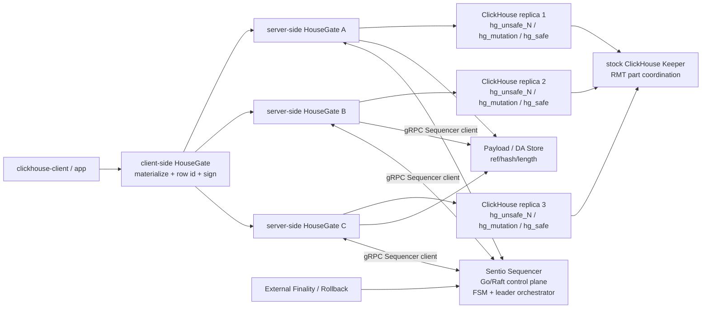
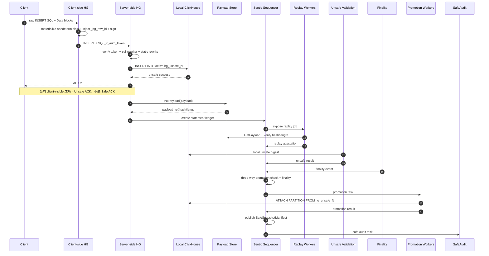
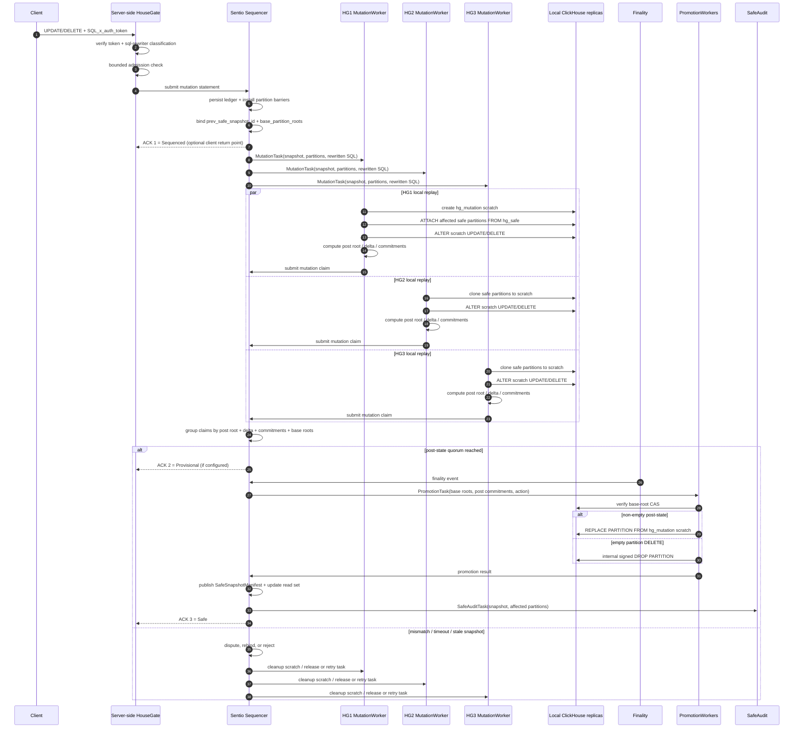
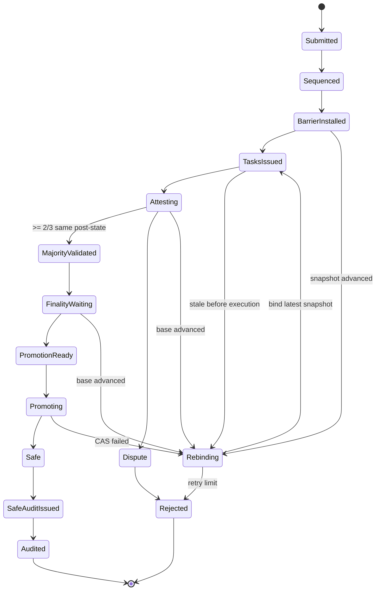

# Sentio Sequencer Storage Integrity 统一设计：INSERT + Bounded UPDATE/DELETE

日期：2026-07-01

来源文档：

- `housegate/docs/superpowers/specs/2026-06-25-housekeeper-storage-integrity-overall-design.zh-CN.md`
- `housegate/docs/superpowers/specs/2026-06-30-storage-integrity-bounded-mutation-design.zh-CN.md`
- `housegate@main/docs/superpowers/specs/2026-06-30-sentio-sequencer-design.zh-CN.md`

本文把当前 INSERT-only storage integrity 实现、bounded UPDATE/DELETE 方案和 main 分支 Sentio Sequencer Go 服务设计合并成一份统一设计。它不是简单拼接：当前实现文档描述的是已跑通的 3 ClickHouse / 3 HouseGate / 3 ClickHouse Keeper fork 基线；Sequencer 设计把完整性控制面重命名并迁移为独立的 Go/Raft/gRPC **Sentio Sequencer**；bounded mutation 文档在该控制面之上扩展 UPDATE/DELETE 的 post-state 校验、`base_partition_root` CAS、`SafeSnapshotManifest` 和 read set gating。

## 1. 设计定位

统一后的 storage integrity 分成三条 lane：

| Lane | 用户入口 | 写入位置 | 验证方式 | Safe 发布方式 |
| --- | --- | --- | --- | --- |
| INSERT | `INSERT ... VALUES` / Native Data block | active `hg_unsafe_N` | three-way promotion check + finality | 当前实现：`ATTACH PARTITION ... FROM hg_unsafe_N`；Sequencer 目标设计：`hg_promote + REPLACE PARTITION` |
| UPDATE | `ALTER TABLE ... UPDATE ... WHERE ...` 或可归一化 `UPDATE ... SET ... WHERE ...` | `hg_mutation` scratch | post-state quorum + finality + base-root CAS | scratch `REPLACE PARTITION` |
| DELETE | `ALTER TABLE ... DELETE WHERE ...` 或可归一化 `DELETE FROM ... WHERE ...` | `hg_mutation` scratch | post-state quorum + finality + base-root CAS | scratch `REPLACE PARTITION`；空 partition 用内部 signed `DROP PARTITION` |

UPDATE/DELETE 的 `post-state quorum` 由 3 个 server-side HouseGate 本地 parallel replay 产生：各自从同一个 safe snapshot clone affected partitions 到 scratch，执行同一条 mutation，并对 post root / partition delta / post commitment 达成 2/3 一致。

INSERT 的 `three-way promotion check` 来自 main 分支 Sequencer 设计，含三部分：`replay quorum`、`partition commitment check`、`byte-side part-lthash check`。它发生在 promotion 前，验证 `hg_unsafe` candidate parts 是否能进入 safe；它不是 SafeAudit。

核心原则：

1. 用户 client 和 ClickHouse driver 不修改；协议增强发生在 client-side HouseGate 和 server-side HouseGate。
2. Sentio Sequencer 是独立 Go 服务，基于 `hashicorp/raft` 复制 FSM；它负责定序、L3 block、`statement_id` 去重、attestation 收集、promotion 裁决、manifest 发布和 gRPC 服务面。它不兼容 ZooKeeper，也不与 ClickHouse Keeper 交互。
3. Sentio Sequencer 的 FSM 只做确定性状态改写；leader-only orchestrator 做 replay dispatch、attestation 收集、finality 观察、promotion 签发等 I/O，再把结果作为命令写回 Raft log。
4. 每个 server-side HouseGate / SNode / Verifier 只操作自己一对一连接的本地 ClickHouse。Sentio Sequencer 通过冻结 participants、Verifier quorum 和 signed evidence 聚合结果。
5. `SafeSnapshotManifest` 是 safe state 的权威对象。mutation 不能把当前 `system.parts` 当成 integrity snapshot。
6. stock ClickHouse v1 中，`hg_safe` 和 `hg_unsafe` 都必须 `STOP MERGES`，并通过 anchored DDL/settings 固化 no-merge 行为；manifest-aware safe merge publication 留给后续 controlled compaction。
7. 所有进入 `hg_safe` 的状态变更都必须经过 Sentio Sequencer 管理的 publication lane。用户不能直接 mutation safe 表，也不能直接提交 `TRUNCATE` / `DROP PARTITION`。

## 2. 统一拓扑



HouseGate 内部 worker（设计视角）：

- SNodeWorker：执行 source write，生成并上报 `RegisterRC`，订阅 Sentio Sequencer 下发的 publication / cleanup command。
- VerifierWorker：执行 INSERT promotion 前的验证动作。它从 signed payload 和 `prev_safe_snapshot` replay INSERT，计算 `ComputedStateRoot`、partition delta 和 replay log hash，提交 `RecordAttestation`；同时读取实际 fetched `hg_unsafe` candidate parts，按 canonical row + `_hg_row_id` 重算 per-part `part_row_lthash`，提交 `RecordByteSideScan`。
- MutationWorker：从 `SafeSnapshotManifest` 指定的 safe snapshot clone affected partitions 到 `hg_mutation` scratch，执行 UPDATE/DELETE，计算 post-state root、partition delta、post commitments，并提交 mutation claim。
- PromotionWorker：执行 Sentio Sequencer-signed publication action；INSERT 发布 verified candidate parts，mutation 使用 scratch `REPLACE PARTITION` 或内部 signed empty-partition action。
- RollbackWorker：处理尚未进入 safe 的 rollback / reject / cleanup，删除 unsafe 或 scratch provisional state，并释放 barrier。
- SafeAuditWorker：promotion 后读取本地 `hg_safe`，重算 safe serving state，提交 audit vote，用于 read set / quarantine 决策。
- SnapshotResolver：解析 latest `SafeSnapshotManifest`，为 replay、mutation、promotion 和 audit 提供 base snapshot / base roots，并校验本地 active set 与 manifest 一致。

### 2.1 Sentio Sequencer 对齐模型

本设计中的 Sentio Sequencer 按 main 分支 `2026-06-30-sentio-sequencer-design.zh-CN.md` 落地为独立 Go 服务：

- **共识与状态：** 3 或 5 节点 `hashicorp/raft` 组，业务真相是 Raft log + deterministic FSM 派生状态。
- **FSM 红线：** `Apply` 不读时钟、不随机、不做网络 I/O、不执行 SQL；只验证签名证据并确定性更新 state。
- **leader orchestrator：** 只在 leader 上运行，负责所有副作用：派发 `ReplayJob`、收集 attestation、请求 byte-side scan、观察 finality、签发 promotion、下发 cleanup，再把结果作为 Raft command 写回 FSM。
- **gRPC 服务面：** HouseGate/SNode/Verifier 主动 dial Sequencer；写类 RPC 非 leader 返回 `NotLeader{leader_addr}`；ReplayJob 和 Promotion 通过数据面节点发起的订阅流下发。
- **ClickHouse Keeper 边界：** stock ClickHouse Keeper 只协调 `hg_unsafe` 的 ReplicatedMergeTree part 复制；Sentio Sequencer 不讲 ZooKeeper 协议，也不解析 ClickHouse Keeper 状态。

FSM 中和本文相关的核心命令映射：

| Sequencer command | 本文语义 |
| --- | --- |
| `SubmitStatement` | 接收 HouseGate ingress 的 signed statement，验签、验证 `statement_id` 非成员证明，分配 `statement_seq`，推进 L3 open block。 |
| `SealL3Block` | 把 open statements 封成 L3 block，提交 `prev_l3_hash`、`spent_ids_root_after` 和 block-level schema/executor profile。 |
| `RegisterRC` | source SNode 上报 INSERT candidate parts / source claim；mutation 扩展中对应 post-state claim 的输入记录。 |
| `RecordAttestation` | 记录 Verifier 的 signed replay receipt，并在 FSM 内重算 replay check。 |
| `RecordByteSideScan` | INSERT 路径记录 Verifier 对实际 fetched candidate parts 的 `part_row_lthash` 背书。 |
| `RecordAnchorFinality` | 记录 L2/L1 finality 或外部 finality event，使 `QuorumVerified` statement 进入 promotable。 |
| `RecordPromotionIssued` | 记录 leader 签发的 `PromoteSafePartition` / mutation promotion command、`promotion_seq` 和签名。 |
| `PublishSafeSnapshot` | 验证并发布新的 `SafeSnapshotManifest`，推进 safe watermark / read set。 |
| `ScheduleUnsafeCleanup` / `RecordCleanupAck` | INSERT promotion 后维护已提升 unsafe part registry 与清理 ack。 |
| `RegisterNode` / `MarkActive` / `EvictNode` | 维护 Verifier/SNode membership、Active 读集和公钥。 |

`RecordAttestation` 和 `RecordByteSideScan` 的**语义证据是必须的**，但命令名和提交形态不是强约束。实现可以拆成两个 RPC/command，也可以由同一个 VerifierWorker 一次性提交组合 evidence；FSM 必须能分别持久化和判定 replay evidence 与 byte-side evidence。缺少 replay evidence 不能证明 signed payload 的执行结果；缺少 byte-side evidence 不能证明即将进入 safe 的 candidate part bytes 与 source 声明一致。

Mutation 在 main 分支 Sequencer 设计中标为 P2，不属于 v1 INSERT 主体。本文把 bounded UPDATE/DELETE 作为该 P2 lane 的细化：保留 Sequencer 的 Raft/FSM/orchestrator/gRPC 边界，只扩展 command payload、barrier、post-state quorum 和 mutation promotion 规则。

## 3. 表布局

每张受保护逻辑表对应以下物理表：

| 表 | Engine | 用途 |
| --- | --- | --- |
| `hg_safe.<table>` | MergeTree | 已验证可读状态；v1 必须 STOP MERGES |
| `hg_unsafe.<table>` 或 `hg_unsafe_0/1.<table>` | ReplicatedMergeTree | INSERT unsafe 候选 parts；v1 必须 STOP MERGES |
| `hg_promote.<promotion_id>__<partition_id>` | MergeTree | Sequencer 目标 INSERT publication 的 copy-on-write commit buffer；用于 `REPLACE PARTITION` |
| `hg_mutation.<table_id>__<statement_id>__<worker_id>` | MergeTree | UPDATE/DELETE scratch post-state |

协议列和保留列：

- `_hg_row_id FixedString(32)` 是 v1 必需协议列，由 client-side HouseGate 对 INSERT 注入。
- 所有 `_hg_*` 名称为协议保留名，用户不能 UPDATE、rename、drop 或改变类型/default/key。
- UPDATE 不改变 `_hg_row_id`；DELETE 删除对应 row instance。
- 不引入每行 `_hg_statement_id`、`_hg_block_seq`、`_hg_partition_id` 作为正确性前提。safe time-travel 走 manifest，不走 per-row sequencing columns。

## 4. 输入签名、物化和 rewrite

### 4.1 Client-side HouseGate

client-side HouseGate 是签名前 normalizer：

1. 物化白名单非确定性零参数函数：`now()`、`rand()`、`random()`、`rand64()`、`generateUUIDv4()`。
2. INSERT 时注入 `_hg_row_id`：

```text
BLAKE3("housegate-row-id-v1" || network_id || table_id || statement_id || global_row_ordinal)
```

3. 对最终 `Query.Body` 生成 `SQL_x_auth_token`：

```text
purpose = housegate-query
iss     = <client-side HouseGate signer address>
qhash   = Keccak256(Query.Body)
```

server-side HouseGate 不重新物化非确定函数。签名后仍包含未物化非确定函数的 storage-integrity 写入必须 fail closed。

### 4.2 Server-side HouseGate

server-side HouseGate 做：

1. 校验 JWS、allowlist、`purpose`、`qhash`。
2. 调用 sql-rewriter，取得 statement type、accessed tables、logical/physical rewrite。
3. INSERT：storage-integrity plugin 构造 static table map，把 target rewrite 到 active `hg_unsafe_N`。
4. UPDATE/DELETE：不 rewrite 到 unsafe，也不直接改 safe；通过 admission 后写 Sentio Sequencer mutation ledger，由 MutationWorker 在 scratch 执行。
5. SELECT：默认 rewrite 到 `hg_safe`，并在 read set gating 生效后只路由到满足 requested safe watermark 的 worker。

## 5. ACK 语义

ACK 语义沿用 `2026-06-22-storage-integrity-design.zh-CN.md` 的三段定义。INSERT 和 mutation 都用同一组列来描述：`ACK`、`条件`、`对客户端/读路径的含义`。不能把客户端写成功等同于 safe。

INSERT ACK 语义：

| ACK | 条件 | 对客户端/读路径的含义 |
| --- | --- | --- |
| ACK 1 = Sequenced | Sentio Sequencer 已定序并持久化 statement；ordered + durable，但 source write 尚未完成 | 不是当前默认 client-visible 返回点。当前 optimistic/source-write 路径可以先写 `hg_unsafe`，再异步补 statement ledger / sequencing；以后 managed/sequencing-before-write 模式可暴露该 ACK。默认 safe SELECT 仍读旧 safe snapshot。 |
| ACK 2 = Unsafe | source 已把数据写入 `hg_unsafe`，本地 ClickHouse unsafe INSERT 返回成功 | 当前 INSERT 的同步成功语义：client 收到 query success。它只表示 provisional / unsafe，不表示 integrity-final；显式 `unsafe_latest` 才可能看到这部分数据，普通 safe SELECT 仍读旧 safe snapshot。 |
| ACK 3 = Safe | three-way promotion check、finality、promotion、`SafeSnapshotManifest` 发布完成 | integrity-final；普通 safe SELECT 可以读到新状态。当前 INSERT SQL 响应默认不等待 ACK 3，可通过状态查询、watermark 或订阅类接口感知。 |

UPDATE/DELETE 的 ACK 语义在 §7 单独列出；它与 INSERT 同构，但 ACK 2 是 scratch provisional claim，不是 `hg_unsafe` 可读数据。

## 6. INSERT Lane

### 6.1 流程



### 6.2 Three-way promotion check

INSERT promotion 前的目标校验是 Sequencer 设计里的三方提升校验，而不是 SafeAudit。Replay job 使用 statement 派生：

```text
block_seq
prev_safe_snapshot
schema_snapshot_id
executor_profile_id
source_claim_root
statement.sql_hash
payload_ref/hash/length
```

Replay Verifier 必须读取 payload bytes 并重新校验 hash/length，不能只信任 metadata。

三方提升校验：

| Check | 验证内容 | 目的 |
| --- | --- | --- |
| Replay check | ≥2 个独立 Verifier replay signed payload，得到与 source claim 一致的 state root | 证明签名 payload 的语义执行结果正确 |
| Partition commitment check | `BasePartitionRoot + Σ(source 声明的新 part LtHash) == verifier 的 post partition commitment` | 把 replay root 绑定到 source 的 per-part 声明 |
| Byte-side part-lthash check | Verifier 从实际 fetched `hg_unsafe` candidate parts 重算 `part_row_lthash`，与 `RCRecord.candidate_parts` 比对 | 把 source 的 per-part 声明绑定到磁盘真实 bytes |

对 INSERT route A（source 先写 unsafe，再把 candidate parts 发布到 safe）来说，`RecordAttestation` 和 `RecordByteSideScan` 代表两类不可省的 promotion 前置证据：前者支撑 Replay check，后者支撑 Byte-side part-lthash check。只有改成 route B / full-node local replay、不搬运 source bytes 的模型时，byte-side scan 这一路才可以被 majority local materialization 取代；本文的 Sequencer target 仍按 route A 定义，所以二者都必须进入 promotion 判定。

#### `R_source` / `source_claim_root`

`R_source` 是 source 在 `RegisterRC` 时声明的 **post-state root**，即同一个 signed INSERT payload 从上一版 safe snapshot replay 后应得到的状态根。它不是 raw part bytes 的 hash，也不是只对 SQL 文本或 payload metadata 做 hash；target 语义里它必须绑定到 `prev_safe_snapshot`、schema snapshot、executor profile、payload 以及 replay 后的 partition commitments。

目标计算方式：

```text
row_id = H(network_id, table_id, statement_id, global_row_ordinal)
row_lthash = LtHash("housegate-row-v1", table_id, row_id, canonical column values)
part_row_lthash = Σ row_lthash

partition_root_after[p] =
  partition_root_before[p] + Σ part_row_lthash(candidate parts in p)

data_root_after =
  H(canonicalized [(table_id, schema_hash, partition_roots_after, active_parts_after)])

R_source =
  source_claim_root =
  state_root_after =
  H(schema_snapshot_id, schema_root, executor_profile_id, data_root_after)
```

也就是说，source 先用 pinned executor/profile 对 signed payload 做一次同构 replay，得到 replay 后的 row set、part LtHash、partition commitments 和最终 `state_root_after`，再把这个值作为 `source_claim_root` 写入 `RCRecord`。Replay Verifier 收到 `ReplayJob.SourceClaimRoot` 后独立执行同一 payload，产出 `ComputedStateRoot`，并要求 `ComputedStateRoot == SourceClaimRoot`。

设计要求：`source_claim_root` 必须来自 replay 后的 `state_root_after`。仅由 statement metadata、SQL hash 或 payload commitment 派生的 digest 不能作为 promotion 判据。

INSERT 的 byte-side 路径由 **VerifierWorker** 执行：读取实际 fetched `hg_unsafe` candidate parts，按 canonical row + `_hg_row_id` 重算 per-part `part_row_lthash`，并通过 `RecordByteSideScan` 写入 FSM。它不是 SafeAudit；它发生在 promotion 前，是 three-way promotion check 的第三路，用来把 `RCRecord.candidate_parts` 精确绑定到即将进入 safe 的磁盘字节。

### 6.3 INSERT promotion

INSERT promotion 保持当前实现语义：PromotionWorker 按 Sentio Sequencer task 在每个本地 ClickHouse 执行 `ATTACH PARTITION ... FROM unsafe`，把已验证 unsafe partition 发布到本地 `hg_safe`。

```sql
ALTER TABLE <safe_table>
ATTACH PARTITION ID '<partition_id>'
FROM <unsafe_table>;
```

promotion task 必须包含：

```text
promotion_key
unsafe_table
safe_table
unsafe_buffer_id
unsafe_buffer_epoch
partition_ids
statement_ids
expected_rows
expected_hash
```

执行规则：

- `partition_ids` 由 statement / part registry metadata 传入；task 缺失 `partition_ids` 时 fail closed，不扫描 unsafe 表反推。
- 每个 server-side HouseGate/ClickHouse pair 都要在本地执行一次 attach。
- attach 后 worker 读取本地 safe readback，校验 row count / rows hash。
- Sentio Sequencer 等 promotion quorum 后推进 safe watermark，发布新的 `SafeSnapshotManifest`，并创建 SafeAudit task。
- INSERT 的 attach 语义和 mutation 的 replace 语义不同：INSERT 是把新 verified parts 挂入 safe；UPDATE/DELETE 是把旧 safe partition 替换成 post-state partition。

与 main 分支 Sentio Sequencer 设计对齐后的目标 publication 是 `PromoteSafePartition -> hg_promote -> REPLACE PARTITION`：

```sql
ALTER TABLE hg_promote.`<promotion_id>__<partition_id>`
ATTACH PARTITION ID '<partition_id>'
FROM hg_safe.`<table>`;

-- 每个已验证 candidate part 从 hg_unsafe hardlink 到 hg_promote/detached 后 attach 到 hg_promote
ALTER TABLE hg_promote.`<promotion_id>__<partition_id>`
ATTACH PART '<part_name>';

ALTER TABLE hg_safe.`<table>`
REPLACE PARTITION ID '<partition_id>'
FROM hg_promote.`<promotion_id>__<partition_id>`;
```

目标路径的目的不是改变 INSERT 的验证语义，而是解决同 partition 并发 promotion、base snapshot CAS、exactly-once 和 unsafe cleanup 的工程边界。本文保留当前 `ATTACH` 作为已实现路径；Sequencer P0/P1 应把 INSERT publication 收敛到 `hg_promote + REPLACE PARTITION`，或明确记录为何当前 attach 路径足以满足同样的不变量。

## 7. UPDATE/DELETE Lane

Mutation 语义先按 `2026-06-30-storage-integrity-bounded-mutation-design.zh-CN.md` 的 v1 目标定义；当前代码基线仍是 INSERT-only。

核心语义：

- UPDATE/DELETE 不写 `hg_unsafe`，也不直接 mutation `hg_safe`。
- mutation 绑定一个明确的 `prev_safe_snapshot_id`，只从 latest safe snapshot 的 affected partitions clone pre-state 到 `hg_mutation` scratch。
- scratch 是 provisional post-state，不参与默认 SELECT rewrite，也不是可服务表。
- 默认 safe SELECT 在 ACK 3 之前仍读旧 safe snapshot；mutation 的 ACK 2 不等价于 INSERT 的“unsafe 表可读”。
- 同一 `(table_id, partition_id)` 上如果有更早的 INSERT 已 Sequenced/Unsafe ACK 但尚未 Safe 或 rollback，后续 UPDATE/DELETE 必须等待，不能基于看不到该 INSERT 的旧 safe snapshot 执行。
- 进入 Safe 之前 rollback 只取消 task、清理 scratch、释放 barrier；进入 Safe 之后不能原地回滚，只能提交新的反向 mutation statement。

Mutation ACK 语义：

| ACK | 条件 | 对客户端/读路径的含义 |
| --- | --- | --- |
| ACK 1 = Sequenced | Sentio Sequencer 已持久化 mutation statement，并为 affected partitions 安装 barrier | ordered + durable；mutation 尚未执行，safe 读仍是旧 snapshot |
| ACK 2 = Provisional / Unsafe | 本地 worker 已从 `prev_safe_snapshot_id` clone affected safe parts 到 scratch，完成 UPDATE/DELETE materialization，并提交本地 provisional claim | 可配置为写请求返回点，但只是本地 provisional 结果；默认 safe SELECT 仍读旧 snapshot，scratch 不作为普通读 surface |
| ACK 3 = Safe | 至少 2/3 worker 对 post-state root、partition deltas、post commitments、schema snapshot、base roots 达成一致，finality 到达，promotion 完成并发布 `SafeSnapshotManifest` | integrity-final；普通 safe SELECT 才能读到新状态 |

v1 固定采用 `parallel_local_replay`：3 个 server-side HouseGate 都从各自本地 safe snapshot clone affected partitions 到 scratch，执行同一条 normalized mutation，并提交 claim。每个 claim 同时是 local replay attestation；v1 不区分 source claim 和 replay claim。

Mutation 端到端流程：



Mutation 示例，以单 partition UPDATE 为例：

初始 safe snapshot `S10` 中，表 `balance` 的 partition `P=2026-06-30` 有两行：

```text
row_a = (_hg_row_id=a, account='alice', amount=100)
row_b = (_hg_row_id=b, account='bob',   amount=50)

base_partition_root(P) =
  LtHash(row_a@amount=100) + LtHash(row_b@amount=50)
```

用户提交：

```sql
ALTER TABLE balance
UPDATE amount = amount + 10
WHERE day = '2026-06-30' AND account = 'alice';
```

每一步的结果：

| 步骤 | 产生的结果 |
| --- | --- |
| Admission | 语句被归一化为 bounded mutation；affected partitions = `[P]`；绑定 `prev_safe_snapshot_id=S10` 和 `base_partition_root(P)`；安装 `(table_id, P)` barrier。 |
| ACK 1 = Sequenced | `MutationStatement` 持久化，顺序确定；safe SELECT 仍读 `S10`，scratch 尚未生成。 |
| Worker clone | HG1/HG2/HG3 分别创建自己的 `hg_mutation` scratch，从 `hg_safe` clone `P`，并校验 scratch 初始 commitment 等于 `base_partition_root(P)`。 |
| Worker execute | 三个 worker 都在本地 scratch 执行同一条 UPDATE；`_hg_row_id=a` 保持不变，`alice.amount` 从 `100` 变成 `110`，`bob` 不变。 |
| Worker claim | 每个 worker 计算 `post_partition_root(P)`、`partition_delta(P)`、`post_state_root`、rows before/after/updated，并签名提交 `MutationClaim`。 |
| Post-state quorum | Sentio Sequencer 按 `(post_state_root, partition_delta, post_partition_root, base_partition_root)` 分组；至少 2/3 claim 一致时进入 `MajorityValidated`。 |
| ACK 2 = Provisional | 如果配置客户端等待到 ACK 2，此时只表示本地 scratch post-state 有 2/3 一致；默认 safe SELECT 仍读 `S10`。 |
| Finality + promotion | finality 到达后，PromotionWorker 在执行前重新计算本地 `hg_safe.P` commitment，必须仍等于 `base_partition_root(P)`；CAS 通过后用 scratch `REPLACE PARTITION`。 |
| ACK 3 = Safe | 发布新 `SafeSnapshotManifest S11`，其中 `partition_root(P)=post_partition_root(P)`、`state_root=post_state_root`；默认 safe SELECT 开始读到 `alice.amount=110`。 |

这个例子里的 commitment 变化可以写成：

```text
post_partition_root(P) =
  LtHash(row_a@amount=110) + LtHash(row_b@amount=50)

partition_delta(P) =
  post_partition_root(P) - base_partition_root(P)
  = LtHash(row_a@amount=110) - LtHash(row_a@amount=100)

post_state_root =
  H(schema_snapshot_id, schema_root, executor_profile_id, data_root_after)
```

DELETE 的形态相同，只是 delta 表达为删除旧 row commitment：

```text
DELETE alice:
post_partition_root(P) = LtHash(row_b@amount=50)
partition_delta(P) = -LtHash(row_a@amount=100)
```

如果 DELETE 把整个 partition 清空，scratch 中没有可 `REPLACE` 的 post partition；promotion 使用 Sentio Sequencer 签发的内部 `DROP PARTITION` publication action，并同样要求 `base_partition_root` CAS 通过后才能发布 `S11`。

### 7.1 Admission

v1 支持：

```sql
ALTER TABLE <db>.<table> UPDATE ... WHERE ...;
ALTER TABLE <db>.<table> DELETE WHERE ...;
```

以及可明确归一化为 ClickHouse mutation 的：

```sql
UPDATE <db>.<table> SET ... WHERE ...;
DELETE FROM <db>.<table> WHERE ...;
```

拒绝：

- 无 partition predicate。
- affected partition 数量、touched parts、touched bytes 超过阈值。
- 用户入口 `TRUNCATE` / `DROP PARTITION`。
- ClickHouse lightweight DELETE mask。
- 修改 `_hg_*` 协议列。
- 修改 partition key、order key、primary key 相关列。
- subquery、join、dictionary lookup、remote/table function 等难以稳定界定 touched set 的表达式。
- 签名后仍含未物化非确定函数。

v1 的 bounded 是 partition 级 bounded：按 latest manifest 中 affected partitions 的 active parts/bytes 估算成本，不依赖 primary key 或 data skipping index 精确缩小 touched set。

### 7.2 Mutation 状态机



Barrier 粒度是 `(table_id, partition_id)`。同一 partition 上只允许一个未完成 mutation；mutation barrier 和 publish lock 同时覆盖同 partition 的 INSERT promotion、UPDATE promotion、DELETE promotion，以及后续 controlled compaction publication。

如果 WHERE 影响多个 partition，Sentio Sequencer 必须按排序顺序一次性安装所有 barriers，避免死锁。

### 7.3 MutationWorker

每个 worker 只操作本地 ClickHouse：

1. claim mutation task。
2. 读取 `prev_safe_snapshot_id`、`base_partition_roots`、affected partitions、rewritten mutation SQL。
3. 创建 scratch 表：

```sql
CREATE TABLE hg_mutation.`<table_id>__<statement_id>__<worker_id>`
AS hg_safe.`<table>`
ENGINE = MergeTree
PARTITION BY <same partition expr>
ORDER BY <same order expr>
PRIMARY KEY <same primary key>
SETTINGS <same settings>;
```

4. SnapshotResolver 校验 latest manifest 和本地 active set。
5. attach affected safe partitions 到 scratch。
6. 校验 scratch 初始 commitment 等于 manifest base root。
7. 在 scratch 上执行 `ALTER TABLE ... UPDATE/DELETE WHERE ...`。
8. 等待 `system.mutations` 完成。
9. 计算：
   - `post_state_root`
   - 每个 affected partition 的 `partition_delta`
   - 每个 affected partition 的 `post_partition_commitment`
   - rows before / after / updated / deleted
10. 签名并提交 claim。

Sentio Sequencer 对 claim 分组时不能只比较 `post_state_root`。必须同时比较：

- `post_state_root`
- `partition_deltas`
- `post_partition_commitments`
- `schema_snapshot_id`
- `prev_safe_snapshot_id`
- `base_partition_roots`

任一字段不一致，即使 state root 相同，也不能 promotion。

### 7.4 Rebind 与 pending INSERT

mutation 只基于 current latest safe snapshot，不读 unsafe state。因此同一 partition 上如果存在更早 sequenced 或 Unsafe ACK、但尚未 safe/rollback 的 INSERT，后续 UPDATE/DELETE 必须等待。

规则：

- Sentio Sequencer 维护 `(table_id, partition_id)` pending write queue。
- 后续 mutation dispatch 前，必须确认同 partition 更早 INSERT 已 safe promotion 或 rollback/rejected。
- snapshot 在 dispatch、worker execution、majority decision、finality wait 或 promotion 前推进时，旧 scratch/claim 不能复用。
- Rebinding 必须重新绑定 latest snapshot，重新 clone affected partitions，重新执行 mutation。
- 超过 `max_rebind_attempts` 或 `max_rebind_duration` 后，statement retryable reject。

## 8. SafeSnapshotManifest

`SafeSnapshotManifest` 是 safe state object。每次 INSERT promotion、mutation promotion 或后续 controlled compaction publication 成功后，Sentio Sequencer 发布新 manifest：

```text
snapshot_id
parent_snapshot_id
safe_l3_block_seq
schema_snapshot_id
schema_root
executor_profile_id
data_root
state_root
manifest_root
tables[]:
  table_id
  schema_hash
  partition_roots[partition_id]
  active_parts[]:
    part_name
    partition_id
    part_phys_hash
    part_row_lthash
    row_count
    bytes
    storage_refs
```

Canonicalization 要求：

- table、partition、part 顺序固定后再 hash。
- manifest root 和 state root 由 committed metadata 派生。
- mutation replay 使用 `prev_safe_snapshot_id` 和 affected partition 的 `base_partition_root`，不能使用本地 `system.parts` 的瞬时 active set。

v1 只承诺 latest safe watermark 可读。历史 manifest 是 audit/replay proof；历史 `as_of_safe` 需要 active part retention/refcount 或从 L3/peer 恢复后才能承诺本地可读。

## 9. Sentio Sequencer Ledger

Sentio Sequencer 不再把 storage-integrity ledger 暴露为 ClickHouse Keeper znode path。按 main 分支 Sequencer 设计，ledger 是 Raft log command 和 FSM 派生状态；gRPC API 是外部交互面，FSM snapshot 是压缩/恢复面。

### 9.1 INSERT 记录

| FSM 记录 | 来源 command / RPC | 作用 |
| --- | --- | --- |
| `StatementState.Env` | `SubmitStatement` / `SequencerIngress.SubmitStatement` | signed `StatementEnvelopeV2`、payload ref/hash/length、schema/executor profile、source assignment、`statement_seq` 绑定。 |
| `L3BlockHeader` | `SealL3Block` | L3 block hash 链、`statement_seq` 范围、`spent_ids_root_after`、`PrevSafeSnapshotID`。 |
| `RCRecord` | `RegisterRC` / `SourceClaims.RegisterResultClaim` | source SNode 的 candidate parts、source claim root、per-partition new-part LtHash 声明。 |
| `ReplayAttestation` | `RecordAttestation` / `VerifierGateway.SubmitAttestation` | Verifier signed receipt；FSM 在已记录 receipt 上重算 replay check。 |
| `ByteSideScanMsg` | `RecordByteSideScan` / `VerifierGateway.SubmitByteSideScan` | INSERT byte-side part LtHash 背书。 |
| `AnchorRef` | `RecordAnchorFinality` | finality / L2 anchor 引用，使 `QuorumVerified` statement 可进入 promotion。 |
| `PromotionIssued` | `RecordPromotionIssued` | promotion seq、promotion command、leader signature、base snapshot/root 或 candidate part set。 |
| `SafeSnapshotManifest` | `PublishSafeSnapshot` / `SafeState.GetManifest*` | safe watermark、manifest root、partition roots 和 active part metadata。 |
| `PromotedUnsafe` registry | `ScheduleUnsafeCleanup` / `RecordCleanupAck` | 已提升但未清理的 unsafe parts；用于 `unsafe_latest` 过滤和 cleanup 幂等。 |

### 9.2 Mutation 记录

Mutation 是 P2 lane，仍复用同一个 Raft/FSM 模型。建议新增或扩展以下 FSM 记录，而不是新增 znode 树：

| FSM 记录 | 作用 |
| --- | --- |
| `MutationStatement` | `kind=mutation`、`mutation_type=update|delete`、original/rewritten SQL hash、table id、`prev_safe_snapshot_id`、base partition roots、affected partitions、payload ref/hash、`rebind_count`。 |
| `PartitionBarrier` | `(table_id, partition_id)` 上的 pending mutation / INSERT promotion / controlled compaction publication 串行化。 |
| `PendingWriteQueue` | 阻塞后续 UPDATE/DELETE，直到同 partition 更早 INSERT safe 或 rollback/rejected。 |
| `MutationClaim` | worker signature、post root、partition deltas、post commitments、base roots、scratch parts、rows before/after/updated/deleted。 |
| `MutationDecision` | majority/dispute/rejected、majority root、minority workers、finalized、promotion ready、stale reason、new snapshot id。 |
| `WorkerWatermark` / `ReadSet` | per-worker `local_safe_snapshot_id`、`read_set=false/needs_repair` gating。 |
| `WorkerQuarantine` | replay/mutation/safeAudit minority 的 unified quarantine 状态。 |

mutation statement 必须记录：

- `mutation_type=update|delete`
- `execution_mode=parallel_local_replay`
- original / rewritten SQL hash
- table id 和 safe/scratch 表信息
- `prev_safe_snapshot_id`
- `base_partition_roots`
- affected partitions
- predicate / assignments hash
- payload ref/hash
- `rebind_count`

claim 必须记录 worker signature、post root、partition deltas、post commitments、base roots、scratch parts、rows before/after/updated/deleted。

### 9.3 Unified quarantine

当前已有 replay minority quarantine 和 safeAudit quarantine。统一设计建议提升为：

```text
WorkerQuarantine[worker_id]
```

被 active quarantine 的 worker 不能 claim replay、byte-side scan、mutation、promotion、rollback、safeAudit，也不能继续提交 attestation 或 safe audit vote。

## 10. Promotion 与 read set

INSERT 和 mutation 共用 publication 外层不变量：

1. Sentio Sequencer decision 达到 promotion 条件。
2. external finality 已到达。
3. `(table_id, partition_id)` barrier/publish lock 仍有效。
4. promotion task 携带明确的 `partition_ids`、`statement_ids`、expected rows/hash 或 post commitments。
5. publication 成功后重新读取 safe affected partitions，提交 promotion result。
6. Sentio Sequencer 达到 promotion quorum 后发布新 `SafeSnapshotManifest`。

INSERT promotion：

- 当前实现路径使用 `ATTACH PARTITION ID '<partition_id>' FROM <unsafe_table>`。
- Sequencer 目标路径使用 leader-signed `PromoteSafePartition`，由 SNode 构造 `hg_promote` commit buffer，再对 `hg_safe` 执行 `REPLACE PARTITION`。
- `partition_ids` / `CandidateParts` 必须来自 statement / part registry / RCRecord metadata；不能通过扫描 unsafe 表临时推导。
- 幂等锚点是 `promotion_seq`、`promotion_key`、participant result、unsafe buffer epoch、statement_ids、base snapshot/root 和 readback 校验。
- INSERT 当前 attach 不使用 mutation 的 `REPLACE PARTITION` 语义；目标 `hg_promote + REPLACE` 路径则把 base safe partition + verified candidate parts 构造成完整 post partition 后原子发布。

Mutation promotion：

- 非空 post-state：`REPLACE PARTITION FROM hg_mutation.<scratch>`。
- 空 partition DELETE：内部 Keeper-signed `DROP PARTITION`，并在新 manifest 中记录 `active_parts=[]`、`partition_root=zero_lthash`。
- promotion task 携带 `base_safe_snapshot_id` 和每个 affected partition 的 `base_partition_root`。
- worker 执行 SQL 前重新计算本地 current partition root；`current_partition_root != base_partition_root` 时禁止 publication。
- 不允许用 `ATTACH PARTITION` 表达 mutation post-state，因为它不能删除或重写旧行集合。

Read set gating：

- 不要求所有 worker 都在 manifest 发布前完成本地 publication。
- 但未完成 publication 的 worker 必须在 manifest 发布前或同一原子状态更新中移出 read set。
- 普通 safe SELECT 只能路由到 `local_safe_snapshot_id >= requested_snapshot_id` 的 worker。
- 落后 worker repair/sync 到 latest manifest 后才能重新进入 read set。

## 11. Rollback

Rollback event 由外部服务写入 Sentio Sequencer。行为按状态区分：

| 状态 | 行为 |
| --- | --- |
| Sequenced / BarrierInstalled / TasksIssued | 删除 task，释放 barrier，标记 rejected |
| Attesting | 停止接收新 claim，删除 scratch task，释放 barrier |
| MajorityValidated / FinalityWaiting | 不生成 promotion task，删除 scratch，释放 barrier |
| PromotionReady / Promoting | 如果尚未 replace，阻止 promotion；如果部分 worker 已 replace，需要 repair |
| Safe / Audited | 不原地 rollback；必须提交新的反向 statement |

进入 safe 后不能无 ledger 地原地回滚。

## 12. SafeAudit

SafeAudit 在 INSERT 和 mutation promotion 后执行：

1. Sentio Sequencer 创建 audit task，包含 snapshot、table/range/affected partitions、participants。
2. 每个 SafeAuditWorker 查询本地 `hg_safe`。
3. worker canonical encode rows 并计算 batch hash。
4. Sentio Sequencer 比较 row count / rows hash。
5. `3/3` 一致通过；`2/3` 一致时通过并 quarantine minority；无多数或超时则 audit failed。

SafeAuditCoordinator / Sequencer FSM 不读取行数据、不计算大范围 hash。外部只能通过 gRPC 提交 audit vote；decision/quarantine 只能由 Sequencer FSM 根据已记录证据派生，不能由外部直接写。

注意：SafeAudit 是 promotion 后的 serving/read-set 审计，检查本地 `hg_safe` 是否和已发布 manifest / majority 结果一致；它不负责 promotion 前的 INSERT byte-side validation。promotion 前的 byte-side check 由 Verifier 对实际 fetched `hg_unsafe` candidate parts 重算 `part_row_lthash` 完成，并作为 `RecordByteSideScan` 进入 Sequencer FSM。

## 13. DA / Payload Store

当前实现使用 `MockPayloadStore`：

```text
PutPayload(table_id, statement_id, payload)
  -> payload_hash = replay.DigestBytes(payload)
  -> payload_length = len(payload)
  -> payload_ref = mockda://<table_id>/<statement_id>/<hash>
```

Sentio Sequencer statement 只保存 `payload_ref`、`payload_hash`、`payload_length`。Replay Verifier 必须重新读 bytes 并校验 hash/length。

统一设计保留 DA 接口，不把中心化 mock store 写死进协议。后续可以替换为 S3、本地分层存储、中心化 DA gateway 或去中心化 DA；只要 `payload_ref/hash/length` 语义稳定，Sentio Sequencer ledger 不需要改。

## 14. 配置汇总

基础配置：

```yaml
storage_integrity:
  enabled: true
  mock_payload_store:
    path: "/var/lib/housegate/mock-payloads"
  sequencer:
    grpc_endpoints:
      - "sequencer1:9090"
      - "sequencer2:9090"
      - "sequencer3:9090"
    replay_quorum: 2
    request_timeout: "10s"
    not_leader_retry: true
  raft:
    node_id: "sequencer1"
    data_dir: "/var/lib/sentio-sequencer/raft"
    peers:
      - "sequencer1:12000"
      - "sequencer2:12000"
      - "sequencer3:12000"
  unsafe_validation:
    query_timeout: "10s"
  workers:
    poll_interval: "1s"
    replay: true
    unsafe_validation: true
    promotion: true
    rollback: true
    safe_audit: true
```

mutation 扩展配置：

```yaml
storage_integrity:
  mutations:
    enabled: true
    scratch_database: "hg_mutation"
    query_timeout: "30s"
    mutation_timeout: "120s"
    max_touched_partitions: 4
    max_touched_parts: 128
    max_touched_bytes: 1073741824
    require_partition_predicate: true
    wait_mutations_sync: 2
    reject_lightweight_delete: true
    quarantine_minority: true
    max_rebind_attempts: 3
    max_rebind_duration: "300s"
  safe_tables:
    stop_merges: true
    enforce_no_merge_settings: true
    verify_physical_active_matches_manifest: true
  safe_merges:
    enabled: false
```

不需要配置 replica list。Sentio Sequencer membership 冻结 participants，HouseGate 根据本实例和本地 upstream 派生 participant identity。

## 15. 实施路线

### P0：Sentio Sequencer P0 + INSERT 当前路径

- 建立 `cmd/sequencer` / `pkg/sequencer/{fsm,orchestrator,server,raftnode,accumulator}` 的 Go/Raft/gRPC 控制面骨架。
- 冻结 `sequencer-go` proto：`StatementEnvelopeV2`、`RCRecord`、`PromoteSafePartition`、`ByteSideScanMsg`，以及复用 replay 类型的 wire form。
- 保留当前 INSERT replay / Verifier byte-side scan（当前代码可先由 `UnsafeValidationWorker` 兼容承载）/ finality / rollback 基线，短期可继续用 `ATTACH PARTITION FROM unsafe` 作为兼容 publication。
- 引入 `SafeSnapshotManifest` 发布和 latest safe watermark。
- 对 `hg_safe` / `hg_unsafe` 强制 STOP MERGES，并在启动和巡检时校验。

### P0.5：INSERT publication 收敛到 Sequencer 目标设计

- 将 INSERT promotion 从兼容 `ATTACH PARTITION FROM unsafe` 收敛到 main 分支 Sequencer 设计的 `PromoteSafePartition -> hg_promote + REPLACE PARTITION`。
- promotion command 携带 `promotion_seq`、`BaseSafeSnapshotID`、`BasePartitionRoot`、`CandidateParts` 和 leader secp256k1 signature。
- SNode 执行 base-root CAS、构造 `hg_promote` commit buffer、`REPLACE PARTITION`、readback、unsafe cleanup ack。
- 若继续保留 attach 路径，必须证明它在同 partition 并发 promotion、幂等重试、base drift、unsafe cleanup 上满足等价不变量。

### P1：Mutation admission 和 ledger

- 识别 UPDATE/DELETE statement type。
- 接入 sql-rewriter classification。
- 实现 bounded admission。
- 新增 mutation ledger、barrier、pending write queue、claim quorum、minority quarantine、rebind。

### P2：Mutation execution 与 promotion

- 实现 SnapshotResolver。
- 实现 MutationScratchExecutor / MutationWorker。
- PromotionWorker 支持 mutation `REPLACE PARTITION` 和 empty partition internal `DROP PARTITION`。
- 发布新 manifest，维护 worker local watermark 和 read set。

### P3：审计、隔离和修复

- 统一 worker quarantine。
- SafeAudit 覆盖 INSERT 和 mutation。
- promotion quorum 后对未追上 worker 做 read set gating。
- 增加 repair/sync 流程。

### P4：后续 controlled compaction

- `hg_safe` 继续 STOP MERGES。
- Sentio Sequencer 选择 manifest input parts。
- HouseGate 在 `hg_compact` shadow table 执行受控 merge。
- 校验 input/output LtHash 等式。
- 用 signed `REPLACE PARTITION` 发布新 manifest。

## 16. 验收测试

必须使用真实二进制拓扑：

- 3 ClickHouse
- 3 HouseGate
- 3 Sentio Sequencer + stock ClickHouse Keeper
- real sql-rewriter image
- mock finality / rollback

测试矩阵：

| 场景 | 预期 |
| --- | --- |
| INSERT 正常路径 | unsafe success -> three-way promotion check -> finality -> promotion -> manifest -> safeAudit |
| replay 少数不一致 | 多数通过，少数 worker quarantine |
| byte-side part-lthash mismatch | 不生成 promotion |
| rollback before promotion | 清理 task，safe 不变 |
| INSERT attach promotion | `ATTACH PARTITION FROM unsafe`，promotion_key/readback 幂等生效 |
| INSERT target promotion | `PromoteSafePartition -> hg_promote + REPLACE PARTITION`，base-root CAS、promotion_seq、unsafe cleanup 生效 |
| DELETE 正常路径 | affected rows 删除，post commitment 2/3 一致 |
| UPDATE 正常路径 | `_hg_row_id` 不变，post commitment 2/3 一致 |
| 无界 DELETE | admission reject，不写 mutation ledger |
| UPDATE 协议列/key 列 | admission reject |
| mutation 少数作恶 | majority decision，minority quarantine |
| empty partition DELETE | internal signed `DROP PARTITION`，manifest 记录 zero root |
| stale snapshot rebind | 旧 scratch/claim superseded，重新绑定 latest snapshot |
| promotion CAS 失败 | 不执行 replace，触发 rebind 或 repair |
| pending INSERT 阻塞 UPDATE | UPDATE 等前序 INSERT safe/rollback 后再执行 |
| safeAudit minority | minority quarantine，后续不能 claim |
| read set gating | 未 promotion 成功 worker 不服务新 safe watermark |
| `hg_safe STOP MERGES` | 重启后仍停止 merges，active set 与 manifest 一致 |

## 17. 风险与处理

| 风险 | 处理 |
| --- | --- |
| INSERT attach 重试可能重复发布 | 用 `promotion_key`、participant result、unsafe buffer epoch、statement_ids 和 readback 做幂等锚点 |
| 当前 INSERT attach 与 main Sequencer 目标 publication 不一致 | 阶段化处理：短期记录为 current implementation；P0.5 收敛到 `hg_promote + REPLACE PARTITION`，或补齐 attach 路径的等价性证明 |
| mutation touched set 判断错误 | v1 只接受 partition predicate，并按 manifest active parts/bytes 阈值拒绝超限 |
| ClickHouse mutation 异步完成 | `mutations_sync=2` 或轮询 `system.mutations` 到完成 |
| safe 表发生后台 merge | v1 强制 STOP MERGES；发现 active-set mismatch 后停止 claim 并 repair/quarantine |
| mutation stale snapshot 覆盖新 safe state | dispatch、execution、majority、promotion 四处 stale 检查；mutation 的 base root CAS 必须成功 |
| INSERT Unsafe ACK 后 UPDATE 看不到 unsafe 行 | per-partition pending write queue；mutation 等前序 INSERT safe/rollback |
| promotion quorum 后落后节点继续服务旧数据 | per-worker local watermark + read set gating |
| rollback 发生在部分 promotion 后 | 未 safe 的阻止 promotion；已 safe 的只能提交新反向 statement |
| DA 实现切换 | Sentio Sequencer 只依赖 `payload_ref/hash/length`，DA 内部可替换 |

## 18. 完成定义

统一方案完成需要同时满足：

- INSERT 当前基线 E2E 继续通过。
- INSERT 当前兼容路径使用 `ATTACH PARTITION FROM unsafe`，并发布 `SafeSnapshotManifest`。
- Sequencer 目标路径覆盖 `PromoteSafePartition -> hg_promote + REPLACE PARTITION`、base-root CAS、`promotion_seq` exactly-once 和 unsafe cleanup。
- UPDATE/DELETE admission 单测覆盖 accept/reject matrix。
- Sentio Sequencer mutation 状态机单测覆盖 majority、dispute、rollback、barrier、rebind、pending INSERT。
- MutationScratchExecutor 覆盖 scratch clone、mutation completion、commitment 计算、active-set mismatch。
- PromotionWorker 覆盖 mutation replace、empty partition drop、base root CAS failure。
- SafeAudit 和 unified quarantine 覆盖 minority 隔离。
- 3 CH / 3 HG / 3 Sentio Sequencer 真实二进制 E2E 覆盖测试矩阵中的关键路径。
- 文档中的 Sequencer gRPC/FSM records、配置、worker 行为与代码实现一致。
