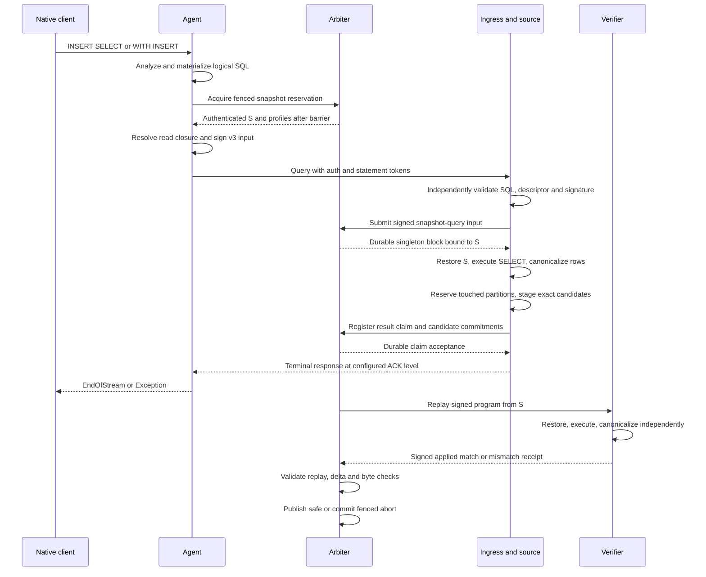

# Signed INSERT ... SELECT over an authenticated safe snapshot

**Date:** 2026-09-16. **Status:** Proposed; design only, no runtime capability is enabled. **Scope:** Tier 3 of [issue #153](https://github.com/housegate/housegate/issues/153). **Implementation baseline:** Housegate `2e6633c`, including [#152](https://github.com/housegate/housegate/pull/152). **Source of truth:** English.

## 1. Problem and decision

The signed INSERT lane currently commits to client-supplied Native Data bytes. `INSERT ... SELECT` and both placements of `WITH` have no row payload to sign: their rows depend on executing a query. Admitting their spelling through `InsertPayloadEncoding` would not provide a verifier with that execution's inputs. The required evidence is the signed program, an authenticated and recoverable pre-state containing every relation it reads, and independent execution of that program.

This proposal adds a separately versioned **snapshot-query input**. The agent signs materialized logical SQL, its complete read set, and an exact safe-snapshot pin. The source and verifiers restore that snapshot into isolated ClickHouse scratch databases and independently execute the SELECT under the same restricted execution profile. They canonicalize the output before assigning `_hg_row_id`, then use the existing row/partition/state commitment machinery. A source-produced row payload is not a substitute for replaying the SELECT.

The initial protocol serializes this lane with a network/shard barrier and one statement per block. It executes only after sequencing has accepted the signed snapshot pin. This deliberately adds latency and limits throughput; it makes “previous safe snapshot” an actual common input instead of a name for whichever local `hg_safe` happens to exist. Finer-grained scheduling is a subsequent protocol change, not a hidden optimization of this design.

This document does not implement Tier 2 inline `VALUES`, broaden the current format allowlist, enable arbitrary mutations/DDL, attest ordinary SELECT responses, or authorize a deployment. `FORMAT Values` on stdin remains the supported ergonomic alternative. The existing v2 payload lane keeps its current signed-byte and deferred-INSERT behavior.

### Current evidence and missing work

| Boundary | Current implementation | Required extension |
|---|---|---|
| Agent classification/signing | [`sistatement.OnQuery`](../../../pkg/plugins/sistatement/plugin.go) signs payload-local INSERTs after deferred input; other shapes do not enter that lane. | Analyze SELECT/CTE dependencies, obtain a safe pin, and sign without waiting for row Data. |
| Independent ingress classification | [`InsertPayloadEncoding`](../../../pkg/storageintegrity/sql.go) and [`EnvelopeFromAdmission`](../../../pkg/storageintegrity/intake.go) require a supported streaming form and captured Native payload. | A distinct validated input variant; no weakening of those payload checks. |
| SQL materialization | [`materialize.Plugin`](../../../pkg/plugins/materialize/materialize.go) changes SQL before signing but fails open on materialization errors. | Positive, fail-closed admission under the new SQL profile, even when the ordinary plugin leaves SQL unchanged. |
| Previous safe state | [`SafeSnapshotManifest`](../../../pkg/replay/types.go) commits table/partition/part metadata; it is explicitly not a filesystem backup. | An injected store that restores and verifies all referenced input rows, plus retention of those artifacts. |
| Real ClickHouse replay | [`chexec.Materializer`](../../../pkg/replay/chexec/materializer.go) creates an empty scratch table per payload-local INSERT. | A snapshot-aware query executor; the existing materializer interface has no pre-state argument. |
| Commitments | [`roots.go`](../../../pkg/replay/roots.go) already commits all supplied table roots; [`statementRoot`](../../../pkg/replay/verifier.go) has no read descriptor. | Complete pre/post table coverage and versioned commitments to the program's read dependencies. |
| Source intake | [`SourcePreparer` and the intake orchestrator](../../../pkg/storageintegrity/intake.go) prepare and submit concurrently using one payload envelope. | A separate sequenced snapshot-query lifecycle with durable pin, result and recovery state. |

The [June integrated design](2026-06-22-storage-integrity-design.md) explicitly excludes INSERT SELECT from v1. [The earlier trust design §9.4](2026-06-10-multi-replica-trust-design.md#94-insert--select) sketches a barrier plus capture of output into a signed payload. This proposal supplies the barrier but replaces that output-capture exception: the **user signs the query and its pre-state**, and verifiers independently derive the output. A sequencer/source signature over output alone would prove who supplied those rows, not that they came from the user's SELECT. The [implemented envelope-v2 design](2026-08-18-storage-integrity-signed-envelope-v2-design.md) remains authoritative for payload inputs. These are proposed future semantics, not retrospective edits to either document.

## 2. Execution semantics

### D1. Exactly one authenticated base

Let `S` be the complete safe snapshot selected by the Arbiter after all previously admitted work in the network/shard has reached a terminal state. The pin contains `network_id`, `keeper_shard_id`, `snapshot_id`, `safe_block_seq`, `manifest_root`, `state_root`, `schema_snapshot_id`, and `schema_root`. Selection is from the Arbiter's published safe chain, not from a source-provided manifest or local table listing.

For the new block, the signed snapshot identity must equal the block's `prev_safe_snapshot_id` and `prev_state_root`. The publisher's authenticated record must bind the remaining pin fields to that identity. A manifest passing `Validate()` is internally consistent; that alone does not prove that the Arbiter published it or that it is the selected predecessor. Verifiers check both properties.

The proposed `AcquireSnapshotQuery` control-plane operation drains prior work, installs a network/shard admission and schema barrier, and returns a fenced reservation for `S` and the active execution profile. No new ordinary writes, snapshot-query writes, schema transitions, or safe publications can overtake this reservation. After signature verification, submission consumes that reservation atomically into a singleton block. A different snapshot, schema, profile, account, statement id or fencing generation rejects the submission before source execution. No implicit rebase or automatic re-signing of the same statement id is allowed.

Reservation expiry is a committed Arbiter transition with a new fencing generation, not a wall-clock decision inside deterministic FSM application. Before submission it releases the barrier. After submission, resolution follows the accepted block's recovery/abort protocol; a lost client connection cannot expire an accepted operation into a second execution.

An explicit genesis pin is allowed only when the authenticated safe-chain state is genesis. It names the locally derived empty manifest with the configured network/schema and supported profile; a missing read table is never equivalent to an empty declared table. The existing legacy empty-prev spelling introduced by [#151](https://github.com/housegate/housegate/pull/151) is unchanged for v2 replay. The new lane transports the derived pin explicitly so the signed read descriptor is unambiguous.

### D2. All reads see S; writes append to S

Every logical source table, including tables referenced through nested subqueries or CTEs, must be an SI table in **that same** `S`, in the same network and shard. Its snapshot schema must agree with the schema selected for this operation. The target must also be declared in `S`. Even one ordinary table, another snapshot, an unavailable schema, or an unresolved dependency rejects the entire statement.

Reads observe only `S`. They never observe `unsafe_latest`, live `hg_safe`, source-local session state, or partially produced output. A self-insert reads the old target from `S` and appends new row instances to it; it does not recursively read its own output. With singleton blocks there are no intra-block read-after-write semantics to infer. A later statement sees an earlier statement's rows only after that earlier block becomes safe and a new pin is acquired.

For example, with two safe rows in `tenant.events`, `INSERT INTO tenant.events SELECT * FROM tenant.events` appends exactly two new rows with new `_hg_row_id` values, even if unsafe rows exist locally. A second such operation, after promotion and a fresh pin, sees four rows. If the first operation is aborted, the second still sees two.

### D3. The supported SQL surface is explicit

The syntax analyzer belongs in the rewriter backend, preserving the [existing ownership boundary](https://github.com/housegate/docs/blob/main/docs/architecture.md#68-architecture-three-layer-responsibility-split). The native and gRPC engines expose the same versioned analysis contract and conformance corpus. Neither the agent nor ingress gains a regex-based SELECT parser.

The initial profile admits a single INSERT target with SELECT projections and filters, deterministic scalar expressions, non-recursive CTEs, deterministic scalar/IN subqueries, `UNION ALL`, and explicit `ALL INNER JOIN` on equality conditions between admitted relations. A constant SELECT has an empty read set but still has a pinned predecessor for its target state. Target column lists must contain every user column exactly once; omitting the list means the complete schema order. No implicit defaults, materialized columns, or schema-dependent omitted-column synthesis are admitted. SELECT expressions map to target columns by position, are coerced by the pinned ClickHouse engine, and must produce the target's supported types.

Both spellings below are included. ClickHouse documents [WITH before INSERT and WITH inside INSERT](https://clickhouse.com/docs/reference/statements/insert-into); recognizing only a leading INSERT token would miss the second one.

```sql
INSERT INTO tenant.copy (value)
WITH selected AS (SELECT value FROM tenant.events WHERE value > 0)
SELECT value FROM selected;

WITH selected AS (SELECT value FROM tenant.events WHERE value > 0)
INSERT INTO tenant.copy (value) SELECT value FROM selected;
```

The initial profile refuses aggregates, window functions, recursive/materialized CTEs, correlated subqueries, `ANY`/`ASOF` joins, `LIMIT`/`OFFSET`/`LIMIT BY`/`TOP`, sampling, `FINAL`, `DISTINCT`, and order-dependent operators at **any** nesting depth. Pure final-output ORDER BY may be accepted without `COLLATE` or `WITH FILL`; row identity still uses D6. More operators can be admitted only with a new tested profile. Sorting after an arbitrary LIMIT or arbitrary aggregate cannot repair a nondeterministic choice of rows or values.

All external table functions and implicit data sources are refused, including `remote`, `cluster`, `merge`, `dictionary`/`dictGet`, `url`, `file`, `s3`, `input`, database connectors, table-name parameters, temporary tables, views, system catalogs and UDFs. This closed profile also refuses generators such as `numbers` and `generateRandom`; a constant SELECT needs no generator. Cross-indexer `remote()` routing is not used to satisfy snapshot reads. Unknown AST nodes, functions or settings fail closed even if the broader ClickHouse engine accepts them.

`SQL_x_read_mode` cannot select a different read surface for this lane: absent or `safe` is admitted; `unsafe_latest` or any other value is refused. No user execution settings or unresolved query parameters are admitted, whether supplied in SQL, protocol settings or session state. The existing empty-user-settings hash remains meaningful; internal execution settings come solely from the signed execution profile. Query authentication and account authorization still run, including read permission on every resolved source database and write permission on the target. Peer routing/trust markers do not waive snapshot-query validation at the executing host.

## 3. Authenticated input and read-set contract

### D4. Introduce a new input variant, not an empty v2 payload

All names in this section are **proposed contract names**, not existing structs, proto fields, enum allocations or configuration keys. Implementation must add the matching wire types in arbiter-proto and mirrored Housegate types together and run the [arbiter-core field-name conformance gate](https://github.com/sentioxyz/arbiter-core/blob/main/conformance/replay_wire_test.go). It must not reinterpret the frozen INSERT numeric value or the existing `clickhouse-native-data-v1` format.

Use a new envelope version and JWS purpose, proposed as `housegate-statement-v3`, with an explicit input discriminator `snapshot_query`. Retain the existing signed identity fields: account/statement id, network/shard, post-materialization `sql_hash`, `settings_hash`, target/schema hash, row-id profile, client revision and a separately allocated snapshot-query statement kind. Add the following authenticated fields:

| Field/group | Meaning |
|---|---|
| `read_snapshot` | Complete D1 pin. The logical SQL and this pin together define what was authorized. |
| `read_set_root` | Commitment to the complete D5 descriptor. The descriptor travels in the envelope/L3 data; a root without retrievable descriptor bytes is insufficient. |
| `schema_snapshot_id`, `schema_root` | Bind source and target schemas, not just the existing target-only `schema_hash`. |
| `logical_database` | Explicit context for resolving every unqualified target/source name; no dependence on a replay connection's default database. |
| `query_profile_id` | Content-addressed SQL admission, materialization, engine/settings, resource-limit and output-ordering profile. |
| `executor_profile_id` | The profile returned by the reservation and later required on the block. It is known before signing in this lane; the sequencer may not replace it. |
| `reservation_id`, `fencing_generation` | Bind the statement to the specific barrier reservation and prevent late use after release/reassignment. |

For `snapshot_query`, all **client row-payload** fields are absent. A mixed variant carrying `payload_format`, `payload_ref`, `payload_hash` or `payload_length` is malformed, including a claim to hash an empty Native payload. The source's derived rows are neither user input nor user-signed bytes. Optional cached result artifacts must be separately labeled, bound to the input root and treated as untrusted caches; verifiers still execute the SELECT independently.

`statement_seq`, block sequence and source identity remain assigned after signing. Define `input_root = CanonicalDigest("snapshot-query-input-v1", canonical_input)`, where `canonical_input` contains the envelope version/input kind, SQL bytes, all execution-bound signed fields listed above and the full read descriptor. It excludes token signatures, issuance time and transport hints, and contains no `input_root` field of its own. The sequencer anchors this canonical input and its original user JWS in a new versioned statement/L3 commitment; the verifier recomputes the input root after checking the JWS. The proposed domains `snapshot-query-read-set-v1`, `snapshot-query-input-v1`, `snapshot-query-output-v1`, `snapshot-query-statement-root-v1` and `snapshot-query-receipt-v1` must have shared byte-level vectors before use. Extend neither the old receipt hash nor `replay-statement-root` silently: old blocks and signatures must retain their original hashes.

### D5. Commit the complete relation closure

After materialization, resolve the entire SQL AST against the pinned logical catalog. Expand CTE references and aliases, bind unqualified names to the signed logical database context, and reject free/unbound identifiers. Record base-table dependencies from projection subqueries, filters, JOINs, IN subqueries and every nested CTE. Do not infer the read set from the target or a top-level `FROM`. Ordinary [ClickHouse CTEs are inlined and may be executed repeatedly](https://clickhouse.com/docs/reference/statements/select/with); a CTE name is not an independently snapshotted table. Unused CTE definitions must also pass the closed syntax profile; the read set includes the transitive closure of referenced definitions.

For each distinct base table, the descriptor contains its structured logical identity, canonical `table_id`, `schema_hash`, **all** partition commitments and **all** active part commitments from `S`. Each part entry includes partition id, part name, physical/content hash, row LtHash, row count and byte size. Full-table coverage is deliberate: even `WHERE value > 0` binds the whole input table. Predicate-based partial witnesses require a separate completeness-proof design. An empty table has an explicit table entry with empty partition and part lists.

The descriptor root uses the existing `replay.CanonicalDigest` hashing convention under the new domain over `{read_snapshot, tables}` with a frozen field order and field names. Tables are sorted by canonical table id, partitions by `(table_id, partition_id)`, parts by `(table_id, partition_id, part_name)`; duplicates and conflicting identities are rejected rather than silently deduplicated. Empty collections serialize as `[]`, never `null` or omitted. `StorageRefs` are fetch hints and are not included in the read-set descriptor. Their transport never authorizes substituting another part; the selected manifest and the content commitments remain authoritative.

The agent builds and signs this descriptor. The ingress and each verifier independently analyze the signed SQL under the same pinned catalog/profile and require exact descriptor equality. The sequencer FSM performs deterministic signature, descriptor-root, snapshot/reservation and profile checks; it makes no rewriter RPC or network read while applying a log entry. An ingress's analysis is not proof for a verifier. An operator that omits a hidden non-SI dependency cannot obtain an applied receipt from an honest verifier.

## 4. Restore data before executing SQL

Add a snapshot-aware executor implementing the existing injected `replay.Executor` boundary. Keep the payload executor as the v2 implementation. Share row encoding, row-id derivation and state assembly in Housegate's canonical replay packages; [Housegate owns these implementations](../../../pkg/replay/AGENTS.md), and arbiter-core consumes them. A second implementation of column coercion/encoding in the agent is not part of this design.

A proposed injected `SnapshotReadStore` resolves the authenticated manifest and restores the selected read tables. Its handle is scoped to one pin and held until the execution is terminal. It must:

1. Verify the pin against safe publication, validate the complete manifest and its schema/profile identities, and check that the read descriptor exactly covers the named tables in it.
2. Fetch every active part needed for those tables, using content-addressed artifacts. Verify physical integrity, row count, schema, partition membership and canonical row LtHash, and prove the per-part ledger folds to the committed partition roots. Missing, duplicate, substituted or extra input parts fail closed. An empty table is restored only from an authenticated empty table entry.
3. Attach or copy the verified parts into a fresh, isolated scratch database with catalog definitions derived from the authenticated schema. Hardlinks/reflinks are permitted only if the referenced bytes cannot mutate during use; local existence under `hg_safe` is not sufficient evidence. Acquire retention references before restore and keep them across process recovery and challenge replay.
4. Expose read-only user-column relations to the query executor. Keep `_hg_row_id` for verifying imported rows but hide it from user SQL. Bind every table reference to these scratch relations through the AST rewrite; deny all other catalogs and network/filesystem readers. Give the query connection read access only to those relations. A separate internal writer owns the output scratch table.

The executor does not run the user's INSERT against a production ClickHouse connection. It evaluates the admitted SELECT in this isolated environment, maps/coerces the output into the target schema, and constructs new output rows. Restoring the target's old rows is required when the SELECT reads it; otherwise its authenticated old commitments are carried forward without a row scan. Unchanged tables outside the read set require their committed manifests for complete state assembly, not their data files.

Snapshot artifact availability is a new deployment prerequisite. `SafeSnapshotManifest.ActiveParts` and `StorageRefs` alone do not guarantee it. The publisher must preserve retrievable parts/schema through the configured replay/challenge retention period and reference-count every active query pin. Cold restore and cache eviction must preserve the same content checks. Unavailable bytes produce a refusal/retry, never a fallback to live tables or an assumption that the relation was empty.

## 5. Determinism, row identity and roots

### D6. Produce a deterministic multiset, then assign deterministic ordinals

Materialize supported volatile expressions at the agent **before** signing, through the existing SQL materialization seam. The new profile requires an acknowledged successful analysis/materialization pass and proves that no forbidden expression remains. Transport failure, partial coverage, exhausted literal pools or unsupported function is a rejection for this lane even though ordinary materialization is fail-open. Replay does not call `now()`/`rand()` again or generate replacement literals. Random/time literals are fixed per materialized occurrence in the signed SQL, not refreshed for each output row; callers needing per-row randomness need a later explicitly defined profile.

Pin the ClickHouse executable/build digest and supported platform, analyzer/rewriter build, timezone and tzdata, internal execution settings, scalar operator/function catalog, schema/type profile, and result resource limits. Initial scalar operations are column/literal projection, integer comparisons, boolean composition, and integer arithmetic/conversions only where the profile supplies an explicit checked expression with overflow/error vectors; other functions require explicit profile entries and vectors. Ordinary ClickHouse casts or arithmetic must not be assumed to check overflow. Failed checks, conversions or expression evaluation produce no successful write. Float columns may be copied under the existing canonical value rules, but floating arithmetic and aggregation are not admitted. Pinning `max_threads=1` is a resource/execution setting, not a proof that arbitrary SQL is deterministic.

The only column representation authority remains [`ResolveColumnProfile`](../../../pkg/replay/payloadexec/column_profile.go). All source and verifier outputs must be representable by that authority and its decoder/scanner/encoder chain. No Nullable, UUID or Decimal support is implied by this proposal. Explicit target type coercion is performed by ClickHouse and read back through the shared profile; no Go-side SQL expression evaluator is introduced.

ClickHouse documents that [unordered results and tied ORDER BY keys have nondeterministic order](https://clickhouse.com/docs/reference/statements/select/order-by). The new output-ordering profile therefore defines:

1. Convert each output row to the target's canonical typed values. Normalize value-equivalent representations consistently with the commitment encoder, including NaN, signed zero and time values, before output is stored.
2. Compute its **full canonical user-row bytes** through [`lthash.EncodeRow`](../../../pkg/lthash/canonical.go), with the target table id and user columns only. Sort lexicographically by those bytes, not by their digest, arrival order, part name, block boundary or a user-provided non-unique sort key.
3. Preserve duplicate multiplicity. Byte-identical rows occupy consecutive positions; their order among themselves is irrelevant because the same values receive the same set of ordinal-derived ids. Assign ordinal `0..N-1` across the entire statement, never per part or partition.
4. Derive `_hg_row_id` using the existing [`payloadexec.RowID`](../../../pkg/replay/payloadexec/executor.go) with network, target, statement id and that ordinal. A self-insert creates new ids; it never copies old ids into the output. Compute row LtHash through the same `RowElementHash` used by source-part scanning.

The row-id derivation domain remains unchanged. The new query profile identifies the new source of ordinals; v2 keeps its payload-global order. Sharing the canonical byte encoder prevents a second row-encoding authority, but the normalization and external sort still need new shared implementation and cross-component vectors. Sort/spill must obey signed row/byte limits and remain stable across chunk sizes and worker scheduling. Partial results are never admitted.

For diagnostic and replay equivalence evidence, define `output_rows_root = CanonicalDigest("snapshot-query-output-v1", {target_table_id, schema_hash, row_count, row_hashes})`, where `row_hashes` is the **ordered** array of `replay.DigestBytes` of the canonical user-row bytes after sorting, retaining duplicates. Empty output has `row_count=0` and `row_hashes=[]`. The exact descriptor/input/output encoding is frozen in shared golden vectors; it is not a hash of ClickHouse Native serialization or of physical part bytes.

### D7. Preserve the whole state, and bind the execution evidence

Let `R` be the read-table closure and `W` the singleton write target. Derive output solely from `(signed SQL, query profile, S restricted to R)`. Start post-state assembly with **every table in S**, append the new target partition contributions, and carry all untouched table/partition commitments unchanged. If a table is both read and written, its old commitment is authenticated in the read descriptor and its new commitment includes old plus inserted rows.

The existing `safe-snapshot-data-v2` root already covers all supplied tables, and the state root covers that data root plus schema and executor identity. Do not compute a target-only state root: that would discard the read tables and unrelated state. No new state-root formula is needed for this append-only extension. Complete table-set validation must establish that neither the source nor executor omitted an unchanged table. Manifest construction must also preserve untouched active parts and parent linkage.

A state root proves a state commitment, not which program produced it. The new L3 statement root and signed receipt additionally bind `input_root` (the complete signed logical input), `read_set_root`, the D1 pin, execution profile, `execution_outcome`, output row count/root, and computed post-state. Root mismatches after valid replay remain **signed mismatch receipts**, as in the existing verifier. Malformed signatures, invalid pins, missing snapshot bytes or an unsupported profile are pre-receipt refusals; the verifier cannot claim to have executed a program it could not validate or run.

Keep the existing three-way promotion check: independent replay versus source claim, partition-delta consistency against S, and byte-side scanning of the exact candidate parts. Matching source/verifier output hashes alone is insufficient to promote different stored bytes. A source that executes against unsafe state, changes an input row, inserts extra rows or swaps candidate parts must fail one of these checks.

Zero-result SELECT is an applied operation with a committed empty output root and no candidate parts. Its data root remains unchanged; its state root remains unchanged when schema and executor identities are unchanged. The statement id is consumed and the safe block/manifest advances normally. This is distinct from an aborted operation and does not relax v2's non-empty-payload rule.

## 6. Protocol and durable lifecycle



### D8. Query-only native protocol path

The agent signs this input during query admission once it has the reservation and descriptor. It does not create `DeferredInsertPlan`, emit a sample block, wait for a row terminator, or synthesize client Data packets. The existing query-auth token still authenticates the final signed SQL; the domain-separated statement token authenticates the new input variant.

The server suppresses ordinary upstream execution and invokes the new intake path. Native clients may send the protocol's empty external-table marker: recognize and drain the permitted empty marker with the normal framed reader, but reject non-empty external-table Data and any row payload. A marker is not a signal to start this operation. Completion comes from the intake result at the configured ACK level. The exact CLI/driver packet sequences, including a missing marker, must be measured and covered before enabling the path.

Preserve one query in flight, one codec reader per connection and terminal lifecycle ordering. Query-only success must not be conditioned on deferred INSERT's sample/terminator preconditions. ACK2 means durable accepted input plus registered source preparation/claim at the configured boundary; it does **not** mean safe promotion. Safe visibility still requires the promotion protocol. A reconnect queries/retries the same durable statement identity; it must not interpret a lost EndOfStream as permission to create another write.

### D9. Sequence before source execution; reserve capacity before unsafe writes

The new path does not call the current concurrent `prepareAndSubmit` with an empty payload. Persist the reservation and complete signed input, validate it independently at ingress, and obtain durable sequencer acceptance first. The source then restores S and evaluates into bounded scratch storage. Compute the touched partition ids from the actual canonical output using the shared partition authority. Atomically reserve those exact partitions before any unsafe-table write, candidate creation or result claim. Snapshot download and scratch computation have their own admission budgets and cannot borrow the payload lane's “payload known before prepare” assumption.

Journal the input root, snapshot pin, fencing generation, statement/block identity, execution state, canonical output root/count, touched partitions, capacity reservations and exact candidate identities. Reuse the existing source-frontier, idempotency, candidate visibility and exact cleanup principles. Retry may recompute scratch output only from the same signed input and pin and must match any already durable output commitment. It must look up an indeterminate source prepare before issuing another write.

| Event | Required behavior |
|---|---|
| Stale/expired reservation before Submit | Reject without source execution; release only the matching generation. A fresh pin requires a new signed operation. |
| Client Cancel/EOF before Submit | Cancel the reservation after confirming it was not consumed. A Submit with an unknown outcome is reconciled by id. |
| Client Cancel/EOF after Submit | Stop client delivery; reconcile/finish the accepted operation under its existing id. No local rollback or duplicate submission. |
| Missing part, local timeout, resource exhaustion, back-pressure | Refuse/retry at the same pin with no partial successful output. A local inability to run is not a signed SQL mismatch. |
| Deterministic SQL/type failure | Produce a terminal failure for this operation; no partial write may be promoted. Arbiter resolves the block through the explicit abort transition below. |
| Crash before/after unsafe prepare, lost response | Recover durable state and exact candidates by statement id; retain pin and pressure ownership while the write outcome is unknown. |
| Valid replay differs from source | Sign mismatch evidence, withhold promotion and enter challenge handling. |
| Success or zero-result success | Persist the applied result and follow normal configured ACK/promotion semantics exactly once. |

A sequenced operation cannot disappear when a reservation timer fires. Add a committed **aborted no-op** outcome to the new block/receipt protocol: fence all old claims and promotion work for the operation, settle or quarantine its exact unsafe candidates using the cleanup protocol, and finalize a manifest carrying the predecessor's data unchanged. Only an Arbiter-authorized terminal abort can release the barrier without an applied safe transition. Such a receipt is explicitly `aborted`, never an applied-match receipt for the SQL. A retry after abort needs a new statement id and signature. This preserves forward progress when a sequenced query cannot finish without pretending its SQL succeeded.

Barrier release requires durable publication of the applied or aborted outcome, resolution/fencing of all earlier claims and promotions, and a recovery record for any remaining cleanup debt. On restart, the Arbiter restores the barrier before admitting another write. Old fencing generations cannot register claims or promote parts after release. Snapshot retention for replay/challenge may outlive the scheduling barrier; release it only through its own reference/retention policy.

## 7. Ownership, compatibility and release order

| Owner | Work required before activation |
|---|---|
| rewriter-proto, rewriter-go, rewriter-grpc | Versioned AST analysis and materialization acknowledgement, complete dependency closure, restricted SQL profile and logical-to-scratch rewriting; byte-identical contract cases on both engines. |
| arbiter-proto | New input/statement-kind variant, pin/reservation types, envelope and replay fields, outcome/claim/receipt contracts; allocate new field numbers and preserve old ones. |
| Housegate | Shared v3 signing/checking, agent query-only path, independent ingress admission, snapshot-query executor and canonical ordering, versioned root/receipt derivations, relay and intake recovery boundaries. |
| arbiter-core | Authenticated artifact restore/retention, source staging and verifier backend wiring, mirrored proto conformance, exact candidate scan/cleanup and recovery integration. See the current [source staging seam](https://github.com/sentioxyz/arbiter-core/blob/main/snode/staged.go). |
| Arbiter | Safe-pin reservation, network barrier, singleton sequencing, deterministic v3 admission, versioned L3 roots, replay/challenge/abort outcomes, durable activation and fencing. See the current [admission boundary](https://github.com/sentioxyz/arbiter/blob/main/fsm/admission.go). |
| sentio-node | Embedded Housegate and arbiter-core pins, [storageintegrityadapter](https://github.com/sentioxyz/sentio-node/tree/main/storageintegrityadapter) field carry-through and capability wiring. |
| Deployment configuration | Matching agent, node/source, verifier, rewriter and Arbiter builds; persistent snapshot artifacts, recovery storage and profile selection. |

The old [replay proto](https://github.com/sentioxyz/arbiter-proto/blob/main/proto/replay.proto) and v2 JWS remain decodable and replayable with their original domains. The new variant must be rejected by a node that lacks its capability; it must never fall back to ordinary SQL or the v2 empty-payload path. Historical replay needs profile dispatch, not a global replacement of the old materializer. Protocol/FSM/journal snapshot version upgrades require explicit readers/migration and rollback tests; the earlier v2 design's pre-deployment hard-cutover assumption cannot simply be reused for a live network.

### D10. Activate the executor profile through a state transition

The current [`prevSafeSnapshot`](../../../pkg/replay/verifier.go) requires the job's schema and executor profile to equal the predecessor manifest's identities. Deploying a new executor profile and naming it in the first query would fail that check. Do not bypass the check or edit the old manifest in place.

Before accepting new reservations, drain the network and publish an explicit control-plane **executor-profile transition** from the old profile to a new composite profile that supports both the unchanged v2 payload semantics and snapshot queries. Its authenticated record binds the predecessor snapshot/state, old and new profile identities, unchanged schema/data roots and the resulting manifest. Validators independently copy the complete old table/part ledger, verify the approved profile pair preserves the existing row/schema commitment interpretation, recompute the new state root with the new profile id, and seal a child manifest. Use a new `executor-profile-transition-v1` commitment/receipt domain; this is not a fabricated user INSERT or a reinterpretation of an old receipt.

This transition requires explicit Arbiter/proto/replay support in the implementation. It preserves data bytes while acknowledging that executor identity is part of `state_root`. Only after its publication do new jobs use the new profile with matching predecessor identity; historical jobs still dispatch to the profile they committed. Unsupported profile pairs or a transition that changes schema/data are refused. A new network may instead derive genesis under the composite profile. Subsequent profile upgrades follow the same boundary protocol.

Deliver in this order, with runtime enablement off until step 6:

1. Freeze the restricted profile, wire records, hash domains, golden vectors, barrier/abort/profile transitions and cross-repository compatibility fixtures. Record the actual tested binary/image/profile digests; no minimum release version is invented by this proposal.
2. Implement matching rewriter/proto contracts and read-only capability probes. Retain v2 behavior and old receipt vectors unchanged.
3. Implement snapshot artifact publication, restore/verification and the shared query executor; run source/verifier differential and adversarial tests with separate ClickHouse instances.
4. Implement Arbiter reservation/sequencing/abort and source/verifier recovery with conformance tests; then Housegate's agent/ingress/relay path and sentio-node adapters. These changes must remain capability-gated while they are delivered separately.
5. Deploy compatible readers/executors and artifact retention first. Probe every required role, including both sidecar agent and node-embedded Housegate. Run the full matrix below on a disposable network and a bounded opt-in canary.
6. Publish the D10 profile transition and commit network activation at a declared block boundary with all profiles/capabilities pinned. Only then allow agents to acquire new snapshot-query reservations. Keep existing payload writers on v2.

Rollback first disables **new** reservations, drains/resolves accepted v3 blocks and retains v3 readers/executors plus their snapshot artifacts for historical replay and challenge. An old binary cannot safely replay a history containing v3 by forgetting the new variant. Do not reset sequence state, discard an active pin, or delete old profile artifacts as a rollback shortcut.

## 8. Acceptance evidence required for implementation

This matrix is a future activation gate, **not tests claimed to have passed in this documentation PR**. Bazel is Housegate's ground truth; docker/manual integration targets must be explicitly listed in CI. Wire conformance and runtime scenarios also run in their owning repositories.

| ID | Scenario | Evidence required |
|---|---|---|
| A1 | SELECT plus WITH in both positions, nested/repeated CTEs, aliases, projection/filter subqueries, allowed joins and UNION ALL | Native and gRPC analysis produce identical target/read closure/profile results; official CLI and pinned Go drivers complete the real agent → ingress → source → verifier path. |
| A2 | One non-SI or out-of-snapshot table hidden at any depth; CTE name shadowing/free variables; external table functions, view/UDF/catalog/identifier parameters | Every path refuses before unsafe writes; hand-forged signed descriptors are independently refused by verifiers. Include comments, quoted identifiers and heredocs in the AST corpus. |
| A3 | Read pin, manifest root, state root, table schema, profile, network/shard or generation tampered; half-declared/genesis pin | Signature/admission/safe-chain checks reject each altered field. A self-consistent but unpublished manifest is rejected. An empty declared table is accepted; a missing table is rejected. |
| A4 | Same SQL while local unsafe rows and subsequent safe publications differ | Source/verifiers consume exactly S. Writes and schema changes cannot overtake the reservation; a stale submission cannot execute. Self-insert and two sequential self-inserts match D2. |
| A5 | Omitted, duplicated, extra, corrupted or unavailable snapshot part; wrong schema/partition; rewritten download location | Restore/ledger checks refuse bad data. A changed location serving the same authenticated bytes is usable. Cold restore and warm cache produce identical output/state. |
| A6 | Permuted source scan order, chunks/part layouts and scheduling; identical rows including at least 2^16 copies; multiple output partitions; NaN/signed zero/time representations | Canonical output bytes, global ordinals, row ids, row LtHash and output/state roots agree across independent instances. Duplicates are preserved and ordinals never reset per partition. |
| A7 | Residual volatile function, failed/partial materialization, unsupported scalar, nested LIMIT/aggregate/window, settings/parameters or overflow/type error | Fail-closed profile behavior; no re-materialization during replay and no partial output/candidate promotion. |
| A8 | Unmodified input table changes, read-and-write same table, unrelated unchanged table, zero-result SELECT | Full pre/post state assembly covers R, W and every untouched table; dropping a read/untouched table changes or invalidates the root. Empty applied output consumes its id, advances the manifest and creates no parts. |
| A9 | Source substitutes rows, reads unsafe instead of S, swaps output cache or candidate parts, sends correct output hash with wrong bytes | Verifier recomputation and the three-way check produce signed mismatch/challenge evidence and prevent safe promotion. |
| A10 | Query/external-table marker fragmented or coalesced; missing marker; non-empty Data; Cancel/EOF and next Query racing completion | No waiting for nonexistent payload/sample, no unsolicited sample, correct query-only lifecycle, no duplicate success and reusable framing only after a supported terminal boundary. |
| A11 | Crash/lost response at reservation, Submit, restore, sort, capacity reservation, unsafe prepare, claim, publication and cleanup | Recovery keeps the same pin/id/output, reconciles indeterminate prepare, does not double-write or leak/release capacity prematurely, and rejects every late fenced claim. |
| A12 | Unavailable source/verifier, deterministic failure, back-pressure and terminal abort | No applied receipt for a local failure; committed abort is an explicit no-op, cannot promote old candidates, and lets the next block progress. Snapshot retention survives barrier release. |
| A13 | Mixed old/new agents, embedded servers, rewriters, source/verifiers and Arbiter; genesis activation, old → composite profile transition, restart/migration/rollback with v3 history | Unsupported combinations refuse without ordinary-SQL fallback. The profile transition preserves schema/data, produces a new bound state/manifest, and the first new query chains from it. Old v2 JWS/L3/receipt vectors stay byte-identical; proto/JSON conformance and historical replay pass. |
| A14 | Large snapshots and output sort/spill at/over signed limits | Measure acquisition wait, restore bytes/time, scan time, output rows/bytes, spill peak, unsafe/safe latency and barrier occupancy. Limits reject atomically; load cannot silently create a partial SELECT result. |

## 9. Cost and follow-up boundary

The first release pays for a full restore/validation of each read table, repeated execution on source and verifiers, and canonical sorting of the complete output. The network/shard barrier amplifies slow restores and challenges into write latency. These costs are visible protocol choices; the activation evidence must report them on representative data instead of using payload INSERT benchmarks as a proxy.

The bounded follow-ups are dependency-aware concurrent scheduling, authenticated partition/subset witnesses, more deterministic SQL operators, incremental snapshot distribution, and Tier 2 inline VALUES. Each needs its own profile/protocol argument. None is necessary to define this lane correctly, and none is implied to be supported by merging this design.
